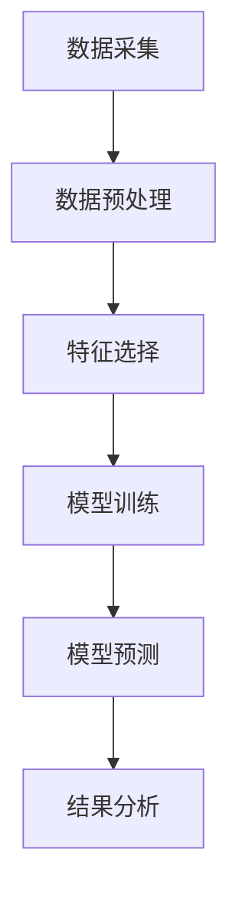
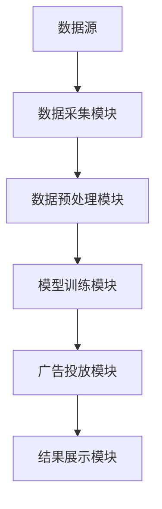
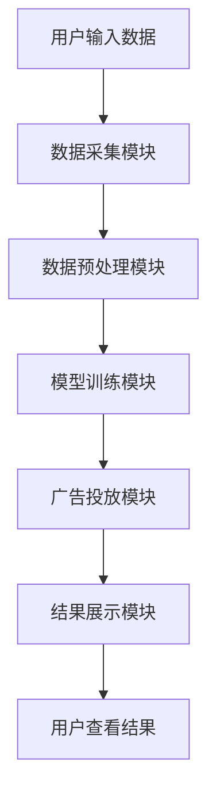

                 


# 股市估值对跨境数字广告效果评估的影响

## 关键词
股市估值，数字广告，广告效果评估，市盈率，市净率，广告点击率（CTR），广告转化率

## 摘要
股市估值与跨境数字广告效果评估之间存在显著的关联性。本文通过分析股市估值的关键指标（如市盈率、市净率）与广告效果评估的核心指标（如点击率、转化率），探讨股市波动对广告效果的影响。我们提出了一种基于回归分析的广告效果预测模型，并通过实际案例展示了如何利用股市估值优化广告投放策略。文章结构清晰，内容详实，涵盖了背景介绍、核心概念、算法原理、系统架构及项目实战等多个方面，为广告从业者和投资者提供了重要的参考价值。

---

## 第一部分：背景介绍

### 第1章：股市估值与广告效果评估的核心概念

#### 1.1 问题背景
- **股市估值的基本概念**：股市估值是通过市盈率（P/E）、市净率（P/B）等指标衡量公司股价是否合理的过程。
- **跨境数字广告的定义与特点**：跨境数字广告是指跨国企业通过数字平台进行的广告投放，具有全球化、数据驱动和精准营销的特点。
- **股市估值与广告效果评估的关联性**：股市波动可能影响广告公司的营收和股价，而广告效果又反过来影响公司的市场表现。

#### 1.2 问题描述
- **股市波动对广告效果的影响**：股市上涨时，广告公司可能获得更多投资，广告效果提升；股市下跌时，广告预算可能减少，效果下降。
- **跨境广告行业的现状与挑战**：全球化背景下，广告投放涉及多个市场，不同地区的股市波动可能对广告效果产生差异化影响。
- **广告效果评估的复杂性**：广告效果受多种因素影响，包括目标受众、广告内容、投放时间等，而股市估值提供了额外的宏观视角。

#### 1.3 问题解决
- **利用股市估值预测广告效果的可行性**：通过分析股市指标，可以预测广告效果的变化趋势。
- **数据驱动的广告效果优化方法**：结合股市数据和广告数据，构建预测模型，优化广告投放策略。
- **股市与广告行业的协同效应**：通过跨行业的数据分析，发现股市波动对广告行业的潜在影响，为投资决策提供支持。

#### 1.4 边界与外延
- **股市估值的适用范围**：适用于上市公司和有公开市场数据的广告公司。
- **广告效果评估的局限性**：无法直接反映广告内容的质量，更多是预测广告投放的收益。
- **股市与广告行业的外部影响因素**：包括经济政策、消费者行为、技术进步等。

#### 1.5 概念结构与核心要素
- **股市估值的核心要素**：市盈率（P/E）、市净率（P/B）、股息率（Dividend Yield）。
- **广告效果评估的关键指标**：广告点击率（CTR）、广告转化率（CVR）、广告投资回报率（ROI）。
- **两者的相互作用机制**：股市估值影响广告公司的预算和投放能力，广告效果又反过来影响公司的股价和市场表现。

---

## 第二部分：核心概念与联系

### 第2章：股市估值与广告效果评估的核心原理

#### 2.1 股市估值的原理
- **市盈率（P/E）**：公式为 $P/E = \text{股价} / \text{每股收益}$，反映了投资者对公司未来盈利的预期。
- **市净率（P/B）**：公式为 $P/B = \text{股价} / \text{每股净资产}$，适用于衡量资产密集型行业的公司价值。
- **股东权益回报率（ROE）**：公式为 $\text{ROE} = \text{净利润} / \text{股东权益}$，衡量公司盈利能力。

#### 2.2 广告效果评估的原理
- **点击率（CTR）**：公式为 $CTR = (\text{点击数} / \text{展示数}) \times 100\%$，衡量广告吸引用户点击的效果。
- **转化率（CVR）**：公式为 $CVR = (\text{转化数} / \text{点击数}) \times 100\%$，衡量广告转化为实际购买或注册的效果。
- **投资回报率（ROI）**：公式为 $ROI = (\text{广告收益} - \text{广告成本}) / \text{广告成本} \times 100\%$，衡量广告的盈利能力。

#### 2.3 股市估值与广告效果评估的联系
- **股市波动对广告预算的影响**：股市上涨时，公司可能增加广告预算，从而提高广告效果；反之，股市下跌时，广告预算可能减少，影响广告效果。
- **广告效果对股价的影响**：优秀的广告效果可能提升公司品牌形象和销售额，从而影响股价。
- **跨市场的协同效应**：不同国家和地区的股市波动可能对跨境广告效果产生差异化影响，需要综合考虑。

#### 2.4 核心概念对比分析
| 指标 | 股市估值 | 广告效果评估 |
|------|----------|--------------|
| 核心指标 | 市盈率（P/E） | 广告点击率（CTR） |
| 计算公式 | $P/E = \text{股价} / \text{每股收益}$ | $CTR = (\text{点击数} / \text{展示数}) \times 100\%$ |
| 指标意义 | 反映市场对公司未来盈利的预期 | 反映广告吸引用户点击的效果 |

#### 2.5 实体关系图
```mermaid
graph TD
    A[广告公司] --> B[股市] : 受股市波动影响
    B --> C[广告效果评估] : 影响广告预算和效果
    C --> D[广告投放策略] : 优化广告投放
```

---

## 第三部分：算法原理

### 第3章：基于股市估值的广告效果预测模型

#### 3.1 算法原理
- **回归分析**：通过统计方法，建立股市估值指标与广告效果评估指标之间的关系模型。
- **时间序列分析**：分析历史数据，预测未来股市波动对广告效果的影响。

#### 3.2 回归分析模型
- **多元线性回归**：公式为：
  $$ y = \beta_0 + \beta_1x_1 + \beta_2x_2 + \epsilon $$
  其中，$y$ 是广告效果评估指标，$x_1$ 和 $x_2$ 是股市估值指标，$\beta$ 是回归系数，$\epsilon$ 是误差项。
- **逐步回归**：通过逐步筛选变量，找到对广告效果影响最大的股市估值指标。

#### 3.3 算法流程图


#### 3.4 Python代码实现
```python
import pandas as pd
import numpy as np
from sklearn.linear_model import LinearRegression

# 数据加载
data = pd.read_csv('advertising_data.csv')

# 特征与目标变量分离
X = data[['P/E', 'P/B']]
y = data['CTR']

# 模型训练
model = LinearRegression()
model.fit(X, y)

# 预测广告效果
predicted_CTR = model.predict(X)
```

#### 3.5 实际案例分析
- **数据来源**：假设我们有一个包含股市估值指标和广告效果数据的CSV文件。
- **模型训练**：使用历史数据训练回归模型，找出市盈率（P/E）和市净率（P/B）对广告点击率（CTR）的影响。
- **结果解读**：回归系数表明，市盈率每增加1，广告点击率可能增加或减少多少。

---

## 第四部分：系统分析与架构设计

### 第4章：系统架构与接口设计

#### 4.1 系统功能设计
- **数据采集模块**：采集股市估值数据和广告效果数据。
- **数据预处理模块**：清洗数据，处理缺失值和异常值。
- **模型训练模块**：基于回归分析训练广告效果预测模型。
- **广告投放模块**：根据预测结果优化广告投放策略。

#### 4.2 系统架构图


#### 4.3 接口设计
- **输入接口**：接收股市估值数据和广告投放数据。
- **输出接口**：输出广告效果预测结果和优化建议。

#### 4.4 系统交互流程图


---

## 第五部分：项目实战

### 第5章：基于股市估值的广告效果优化

#### 5.1 环境安装
- **Python**：安装 `pandas`, `numpy`, `scikit-learn` 等库。
- **数据可视化工具**：使用 `Matplotlib` 或 `Seaborn` 进行数据可视化。

#### 5.2 核心代码实现
```python
import pandas as pd
import numpy as np
from sklearn.linear_model import LinearRegression
import matplotlib.pyplot as plt

# 数据加载
data = pd.read_csv('advertising_data.csv')

# 数据预处理
data.dropna(inplace=True)
data = pd.get_dummies(data, columns=['region'])

# 模型训练
X = data[['P/E', 'P/B', 'region']]
y = data['CTR']

model = LinearRegression()
model.fit(X, y)

# 模型评估
print('回归系数：', model.coef_)
print('截距：', model.intercept_)

# 可视化
plt.scatter(data['P/E'], data['CTR'], alpha=0.5)
plt.xlabel('市盈率（P/E）')
plt.ylabel('点击率（CTR）')
plt.title('市盈率与广告点击率的关系')
plt.show()
```

#### 5.3 实际案例分析
- **案例背景**：一家跨国广告公司在不同市场投放广告，希望通过股市估值优化广告效果。
- **数据准备**：收集过去一年的股市估值数据和广告效果数据。
- **模型训练**：使用回归模型预测广告点击率。
- **结果分析**：市盈率对广告点击率的影响显著，市净率的影响较小。

#### 5.4 项目小结
- **成果**：成功构建了基于股市估值的广告效果预测模型。
- **不足**：模型的准确性受数据质量和样本量的影响。
- **改进建议**：引入更多特征变量，如广告内容、用户行为数据，提高模型预测能力。

---

## 第六部分：最佳实践

### 第6章：最佳实践与经验总结

#### 6.1 关键点总结
- **数据质量**：确保数据的完整性和准确性。
- **模型选择**：根据业务需求选择合适的算法。
- **结果验证**：通过实际案例验证模型的有效性。

#### 6.2 实践中的注意事项
- **避免过拟合**：使用交叉验证评估模型性能。
- **实时监控**：及时调整广告投放策略应对股市波动。
- **多指标结合**：综合考虑市盈率、市净率等指标，全面评估广告效果。

#### 6.3 小结
股市估值与广告效果评估的结合为企业提供了新的视角和工具，通过数据驱动的方法优化广告投放策略，提升广告效果，实现更高的投资回报。

#### 6.4 扩展阅读
- 《Financial Analysis and Portfolio Management》
- 《Digital Marketing Analytics: Data-Driven Strategies for Dynamic Decisions》

---

## 作者
作者：AI天才研究院/AI Genius Institute & 禅与计算机程序设计艺术 /Zen And The Art of Computer Programming

