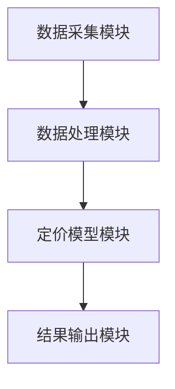
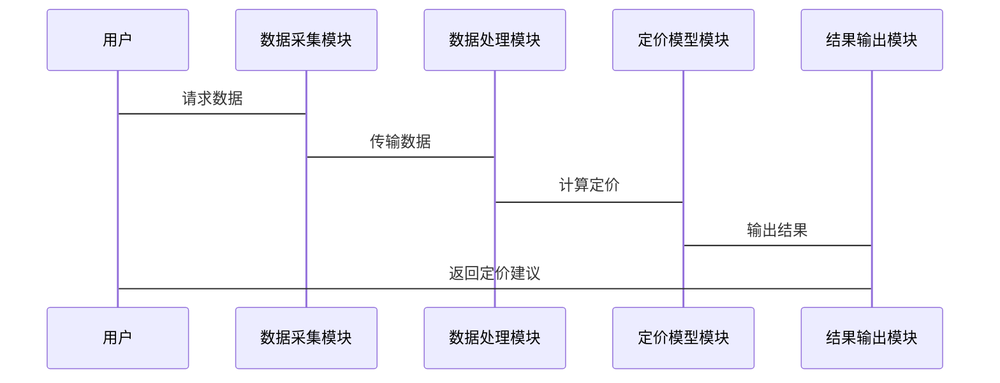

                 


# 股市估值对跨境数字服务定价的影响

> 关键词：股市估值、跨境数字服务、定价模型、数学模型、系统架构、算法影响

> 摘要：本文探讨股市估值如何影响跨境数字服务的定价策略，通过数学模型和系统架构分析，结合实际案例，揭示股市波动对定价的影响，并提出最佳实践建议。

---

## 第一部分：背景与概念

### 第1章：股市估值的基本概念

#### 1.1 股市估值的定义与核心要素

股市估值是通过分析公司财务数据和市场指标来评估其股票价值的过程。核心要素包括市盈率、市净率和股息率。

- **市盈率（P/E）**：股价与每股收益的比率，衡量市场对公司盈利能力的预期。
- **市净率（P/B）**：股价与每股净资产的比率，反映公司资产价值。
- **股息率**：股息与股价的比率，衡量投资回报。

#### 1.2 股市估值与企业价值的关系

股市估值影响投资者对企业的价值判断，进而影响市场行为。例如，高市盈率意味着市场对公司未来增长的乐观预期。

### 第2章：跨境数字服务的基本概念

#### 2.1 跨境数字服务的定义与特点

跨境数字服务是跨国提供数字产品或服务，具有以下特点：

- **无 borders**：服务通过互联网跨国界提供。
- **数字化交付**：无实体产品，直接通过数字方式交付。
- **实时性**：服务通常是实时的，如在线教育、云服务。

#### 2.2 跨境数字服务与传统服务的区别

- **交付方式**：传统服务依赖实体渠道，而数字服务依赖互联网。
- **成本结构**：数字服务边际成本低，传统服务边际成本高。
- **市场扩展**：数字服务可以快速覆盖全球市场。

### 第3章：股市估值对跨境数字服务定价的影响

#### 3.1 股市估值与定价的关系

股市估值影响企业的定价能力。例如，高市盈率意味着企业有更高的定价权，因为市场认为其产品有更高的价值。

#### 3.2 跨境数字服务定价的核心要素

- **成本**：包括开发、维护和运营成本。
- **市场需求**：通过分析用户需求和竞争情况制定价格。
- **股市波动**：股市波动会影响企业的定价策略，尤其是在跨国经营中。

---

## 第二部分：数学模型与算法

### 第4章：股市估值与定价的数学模型

#### 4.1 股市估值的数学模型

- **市盈率模型**：计算公式为 $P/E = \frac{Stock Price}{Earnings Per Share}$。
- **市净率模型**：计算公式为 $P/B = \frac{Stock Price}{Book Value Per Share}$。

#### 4.2 跨境数字服务定价模型

- **成本加成定价**：计算公式为 $Price = Cost + Mark-up$。
- **市场供需定价**：根据市场需求和供给情况调整价格。

### 第5章：股市波动对定价策略的算法影响

#### 5.1 股市波动的量化分析

- **波动率**：衡量股票价格的短期波动程度。
- **市场情绪**：通过新闻和社交媒体分析投资者情绪。

#### 5.2 基于机器学习的定价预测算法

使用机器学习模型预测股市波动，调整定价策略。例如，使用 LSTM 神经网络预测未来股价。

---

## 第三部分：系统分析与架构设计

### 第6章：系统功能设计

#### 6.1 功能模块划分

- **数据采集模块**：收集股票价格、财务数据和市场新闻。
- **数据处理模块**：清洗和转换数据，计算估值指标。
- **定价模型模块**：应用数学模型计算定价。
- **结果输出模块**：生成定价建议和报告。

#### 6.2 系统架构设计

使用微服务架构，各模块独立运行，通过 API 通信。例如：



### 第7章：系统接口设计与交互

#### 7.1 系统接口设计

- **API 接口**：提供 RESTful API，供其他系统调用。
- **数据格式**：使用 JSON 格式传输数据。

#### 7.2 系统交互流程



---

## 第四部分：项目实战

### 第8章：环境安装与核心实现

#### 8.1 环境安装

- **编程语言**：Python 3.8+
- **库**：Pandas、NumPy、Scikit-learn、Flask

#### 8.2 核心代码实现

```python
import pandas as pd
from sklearn.linear_model import LinearRegression

# 数据处理
data = pd.read_csv('data.csv')
X = data[['P/E', 'P/B']]
y = data['Price']

# 训练模型
model = LinearRegression()
model.fit(X, y)

# 预测定价
new_data = {'P/E': 15, 'P/B': 2.5}
predicted_price = model.predict(pd.DataFrame(new_data, index=[0]))
print(predicted_price)
```

---

## 第五部分：总结与展望

### 第9章：最佳实践与注意事项

- **定期更新模型**：市场变化快，需定期重新训练模型。
- **考虑监管因素**：不同国家的监管政策影响定价策略。
- **风险管理**：制定风险管理策略，应对股市波动带来的影响。

### 第10章：小结与未来展望

股市估值对跨境数字服务定价的影响是一个复杂但重要的课题。通过数学模型和系统架构的设计，可以帮助企业制定更科学的定价策略。未来，随着技术的发展，可以进一步结合人工智能和大数据分析，优化定价模型。

---

## 作者信息

作者：AI天才研究院/AI Genius Institute & 禅与计算机程序设计艺术 /Zen And The Art of Computer Programming

---

希望这篇文章能为您提供有价值的信息，并帮助您更好地理解股市估值对跨境数字服务定价的影响。如果有任何问题或需要进一步的解释，请随时联系我。

