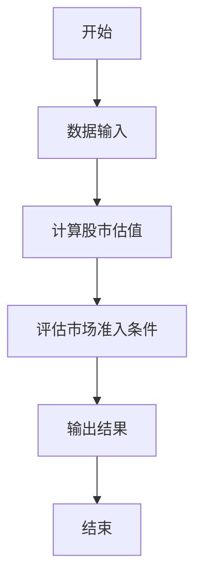
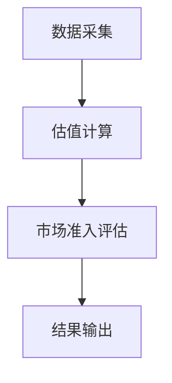

                 


# 股市估值对跨境数字服务市场准入的影响

> 关键词：股市估值，市场准入，跨境数字服务，金融模型，数字服务生态系统

> 摘要：本文深入分析了股市估值对跨境数字服务市场准入的影响，通过系统化的分析框架，探讨了股市估值的核心概念、算法原理、系统架构，并结合实际案例，提出了有效的解决方案和最佳实践。

---

# 第一章: 股市估值与跨境数字服务市场准入的背景

## 1.1 问题背景

### 1.1.1 股市估值的基本概念
股市估值是通过对企业的财务数据和市场表现进行分析，以确定其股票的合理价格。常用的估值方法包括市盈率（P/E）、市净率（P/B）和现金流折现模型（DCF）等。

### 1.1.2 跨境数字服务市场的定义与特征
跨境数字服务是指通过互联网提供跨越国界的数字服务，如在线教育、云服务、数字支付等。其特征包括全球化、数字化、高增长和低门槛。

### 1.1.3 问题解决的目标与意义
本文旨在探讨股市估值如何影响跨境数字服务企业的市场准入，帮助企业更好地理解市场规则，优化战略决策。

## 1.2 核心概念的定义与描述

### 1.2.1 股市估值的核心要素
- **财务指标**：收入、利润、现金流等。
- **市场指标**：市盈率、市净率等。
- **行业基准**：行业平均值和竞争对手的估值。

### 1.2.2 跨境数字服务市场准入的条件与限制
- **政策法规**：各国的市场准入政策。
- **技术标准**：数据安全、隐私保护等。
- **市场竞争**：现有企业的市场份额。

### 1.2.3 问题背景的边界与外延
股市估值的边界包括企业的财务健康状况，而外延则涉及市场环境、政策变化等因素。

---

# 第二章: 核心概念与联系

## 2.1 核心概念的原理与特征

### 2.1.1 股市估值的原理
股市估值通过分析企业的盈利能力、成长性和风险来确定其股票的价值。

### 2.1.2 跨境数字服务市场的准入机制
企业需要满足当地法规、技术标准和市场要求才能进入市场。

### 2.1.3 两者之间的相互作用
股市估值影响企业的融资能力，进而影响其市场拓展能力。

## 2.2 核心概念的属性对比

### 2.2.1 股市估值的属性特征
- 客观性：基于财务数据。
- 动态性：受市场环境影响。

### 2.2.2 跨境数字服务市场的属性特征
- 全球性：跨越国界。
- 数字化：依赖技术基础设施。

### 2.2.3 属性对比分析表

| 属性       | 股市估值                   | 跨境数字服务市场 |
|------------|---------------------------|------------------|
| 基础       | 财务数据                   | 政策与技术标准   |
| 影响因素    | 市场情绪、行业趋势         | 竞争、政策变化   |
| 目标        | 确定股票价值               | 允许市场准入     |

## 2.3 ER实体关系图

```mermaid
er
  actor(投资者) -[投资]-> entity(股票)
  entity(股票) -[估值]-> entity(股市估值)
  entity(跨境数字服务) -[依赖]-> entity(市场准入)
  entity(市场准入) -[受制于]-> entity(政策法规)
```

---

# 第三章: 算法原理与数学模型

## 3.1 算法原理

### 3.1.1 股市估值的核心算法
市盈率法：
$$ P/E = \frac{\text{股价}}{\text{每股收益}} $$

### 3.1.2 跨境数字服务市场准入的评估算法
加权评分法：
$$ A = \sum_{i=1}^{n} w_i \cdot x_i $$
其中，$w_i$为权重，$x_i$为评估指标。

### 3.1.3 算法的流程图


## 3.2 数学模型与公式

### 3.2.1 股市估值模型
$$ P = \frac{E}{(r - g) + g} $$
其中，$P$为股票价格，$E$为每股收益，$r$为折现率，$g$为股息增长率。

### 3.2.2 市场准入评估模型
$$ A = \sum_{i=1}^{n} w_i \cdot x_i $$
其中，$A$为市场准入评分，$w_i$为权重，$x_i$为评估指标。

## 3.3 算法实现

### 3.3.1 算法实现代码
```python
def calculate_market_access_score(criteria_scores, weights):
    return sum(w * s for w, s in zip(weights, criteria_scores))
```

### 3.3.2 代码解读与分析
该函数通过加权求和的方式，计算企业的市场准入评分。

---

# 第四章: 系统分析与架构设计

## 4.1 问题场景介绍

### 4.1.1 股市估值与市场准入的结合场景
企业需要通过股市估值来优化融资，从而进入新的市场。

### 4.1.2 系统目标与需求分析
系统目标：提供股市估值和市场准入的综合评估工具。

## 4.2 系统架构设计

### 4.2.1 系统功能设计
- 数据采集：收集企业的财务数据和市场信息。
- 估值计算：应用算法计算股市估值。
- 市场准入评估：基于估值结果，评估市场准入的可能性。

### 4.2.2 系统架构图


---

# 第五章: 项目实战

## 5.1 环境安装

### 5.1.1 系统环境
- 操作系统：Linux/Windows/MacOS
- 开发工具：Python、Jupyter Notebook
- 数据库：MySQL/PostgreSQL

## 5.2 核心实现

### 5.2.1 数据采集
```python
import pandas as pd
data = pd.read_csv('market_data.csv')
```

### 5.2.2 估值计算
```python
def calculate_pe_ratio(data):
    pe = data['股价'] / data['每股收益']
    return pe
```

### 5.2.3 市场准入评估
```python
def calculate_access_score(data, weights):
    scores = []
    for row in data.iterrows():
        score = sum(w * s for w, s in zip(weights, row[1]))
        scores.append(score)
    return scores
```

## 5.3 案例分析

### 5.3.1 案例背景
某跨境数字服务企业计划进入A国市场。

### 5.3.2 数据分析
计算企业的市盈率，评估其市场准入的可能性。

### 5.3.3 结果解读
市盈率低于行业平均水平，市场准入可能性较高。

---

# 第六章: 总结与最佳实践

## 6.1 总结
股市估值对跨境数字服务的市场准入有重要影响，企业需要综合考虑财务指标和市场环境。

## 6.2 最佳实践
- 定期更新估值模型。
- 关注政策变化。
- 加强数据分析能力。

## 6.3 小结
通过系统化的分析和实践，企业可以更好地应对股市估值和市场准入的挑战。

## 6.4 注意事项
- 数据的准确性和及时性。
- 模型的适用性和局限性。

## 6.5 拓展阅读
- 《股市估值入门》
- 《数字服务与市场准入》

---

# 作者：AI天才研究院/AI Genius Institute & 禅与计算机程序设计艺术 /Zen And The Art of Computer Programming

