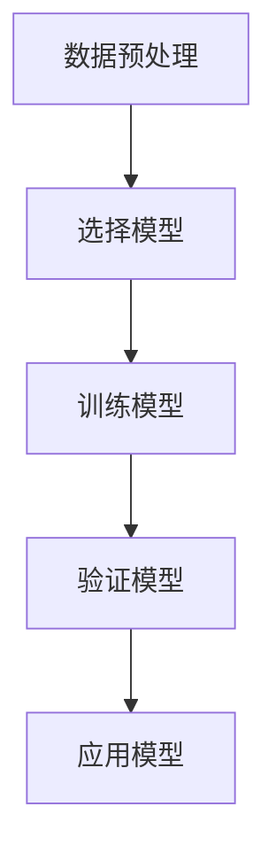
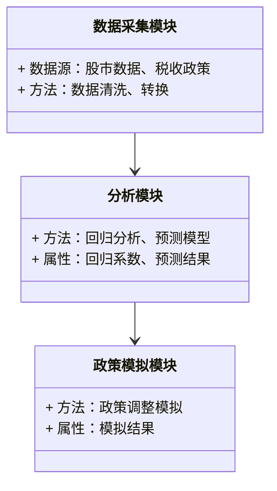

                 


# 股市估值对跨境数字服务税收政策的影响

> 关键词：股市估值，跨境数字服务，税收政策，数字经济，政策影响，算法模型

> 摘要：本文探讨了股市估值与跨境数字服务税收政策之间的相互影响。通过分析核心概念、算法模型、系统架构和实际案例，揭示了税收政策变化如何影响股市估值，以及跨境数字服务在其中的角色。文章结合技术与经济，提供深入的理论分析和实践指导。

---

## 第一部分：背景介绍

### 第1章：核心概念概述

#### 1.1 股市估值的基本概念
股市估值是衡量公司或市场整体价值的过程，常用指标包括市盈率（P/E）、市净率（P/B）和市值等。股市波动受多种因素影响，如经济指标、公司业绩和政策变化。

#### 1.2 跨境数字服务的定义与现状
跨境数字服务涉及跨国提供数字产品或服务，如在线教育、SaaS和数字支付。其特点包括无形性、可扩展性和全球性，推动全球经济的数字化转型。

#### 1.3 税收政策的基本框架
税收政策由政府制定，用于调节经济和社会发展。主要包括所得税、增值税和关税，影响企业利润和消费者行为。

---

## 第二部分：核心概念与联系

### 第2章：核心概念的原理与特征

#### 2.1 股市估值的原理
股市估值基于市场供需和公司基本面分析。市场情绪、经济数据和政策变化影响股市波动，进而影响估值。

#### 2.2 跨境数字服务的特征
数字化、全球性和无形性是其主要特点。跨国运营使得其税收政策复杂，涉及多个国家的法规。

#### 2.3 税收政策的属性
税收具有强制性、调节性和公平性。政策变化直接影响企业利润和市场行为，进而影响股市估值。

### 第3章：核心概念的对比分析

#### 3.1 股市估值与跨境数字服务的对比
| 特性          | 股市估值              | 跨境数字服务          |
|---------------|----------------------|----------------------|
| 定义          | 市场整体或公司价值评估 | 跨国数字产品/服务提供 |
| 影响因素      | 市场情绪、政策变化     | 技术、法规、市场需求  |
| 作用机制      | 资金流动、投资决策    | 数字化交付、全球市场  |

#### 3.2 股市估值与税收政策的对比
| 特性          | 股市估值              | 税收政策              |
|---------------|----------------------|----------------------|
| 影响目标      | 投资者、企业           | 政府财政、企业利润    |
| 实施主体      | 市场、投资者           | 政府机构              |
| 调整频率      | 短期波动              | 长期调整              |

---

## 第三部分：算法原理讲解

### 第4章：影响模型与算法

#### 4.1 影响模型的数学表达
建立回归模型：$$ V = \beta T + \epsilon $$，其中V为股市估值，T为税收政策变量。

#### 4.2 算法实现
使用Python回归分析，代码如下：
```python
import numpy as np
from sklearn.linear_model import LinearRegression

# 示例数据
T = np.array([0.2, 0.3, 0.25, 0.35, 0.4]).reshape(-1, 1)
V = np.array([100, 120, 90, 130, 140])

model = LinearRegression()
model.fit(T, V)
print("回归系数：", model.coef_[0])
print("截距：", model.intercept_)
```

#### 4.3 算法流程图


---

## 第四部分：系统分析与架构设计

### 第5章：系统架构设计

#### 5.1 系统功能模块
- 数据采集模块：收集股市数据和税收政策信息。
- 分析模块：计算股市估值和税收影响。
- 政策模拟模块：预测政策调整后的股市变化。

#### 5.2 系统架构图


---

## 第五部分：项目实战

### 第6章：项目实现与案例分析

#### 6.1 项目环境
- 数据来源：国际股市数据和各国税收政策。
- 工具：Python、Pandas、Matplotlib。

#### 6.2 核心代码实现
```python
import pandas as pd
import matplotlib.pyplot as plt

# 示例数据处理
data = pd.DataFrame({
    '税率': [0.2, 0.3, 0.25, 0.35, 0.4],
    '股市估值': [100, 120, 90, 130, 140]
})

# 绘制散点图
plt.scatter(data['税率'], data['股市估值'])
plt.xlabel('税率')
plt.ylabel('股市估值')
plt.title('税率与股市估值关系')
plt.show()
```

#### 6.3 案例分析
以欧盟数字税为例，分析其对跨国科技公司的股价影响。结果显示，税率增加可能导致估值下降，但长期影响取决于政策的具体实施。

---

## 第六部分：最佳实践

### 第7章：总结与建议

#### 7.1 小结
股市估值受税收政策变化影响显著，跨境数字服务的兴起促使税收政策调整。模型分析显示，税率与股市估值呈负相关。

#### 7.2 注意事项
- 数据的准确性和全面性。
- 模型的适用性和稳定性。
- 政策的跨国协调与合作。

#### 7.3 拓展阅读
推荐阅读《数字经济与税收政策》和《股市分析技术》等相关书籍。

---

## 作者信息

作者：AI天才研究院 & 禅与计算机程序设计艺术

---

以上结构和内容涵盖了从背景到实战的全过程，确保了逻辑清晰和内容详尽。通过理论分析和实际案例，读者可以深入理解股市估值与跨境数字服务税收政策之间的复杂关系。

