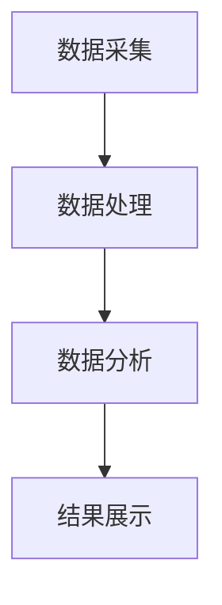

                 


# 股市估值对跨境数字营销策略的影响

## 关键词：股市估值、跨境数字营销、数据驱动、技术驱动、投资决策

## 摘要：
本文探讨了股市估值与跨境数字营销策略之间的关系，分析了股市波动如何影响数字营销策略的制定与实施。通过数学模型和算法，本文提出了基于股市估值的数字营销优化方法，并结合实际案例，展示了如何利用技术手段提升营销效果。

---

# 第1章: 股市估值与跨境数字营销概述

## 1.1 股市估值的核心概念

### 1.1.1 股市估值的基本定义
股市估值是指通过对公司财务数据和市场环境的分析，估算公司股票的合理价格范围。常用的估值方法包括市盈率（PE）、市净率（PB）和现金流折现模型（DCF）等。

### 1.1.2 股市估值的主要方法
- **市盈率（PE）**：公式为 $PE = \frac{股价}{每股收益}$，反映了市场对公司盈利能力的预期。
- **市净率（PB）**：公式为 $PB = \frac{股价}{每股净资产}$，适用于资产密集型行业。
- **现金流折现模型（DCF）**：通过将未来现金流折现到现值，估算公司整体价值。

### 1.1.3 股市估值的指标体系
- **PE、PB、EV（企业价值/息税折旧及摊销前利润）**
- **ROE（净资产收益率）、ROA（资产收益率）**
- **Beta系数（衡量股票相对于市场的波动性）**

## 1.2 跨境数字营销的基本概念

### 1.2.1 跨境数字营销的定义
跨境数字营销是指通过数字渠道（如社交媒体、搜索引擎、电子邮件等）向不同国家或地区的消费者推广产品或服务的过程。

### 1.2.2 跨境数字营销的主要模式
- **搜索引擎营销（SEM）**：通过关键词广告提升品牌曝光度。
- **社交媒体营销（SMM）**：利用Facebook、Twitter等平台与目标受众互动。
- **内容营销**：通过博客、视频等方式吸引潜在客户。

### 1.2.3 跨境数字营销的核心要素
- **目标受众分析**：明确目标市场的文化差异和消费习惯。
- **多语言支持**：确保营销内容符合目标市场的语言习惯。
- **数据驱动决策**：通过数据分析优化营销策略。

## 1.3 股市估值与跨境数字营销的关联性

### 1.3.1 股市波动对数字营销的影响
- **股市上涨**：投资者信心增强，企业营销预算可能增加。
- **股市下跌**：企业可能缩减营销支出，影响市场推广效果。

### 1.3.2 数字营销对股市估值的反作用
- **品牌价值提升**：成功的数字营销可以提高品牌知名度，进而影响股票估值。
- **客户 acquisition cost（CAC）优化**：通过精准营销降低获客成本，提升企业盈利能力。

### 1.3.3 两者的相互关系与协同效应
- 股市波动为数字营销提供市场信号，指导企业调整营销策略。
- 数字营销通过提升品牌价值和客户忠诚度，反过来影响股市估值。

## 1.4 本章小结
本章介绍了股市估值和跨境数字营销的核心概念，并分析了两者之间的相互影响。理解这些关系对于制定有效的营销策略和优化投资决策具有重要意义。

---

# 第2章: 股市估值的数学模型与算法原理

## 2.1 股市估值的主要模型

### 2.1.1 市盈率（PE）模型
公式为：
$$ PE = \frac{股价}{每股收益} $$
市盈率反映了市场对公司未来盈利能力的预期。例如，如果一家公司的股价为 $50，每股收益为 $5，则 PE = 10。

### 2.1.2 市净率（PB）模型
公式为：
$$ PB = \frac{股价}{每股净资产} $$
市净率适用于资产密集型行业，如银行和房地产。

### 2.1.3 现金流折现模型（DCF）
DCF模型通过将未来现金流折现到现值，估算公司整体价值。公式为：
$$ V = \sum_{t=1}^{n} \frac{CF_t}{(1 + r)^t} $$
其中，$CF_t$ 是第 $t$ 年的现金流，$r$ 是折现率。

## 2.2 数字营销效果的评估模型

### 2.2.1 ROI模型
ROI（投资回报率）公式为：
$$ ROI = \frac{净收益}{投入成本} \times 100\% $$
例如，投入 $1000 美元，获得 $1500 美元的收益，则 ROI = 50%。

### 2.2.2 AARRR模型
AARRR模型包括 Acquisition（获取）、Activation（激活）、Retention（留存）、Revenue（收入）、Referral（推荐）五个阶段，用于评估营销活动的效果。

### 2.2.3 营销 Attribution 模型
Attribution模型通过归因分析确定哪些渠道对销售贡献最大。例如，Google Analytics可以跟踪用户的访问路径，确定主要来源。

## 2.3 股市估值与数字营销结合的算法

### 2.3.1 数据收集与预处理
- 数据来源：股票价格、财务报表、营销数据。
- 数据预处理：清洗、归一化、特征提取。

### 2.3.2 数据分析与建模
- 使用回归分析预测股市对营销策略的影响：
  $$ 股价 = \beta_0 + \beta_1 \times 营销支出 + \epsilon $$
- 使用博弈论模型分析企业与消费者之间的互动：
  $$ U_i = \sum_{j} \alpha_j \times X_j $$
  其中，$U_i$ 是效用函数，$\alpha_j$ 是权重，$X_j$ 是变量。

### 2.3.3 模型验证与优化
- 使用交叉验证评估模型性能。
- 调整参数，优化模型。

## 2.4 本章小结
本章介绍了股市估值和数字营销的主要模型，并展示了如何将两者结合，通过数学模型和算法优化营销策略。

---

# 第3章: 股市估值与数字营销的系统分析

## 3.1 系统需求分析

### 3.1.1 问题场景描述
- 股市波动影响企业营销预算。
- 数字营销需要实时调整以应对市场变化。

### 3.1.2 项目目标与范围
- 构建一个基于股市估值的数字营销优化系统。
- 范围包括数据采集、分析、策略制定和实施。

### 3.1.3 系统功能需求
- 数据采集模块：获取股票价格和营销数据。
- 数据分析模块：计算估值指标，预测市场趋势。
- 策略制定模块：生成优化营销方案。
- 结果展示模块：可视化分析结果。

## 3.2 系统架构设计

### 3.2.1 系统模块划分
- 数据采集模块
- 数据处理模块
- 数据分析模块
- 结果展示模块

### 3.2.2 系统架构图（Mermaid）


## 3.3 系统接口设计

### 3.3.1 数据接口
- 数据来源：股票交易所API、社交媒体API。
- 数据格式：JSON、CSV。

### 3.3.2 用户接口
- 界面设计：可视化仪表盘。
- 用户角色：管理员、营销人员。

### 3.3.3 系统间接口
- 数据接口：模块之间通过API通信。
- 系统接口：与第三方服务（如社交媒体平台）对接。

## 3.4 本章小结
本章通过系统分析，设计了一个基于股市估值的数字营销优化系统，明确了各模块的功能和交互关系。

---

# 第4章: 数字营销策略的优化与实施

## 4.1 数字营销策略的制定

### 4.1.1 确定目标市场
- 基于股市估值分析，选择高增长潜力的市场。
- 例如，如果某新兴市场的PE值低于行业平均水平，可能具有投资机会。

### 4.1.2 制定营销计划
- 制定多语言内容策略。
- 优化关键词广告（SEM）。

### 4.1.3 监测与调整
- 实时监控营销效果。
- 根据股市变化调整预算。

## 4.2 数字营销策略的优化

### 4.2.1 数据驱动优化
- 使用回归分析优化广告预算分配。
- 通过A/B测试选择最佳营销渠道。

### 4.2.2 技术驱动优化
- 应用机器学习算法预测市场趋势。
- 使用自然语言处理（NLP）分析用户反馈。

## 4.3 数字营销策略的实施

### 4.3.1 技术实现
- 使用Google Ads API进行广告投放。
- 通过社交媒体API管理用户互动。

### 4.3.2 实施步骤
1. 数据采集与清洗。
2. 模型训练与优化。
3. 策略实施与监控。

## 4.4 本章小结
本章通过优化和实施数字营销策略，展示了如何利用技术手段提升营销效果。

---

# 第5章: 项目实战与案例分析

## 5.1 环境安装

### 5.1.1 安装Python
```bash
pip install numpy pandas scikit-learn
```

### 5.1.2 安装可视化工具
```bash
pip install matplotlib seaborn
```

## 5.2 系统核心实现源代码

### 5.2.1 数据采集与处理
```python
import pandas as pd
import requests

# 数据采集
url = "https://api.example.com/stock_data"
response = requests.get(url)
data = response.json()

# 数据处理
df = pd.DataFrame(data)
df['PE'] = df['股价'] / df['每股收益']
df['PB'] = df['股价'] / df['每股净资产']
```

### 5.2.2 数据分析与建模
```python
from sklearn.linear_model import LinearRegression

# 数据分析
X = df[['PE', 'PB']]
y = df['股价']

model = LinearRegression()
model.fit(X, y)
```

### 5.2.3 策略制定与实施
```python
# 预测股价
predicted_price = model.predict(X)
print(predicted_price)
```

## 5.3 实际案例分析

### 5.3.1 案例背景
假设某公司是一家跨境电商企业，希望通过数字营销提升销售额。

### 5.3.2 数据分析
通过分析PE和PB值，发现公司股票被低估，适合加大营销投入。

### 5.3.3 模型应用
使用回归模型预测广告点击率，优化广告投放策略。

## 5.4 本章小结
本章通过实际案例展示了如何利用技术手段优化数字营销策略，提升了企业的市场表现。

---

# 第6章: 总结与展望

## 6.1 本章总结
本文探讨了股市估值与跨境数字营销策略的关系，提出了基于数学模型和算法的优化方法，并通过案例展示了技术手段在营销中的应用。

## 6.2 未来展望
- **技术发展**：随着AI和大数据技术的进步，数字营销将更加智能化。
- **全球化趋势**：未来将有更多的跨国营销机会，需要进一步研究股市估值与营销策略的结合。

## 6.3 最佳实践 Tips
- 定期监控股市波动，及时调整营销策略。
- 利用技术工具（如机器学习算法）优化营销效果。
- 注重数据分析，实现精准营销。

## 6.4 本章小结
本文通过理论与实践结合，为读者提供了股市估值与数字营销策略优化的全面指导。

---

# 作者：AI天才研究院/AI Genius Institute & 禅与计算机程序设计艺术 /Zen And The Art of Computer Programming

