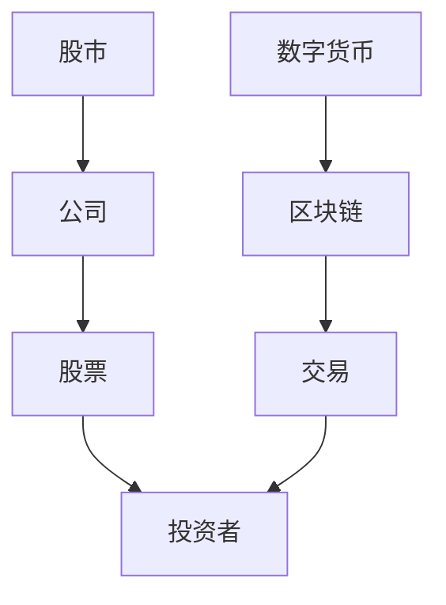
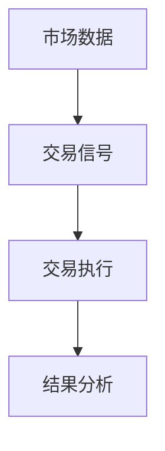
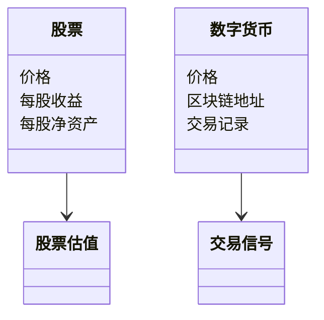
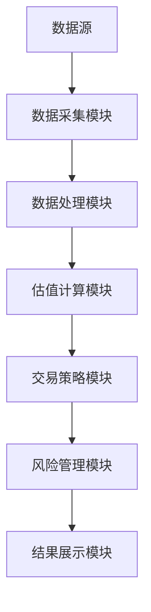
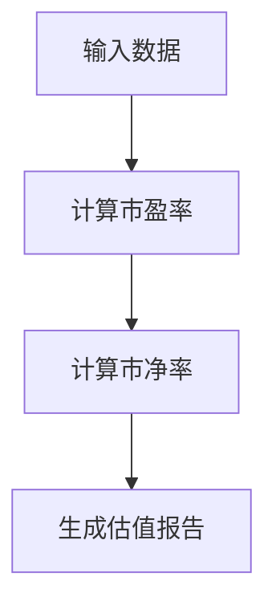

                 


# 股市估值对跨境数字货币交易的影响

> 关键词：股市估值、跨境数字货币交易、金融模型、算法交易、风险管理

> 摘要：本文深入探讨了股市估值与跨境数字货币交易之间的相互影响，通过数学模型、算法原理和系统架构的分析，结合实际案例，揭示了股市估值对数字货币交易的潜在影响。同时，本文还提供了系统的解决方案和最佳实践，帮助投资者更好地理解和应对这一复杂领域的挑战。

---

# 第一部分: 股市估值与跨境数字货币交易的背景与基础

## 第1章: 股市估值与跨境数字货币交易的基本概念

### 1.1 股市估值的核心概念

#### 1.1.1 股票估值的基本方法
股市估值是通过分析公司的财务数据、市场环境和行业趋势，来确定股票的合理价格区间。常用的估值方法包括：

1. **市盈率（P/E）**：用股价除以每股收益，衡量投资者对股票的支付意愿。
2. **市净率（P/B）**：用股价除以每股净资产，适用于重资产行业。
3. **股息率**：用每股股息除以股价，衡量股票的分红能力。
4. **DCF模型**：通过现金流折现计算公司估值。

#### 1.1.2 市盈率、市净率等核心指标解析
- **市盈率**：$P/E = \frac{P}{E}$，其中$P$为股票价格，$E$为每股收益。
- **市净率**：$P/B = \frac{P}{B}$，其中$B$为每股净资产。
- 这些指标反映了市场对公司的估值预期，但需要结合行业和公司具体情况分析。

#### 1.1.3 股市估值的边界与外延
股市估值不仅关注公司财务数据，还需要考虑宏观经济环境、政策变化和市场情绪等外部因素。

---

### 1.2 跨境数字货币交易的定义与特点

#### 1.2.1 数字货币的基本概念
数字货币是一种基于区块链技术的虚拟货币，具有去中心化、匿名性和可编程性等特点。

#### 1.2.2 跨境交易的核心特点
- **24/7交易**：数字货币市场全年无休，支持全球范围内的实时交易。
- **去中心化**：交易不受传统金融机构的限制，但需要依赖区块链技术保证安全性。
- **高波动性**：数字货币价格受市场情绪影响较大，波动性远高于传统金融资产。

#### 1.2.3 数字货币与传统货币的对比
| 对比维度 | 数字货币 | 传统货币 |
|----------|----------|-----------|
| 发行方式 | 去中心化 | 中央银行 |
| 交易效率 | 高 | 低 |
| 跨境成本 | 低 | 高 |

---

### 1.3 股市估值与数字货币交易的联系

#### 1.3.1 股市与数字货币市场的相互影响
- 股市的波动可能影响投资者对数字货币的交易情绪。
- 数字货币的剧烈波动也可能反过来影响股市的稳定性。

#### 1.3.2 数字货币对股市估值的潜在影响
- 数字货币的高波动性可能通过投资者情绪影响股市估值。
- 某些公司（如科技公司）的数字货币业务可能影响其股票估值。

#### 1.3.3 股市与数字货币交易的协同效应
- 数字货币为投资者提供了新的资产配置选择，可能分散股市风险。
- 股市中的技术创新（如区块链）可能推动数字货币市场的增长。

---

## 第2章: 股市估值与数字货币交易的核心概念关系

### 2.1 核心概念的原理分析

#### 2.1.1 股市估值的数学模型
股票价格的合理估值可以通过以下公式计算：
$$ P = \frac{E}{E/P} $$
其中$E$为公司净利润，$P$为市盈率。

#### 2.1.2 数字货币交易的算法原理
数字货币交易通常基于技术分析和量化模型，例如：
1. 移动平均线（MA）：计算一定周期内的价格平均值。
2. 相对强弱指数（RSI）：衡量价格超买或超卖状态。

#### 2.1.3 两者的关联性分析
- 股市估值模型为数字货币交易提供了理论基础。
- 数字货币交易的高频特性为股市估值提供了新的数据来源。

---

### 2.2 核心概念的属性特征对比

#### 2.2.1 股市估值与数字货币交易的对比表格
| 对比维度 | 股市估值 | 数字货币交易 |
|----------|----------|---------------|
| 交易场所 | 交易所 | 去中心化平台 |
| 交易时间 | 交易日 | 全天候 |
| 交易主体 | 投资者、机构 | 投资者、算法交易机器人 |
| 价格影响因素 | 公司业绩、宏观经济 | 技术指标、市场情绪 |

---

### 2.3 ER实体关系图架构



---

## 第3章: 股市估值与数字货币交易的数学模型与算法原理

### 3.1 股市估值的数学模型

#### 3.1.1 市盈率模型
$$ P/E = \frac{P}{E} $$
其中$P$为股票价格，$E$为每股收益。

#### 3.1.2 市净率模型
$$ P/B = \frac{P}{B} $$
其中$B$为每股净资产。

---

### 3.2 数字货币交易的算法原理

#### 3.2.1 简单的交易策略


---

### 3.3 组合模型与算法实现

#### 3.3.1 组合模型的构建
结合股市估值和数字货币交易的特点，构建如下的组合模型：
1. 利用市盈率和市净率筛选低估股票。
2. 通过技术指标（如RSI、MACD）捕捉数字货币交易机会。

#### 3.3.2 算法实现的Python代码示例
```python
import pandas as pd
import numpy as np

# 示例：计算股票的市盈率和市净率
df = pd.DataFrame({
    'Price': [100, 200, 300],
    'Earnings_per_share': [10, 20, 30],
    'Book_value_per_share': [50, 60, 70]
})

df['PE'] = df['Price'] / df['Earnings_per_share']
df['PB'] = df['Price'] / df['Book_value_per_share']
print(df)
```

---

### 3.4 本章小结
通过数学模型和算法分析，我们建立了股市估值与数字货币交易的理论基础，为后续的系统实现奠定了基础。

---

# 第二部分: 股市估值与数字货币交易的系统分析与架构设计

## 第4章: 股市估值与数字货币交易的系统架构设计

### 4.1 项目介绍
我们设计一个综合系统，用于分析股市估值对数字货币交易的影响，实现以下功能：
1. 数据采集：获取股票和数字货币的实时数据。
2. 估值计算：基于市盈率和市净率模型计算股票估值。
3. 交易策略：结合技术指标和市场情绪制定交易策略。
4. 风险管理：评估交易风险并优化投资组合。

---

### 4.2 系统功能设计

#### 4.2.1 领域模型


---

### 4.3 系统架构设计

#### 4.3.1 系统架构图


---

## 第5章: 股市估值与数字货币交易的算法实现

### 5.1 算法实现的Python代码示例

#### 5.1.1 数据采集
```python
import requests

def get_stock_data(symbol):
    url = f"https://api.example.com/stock/{symbol}"
    response = requests.get(url)
    return response.json()
```

#### 5.1.2 估值计算
```python
def calculate_pe_ratio(price, earnings_per_share):
    return price / earnings_per_share

def calculate_pb_ratio(price, book_value_per_share):
    return price / book_value_per_share
```

---

### 5.2 算法实现的流程图



---

## 第6章: 股市估值与数字货币交易的实际案例分析

### 6.1 案例背景介绍
假设某科技公司股票价格为100元，每股收益为10元，每股净资产为50元。同时，其数字货币业务可能影响其股票估值。

---

### 6.2 估值计算与分析
1. 市盈率：$P/E = 100/10 = 10$。
2. 市净率：$P/B = 100/50 = 2$。
3. 如果数字货币价格波动较大，可能会影响投资者对该公司股票的估值预期。

---

### 6.3 交易策略与风险管理

#### 6.3.1 交易策略
- 当市盈率低于行业平均水平时，买入股票。
- 当RSI指标显示超卖时，买入数字货币。

#### 6.3.2 风险管理
- 设置止损点，避免重大损失。
- 分散投资，降低单一资产的风险。

---

## 第7章: 最佳实践与总结

### 7.1 最佳实践 tips
1. 结合股市估值和数字货币交易的特点，制定合理的投资策略。
2. 采用技术分析和量化模型，提高交易效率。
3. 加强风险管理，控制投资风险。

---

## 第8章: 作者信息

作者：AI天才研究院/AI Genius Institute & 禅与计算机程序设计艺术 /Zen And The Art of Computer Programming

---

# 附录: 参考文献与扩展阅读

- 《股票估值的数学模型与应用》
- 《区块链与数字货币交易》
- 《量化交易与算法实现》

---

以上为《股市估值对跨境数字货币交易的影响》的完整目录大纲和文章内容。

