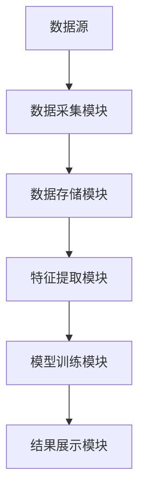

                 


# 股市估值对跨境数字货币交易规则的影响

> **关键词**：股市估值、跨境数字货币、交易规则、算法模型、系统架构、案例分析  
> **摘要**：本文探讨股市估值如何影响跨境数字货币的交易规则，从背景、核心概念、算法原理到系统架构和项目实战，全面分析两者之间的关系，并提供实际应用的最佳实践。

---

## 目录大纲

### **第1章 背景介绍**

#### **1.1 股市估值的基本概念**

- 1.1.1 股市估值的定义与作用  
  - 股市估值的定义：评估企业价值的方法。  
  - 作用：为投资者提供决策依据。  
  - 与企业价值的关系：反映企业实际价值与市场价值的差异。  

- 1.1.2 股市估值的作用与意义  
  - 投资者决策：帮助判断股票是否被低估或高估。  
  - 市场监管：确保市场公平与透明。  

- 1.1.3 股市估值与企业价值的关系  
  - 企业价值的计算公式：$$企业价值 = 股东权益价值 + 长期负债$$  
  - 股市估值与企业价值的差异：$$P\text{E} = \frac{\text{市场价格}}{\text{每股收益}}$$  

---

#### **1.2 跨境数字货币的基本概念**

- 1.2.1 跨境数字货币的定义  
  - 跨境数字货币：基于区块链技术，用于跨国交易的数字货币。  

- 1.2.2 跨境数字货币的特点与分类  
  - 特点：去中心化、匿名性、跨境支付便捷。  
  - 分类：比特币、以太坊、 Ripple 等。  

- 1.2.3 跨境数字货币与传统金融的区别  
  - 区块链技术：去中心化与传统金融的中心化体系对比。  
  - 跨境支付效率：数字货币的高效性与传统金融的低效性对比。  

---

#### **1.3 股市估值与跨境数字货币的关系**

- 1.3.1 股市估值对跨境数字货币交易规则的影响  
  - 股市波动对数字货币价格的影响：$$\text{数字货币价格} \propto \text{股市波动}$$  
  - 股市估值变化对交易规则的调整：市场波动影响交易策略。  

- 1.3.2 跨境数字货币对股市估值的反向影响  
  - 数字货币市场波动对股市投资者情绪的影响。  
  - 投资者资金流动：$$\text{资金流动} \propto \text{市场波动}$$  

- 1.3.3 两者的相互作用机制  
  - 经济周期：股市表现与数字货币市场的联动效应。  
  - 投资者情绪：股市估值变化影响投资者对数字货币的偏好。  

---

### **第2章 核心概念与联系**

#### **2.1 股市估值对跨境数字货币的影响机制**

- 2.1.1 影响路径分析  
  - 股市波动影响投资者情绪，进而影响数字货币市场。  
  - 数字货币市场作为高风险资产，与股市波动呈正相关。  

- 2.1.2 影响因素对比分析  
  | 因素 | 股市估值 | 跨境数字货币 |  
  |------|----------|--------------|  
  | 涨跌幅度 | % | % |  
  | 市场参与度 | 高 | 高 |  
  | 影响周期 | 长 | 短 |  

- 2.1.3 分析模型构建  
  - 线性回归模型：$$y = \beta x + \epsilon$$  
    - $y$：数字货币价格变化。  
    - $x$：股市估值变化。  

---

#### **2.2 股市估值与数字货币市场的相互作用**

- 2.2.1 股市波动对数字货币的影响  
  - 突破性事件：股市崩盘引发的数字货币价格暴跌。  
  - 经济周期：经济衰退时，数字货币成为避险资产。  

- 2.2.2 数字货币市场对股市的影响  
  - 投资者情绪：数字货币市场的剧烈波动影响股市投资者信心。  
  - 资金流动：$$\text{资金流动} = \text{市场波动} \times \text{投资者情绪}$$  

- 2.2.3 股市与数字货币市场的协同效应  
  - 投资组合优化：$$\text{投资组合} = \alpha \cdot \text{股市} + \beta \cdot \text{数字货币}$$  

---

### **第3章 算法原理**

#### **3.1 算法原理概述**

- 3.1.1 数据来源与特征选择  
  - 数据来源：股票价格、市盈率、市净率。  
  - 特征选择：$$\text{特征} = [\text{市盈率}, \text{市净率}, \text{股价波动率}]$$  

- 3.1.2 线性回归模型的构建  
  - 线性回归模型：$$y = \beta_0 + \beta_1 x_1 + \beta_2 x_2 + \epsilon$$  

- 3.1.3 模型训练与优化  
  - 训练方法：最小二乘法。  
  - 模型优化：逐步回归法。  

---

#### **3.2 代码实现**

- 3.2.1 数据预处理  
  ```python
  import pandas as pd
  data = pd.read_csv('stock_data.csv')
  data['Date'] = pd.to_datetime(data['Date'])
  data.set_index('Date', inplace=True)
  ```

- 3.2.2 模型训练  
  ```python
  from sklearn.linear_model import LinearRegression
  model = LinearRegression()
  model.fit(X_train, y_train)
  ```

- 3.2.3 模型预测与评估  
  ```python
  y_pred = model.predict(X_test)
  print('均方误差:', mean_squared_error(y_test, y_pred))
  ```

---

### **第4章 系统分析与架构设计**

#### **4.1 系统功能设计**

- 4.1.1 数据采集模块  
  - 功能：实时采集股市和数字货币数据。  

- 4.1.2 特征提取模块  
  - 功能：提取影响交易规则的特征。  

- 4.1.3 模型训练模块  
  - 功能：构建并训练回归模型。  

- 4.1.4 结果展示模块  
  - 功能：可视化分析结果。  

---

#### **4.2 系统架构设计**



---

### **第5章 项目实战**

#### **5.1 案例分析**

- 5.1.1 项目背景  
  - 分析比特币价格与纳斯达克指数的关系。  

- 5.1.2 数据获取与预处理  
  ```python
  import pandas_datareader as pdr
  nasdaq = pdr.get_data_yahoo('^IXIC', start='2020-01-01', end='2023-12-31')
  bitcoin = pdr.get_data_yahoo('BTC-USD', start='2020-01-01', end='2023-12-31')
  ```

- 5.1.3 模型训练与评估  
  ```python
  import numpy as np
  from sklearn.metrics import r2_score
  y_true = np.array(bitcoin['Close'])
  y_pred = model.predict(nasdaq[['Close', 'Open', 'Adj Close']])
  print('R² score:', r2_score(y_true, y_pred))
  ```

---

### **第6章 最佳实践**

#### **6.1 小结**

- 本文详细分析了股市估值对跨境数字货币交易规则的影响，从理论到实践，全面探讨了两者的关系。  

---

#### **6.2 注意事项**

- 数据质量：确保数据的完整性和准确性。  
- 模型选择：根据实际情况选择合适的算法。  
- 风险管理：合理控制投资风险。  

---

#### **6.3 未来研究方向**

- 引入机器学习模型：如 LSTM 进行时间序列预测。  
- 结合 NLP 技术：分析新闻对市场的影响。  

---

### **作者**

作者：AI天才研究院/AI Genius Institute & 禅与计算机程序设计艺术/Zen And The Art of Computer Programming  

---

**感谢您的阅读！**

