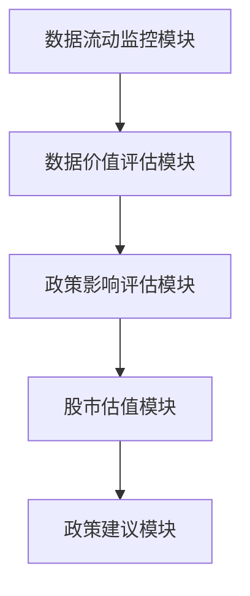

                 


```markdown
# 股市估值对跨境数据流动政策的影响

## 关键词：股市估值，跨境数据流动，政策影响，信息不对称，数据隐私，宏观经济

## 摘要：  
本文探讨了股市估值与跨境数据流动政策之间的复杂关系，从数据流动的经济学原理到股市估值的金融学机制，再到政策对数据流动的约束与影响，层层剖析。通过数学模型和实际案例分析，揭示了跨境数据流动对股市估值的深远影响，为政策制定者和投资者提供了重要的理论依据和实践指导。

---

## 第一部分: 股市估值与跨境数据流动政策的背景介绍

### 第1章: 股市估值与跨境数据流动的基本概念

#### 1.1 股市估值的定义与计算方法
- 1.1.1 股市估值的基本概念
  - 股票价值的决定因素：包括企业盈利能力、市场供需、宏观经济环境等。
  - 股市估值的边界：仅考虑公开市场交易的股票，不包括场外市场。
  - 股市估值的外延：涵盖主板、创业板、科创板等不同市场板块。

- 1.1.2 市盈率、市净率等核心指标的定义与计算公式
  - 市盈率（P/E）= 股价 / 每股净利润
  - 市净率（P/B）= 股价 / 每股净资产
  - 市销率（P/S）= 股价 / 每股收入

- 1.1.3 股市估值的边界与外延
  - 边界：仅考虑上市公司的公开数据，不包括未上市企业的估值。
  - 外延：涵盖全球主要股市的指数表现和行业板块走势。

#### 1.2 跨境数据流动的定义与特点
- 1.2.1 跨境数据流动的基本概念
  - 数据流动：指数据从一国境内转移到另一国境内的过程。
  - 跨境数据流动的特点：跨国性、双向性、高频性。

- 1.2.2 跨境数据流动的核心属性对比表格
  | 属性         | 描述                                                                 |
  |--------------|----------------------------------------------------------------------|
  | 数据类型     | 包括个人信息、企业数据、政府数据等。                              |
  | 流动方向     | 单向或双向流动。                                                   |
  | 流动频率     | 高频或低频，取决于数据类型和用途。                                 |

- 1.2.3 跨境数据流动的边界与外延
  - 边界：仅考虑合法、合规的数据流动，不包括非法数据传输。
  - 外延：涵盖互联网、金融系统、跨国企业内部数据传输等多个领域。

#### 1.3 股市估值与跨境数据流动的关联性
- 1.3.1 股市估值与跨境数据流动的内在联系
  - 数据流动影响企业运营效率，进而影响股市估值。
  - 数据流动的合规性影响企业信用评级，间接影响股市估值。

- 1.3.2 股市估值对跨境数据流动的影响机制
  - 股市估值的变化会影响企业的融资能力，进而影响其数据流动能力。
  - 股市波动可能引发数据流动的短期波动，如数据泄露事件导致股价下跌，进而影响数据流动的合规性。

- 1.3.3 跨境数据流动对股市估值的反向影响
  - 数据流动的不确定性可能导致股市估值波动。
  - 数据流动的政策变化可能导致特定行业或公司的估值调整。

---

## 第二部分: 股市估值与跨境数据流动政策的理论基础

### 第2章: 股市估值与跨境数据流动的核心概念与联系

#### 2.1 数据流动的经济学原理
- 2.1.1 数据的经济价值与定价模型
  - 数据的经济价值：数据作为生产要素，其价值取决于其对生产效率的提升作用。
  - 数据定价模型：基于数据的稀缺性、用途和质量进行定价。

- 2.1.2 数据流动的市场机制与供需关系
  - 数据供需的基本模型：供给方提供数据，需求方支付费用。
  - 数据流动的市场机制：市场供需决定数据流动的路径和速度。

- 2.1.3 数据流动的外部性与公共政策
  - 数据流动的正外部性：促进经济增长和技术进步。
  - 数据流动的负外部性：可能导致隐私泄露和数据滥用。

#### 2.2 股市估值的金融学原理
- 2.2.1 股票价值的决定因素
  - 企业基本面：包括盈利能力、成长性、财务状况等。
  - 市场情绪：投资者情绪和市场预期对股价的影响。

- 2.2.2 数据流动与市场信息不对称
  - 信息不对称的定义：市场参与者掌握不同信息导致的交易不公平现象。
  - 数据流动对信息不对称的影响：数据流动的增加可能缓解信息不对称，但也可能加剧信息不对称。

- 2.2.3 数据流动对股市估值的宏观经济影响
  - 数据流动促进技术创新，提高企业生产力，从而提升股市估值。
  - 数据流动可能导致金融市场的过度波动，对股市估值产生负面影响。

#### 2.3 股市估值与跨境数据流动的ER实体关系图
```mermaid
er
    actor 股市参与者
    actor 数据提供者
    actor 数据接收者
    entity 股票
    entity 数据流
    entity 政策法规
    股市参与者 --> 股票: 估值影响
    数据提供者 --> 数据流: 提供
    数据接收者 <-- 数据流: 接收
    政策法规 --> 数据流: 约束
```

---

## 第三部分: 股市估值与跨境数据流动政策的影响机制与数学模型

### 第3章: 股市估值与跨境数据流动的数学模型与算法原理

#### 3.1 数据流动对股市估值的影响模型
- 3.1.1 数据流动的经济价值对股市估值的影响
  - 数据流动的价值 = 数据的使用价值 × 数据的流动性
  - 数据的使用价值：数据对企业和经济的贡献程度。
  - 数据的流动性：数据在不同地区和企业之间的转移能力。

- 3.1.2 数据流动的政策约束对股市估值的影响
  - 政策约束强度 = 数据流动的监管力度 × 数据流动的敏感性
  - 数据流动的监管力度：政府对数据流动的监管强度。
  - 数据流动的敏感性：数据对国家安全和公共利益的影响程度。

- 3.1.3 数据流动对股市估值的综合影响模型
  $$ \text{综合影响} = \text{数据流动的经济价值} - \text{政策约束强度} $$

#### 3.2 数据流动对股市估值的影响算法
- 3.2.1 数据流动的经济价值计算算法
  ```python
  def data_value_assessment(data_type, data_usefulness, data_relevance):
      return data_type * data_usefulness * data_relevance
  ```

- 3.2.2 数据流动的政策约束计算算法
  ```python
  def policy_constraint(policy_level, data_sensitivity):
      return policy_level * data_sensitivity
  ```

- 3.2.3 综合影响评估算法
  ```python
  def overall_impact(data_value, policy_constraint):
      return data_value - policy_constraint
  ```

---

## 第四部分: 股市估值与跨境数据流动政策的案例分析与实战

### 第4章: 股市估值与跨境数据流动政策的案例分析

#### 4.1 数据泄露事件对股市估值的影响
- 案例背景：某跨国公司因数据泄露事件导致股价大幅下跌。
- 数据流动的合规性问题：数据流动的不合规性导致数据泄露风险增加。
- 对股市估值的影响：数据泄露事件引发投资者对数据安全的担忧，导致股价下跌。

#### 4.2 政策变化对股市估值的影响
- 案例背景：某国出台新的跨境数据流动政策，导致部分行业股价波动。
- 数据流动的政策约束：新政策增加了数据流动的合规成本，影响企业盈利能力和市场预期。
- 对股市估值的影响：政策变化引发市场对相关行业的重新评估，导致股价波动。

---

## 第五部分: 股市估值与跨境数据流动政策的系统架构与风险管理

### 第5章: 股市估值与跨境数据流动政策的系统架构设计

#### 5.1 系统功能设计
- 数据流动监控模块：实时监控跨境数据流动，识别异常数据流动。
- 数据价值评估模块：评估数据流动的经济价值，计算数据流动对股市估值的影响。
- 政策影响评估模块：评估政策变化对数据流动和股市估值的影响。

#### 5.2 系统架构设计


---

## 第六部分: 股市估值与跨境数据流动政策的总结与展望

### 第6章: 股市估值与跨境数据流动政策的总结

#### 6.1 股市估值与跨境数据流动政策的核心结论
- 数据流动的经济价值对股市估值有重要影响。
- 数据流动的政策约束对股市估值有双向影响。

#### 6.2 股市估值与跨境数据流动政策的未来展望
- 数据流动的智能化监管：利用人工智能技术提高数据流动监管效率。
- 数据流动的全球化治理：推动国际间的数据流动政策协调与合作。

---

## 作者：AI天才研究院/AI Genius Institute & 禅与计算机程序设计艺术 /Zen And The Art of Computer Programming
```

