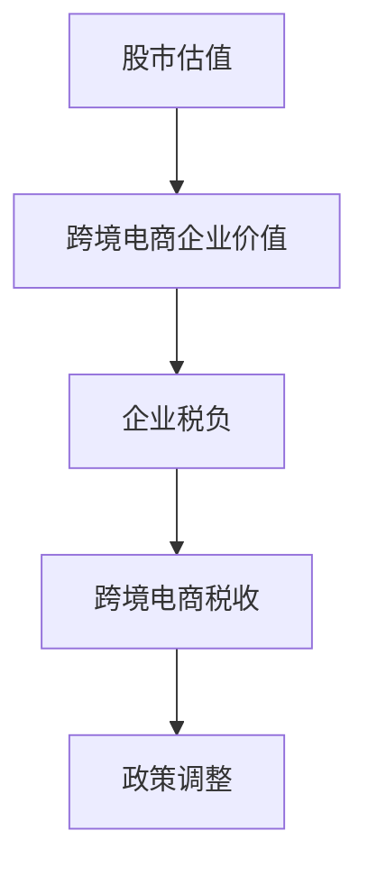

                 


# 股市估值对跨境电子商务税收的影响

> **关键词**：股市估值、跨境电商税收、税收政策、企业价值、税务优化  
> **摘要**：本文探讨股市估值与跨境电子商务税收之间的关系，分析股市估值波动对跨境电商企业税负的影响，构建数学模型解释其相互作用机制，并提出优化策略以降低企业税务风险。

---

## 第一部分：背景与核心概念

### 第1章：股市估值与跨境电商税收的背景介绍

#### 1.1 股市估值的基本概念

- **1.1.1 股市估值的定义与核心要素**  
  股市估值是指通过对企业财务状况、市场表现和行业前景等多维度分析，确定其股票的市场价格是否合理。核心要素包括市盈率（P/E）、市净率（P/B）、市值与现金流比（P/FCF）等。

- **1.1.2 股市估值的主要方法**  
  常见的估值方法有相对估值法（如市盈率法、市净率法）和绝对估值法（如现金流贴现法）。这些方法帮助企业判断股票价格是否被高估或低估。

- **1.1.3 股市估值与企业价值的关系**  
  股市估值是市场对企业的整体价值判断，直接影响投资者信心和企业融资成本。高估可能导致企业过度扩张，低估则可能限制企业发展。

#### 1.2 跨境电子商务的基本概念

- **1.2.1 跨境电子商务的定义与特点**  
  跨境电子商务（Cross-border E-commerce，简称CBEC）是指不同国家之间的企业或个人通过电商平台进行的交易。其特点是全球性、便捷性和低成本。

- **1.2.2 跨境电子商务的主要模式**  
  主要模式包括B2B（企业对企业）、B2C（企业对消费者）、C2C（消费者对消费者）和C2B（消费者对企业）。其中，B2C模式最为常见。

- **1.2.3 跨境电子商务的税收政策概述**  
  跨境电商税收政策复杂，涉及增值税、关税和消费税。不同国家的政策差异大，影响企业的税务负担和运营成本。

### 第2章：股市估值对跨境电商税收的影响背景

#### 2.1 股市估值与跨境电商税收的关系

- **2.1.1 股市估值对跨境电商企业的影响**  
  股市估值影响企业的融资能力。高估值可能吸引更多的投资，但也可能导致过度杠杆化，增加税务负担。

- **2.1.2 股市估值与跨境电商税收的间接联系**  
  股市估值波动影响企业的盈利能力，进而影响其税务负担。例如，高估值可能导致企业所得税增加。

- **2.1.3 股市估值对跨境电商税收政策的影响**  
  政策制定者可能根据股市估值调整税收政策，以促进跨境电商的健康发展。

#### 2.2 问题背景与问题描述

- **2.2.1 股市估值波动对跨境电商企业的挑战**  
  股市波动可能导致企业市值下降，影响其税务信用和融资能力。

- **2.2.2 跨境电商税收政策的复杂性**  
  不同国家的税收政策差异大，跨境电商企业需要应对复杂的税务环境。

- **2.2.3 股市估值与跨境电商税收的互动关系**  
  股市估值影响企业的税务负担，而税收政策又反过来影响股市估值。

#### 2.3 问题解决与边界外延

- **2.3.1 股市估值对跨境电商税收的具体影响路径**  
  通过影响企业利润、融资成本和税务信用，间接影响税收政策和企业税负。

- **2.3.2 股市估值与跨境电商税收的边界与外延**  
  股市估值的波动范围和税收政策的调整幅度是影响两者关系的关键因素。

- **2.3.3 核心概念的结构与组成要素**  
  核心要素包括股市估值、跨境电商交易、税收政策和企业财务状况。

---

## 第二部分：核心概念与理论模型

### 第3章：核心概念的原理与联系

#### 3.1 股市估值的核心原理

- **3.1.1 股市估值的主要方法与模型**  
  使用相对估值法和绝对估值法，结合企业基本面分析，判断股票的合理价格。

- **3.1.2 股市估值与企业财务状况的关系**  
  股市估值基于企业的盈利能力、成长性和财务健康状况。良好的财务状况通常带来更高的估值。

- **3.1.3 股市估值与市场预期的互动**  
  市场预期影响股市估值，而股市估值又反过来影响市场情绪。

#### 3.2 跨境电商税收的核心原理

- **3.2.1 跨境电商税收的主要政策与法规**  
  包括增值税、关税和消费税。各国政策差异大，影响企业的税务负担。

- **3.2.2 跨境电商税收的计算方法**  
  以商品价格为基础，扣除运费和保险费，计算增值税和关税。

- **3.2.3 跨境电商税收与企业运营成本的关系**  
  税收政策直接影响企业的运营成本和利润。

### 第4章：核心概念的属性特征对比与实体关系图

#### 4.1 核心概念的属性特征对比

| 属性       | 股市估值                     | 跨境电商税收                 |
|------------|------------------------------|------------------------------|
| 定义       | 股票的市场价格评估           | 商品或服务交易的税务计算     |
| 方法       | 相对估值法、绝对估值法       | 增值税、关税、消费税计算      |
| 影响因素   | 市盈率、市净率、现金流       | 商品价格、税率、政策法规      |
| 目标       | 判断股票合理价格             | 计算应缴税款                  |

#### 4.2 实体关系图


---

## 第三部分：数学模型与算法原理

### 第5章：股市估值对跨境电商税收影响的数学模型

#### 5.1 模型构建

- **模型假设**  
  - 股市估值与企业价值呈正相关关系。
  - 税收政策影响企业的税务负担。
  - 股市波动影响企业的利润和估值。

- **变量定义**  
  - 股市估值（S）：企业的股票市场价格。
  - 企业价值（V）：企业的整体价值，包括资产、负债和股权价值。
  - 税率（T）：跨境电商交易的税率。

- **模型框架**  
  通过股市估值影响企业价值，进而影响税务负担。

- **数学表达式**  
  $$ S = k \times V $$
  其中，k为估值倍数，取决于市盈率或市净率。

#### 5.2 算法原理



---

## 第四部分：系统分析与架构设计

### 第6章：系统分析与架构设计

#### 6.1 问题场景介绍

- 股市波动导致跨境电商企业的利润变化，影响其税务负担。
- 税收政策调整影响企业的运营成本。

#### 6.2 系统功能设计

- **领域模型**  
  ```mermaid
  classDiagram
      class 股市估值 {
          市盈率
          市净率
      }
      class 跨境电商企业 {
          利润
          资产
      }
      class 税务部门 {
          税率
          税收政策
      }
      股市估值 <--| 跨境电商企业
      跨境电商企业 <--| 税务部门
  ```

- **系统架构图**  
  ```mermaid
  rectangle 系统边界 {
      股市估值模块
      跨境电商交易模块
      税务计算模块
  }
  ```

- **系统接口设计**  
  - 股市数据接口：获取企业股价和市盈率。
  - 税务计算接口：计算企业应缴税款。

- **系统交互图**  
  ```mermaid
  sequenceDiagram
      股市估值模块 -> 跨境电商企业: 获取企业价值
      跨境电商企业 -> 税务部门: 提交税务申报
      税务部门 -> 跨境电商企业: 计算应缴税款
  ```

---

## 第五部分：案例分析与解决方案

### 第7章：案例分析与解决方案

#### 7.1 案例分析

- **案例背景**  
  某跨境电商企业因股市估值波动导致利润下降，税务负担增加。

- **问题分析**  
  股市波动影响企业利润，进而影响税收政策。

- **解决方案**  
  - 优化财务结构，降低杠杆率。
  - 提升财务透明度，增强投资者信心。

#### 7.2 解决方案

- **优化税务结构**  
  通过合理分配收入和成本，降低税率。

- **提升财务透明度**  
  通过及时披露财务信息，增强投资者信心，降低股市估值波动对企业的负面影响。

---

## 第六部分：结论与注意事项

### 第8章：结论

- **总结**  
  股市估值与跨境电商税收相互影响，企业应通过优化财务结构和提升透明度，降低税务风险。

- **未来研究方向**  
  探讨更多因素对股市估值和跨境电商税收的影响，如全球经济形势和政策变化。

### 第9章：注意事项

- **最佳实践 tips**  
  - 定期评估财务状况，及时调整税务策略。
  - 密切关注股市波动，制定应对措施。

- **小结**  
  股市估值与跨境电商税收的关系复杂，企业需综合考虑多因素，制定科学的税务策略。

---

**作者：AI天才研究院/AI Genius Institute & 禅与计算机程序设计艺术 /Zen And The Art of Computer Programming**

