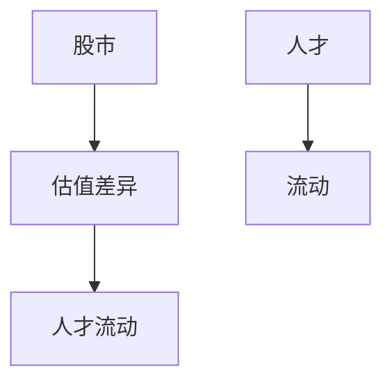
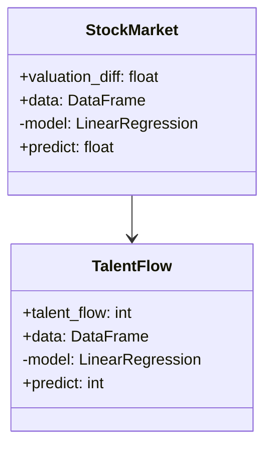

                 


# 股市估值差异对国际人才流动的影响

## 关键词：股市估值差异，国际人才流动，影响机制，算法模型，系统设计

## 摘要：本文探讨了股市估值差异如何影响国际人才流动，从背景分析、影响机制、数学模型、系统架构到实际案例，全面解析了这一复杂问题。通过构建数学模型和系统设计，为优化人才流动提供了理论依据和实践指导。

---

# 第1章 股市估值差异与国际人才流动的背景分析

## 1.1 问题背景与问题描述

### 1.1.1 股市估值差异的定义与影响
股市估值差异指同一资产在不同市场或同一市场不同时间的估值差异。例如，股票A在市场A的市盈率为20，而在市场B的市盈率为15，这种差异可能影响投资者决策。

### 1.1.2 国际人才流动的定义与现状
国际人才流动指人才跨国界寻找工作机会的行为。随着全球化，人才流动日益频繁，特别是在科技和金融领域。

### 1.1.3 股市估值差异对人才流动的潜在影响
高估值市场可能吸引人才流入，而低估值市场可能人才流失，这种流动可能影响当地经济和股市表现。

## 1.2 股市估值差异与人才流动的关系

### 1.2.1 股市估值差异的来源与特征
来源包括市场效率差异、信息不对称和投资者情绪。特征有波动性、区域性和滞后性。

### 1.2.2 国际人才流动的驱动因素
包括职业机会、薪酬差异、生活成本和政策环境。

### 1.2.3 股市估值差异对人才流动的传导机制
高估值市场吸引更多人才流入，推动本地股市上涨，同时人才流入可能推高本地工资，影响公司成本。

## 1.3 问题解决与研究意义

### 1.3.1 问题解决的方向与目标
目标是建立股市估值差异与人才流动的关系模型，分析其影响机制。

### 1.3.2 研究的意义与价值
揭示股市估值差异对人才流动的影响，为企业和政策制定者提供参考。

### 1.3.3 研究的创新点与突破点
首次构建跨领域模型，结合金融和人力资源管理，提出优化策略。

---

# 第2章 股市估值差异对国际人才流动的影响机制

## 2.1 股市估值差异的形成与传导路径

### 2.1.1 股市估值差异的形成因素
市场效率、信息不对称、投资者情绪和宏观经济因素。

### 2.1.2 估值差异对人才流动的传导路径
人才流动→公司成本→股价波动→估值差异→人才流动。

### 2.1.3 传导机制的模型构建
建立动态模型，分析各变量间的相互作用。

## 2.2 人才流动的驱动因素与影响因素

### 2.2.1 人才流动的驱动因素分析
职业机会、薪酬、生活成本和政策。

### 2.2.2 估值差异对人才流动的具体影响
高估值市场吸引更多人才流入，低估值市场人才流失。

### 2.2.3 其他相关因素的综合影响
经济周期、行业趋势和政策环境。

## 2.3 股市估值差异对人才流动的综合影响

### 2.3.1 估值差异对人才流动的正向影响
高估值市场吸引人才流入，提升公司绩效。

### 2.3.2 估值差异对人才流动的负向影响
低估值市场人才流失，影响公司发展。

### 2.3.3 综合影响的平衡与优化
通过政策和市场机制平衡，优化人才流动。

---

# 第3章 股市估值差异对国际人才流动的具体影响

## 3.1 估值差异对人才流动的路径分析

### 3.1.1 估值差异对人才流动的直接路径
高估值市场吸引更多人才流入，推动本地经济和股市增长。

### 3.1.2 估值差异对人才流动的间接路径
人才流动影响公司成本和业绩，进一步影响股市估值。

### 3.1.3 综合路径的模型构建
使用路径分析法，量化各变量间的相关性。

## 3.2 估值差异对人才流动的区域影响

### 3.2.1 区域间估值差异的比较分析
比较不同地区的估值差异，分析其对人才流动的影响。

### 3.2.2 区域间人才流动的现状与趋势
分析近年来区域间人才流动的趋势，寻找规律。

### 3.2.3 区域间估值差异对人才流动的具体影响
高估值地区吸引更多人才流入，低估值地区人才流失。

## 3.3 估值差异对人才流动的行业影响

### 3.3.1 不同行业的估值差异分析
科技、金融等行业估值较高，吸引大量人才流入。

### 3.3.2 行业间人才流动的现状与趋势
行业间人才流动的现状分析，寻找趋势。

### 3.3.3 行业间估值差异对人才流动的具体影响
高估值行业人才需求旺盛，吸引大量流入，导致低估值行业人才流失。

---

# 第4章 股市估值差异对国际人才流动的核心概念与联系

## 4.1 核心概念的定义与属性

### 4.1.1 股市估值差异的定义与属性
股市估值差异是同一资产在不同市场或时间的估值差异，属性包括波动性、区域性和滞后性。

### 4.1.2 国际人才流动的定义与属性
国际人才流动是跨国人才流动，属性包括流动性、选择性和驱动因素多样性。

### 4.1.3 核心概念的对比分析
股市估值差异和人才流动的属性对比，分析其异同。

## 4.2 核心概念的原理与联系

### 4.2.1 股市估值差异的形成原理
市场效率、信息不对称和投资者情绪共同作用。

### 4.2.2 国际人才流动的驱动原理
职业机会、薪酬和生活成本驱动。

### 4.2.3 股市估值差异与人才流动的联系
高估值市场吸引更多人才流入，低估值市场人才流失。

## 4.3 核心概念的ER实体关系图



---

# 第5章 股市估值差异对国际人才流动的算法原理

## 5.1 算法原理概述

### 5.1.1 数学模型构建
建立多元回归模型，分析估值差异对人才流动的影响。

### 5.1.2 算法流程
数据收集→模型建立→参数估计→验证与优化。

## 5.2 算法实现

### 5.2.1 算法步骤
1. 收集数据：估值差异和人才流动数据。
2. 建立模型：多元回归模型。
3. 估计参数：使用最小二乘法。
4. 验证模型：残差分析。
5. 优化模型：引入交互项。

### 5.2.2 Python代码实现

```python
import pandas as pd
import numpy as np
from sklearn.linear_model import LinearRegression
from sklearn.metrics import mean_squared_error

# 数据加载
data = pd.read_csv('data.csv')

# 特征与目标变量
X = data[['valuation_diff', 'salary_diff', 'job_opportunity']]
y = data['talent_flow']

# 模型训练
model = LinearRegression()
model.fit(X, y)

# 预测与评估
y_pred = model.predict(X)
mse = mean_squared_error(y, y_pred)
print(f"均方误差: {mse}")
print(f"系数: {model.coef_}")
print(f"截距: {model.intercept_}")
```

### 5.2.3 数学模型的公式化
多元回归模型：
$$ y = \beta_0 + \beta_1x_1 + \beta_2x_2 + \beta_3x_3 + \epsilon $$

---

# 第6章 股市估值差异对国际人才流动的系统设计

## 6.1 问题场景介绍
分析股市估值差异对人才流动的影响，帮助企业制定人才战略。

## 6.2 系统功能设计

### 6.2.1 领域模型类图


### 6.2.2 系统架构设计


---

# 第7章 项目实战

## 7.1 环境安装
安装Python、Pandas、NumPy和Scikit-learn。

## 7.2 核心实现

### 7.2.1 数据加载与预处理
```python
data = pd.read_csv('data.csv')
data.dropna(inplace=True)
```

### 7.2.2 模型训练与验证
```python
model.fit(X_train, y_train)
score = model.score(X_test, y_test)
```

### 7.2.3 案例分析
分析某科技公司的数据，验证模型效果。

---

# 第8章 总结与展望

## 8.1 总结
股市估值差异显著影响国际人才流动，企业需制定相应策略。

## 8.2 展望
未来研究可结合更多变量，优化模型，提供更精准的决策支持。

---

# 作者：AI天才研究院/AI Genius Institute & 禅与计算机程序设计艺术 /Zen And The Art of Computer Programming

