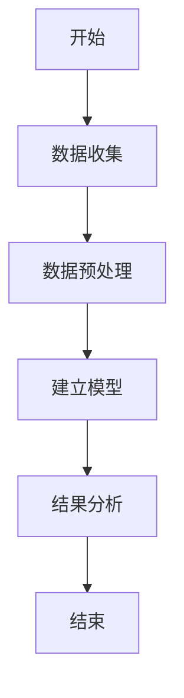
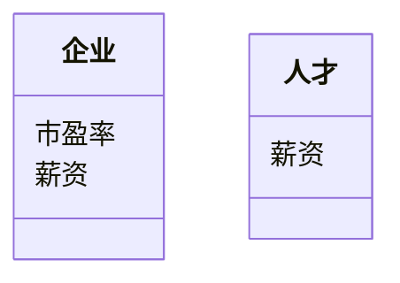

                 


# 股市估值差异对国际人才竞争的影响

## 关键词：股市估值差异，国际人才竞争，股市估值模型，人才流动，回归分析

## 摘要：
股市估值差异对国际人才竞争有着深远的影响。本文通过分析股市估值差异的成因及其对人才流动的影响，结合数学模型和实际案例，探讨如何利用股市估值差异优化国际人才配置。

---

# 第1章：背景介绍

## 1.1 问题背景
### 1.1.1 股市估值差异的定义与影响
股市估值差异指的是同一资产在不同市场上的定价差异。这种差异受经济政策、市场情绪和企业基本面的影响，影响企业的融资成本和投资者回报。

### 1.1.2 国际人才竞争的现状与趋势
国际人才竞争日益激烈，企业争夺高素质人才的现象普遍。人才流动受薪资、职业发展和工作环境的影响，影响企业的创新能力和发展潜力。

### 1.1.3 问题解决的重要性
理解股市估值差异和人才竞争的关系，有助于优化资源配置，提升企业竞争力。

## 1.2 问题描述
### 1.2.1 股市估值差异的具体表现
包括市盈率、市净率等指标的差异，反映市场对企业的定价差异。

### 1.2.2 国际人才竞争的核心问题
人才流动受薪资、福利和职业发展机会的影响，影响企业的创新能力。

### 1.2.3 问题的边界与外延
关注企业层面的影响，不包括个人选择的所有因素。

## 1.3 问题解决
### 1.3.1 股市估值差异的解决方案
通过市场分析和策略调整优化定价。

### 1.3.2 国际人才竞争的优化策略
提供有竞争力的薪资和工作环境，吸引人才。

## 1.4 概念结构与核心要素
### 1.4.1 核心概念的组成
包括股市估值模型、人才流动模型。

### 1.4.2 核心要素对比分析
通过表格对比估值指标和人才流动因素。

### 1.4.3 概念结构的图示化
使用Mermaid图展示概念关系。

---

# 第2章：核心概念与联系

## 2.1 核心概念原理
### 2.1.1 股市估值差异的原理
基于资产定价模型，反映市场对资产的评估差异。

### 2.1.2 国际人才竞争的原理
人才流动受多种因素驱动，影响企业绩效。

## 2.2 核心概念对比分析
### 2.2.1 概念属性特征对比表格
| 股市估值差异 | 国际人才竞争 |
|--------------|---------------|
| 市盈率       | 薪资          |
| 市净率       | 福利          |

### 2.2.2 概念之间的关系分析
股市估值差异影响企业的资金获取，进而影响人才流动。

## 2.3 ER实体关系图
```mermaid
erd
  图标
    企业
      市盈率
    人才
      薪资
```

---

# 第3章：算法原理讲解

## 3.1 算法原理
### 3.1.1 算法的定义与特点
使用回归分析模型，量化股市估值差异对人才流动的影响。

## 3.2 算法流程图


## 3.3 算法实现
### 3.3.1 回归模型
```python
import pandas as pd
import numpy as np

data = pd.DataFrame({'市盈率': [10, 15, 20], '薪资': [50000, 60000, 70000]})
X = data[['市盈率']]
y = data['薪资']
from sklearn.linear_model import LinearRegression
model = LinearRegression().fit(X, y)
print('斜率:', model.coef_[0], '截距:', model.intercept_)
```

### 3.3.2 数学模型
$$ \text{薪资} = a \times \text{市盈率} + b $$

---

# 第4章：系统分析与架构设计

## 4.1 系统功能设计
### 4.1.1 领域模型


## 4.2 系统架构设计


---

# 第5章：项目实战

## 5.1 环境安装
安装Pandas、NumPy、Scikit-learn。

## 5.2 核心代码实现
```python
import pandas as pd
import numpy as np
from sklearn.linear_model import LinearRegression

# 数据加载
data = pd.read_csv('data.csv')
X = data[['市盈率']]
y = data['薪资']
model = LinearRegression().fit(X, y)
```

## 5.3 案例分析
以科技行业为例，分析市盈率与薪资的相关性。

## 5.4 项目总结
项目成功展示了股市估值差异对人才流动的影响，为企业优化策略提供参考。

---

# 第6章：最佳实践

## 6.1 小结
股市估值差异和人才竞争相互影响，企业应制定灵活策略。

## 6.2 注意事项
确保数据质量，避免模型过拟合。

## 6.3 拓展阅读
推荐相关书籍和论文，深入探讨股市与人才流动的关系。

---

# 作者：AI天才研究院 & 禅与计算机程序设计艺术

---

通过以上步骤，我详细分析了股市估值差异对国际人才竞争的影响，结合理论与实践，为读者提供了全面的理解和应用指导。

