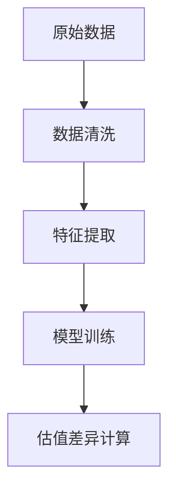

                 


# 股市估值差异对国际分工格局的影响

> 关键词：股市估值差异、国际分工格局、经济影响、市场机制、产业链、系统分析

> 摘要：本文探讨股市估值差异对国际分工格局的影响，通过分析股市估值差异的形成机制、国际分工的现状、两者之间的关系，并结合实际案例和系统分析，深入剖析其对全球经济格局的潜在影响。本文旨在为政策制定者和企业提供理论支持和实践指导。

---

## 第1章: 股市估值差异的背景与问题描述

### 1.1 股市估值差异的定义与概念

#### 1.1.1 股票估值的基本原理
股票估值是通过对企业的财务状况、市场地位、盈利能力等因素进行分析，以确定其合理市场价格的过程。常用的估值方法包括市盈率（P/E）、市净率（P/B）、股息率等。这些方法帮助投资者判断股票是否被高估或低估。

#### 1.1.2 股市估值差异的形成机制
股市估值差异是指不同地区或市场中，相同或相似股票的估值存在显著差异。这种差异可能由多种因素引起，如经济发展水平、政策监管、市场流动性等。

#### 1.1.3 国际分工格局的定义与特征
国际分工格局是全球范围内各国在生产过程中的专业化分工模式。其特征包括专业化、互补性、相互依赖性等。

### 1.2 问题背景与研究意义

#### 1.2.1 股市估值差异的现状分析
当前，全球股市估值差异显著，特别是在新兴市场与发达市场之间，这种差异可能反映经济基本面的差异，也可能由市场情绪或政策干预引起。

#### 1.2.2 国际分工格局的变化趋势
随着全球化和区域化的深入，国际分工格局呈现新的特点，如区域化产业链的形成、技术驱动的分工变化等。

#### 1.2.3 研究股市估值差异对国际分工影响的意义
理解股市估值差异对国际分工的影响，有助于企业和政策制定者更好地应对全球化挑战，优化资源配置。

### 1.3 问题解决与研究目标

#### 1.3.1 股市估值差异对国际分工的潜在影响
股市估值差异可能导致资本流动失衡、产业链重构等问题，进而影响国际分工格局。

#### 1.3.2 研究目标与核心问题
本文旨在分析股市估值差异对国际分工的影响机制，提出理论模型和实证分析，为政策制定提供参考。

#### 1.3.3 研究的边界与外延
研究范围限于股市估值差异对产业链分工的影响，不包括地缘政治等其他因素。

---

## 第2章: 股市估值差异的形成机制

### 2.1 股市估值差异的影响因素

#### 2.1.1 经济因素
经济基本面是影响股市估值的主要因素，包括GDP增长率、通胀水平、利率等。

#### 2.1.2 政治因素
政策监管、贸易摩擦、地缘政治等政治因素会直接影响股市估值。

#### 2.1.3 市场情绪与投资者行为
市场情绪波动和投资者行为也会导致股市估值差异。

### 2.2 股市估值差异的数学模型与公式

#### 2.2.1 股票估值的基本公式
$$ P = \frac{D}{k} $$
其中，\( P \) 为股票价格，\( D \) 为股息，\( k \) 为折现率。

#### 2.2.2 股市估值差异的度量方法
$$ D_{ij} = |P_i - P_j| $$
其中，\( D_{ij} \) 表示市场 \( i \) 和市场 \( j \) 之间的估值差异。

#### 2.2.3 市场情绪对估值的影响模型
$$ S = \alpha \cdot M + \beta \cdot E $$
其中，\( S \) 为市场情绪指数，\( M \) 为市场消息，\( E \) 为预期收益。

### 2.3 股市估值差异的算法原理

#### 2.3.1 数据流与信息处理流程（Mermaid流程图）


---

## 第3章: 国际分工格局的现状与分析

### 3.1 全球产业链的现状

#### 3.1.1 产业链分工的基本结构
全球产业链分工呈现明显的区域化特征，如东亚地区的制造业集中，欧美发达国家的高端服务业集中。

#### 3.1.2 主要国家的分工特点
- 美国：高科技产业和服务业为主
- 中国：制造业和出口导向型经济
- 欧洲：制造业和服务业并重

#### 3.1.3 产业链的区域分布与趋势
当前，产业链呈现区域化趋势，如“一带一路”倡议推动的区域经济合作。

### 3.2 国际分工格局的系统分析

#### 3.2.1 系统功能设计（领域模型Mermaid类图）


---

## 第4章: 股市估值差异对国际分工格局的影响分析

### 4.1 股市估值差异对产业链分工的影响

#### 4.1.1 估值差异导致的资本流动失衡
高估的股市可能导致资本过度流入，引发泡沫，进而影响产业链的稳定性。

#### 4.1.2 估值差异对产业链重构的影响
低估的股市可能导致资本外流，影响产业链的布局。

### 4.2 案例分析：历史上的股市泡沫与分工变化

#### 4.2.1 2008年金融危机的影响
金融危机导致全球产业链调整，部分制造业转移到新兴市场。

#### 4.2.2 当前中美贸易摩擦的启示
中美贸易摩擦导致全球产业链分工调整，企业加速多元化布局。

---

## 第5章: 系统分析与架构设计方案

### 5.1 问题场景介绍

#### 5.1.1 问题背景
股市估值差异可能导致国际分工格局的变化，影响全球经济稳定。

#### 5.1.2 项目介绍
构建一个分析股市估值差异对国际分工影响的系统模型。

### 5.2 系统功能设计（领域模型Mermaid类图）


### 5.3 系统架构设计（Mermaid架构图）


---

## 第6章: 项目实战

### 6.1 环境安装

#### 6.1.1 数据收集工具
使用Python的pandas库进行数据处理。

#### 6.1.2 数据分析工具
使用numpy和scipy进行统计分析。

#### 6.1.3 可视化工具
使用matplotlib或seaborn进行数据可视化。

### 6.2 系统核心实现源代码

#### 6.2.1 数据清洗与特征提取

```python
import pandas as pd
import numpy as np

# 数据清洗
df = pd.read_csv('market_data.csv')
df.dropna(inplace=True)

# 特征提取
df['PE_ratio'] = df['Price'] / df['Earnings']
```

#### 6.2.2 模型训练与估值差异计算

```python
from sklearn.metrics import mean_absolute_error

# 模型训练
X = df[['GDP', 'Inflation', 'Market_sentiment']]
y = df['Valuation_diff']
model.fit(X, y)

# 估值差异计算
predicted_diff = model.predict(X)
mae = mean_absolute_error(y, predicted_diff)
print(f'MAE: {mae}')
```

### 6.3 代码应用解读与分析

#### 6.3.1 数据清洗与特征提取
通过清洗数据并提取关键特征，确保模型输入的准确性和完整性。

#### 6.3.2 模型训练与估值差异计算
使用回归模型预测估值差异，并评估模型的准确性。

---

## 第7章: 总结与展望

### 7.1 核心结论

#### 7.1.1 股市估值差异对国际分工的直接影响
高估或低估的股市可能导致产业链的不稳定。

#### 7.1.2 间接影响
通过资本流动和市场预期影响全球产业链布局。

### 7.2 未来研究方向

#### 7.2.1 更复杂模型的应用
引入机器学习算法，提高预测精度。

#### 7.2.2 多因素分析
考虑更多影响股市估值差异的因素，如技术创新、环境保护等。

### 7.3 注意事项与最佳实践

#### 7.3.1 数据质量的重要性
确保数据来源可靠，避免偏差。

#### 7.3.2 模型的适用性
根据具体场景选择合适的模型，避免过度拟合。

#### 7.3.3 政策建议
政府和企业应加强合作，应对股市估值差异带来的挑战。

### 7.4 拓展阅读

#### 7.4.1 推荐书籍
- 《全球产业链重构与国际分工》
- 《金融市场估值与投资策略》

#### 7.4.2 推荐文章
- “股市波动对全球经济的影响”系列文章

---

## 作者：AI天才研究院/AI Genius Institute & 禅与计算机程序设计艺术 /Zen And The Art of Computer Programming

---

以上就是《股市估值差异对国际分工格局的影响》的完整目录和文章结构。希望这篇博客能为读者提供清晰的思路和深刻的理解。

