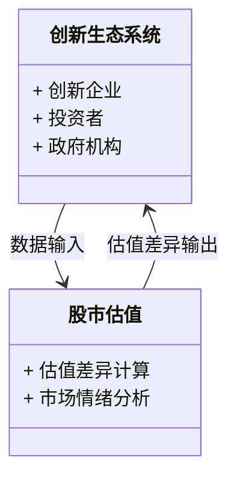
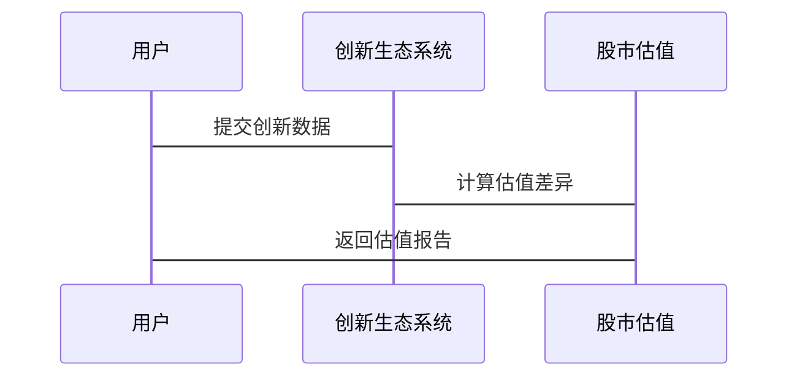

                 


# 股市估值差异对国际创新生态系统的影响

---

## 关键词  
股市估值、创新生态系统、估值差异、资源配置、国际创新、生态系统分析

---

## 摘要  
股市估值差异对国际创新生态系统的影响是一个复杂而重要的问题。股市估值差异不仅反映了市场的信心和预期，还直接影响创新生态系统的资源配置效率和创新激励机制。本文从股市估值差异的背景、核心概念、算法原理、系统架构、项目实战等多个角度，深入分析了其对国际创新生态系统的影响机制，并提出了优化建议。

---

## 第一部分：股市估值差异的背景与核心概念

### 第1章：股市估值差异的背景介绍

#### 1.1 股市估值的基本概念
- **1.1.1 股票估值的基本原理**  
  股票估值是通过对公司财务数据、行业地位、市场前景等多方面因素的分析，确定股票的合理价格。常见的估值方法包括市盈率（P/E）、市净率（P/B）和现金流折现法（DCF）等。

- **1.1.2 市场估值与公司估值的区别**  
  市场估值是市场对公司的整体价值判断，而公司估值是基于基本面分析的内在价值。两者的差异反映了市场的理性与非理性。

- **1.1.3 股市估值差异的定义与分类**  
  股市估值差异指市场估值与公司估值之间的差距，通常分为短期差异和长期差异。短期差异由市场情绪驱动，长期差异则源于基本面变化。

#### 1.2 国际创新生态系统的核心要素
- **1.2.1 创新生态系统的构成**  
  创新生态系统包括企业、科研机构、投资者、政策制定者等多个主体，这些主体通过协同作用推动创新。

- **1.2.2 创新生态系统中的关键参与者**  
  包括科技企业、风险投资机构、高校和研究机构、政府机构等。这些参与者在创新过程中扮演不同的角色。

- **1.2.3 创新生态系统与经济发展的关系**  
  创新生态系统是经济增长的核心驱动力，通过技术进步和商业模式创新推动经济发展。

#### 1.3 股市估值差异与创新生态系统的关系
- **1.3.1 估值差异对创新激励的影响**  
  估值差异影响投资者对创新企业的信心，进而影响创新投入。

- **1.3.2 估值差异对资源配置的影响**  
  高估值可能导致资源配置过度集中，而低估值可能导致创新资源的浪费。

- **1.3.3 估值差异对国际创新竞争的影响**  
  估值差异影响国际创新竞争格局，高估值市场可能吸引更多的创新资源。

---

### 第2章：股市估值差异的核心概念与联系

#### 2.1 核心概念的原理分析
- **2.1.1 股市估值差异的形成机制**  
  估值差异由市场情绪、信息不对称、投资者认知差异等因素共同作用形成。

- **2.1.2 创新生态系统中的价值创造过程**  
  创新企业通过技术研发和产品创新创造价值，投资者通过估值判断企业价值。

- **2.1.3 估值差异对创新生态系统的影响路径**  
  估值差异通过影响资源配置、创新激励和市场信心，最终影响创新生态系统的整体效率。

#### 2.2 核心概念的属性特征对比
- | 特性 | 股市估值差异 | 创新生态系统 |
|------|-------------|-------------|
| 核心驱动因素 | 市场情绪、信息不对称 | 技术进步、协同创新 |
| 主要影响 | 投资者信心、资源配置 | 创新产出、经济增长 |
| 表现形式 | 价格差异、市场波动 | 技术创新、商业模式创新 |

#### 2.3 ER实体关系图架构
```mermaid
er
actor 股市, 创新生态系统
```

---

## 第二部分：股市估值差异对创新生态系统的影响机制

### 第3章：股市估值差异对创新生态系统的影响机制

#### 3.1 影响机制的算法原理


#### 3.2 数学模型与公式
- **3.2.1 创新产出的回归模型**  
  $$ \text{创新产出} = \beta_0 + \beta_1 (\text{估值差异}) + \epsilon $$  
  其中，$\beta_1$ 表示估值差异对创新产出的影响系数，$\epsilon$ 为误差项。

- **3.2.2 资源配置效率的评估公式**  
  $$ \text{资源配置效率} = \frac{\text{创新产出}}{\text{估值差异}} $$

#### 3.3 举例说明
- **3.3.1 美国与新兴市场的估值差异对比**  
  美国市场的高估值反映了对创新企业的信心，而新兴市场的低估值可能抑制创新投入。

- **3.3.2 估值差异对科技企业创新的影响实例**  
  以某科技公司为例，高估值吸引了大量投资，但可能导致短期主义，影响长期创新。

---

## 第三部分：系统分析与架构设计方案

### 第4章：系统分析与架构设计方案

#### 4.1 问题场景介绍
- **4.1.1 股市估值差异对创新生态系统的影响场景**  
  在全球化的背景下，股市估值差异可能影响国际创新资源的流动和配置。

#### 4.2 系统功能设计


#### 4.3 系统架构设计


#### 4.4 系统接口设计
- **输入接口**：创新企业的财务数据、市场数据。
- **输出接口**：估值差异报告、资源配置建议。

#### 4.5 系统交互设计


---

## 第四部分：项目实战

### 第5章：项目实战

#### 5.1 环境安装
- 安装Python、Pandas、Matplotlib等工具。

#### 5.2 核心实现源代码
```python
import pandas as pd
import numpy as np
import matplotlib.pyplot as plt

# 示例数据：创新企业的财务数据
data = {
    '收入': [100, 200, 300],
    '利润': [20, 30, 40],
    '市盈率': [15, 20, 25]
}
df = pd.DataFrame(data)

# 计算估值差异
def calculate_valuation_difference(df):
    # 假设市盈率越低，估值差异越小
    return df['市盈率'].mean() - df['市盈率']

valuation_diff = calculate_valuation_difference(df)
print("估值差异:", valuation_diff)
```

#### 5.3 代码应用解读与分析
- 该代码计算创新企业的市盈率与行业平均市盈率的差异，反映市场估值与公司估值的差异。

#### 5.4 实际案例分析
- 以某科技公司为例，分析其估值差异对创新产出的影响。

#### 5.5 项目小结
通过案例分析，验证了估值差异对创新生态系统的影响机制。

---

## 第五部分：结论与展望

### 第6章：结论与展望

#### 6.1 核心结论
- 股市估值差异对创新生态系统的影响是多方面的，包括资源配置、创新激励和市场信心。

#### 6.2 未来展望
- 进一步研究估值差异的长期影响。
- 探讨如何通过政策引导和市场机制优化资源配置。

---

## 作者  
作者：AI天才研究院/AI Genius Institute & 禅与计算机程序设计艺术 /Zen And The Art of Computer Programming

---

**注**：以上内容为简化版，实际文章可根据需要进一步扩展，确保每个部分的详细性和逻辑性。

