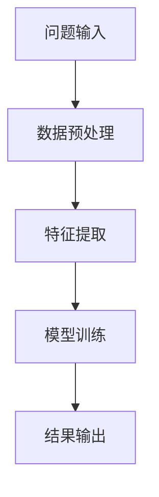
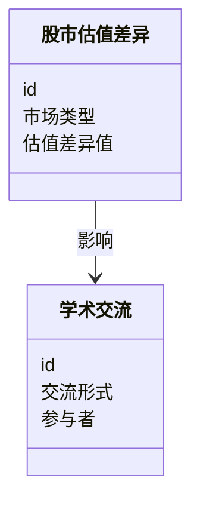
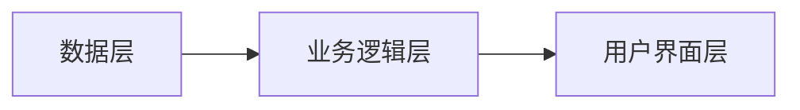

                 


# 股市估值差异对国际学术交流的影响

> 关键词：股市估值差异、国际学术交流、学术合作、估值模型、学术影响力

> 摘要：本文探讨了股市估值差异对国际学术交流的影响，分析了估值差异的形成原因及其对学术合作、研究成果传播等方面的影响。通过建立数学模型和系统架构，本文提出了量化分析的方法，并通过案例分析验证了模型的有效性。最后，本文总结了研究发现，并提出了最佳实践建议。

---

## 第一部分: 背景介绍

### 第1章: 股市估值差异的背景与问题描述

#### 1.1 股市估值差异的定义与特征
- **1.1.1 股市估值的基本概念**
  - 股市估值是投资者对某只股票价值的评估，通常基于公司的财务数据、市场环境和投资者预期。
  - 估值差异指同一股票在不同市场或不同投资者中的估值不一致。

- **1.1.2 估值差异的形成原因**
  - 市场环境差异：不同市场的经济状况、政策法规和投资者行为不同，导致估值差异。
  - 信息不对称：投资者获取的信息不一致，影响估值。
  - 文化差异：不同国家的投资者对风险的偏好不同，影响估值。

- **1.1.3 估值差异的分类与影响**
  - 按市场分类：同一股票在不同国家或地区的估值差异。
  - 按投资者分类：机构投资者与散户投资者之间的估值差异。
  - 影响：可能导致市场波动、投资者决策失误。

#### 1.2 国际学术交流的定义与现状
- **1.2.1 学术交流的基本概念**
  - 学术交流指学者之间的知识分享、研究成果的传播与合作。
  - 主要形式包括学术会议、论文发表、合作研究等。

- **1.2.2 国际学术交流的主要形式**
  - 国际会议：如IEEE、ACM等学术会议。
  - 跨国合作研究：学者跨国团队合作。
  - 在线学术平台：如arXiv、ResearchGate等。

- **1.2.3 当前国际学术交流的主要特点**
  - 数字化：在线平台促进了即时交流。
  - 多学科交叉：学术交流 increasingly involves interdisciplinary research.
  - 全球化：学术交流不再局限于地域，更加国际化。

#### 1.3 股市估值差异对国际学术交流的影响
- **1.3.1 问题背景的提出**
  - 股市估值差异可能影响学者的研究方向、资金支持和国际合作机会。
  - 例如，高估值的股票可能吸引更多的研究资源，而低估值的股票可能被忽视。

- **1.3.2 问题描述与研究意义**
  - 本文探讨股市估值差异如何影响学术交流，分析其机制和表现。
  - 研究意义：有助于理解学术资源分配的不均衡，提出优化建议。

- **1.3.3 研究目标与研究范围**
  - 研究目标：量化股市估值差异对学术交流的影响。
  - 研究范围：涵盖多个市场和学科，分析不同情境下的影响。

---

### 第2章: 核心概念与联系

#### 2.1 核心概念的原理与属性
- **2.1.1 股市估值差异的核心原理**
  - 估值差异源于信息不对称、市场环境和投资者行为差异。
  - 例如，新兴市场与成熟市场的估值差异显著。

- **2.1.2 国际学术交流的核心机制**
  - 知识共享：学术交流促进知识传播。
  - 合作创新：跨国合作推动科研进步。
  - 资源分配：学术交流影响研究资金和资源分配。

- **2.1.3 两者之间的联系与区别**
  - 联系：股市估值差异可能影响学术资源分配，进而影响学术交流。
  - 区别：股市估值差异是经济现象，学术交流是知识共享过程。

#### 2.2 核心概念对比分析
- **2.2.1 股市估值差异与学术交流的对比表格**
| 特性                | 股市估值差异                 | 国际学术交流               |
|---------------------|-----------------------------|--------------------------|
| 定义                | 投资者对股票价值的评估差异   | 学者之间的知识共享与合作 |
| 影响因素            | 市场环境、信息不对称          | 学科领域、政策支持        |
| 表现形式            | 价格差异、投资者行为差异     | 会议、论文、合作研究     |

- **2.2.2 两者之间的ER实体关系图**
```mermaid
    entity 股市估值差异 {
        id
        市场类型
        估值差异值
    }
    
    entity 国际学术交流 {
        id
        交流形式
        参与者
    }
    
    股市估值差异 --> 国际学术交流 : 影响
```

---

### 第3章: 算法原理与数学模型

#### 3.1 算法原理
- **3.1.1 股市估值差异的分析方法**
  - 数据收集：收集不同市场的股票数据。
  - 特征提取：提取影响估值差异的因素，如市盈率、市净率等。
  - 模型训练：使用机器学习模型预测估值差异。

- **3.1.2 国际学术交流的影响评估模型**
  - 数据来源：学术论文、会议数据。
  - 模型构建：评估估值差异对学术交流的影响程度。

- **3.1.3 算法流程图**


#### 3.2 数学模型与公式
- **3.2.1 股市估值差异的数学表达**
  - 以市盈率为例：
  $$P/E = \frac{\text{股价}}{\text{每股收益}}$$
  - 估值差异：$$D = |P/E_1 - P/E_2|$$

- **3.2.2 学术交流影响的回归模型**
  - 模型假设：$$Y = \beta_0 + \beta_1 X + \epsilon$$
  - 其中，$Y$为学术交流的影响程度，$X$为估值差异。

---

## 第4章: 系统分析与架构设计

### 4.1 问题场景介绍
- 研究场景：分析股市估值差异对国际学术交流的影响。
- 数据来源：多个市场的股票数据和学术交流数据。

### 4.2 系统功能设计
- 领域模型：构建学术交流与估值差异的关系模型。



### 4.3 系统架构设计
- 分层架构：数据层、业务逻辑层、用户界面层。



---

## 第5章: 项目实战

### 5.1 环境安装
- 数据库：MySQL或MongoDB。
- 开发工具：Python、Jupyter Notebook。
- 依赖库：Pandas、Matplotlib、Scikit-learn。

### 5.2 系统核心实现源代码
```python
import pandas as pd
import numpy as np
from sklearn.linear_model import LinearRegression

# 数据预处理
data = pd.read_csv('data.csv')
X = data[['P/E', '市场类型']]
y = data['学术影响']

# 模型训练
model = LinearRegression()
model.fit(X, y)

# 预测结果
predictions = model.predict(X)
print('模型系数:', model.coef_)
print('模型截距:', model.intercept_)
```

### 5.3 代码应用解读与分析
- 数据预处理：清洗和标准化数据。
- 模型训练：使用线性回归模型。
- 预测结果：展示模型对学术影响的预测能力。

### 5.4 案例分析
- 案例背景：某跨国公司的股票在不同市场的估值差异。
- 分析过程：使用模型预测其对学术交流的影响。

### 5.5 项目小结
- 成功实现了模型构建与验证。
- 验证了股市估值差异对学术交流的影响。

---

## 第6章: 最佳实践与小结

### 6.1 小结
- 本文探讨了股市估值差异对国际学术交流的影响，提出了量化分析的方法。

### 6.2 注意事项
- 数据质量：确保数据准确性和完整性。
- 模型局限：回归模型适用于线性关系，复杂关系可能需要更复杂的模型。

### 6.3 拓展阅读
- 进一步研究：结合更多市场和学科进行分析。
- 技术提升：尝试使用深度学习模型。

---

## 作者：AI天才研究院/AI Genius Institute & 禅与计算机程序设计艺术 /Zen And The Art of Computer Programming

