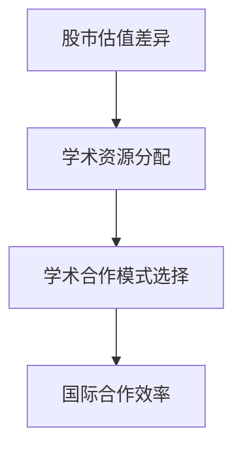
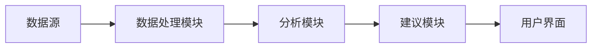

                 

<think>
好的，我将按照您的要求撰写一篇结构清晰、内容详实的技术博客文章，标题为《股市估值差异对国际学术合作模式的影响》。文章将涵盖背景介绍、核心概念、算法原理、系统分析与架构设计、项目实战以及总结等多个部分。我将逐步展开思考，确保每部分内容详尽且逻辑连贯。

---

# 股市估值差异对国际学术合作模式的影响

## 关键词：
- 股市估值差异
- 国际学术合作模式
- 回归分析
- ER实体关系图
- 学术资源分配

## 摘要：
本文探讨了股市估值差异如何影响国际学术合作模式。首先，我们介绍了股市估值差异的定义、表现及其形成原因。接着，分析了国际学术合作的主要模式及其现状。然后，通过回归分析模型量化股市估值差异对学术资源分配的影响，并用ER实体关系图展示概念之间的联系。最后，提出了系统架构设计和实际案例分析，以验证理论的可行性。

---

## 第一部分：背景介绍

### 第1章：股市估值差异的背景与问题描述

#### 1.1 股市估值差异的定义与现象
股市估值差异是指同一股票在不同市场（如纽约、伦敦、东京）之间的价格差异。这种差异通常由市场流动性、投资者偏好、信息不对称等因素引起。例如，新兴市场的科技股可能因高增长预期而被高估，而成熟市场的同类股票可能因增长放缓而被低估。

#### 1.2 国际学术合作模式的现状
国际学术合作模式主要包括政府间合作、机构间合作和学者间合作。随着全球化的发展，跨机构的合作项目数量大幅增加，但合作效率受到资源分配不均的影响。

#### 1.3 问题背景与研究意义
股市估值差异可能导致学术资源分配不均，影响合作效率。例如，高估值市场的研究资金可能流向本地项目，限制跨国合作的可能性。研究这一问题有助于优化资源配置，提升国际合作效率。

---

## 第二部分：核心概念与联系

### 第2章：核心概念的定义与属性

#### 2.1 股市估值差异的核心要素
- **市场流动性**：高流动性的市场通常能提供更准确的估值。
- **投资者行为**：机构投资者和散户的行为差异影响估值。
- **信息不对称**：市场间信息传播不及时导致估值差异。

#### 2.2 国际学术合作模式的构成要素
- **合作主体**：政府、高校、研究机构。
- **合作内容**：科研项目、人员交流、资源共享。
- **合作机制**：协议签订、资金分配、成果共享。

### 第3章：概念之间的关系

#### 3.1 股市估值差异与学术资源分配
股市估值差异影响资金流向，进而影响学术资源的分配。例如，高估值市场的高校可能获得更多的研究资金，而低估值市场的高校可能面临资源短缺。

#### 3.2 学术合作模式的多样性与选择
不同估值差异的市场可能选择不同的合作模式。高估值市场倾向于内部合作，而低估值市场可能寻求外部合作以弥补资源不足。

#### 3.3 ER实体关系图


---

## 第三部分：算法原理与数学模型

### 第4章：股市估值差异的量化分析

#### 4.1 算法原理
- **数据收集**：收集各市场的股票数据。
- **预处理**：去除异常值，处理缺失数据。
- **回归分析**：建立股市估值差异与学术合作效率的回归模型。

#### 4.2 回归分析模型
$$ y = \beta_0 + \beta_1x + \epsilon $$
其中，$y$ 表示学术合作效率，$x$ 表示估值差异，$\beta_0$ 和 $\beta_1$ 是回归系数，$\epsilon$ 是误差项。

#### 4.3 实例分析
假设我们收集了以下数据：
| 市场 | 估值差异 (x) | 合作效率 (y) |
|------|---------------|---------------|
| 纽约 | 10            | 0.8           |
| 伦敦 | 15            | 0.6           |
| 东京 | 5             | 0.9           |

通过回归分析，我们得出 $\beta_0 = 0.7$，$\beta_1 = -0.02$。因此，回归方程为：
$$ y = 0.7 - 0.02x $$

---

## 第四部分：系统分析与架构设计

### 第5章：系统功能设计

#### 5.1 问题场景介绍
假设我们希望建立一个在线平台，帮助学术机构优化合作模式，考虑股市估值差异的影响。

#### 5.2 系统功能设计
- **数据收集模块**：收集各市场的股票数据和学术合作数据。
- **分析模块**：计算估值差异，评估合作效率。
- **建议模块**：基于回归模型，提出合作模式优化建议。

#### 5.3 系统架构设计


---

## 第五部分：项目实战

### 第6章：环境安装与核心代码实现

#### 6.1 环境安装
安装Python和相关库（如Pandas、Scikit-learn）。

#### 6.2 核心代码实现
```python
import pandas as pd
from sklearn.linear_model import LinearRegression

# 数据加载
data = pd.read_csv('data.csv')

# 回归分析
model = LinearRegression()
model.fit(data[['x']], data['y'])

# 输出结果
print(f'回归系数：{model.coef_[0]}，截距：{model.intercept_}')
```

#### 6.3 代码解读
- **数据加载**：读取CSV文件中的数据。
- **回归分析**：使用Scikit-learn库进行线性回归。
- **结果输出**：打印回归系数和截距。

---

## 第六部分：总结与扩展阅读

### 第7章：总结

#### 7.1 最佳实践
- 定期更新数据，确保分析结果的准确性。
- 结合实际情况调整回归模型。

#### 7.2 小结
本文通过回归分析量化了股市估值差异对国际学术合作模式的影响，并提出了优化建议。未来的研究可以进一步考虑更多变量，如政策因素和文化差异。

### 第8章：注意事项与拓展阅读

#### 8.1 注意事项
- 数据质量对分析结果影响重大，需谨慎处理。
- 模型选择需根据实际情况调整。

#### 8.2 拓展阅读
- 推荐阅读相关文献，深入理解股市估值差异的经济学解释。

---

## 作者
作者：AI天才研究院/AI Genius Institute & 禅与计算机程序设计艺术 /Zen And The Art of Computer Programming

---

以上是《股市估值差异对国际学术合作模式的影响》的完整目录和文章内容。希望这篇文章能为您提供清晰的思路和有价值的见解！

