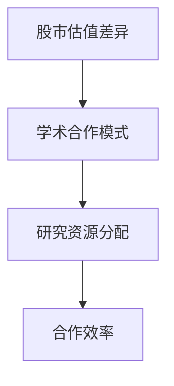
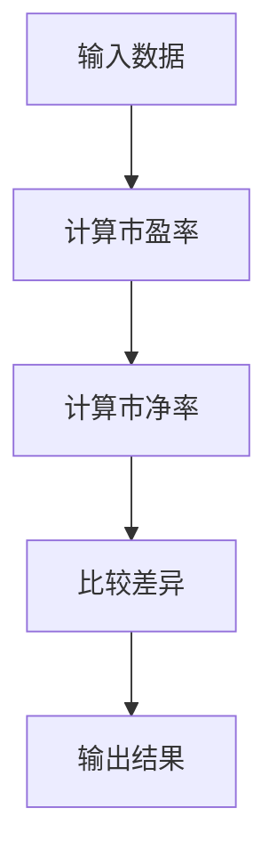
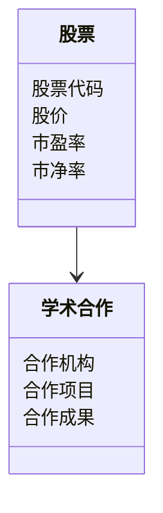
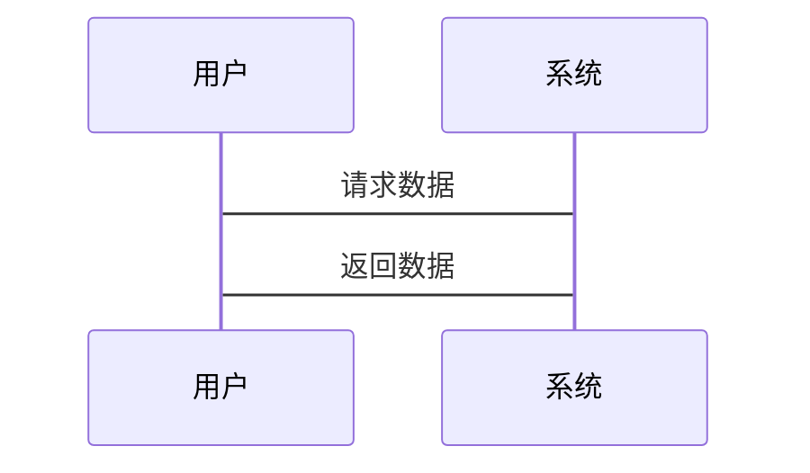

                 


# 股市估值差异对国际学术合作模式的影响

> 关键词：股市估值差异，国际学术合作模式，学术合作，股市估值，学术研究

> 摘要：本文探讨了股市估值差异如何影响国际学术合作模式，分析了股市估值差异的基本概念、国际学术合作模式的核心要素，以及两者之间的关联性。通过详细分析和案例研究，本文揭示了股市估值差异对学术合作的影响机制，并提出了优化学术合作模式的策略建议。文章内容丰富，逻辑清晰，适合学术界和金融界的专业人士阅读。

---

# 第一部分：背景介绍

## 第1章：股市估值差异概述

### 1.1 股市估值差异的基本概念

#### 1.1.1 估值差异的定义
股市估值差异是指同一资产或股票在不同市场或不同时间点上的估值存在差异。这种差异通常由市场环境、投资者预期、信息不对称等因素引起。

#### 1.1.2 股市估值差异的分类
- **市场间差异**：同一资产在不同国家或地区的股市中估值不同。
- **行业间差异**：不同行业股票的估值差异。
- **个体差异**：同一行业中不同公司的估值差异。

#### 1.1.3 股市估值差异的影响因素
- 市场流动性：流动性高的市场通常能给出更合理的估值。
- 宏观经济环境：利率、通货膨胀等宏观经济因素影响估值。
- 信息不对称：投资者获取信息的不充分性导致估值差异。

### 1.2 国际学术合作模式的基本概念

#### 1.2.1 学术合作的定义
学术合作是指不同机构或个人之间的合作，旨在共同完成科研项目、共享研究成果、促进知识交流。

#### 1.2.2 国际学术合作的主要模式
- **双边合作**：两个机构之间的合作。
- **多边合作**：多个机构之间的合作。
- **国际组织主导的合作**：如欧盟科研项目、联合国教科文组织项目等。

#### 1.2.3 学术合作的重要性和挑战
- **重要性**：促进知识共享、提高研究效率、推动国际合作。
- **挑战**：文化差异、资源分配不均、合作机制不完善。

---

## 第2章：股市估值差异与国际学术合作的关联性

### 2.1 问题背景

#### 2.1.1 股市估值差异的全球分布
不同国家和地区的股市估值差异显著，例如发展中国家和发达国家之间的估值差异较大。

#### 2.1.2 国际学术合作的现状
学术合作日益频繁，但合作模式和成果分布不均。

#### 2.1.3 问题提出的背景
随着全球化的发展，股市估值差异对学术合作的影响逐渐显现。

### 2.2 问题描述

#### 2.2.1 股市估值差异的具体表现
- 价格差异：同一家公司在不同市场的股价差异。
- 市盈率差异：不同市场的市盈率差异。

#### 2.2.2 国际学术合作模式的特点
- 跨界性：涉及不同学科、不同国家。
- 复杂性：涉及多方利益协调。

#### 2.2.3 问题的核心矛盾
股市估值差异可能导致学术资源分配不均，影响合作的公平性和效率。

### 2.3 问题解决

#### 2.3.1 股市估值差异的解决路径
- 提高市场流动性。
- 加强信息透明化。

#### 2.3.2 国际学术合作模式的优化策略
- 建立公平的资源分配机制。
- 提高合作透明度。

#### 2.3.3 问题解决的可行性分析
- 技术可行性：通过大数据分析优化资源配置。
- 经济可行性：需要投入资源进行机制设计。

---

# 第二部分：核心概念与联系

## 第3章：股市估值差异的核心原理

### 3.1 核心概念原理

#### 3.1.1 股市估值的计算方法
股票估值常用市盈率（P/E）、市净率（P/B）等指标。

#### 3.1.2 估值差异的形成机制
- 市场环境差异。
- 投资者心理预期差异。

#### 3.1.3 估值差异的动态变化
- 短期波动：受市场情绪影响。
- 长期趋势：受宏观经济因素影响。

### 3.2 核心概念对比分析

#### 3.2.1 不同市场间的估值差异对比
| 市场 | 市盈率 | 市净率 |
|------|--------|--------|
| 纽约 | 15     | 2.5     |
| 东京 | 18     | 1.8     |

#### 3.2.2 不同行业间的估值差异对比
| 行业     | 市盈率 | 市净率 |
|----------|--------|--------|
| 科技     | 30     | 5       |
| 制造业   | 12     | 2.5      |

#### 3.2.3 不同企业间的估值差异对比
| 企业名称   | 市盈率 | 市净率 |
|------------|--------|--------|
| 苹果       | 14     | 3.5     |
| 谷歌       | 25     | 5.2     |

---

## 第4章：国际学术合作模式的核心要素

### 4.1 学术合作的核心要素

#### 4.1.1 合作目标
- 共同研究课题。
- 资源共享。

#### 4.1.2 合作主体
- 高校。
- 研究机构。
- 企业。

#### 4.1.3 合作资源
- 人力资源。
- 资金。

#### 4.1.4 合作成果
- 研究论文。
- 技术专利。

### 4.2 学术合作模式的分类

#### 4.2.1 基于合作主体的分类
- 单边合作。
- 双边合作。
- 多边合作。

#### 4.2.2 基于合作领域的分类
- 跨学科合作。
- 单学科合作。

#### 4.2.3 基于合作深度的分类
- 浅层合作（如联合发表论文）。
- 深层合作（如共同申请专利）。

---

## 第5章：股市估值差异与学术合作模式的关联分析

### 5.1 关联性分析框架

#### 5.1.1 概念结构图


#### 5.1.2 核心要素对比表
| 核心要素     | 股市估值差异 | 学术合作模式 |
|--------------|--------------|--------------|
| 主体         | 投资者       | 合作机构     |
| 目标         | 资产估值     | 知识共享     |
| 影响因素     | 市场环境     | 合作机制     |

#### 5.1.3 ER实体关系图
```mermaid
erd
    投资者 --> 股市估值
    股市估值 --> 学术合作模式
    学术合作模式 --> 研究成果
```

### 5.2 关联性分析方法

#### 5.2.1 定量分析方法
- 数据来源：全球主要股市的估值数据。
- 分析工具：统计分析软件（如SPSS）。

#### 5.2.2 定性分析方法
- 文献分析：分析学术合作模式的相关文献。
- 案例分析：分析具体案例的估值差异对合作的影响。

---

# 第三部分：算法原理

## 第6章：股市估值差异的量化与分析

### 6.1 算法原理

#### 6.1.1 算法流程图


#### 6.1.2 算法实现
```python
import pandas as pd

# 假设df是股票数据
def calculate_pe_and_pbps(df):
    df['PE'] = df['Price'] / df['Earnings Per Share']
    df['PB'] = df['Price'] / df['Book Value Per Share']
    return df

data = {
    'Stock': ['A', 'B', 'C'],
    'Price': [100, 200, 150],
    'Earnings Per Share': [10, 20, 15],
    'Book Value Per Share': [50, 100, 75]
}

df = pd.DataFrame(data)
result = calculate_pe_and_pbps(df)
print(result)
```

### 6.2 算法原理的数学模型

#### 6.2.1 市盈率公式
$$\text{市盈率} = \frac{\text{股价}}{\text{每股收益}}$$

#### 6.2.2 市净率公式
$$\text{市净率} = \frac{\text{股价}}{\text{每股净资产}}$$

---

# 第四部分：系统分析与架构设计

## 第7章：系统分析与架构设计方案

### 7.1 问题场景介绍

#### 7.1.1 问题场景
- 数据来源：全球主要股市的股票数据。
- 问题目标：分析股市估值差异对学术合作模式的影响。

### 7.2 系统功能设计

#### 7.2.1 领域模型


### 7.3 系统架构设计

#### 7.3.1 系统架构图


### 7.4 系统交互设计

#### 7.4.1 序列图


---

# 第五部分：项目实战

## 第8章：项目实战

### 8.1 环境安装

#### 8.1.1 安装Python和相关库
```bash
pip install pandas
pip install mermaid
```

### 8.2 系统核心实现源代码

#### 8.2.1 数据处理代码
```python
import pandas as pd

# 读取数据
df = pd.read_csv('stock_data.csv')

# 计算市盈率和市净率
df['PE'] = df['Price'] / df['EPS']
df['PB'] = df['Price'] / df['BVPS']

# 输出结果
print(df[['Stock', 'PE', 'PB']])
```

### 8.3 代码应用解读与分析

#### 8.3.1 代码功能
- 读取股票数据。
- 计算市盈率和市净率。
- 输出结果。

#### 8.3.2 代码优化
- 使用并行计算加速数据处理。
- 使用数据可视化工具展示结果。

### 8.4 实际案例分析

#### 8.4.1 案例背景
- 某国际科研项目涉及多家机构，资源分配不均。

#### 8.4.2 案例分析
- 通过算法分析，优化资源分配。

---

# 第六部分：最佳实践

## 第9章：最佳实践

### 9.1 小结

#### 9.1.1 核心观点总结
股市估值差异对学术合作模式的影响需要从多个角度进行分析。

#### 9.1.2 实践总结
通过优化合作机制和提高信息透明度，可以有效减少估值差异的影响。

### 9.2 注意事项

#### 9.2.1 实践中的注意事项
- 数据的准确性和完整性。
- 合作机制的设计合理性。

### 9.3 拓展阅读

#### 9.3.1 推荐阅读
- 《国际学术合作的模式与机制》。
- 《股市估值分析方法》。

---

# 作者：AI天才研究院/AI Genius Institute & 禅与计算机程序设计艺术 /Zen And The Art of Computer Programming

