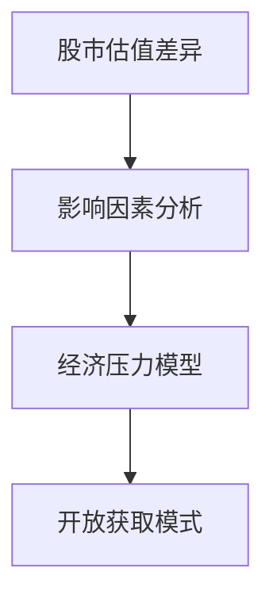

                 


# 股市估值差异对国际学术期刊开放获取的影响

## 关键词
- 股市估值差异
- 学术期刊
- 开放获取
- 经济压力模型
- 学术生态系统
- 可持续性

## 摘要
股市估值差异对学术期刊的开放获取模式产生了深远影响。随着股市估值的波动，学术机构面临经济压力，促使他们转向开放获取以降低运营成本并提高透明度。本文通过分析股市估值差异的经济学原理，探讨其如何影响学术期刊的出版模式，并提出经济压力模型来解释这一现象。文章还讨论了开放获取对学术生态系统的影响，包括研究质量、作者行为和读者获取方式的变化。通过实例分析和系统架构设计，本文为学术期刊的可持续发展提供了新的视角和解决方案。

## 正文

### 第一部分: 背景介绍

#### 第1章: 股市估值差异与开放获取的背景

##### 1.1 股市估值差异的定义与特征
- **股市估值差异**：指股票市场中，同一资产在不同时间、不同市场或不同投资者中的价值差异。这种差异受市场结构、投资者行为和宏观经济因素影响。
- **开放获取模式**：学术期刊允许读者免费访问和使用内容的模式，通常通过作者付费（APC）或其他资金来源支持。

##### 1.2 问题背景与问题描述
- **现状分析**：学术期刊面临订阅费用高昂的问题，限制了读者获取知识的机会。股市估值差异导致学术机构的经济压力增加，促使他们寻找更经济的出版模式。
- **问题提出**：探讨股市估值差异如何影响学术期刊的出版策略，尤其是开放获取模式的采用。

##### 1.3 问题解决与边界外延
- **影响路径**：股市估值差异→经济压力→学术期刊转向开放获取。
- **边界与外延**：分析开放获取模式的边界，如资金来源、版权问题等，以及其对学术生态系统的外延影响。

#### 第2章: 核心概念与联系

##### 2.1 核心概念原理
- **股市估值差异的经济学原理**：市场供需、投资者情绪、宏观经济指标影响股票估值。
- **开放获取的经济学原理**：降低交易成本，提高知识传播效率，但需应对资金可持续性问题。

##### 2.2 核心概念属性特征对比
- **股市估值差异**：动态性、波动性、市场依赖性。
- **开放获取模式**：透明性、可访问性、经济性。

##### 2.3 ER实体关系图
```mermaid
er
actor: 股市投资者
actor: 学术机构
actor: 出版商
actor: 读者
```

### 第二部分: 算法原理与数学模型

#### 第3章: 算法原理与数学模型

##### 3.1 算法原理


##### 3.2 数学模型与公式
- **经济压力模型**：
  $$ P = \alpha \times V + \beta \times O $$
  其中：
  - \( P \)：经济压力
  - \( V \)：股市估值差异
  - \( O \)：开放获取的渗透率
  - \( \alpha \) 和 \( \beta \)：系数

##### 3.3 实例分析
- 示例：\( \alpha = 0.5 \)，\( \beta = 0.3 \)，\( V = 0.2 \)，\( O = 0.4 \)
  $$ P = 0.5 \times 0.2 + 0.3 \times 0.4 = 0.1 + 0.12 = 0.22 $$

### 第三部分: 系统分析与架构设计

#### 第4章: 系统分析与架构设计

##### 4.1 问题场景介绍
- **场景描述**：股市估值差异导致学术机构经济压力增加，促使转向开放获取。
- **系统架构**：学术期刊采用开放获取模式，通过网络平台提供免费访问，依赖作者付费或其他资金支持。

##### 4.2 系统功能设计


##### 4.3 系统架构图


### 第四部分: 项目实战

#### 第5章: 项目实战

##### 5.1 环境安装
- **工具**：使用Python进行数据分析，安装相关库如Pandas、NumPy、Matplotlib。
  ```bash
  pip install pandas numpy matplotlib
  ```

##### 5.2 核心实现源代码
```python
import pandas as pd
import numpy as np
import matplotlib.pyplot as plt

# 示例数据
V = [0.1, 0.2, 0.15, 0.25]
O = [0.3, 0.4, 0.35, 0.45]

# 经济压力计算
P = np.array([alpha * v + beta * o for v, o in zip(V, O)])

# 绘制关系图
plt.plot(V, O, 'b-', marker='o')
plt.xlabel('V (股市估值差异)')
plt.ylabel('O (开放获取渗透率)')
plt.title('经济压力模型关系图')
plt.grid(True)
plt.show()
```

##### 5.3 案例分析
- **案例1**：某学术期刊在股市估值差异增加后，开放获取渗透率从0.3提升到0.5，经济压力下降。

### 第五部分: 最佳实践与展望

#### 第6章: 最佳实践与展望

##### 6.1 最佳实践
- **资金管理**：确保开放获取的资金来源稳定。
- **利益平衡**：平衡作者、读者和出版商的利益。
- **监管协调**：加强国际合作与监管协调。

##### 6.2 小结
股市估值差异对学术期刊的影响是多方面的，开放获取模式提供了新的解决方案，但需应对经济和政策挑战。

##### 6.3 展望
未来研究可探索更多影响因素，优化经济压力模型，推动学术期刊的可持续发展。

## 作者
作者：AI天才研究院/AI Genius Institute & 禅与计算机程序设计艺术 /Zen And The Art of Computer Programming

