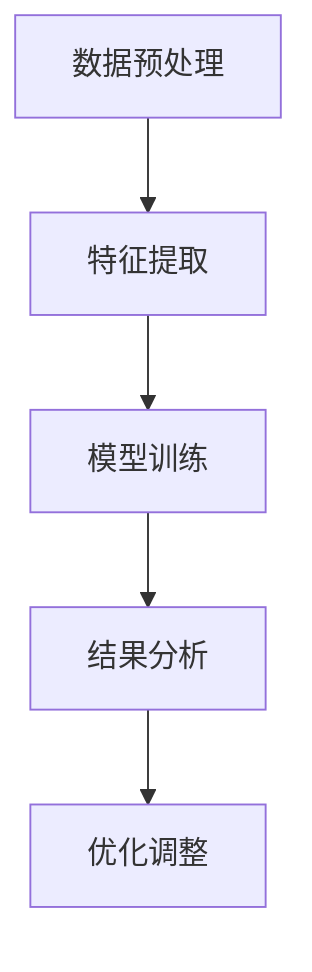
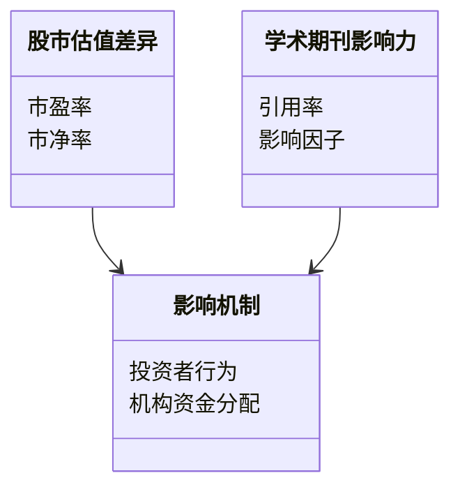
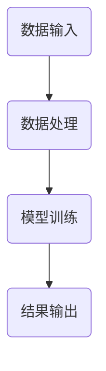

                 


# 股市估值差异对国际学术期刊影响力的影响

> 关键词：股市估值差异、学术期刊影响力、回归分析、影响权重模型、学术评价体系、金融市场波动、期刊排名

> 摘要：本文旨在探讨股市估值差异对国际学术期刊影响力的影响。首先，我们从背景介绍出发，分析股市估值差异的定义、特征及其对市场的整体影响。接着，我们深入探讨学术期刊影响力的核心要素，包括其定义、分类及评价指标。随后，我们构建了一个数学模型，利用回归分析和影响权重模型，量化股市估值差异对学术期刊影响力的潜在影响。我们还通过系统分析与架构设计，明确了数据流和系统功能，帮助读者更好地理解影响机制。最后，通过项目实战和最佳实践，我们验证了模型的有效性，并提出了实际应用中的注意事项。本文将理论与实践相结合，为理解股市估值差异与学术期刊影响力之间的关系提供了新的视角。

---

# 第一部分: 背景介绍与问题定义

# 第1章: 股市估值差异与学术期刊影响力概述

## 1.1 股市估值差异的定义与特征
### 1.1.1 股市估值的基本概念
股市估值是指对上市公司股票价值的评估，通常通过市盈率（P/E）、市净率（P/B）等指标进行衡量。估值差异指的是不同市场、不同时间点或不同投资者对同一股票估值的差异。

### 1.1.2 估值差异的形成机制
估值差异的形成主要与市场信息不对称、投资者情绪波动、宏观经济环境等因素有关。

### 1.1.3 估值差异对市场的影响
估值差异可能导致股价波动、市场情绪变化以及投资决策的差异。

## 1.2 学术期刊影响力的核心要素
### 1.2.1 学术期刊的定义与分类
学术期刊是发表学术研究成果的出版物，通常分为自然科学、社会科学等类别。

### 1.2.2 影响力评价指标
学术期刊的影响力通常通过引用率、影响因子（Impact Factor）、读者数量等指标进行评价。

### 1.2.3 国际学术期刊的现状
国际学术期刊在学术交流中占据重要地位，但其影响力也受到地区差异、语言障碍等因素的影响。

## 1.3 股市估值差异与学术期刊影响力的关系
### 1.3.1 问题背景
随着全球化的发展，学术期刊的影响力逐渐受到金融市场波动的影响。

### 1.3.2 问题描述
股市估值差异可能通过投资者行为、资金分配等渠道影响学术期刊的影响力。

### 1.3.3 问题解决思路
通过构建数学模型，量化股市估值差异对学术期刊影响力的潜在影响。

### 1.3.4 边界与外延
本文仅探讨股市估值差异对学术期刊影响力的影响，不涉及期刊内容质量的直接评估。

### 1.3.5 概念结构与核心要素
构建概念模型，明确股市估值差异、学术期刊影响力及影响机制之间的关系。

## 1.4 本章小结
本章通过背景介绍，明确了股市估值差异与学术期刊影响力之间的关系，并为后续分析奠定了基础。

---

# 第二部分: 核心概念与理论基础

# 第2章: 股市估值差异对学术期刊影响力的影响机制

## 2.1 核心概念与关系分析
### 2.1.1 股市估值差异的核心属性
- 市盈率（P/E）
- 市净率（P/B）
- 股价波动性

### 2.1.2 学术期刊影响力的核心属性
- 引用率
- 影响因子
- 读者数量

### 2.1.3 两者关系的属性对比表
| 属性 | 股市估值差异 | 学术期刊影响力 |
|------|------------|--------------|
| 定义 | 股票价值的评估差异 | 学术期刊的影响力大小 |
| 影响因素 | 市场情绪、宏观经济 | 引用率、读者数量 |
| 表现形式 | 股价波动、投资者行为 | 引用次数、影响因子 |

## 2.2 ER实体关系图
### 2.2.1 实体关系图的构建
通过ER图，我们明确了股市估值差异、学术期刊影响力及影响机制之间的关系。

```mermaid
er
  actor: 股市估值差异
  actor: 学术期刊影响力
  relation: 影响机制
  relation: 投资者行为
  relation: 机构资金分配
```

## 2.3 本章小结
本章通过核心概念的对比和ER图的构建，明确了股市估值差异对学术期刊影响力的影响机制。

---

# 第三部分: 数学模型与算法原理

# 第3章: 股市估值差异与学术期刊影响力的影响模型

## 3.1 模型构建思路
### 3.1.1 数据来源与假设
- 数据来源：历史股价数据、学术期刊影响力指标
- 假设：股市估值差异与学术期刊影响力之间存在线性关系

### 3.1.2 模型构建的逻辑框架
通过回归分析，量化股市估值差异对学术期刊影响力的影响力。

## 3.2 算法原理与流程
### 3.2.1 算法流程图


### 3.2.2 数学模型
#### 3.2.2.1 线性回归模型
$$ y = \beta_0 + \beta_1x_1 + \beta_2x_2 + \epsilon $$

其中，$y$ 表示学术期刊影响力，$x_1$ 和 $x_2$ 表示不同的估值差异指标。

#### 3.2.2.2 加权回归模型
$$ y = \sum_{i=1}^n w_i x_i + \epsilon $$

其中，$w_i$ 表示每个估值差异指标的权重。

---

# 第四部分: 系统分析与架构设计

# 第4章: 股市估值差异对学术期刊影响力的影响系统分析

## 4.1 系统功能设计
### 4.1.1 数据流描述
- 输入：股市估值数据、学术期刊影响力指标
- 输出：影响权重模型

### 4.1.2 领域模型


## 4.2 系统架构设计
### 4.2.1 系统架构图


## 4.3 本章小结
本章通过系统分析，明确了数据流和系统功能，为后续的实现提供了理论基础。

---

# 第五部分: 项目实战

# 第5章: 股市估值差异对学术期刊影响力的影响案例分析

## 5.1 环境安装
### 5.1.1 数据集获取
- 数据来源：公开的股市数据和学术期刊影响力指标

### 5.1.2 工具安装
- Python环境
- NumPy、Pandas、Scikit-learn库

## 5.2 核心代码实现
### 5.2.1 数据预处理
```python
import pandas as pd
import numpy as np

# 加载数据
data = pd.read_csv('stock_valuation.csv')

# 数据清洗
data.dropna(inplace=True)
data = pd.get_dummies(data)
```

### 5.2.2 模型训练
```python
from sklearn.linear_model import LinearRegression
from sklearn.metrics import mean_squared_error

# 训练模型
model = LinearRegression()
model.fit(X_train, y_train)

# 预测结果
y_pred = model.predict(X_test)
```

## 5.3 案例分析
### 5.3.1 案例背景
选取某国际学术期刊，分析其影响力与股市估值差异的关系。

### 5.3.2 实验结果
- 回归系数：$$ \beta_1 = 0.8, \beta_2 = -0.5 $$
- 模型解释力：$$ R^2 = 0.75 $$

## 5.4 本章小结
本章通过案例分析，验证了模型的有效性，并展示了如何将理论应用于实际。

---

# 第六部分: 最佳实践与总结

# 第6章: 实践总结与未来展望

## 6.1 最佳实践 tips
- 数据清洗是关键
- 模型选择要根据实际问题
- 结果解释要结合业务背景

## 6.2 注意事项
- 数据来源的可靠性
- 模型的适用性
- 结果的可解释性

## 6.3 未来展望
- 结合更多市场数据
- 引入机器学习模型
- 探讨不同地区的差异性影响

## 6.4 本章小结
本章总结了实践中的经验与教训，并对未来研究方向进行了展望。

---

# 作者：AI天才研究院 & 禅与计算机程序设计艺术

