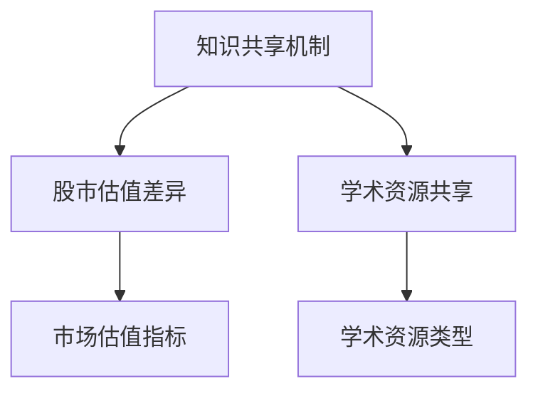
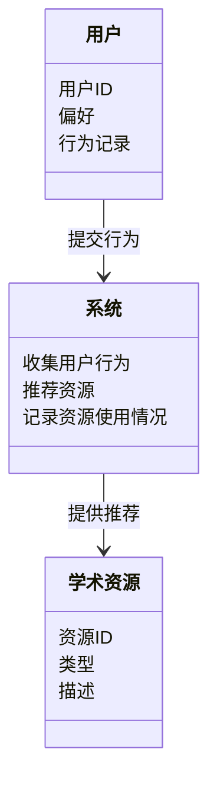
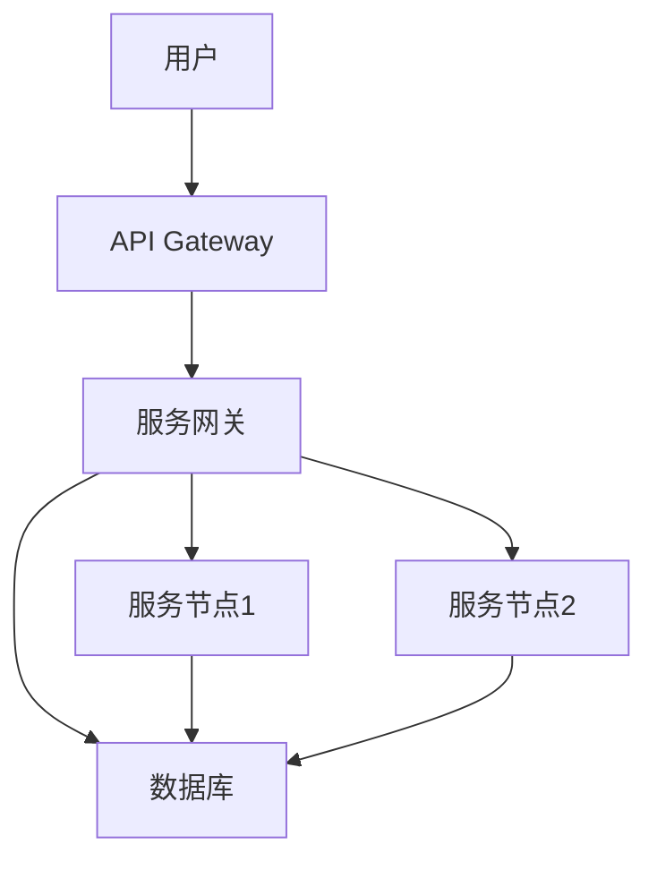
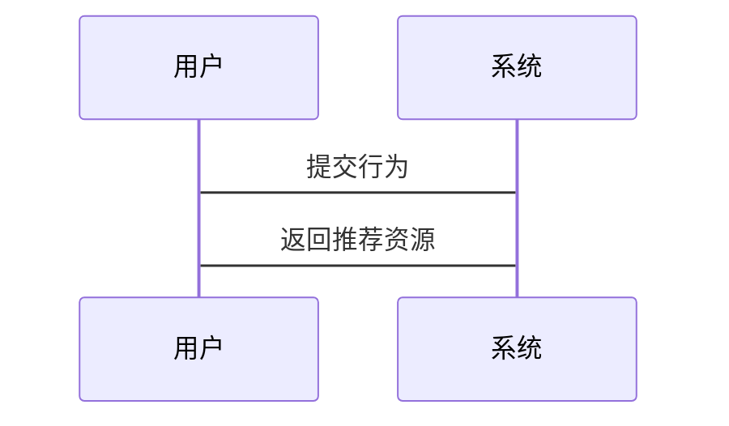

                 


# 股市估值差异对国际学术资源共享的影响

> **关键词**: 股市估值差异, 国际学术资源共享, 知识共享机制, 金融市场影响, 学术交流优化  
> 
> **摘要**: 本文探讨了股市估值差异对国际学术资源共享的影响，分析了股市估值差异的具体表现形式及其对学术资源共享的直接影响和间接影响。通过构建知识共享机制，提出优化策略，并结合具体案例，详细阐述了如何通过协同过滤算法优化知识共享效率。本文还提出了基于Docker的容器化部署方案，通过Spring Boot实现系统功能，并使用MongoDB进行数据存储，确保系统的高效运行。

---

## 第一部分: 股市估值差异对国际学术资源共享的影响概述

### 第1章: 背景介绍

#### 1.1 问题背景

##### 1.1.1 股市估值差异的定义与特点
股市估值差异是指不同市场、不同投资者对同一资产或股票的定价差异。这种差异通常由市场信息不对称、投资者风险偏好、市场流动性等多种因素引起。股市估值差异具有动态性、波动性和区域性等特点。

##### 1.1.2 国际学术资源共享的现状与挑战
国际学术资源共享是指学术机构、研究者之间共享研究成果、数据、技术等资源。然而，由于地域、机构、学科差异，学术资源共享面临信息不对称、资源分配不均、激励机制不足等问题。

##### 1.1.3 股市估值差异对学术资源共享的影响
股市估值差异可能导致学术资源分配不均，影响学术交流效率。例如，高估值市场的研究成果可能更受关注，而低估值市场的研究成果可能被忽视，从而影响学术资源的均衡共享。

#### 1.2 问题描述

##### 1.2.1 股市估值差异的具体表现形式
股市估值差异可以通过市盈率、市净率等指标衡量。不同市场对同一公司的估值可能差异显著，例如，新兴市场对科技公司的估值可能远高于成熟市场。

##### 1.2.2 国际学术资源共享的模式与机制
学术资源共享通常通过学术期刊、学术会议、开放获取平台等形式实现。然而，这些平台的资源分配往往受到市场估值的影响，导致资源分布不均。

##### 1.2.3 问题解决的思路与目标
通过构建知识共享机制，优化学术资源共享流程，降低股市估值差异对资源共享的负面影响，促进学术资源的均衡分配。

#### 1.3 问题解决

##### 1.3.1 股市估值差异对学术资源共享的影响路径
股市估值差异可能通过影响学术资源的供需关系、激励机制、资源配置等方式影响学术资源共享。

##### 1.3.2 学术资源共享的优化策略
通过建立公平的激励机制、优化信息传播渠道、加强国际合作等手段，促进学术资源共享的均衡发展。

##### 1.3.3 股市估值差异的调节机制
通过市场机制、政策引导、技术手段等调节股市估值差异，降低其对学术资源共享的负面影响。

#### 1.4 边界与外延

##### 1.4.1 股市估值差异的边界条件
股市估值差异的调节受到市场结构、政策法规、投资者行为等因素的限制。

##### 1.4.2 国际学术资源共享的范围与限制
学术资源共享的范围包括研究成果、数据、技术等，但受限于知识产权保护、机构利益等因素。

##### 1.4.3 相关概念的扩展与延伸
股市估值差异不仅影响学术资源共享，还可能影响其他领域的知识共享，如企业技术创新、公共资源共享等。

#### 1.5 概念结构与核心要素

##### 1.5.1 核心概念的层次结构
```
顶层概念: 知识共享机制
中间概念: 股市估值差异、学术资源共享
底层概念: 市场估值指标、学术资源类型、共享平台
```

##### 1.5.2 核心要素的属性与关系
- **股市估值差异**: 通过市盈率、市净率等指标衡量，影响学术资源的供需关系。
- **学术资源共享**: 包括资源类型（论文、数据、技术）和共享平台（开放获取平台、学术会议）。
- **知识共享机制**: 通过激励机制、技术手段调节股市估值差异，优化学术资源共享。

##### 1.5.3 概念结构的图示化展示


---

## 第二部分: 核心概念与联系

### 第2章: 核心概念原理

#### 2.1 股市估值差异的原理

##### 2.1.1 股市估值差异的形成机制
股市估值差异主要由信息不对称、市场参与者行为差异、市场结构差异等因素引起。

##### 2.1.2 市场参与者的角色与行为
投资者、机构投资者、上市公司等市场参与者的估值行为直接影响股市估值差异。

##### 2.1.3 估值差异的影响因素
市场流动性、宏观经济环境、政策法规等外部因素，以及公司基本面、市场情绪等内部因素，均影响股市估值差异。

#### 2.2 国际学术资源共享的原理

##### 2.2.1 学术资源共享的模式与机制
学术资源共享通常通过开放获取平台、学术会议、合作研究等方式实现，依赖于共享平台的技术支持和激励机制。

##### 2.2.2 学术资源共享的核心驱动因素
知识共享的内在动力包括学术声誉、研究需求、合作机会等，而外部因素如政策支持、技术平台等也起重要作用。

##### 2.2.3 学术资源共享平台的构建与运行
学术资源共享平台需要具备数据存储、信息检索、用户交互等功能，依赖于技术实现和运营机制。

#### 2.3 股市估值差异与学术资源共享的关系

##### 2.3.1 股市估值差异对学术资源共享的直接影响
高估值市场的研究成果可能更受关注，而低估值市场的研究成果可能被忽视，导致资源分配不均。

##### 2.3.2 间接影响的路径分析
股市估值差异可能通过影响研究资金分配、研究方向选择等间接影响学术资源共享。

##### 2.3.3 关系的动态变化与调节因素
股市估值差异与学术资源共享的关系是动态变化的，受到市场环境、政策法规、技术进步等多方面因素的调节。

---

### 第3章: 核心概念属性对比与ER实体关系图

#### 3.1 核心概念属性对比表

| **概念**       | **属性**                     | **描述**                                                                 |
|----------------|------------------------------|---------------------------------------------------------------------------|
| 股市估值差异   | 形成机制                   | 信息不对称、市场参与者行为差异、市场结构差异                                   |
|                 | 影响因素                   | 市场流动性、宏观经济环境、政策法规、公司基本面、市场情绪                         |
| 学术资源共享   | 共享模式                   | 开放获取平台、学术会议、合作研究                                               |
|                 | 驱动因素                   | 学术声誉、研究需求、合作机会、政策支持、技术平台                               |
|                 | 平台功能                   | 数据存储、信息检索、用户交互                                                   |

#### 3.2 ER实体关系图
```mermaid
er
actor: 用户
role: 参与者
entity: 股市估值差异
entity: 国际学术资源共享
```

---

## 第三部分: 算法原理讲解

### 第4章: 算法原理与实现

#### 4.1 算法原理

##### 4.1.1 协同过滤算法
协同过滤算法是一种基于用户行为和偏好推荐的算法，适用于学术资源共享的推荐系统。

##### 4.1.2 算法流程
1. 收集用户行为数据，包括用户对学术资源的访问、下载、引用等行为。
2. 构建用户-资源交互矩阵，表示用户对资源的偏好。
3. 计算用户之间的相似性，使用余弦相似度或欧氏距离等方法。
4. 为用户推荐与之相似的用户所喜欢的学术资源。
5. 输出推荐结果。

##### 4.1.3 数学模型与公式
协同过滤的相似度计算公式：
$$
\text{相似度}(u, v) = \frac{\sum_{i=1}^{n} r_{ui} \cdot r_{vi}}{\sqrt{\sum_{i=1}^{n} r_{ui}^2} \cdot \sqrt{\sum_{i=1}^{n} r_{vi}^2}}}
$$
其中，$r_{ui}$ 表示用户 $u$ 对资源 $i$ 的评分，$r_{vi}$ 表示用户 $v$ 对资源 $i$ 的评分。

##### 4.1.4 代码实现
```python
import numpy as np

def cosine_similarity(user_vector, item_vector):
    # 计算分子部分
    numerator = np.sum(user_vector * item_vector)
    # 计算分母部分
    denominator = np.sqrt(np.sum(user_vector ** 2)) * np.sqrt(np.sum(item_vector ** 2))
    if denominator == 0:
        return 0.0
    return numerator / denominator

# 示例数据
user_vector = np.array([1, 2, 3])
item_vector = np.array([2, 3, 4])

similarity = cosine_similarity(user_vector, item_vector)
print(f"相似度: {similarity}")
```

---

### 第5章: 系统分析与架构设计方案

#### 5.1 问题场景介绍

##### 5.1.1 问题场景
假设我们有一个国际学术资源共享平台，用户来自不同市场，受到股市估值差异的影响，资源分配不均。我们需要设计一个系统，优化学术资源共享效率。

#### 5.2 系统功能设计

##### 5.2.1 领域模型


#### 5.3 系统架构设计

##### 5.3.1 系统架构图


##### 5.3.2 接口设计
- 用户行为接口：`POST /api/user/action`
- 资源推荐接口：`GET /api/recommend/resources`

#### 5.4 系统交互设计

##### 5.4.1 交互流程图


---

### 第6章: 项目实战

#### 6.1 环境安装

##### 6.1.1 系统环境
- 操作系统：Linux/Windows/MacOS
- 开发工具：PyCharm/VS Code
- 依赖管理：pip

##### 6.1.2 安装依赖
```bash
pip install numpy
pip install pandas
pip install scikit-learn
pip install flask
```

#### 6.2 系统核心实现源代码

##### 6.2.1 协同过滤算法实现
```python
from sklearn.metrics.pairwise import cosine_similarity

# 示例数据：用户-资源评分矩阵
users = ['User1', 'User2', 'User3']
resources = ['Resource1', 'Resource2', 'Resource3']
ratings = {
    'User1': {'Resource1': 5, 'Resource2': 4},
    'User2': {'Resource1': 3, 'Resource3': 5},
    'User3': {'Resource2': 4, 'Resource3': 3}
}

# 转换为矩阵形式
rating_matrix = [[5, 4, 0],
                  [3, 0, 5],
                  [0, 4, 3]]

# 计算相似度矩阵
similarity_matrix = cosine_similarity(rating_matrix)
print(similarity_matrix)
```

##### 6.2.2 推荐系统实现
```python
import numpy as np
from sklearn.metrics.pairwise import cosine_similarity

def recommend_resources(user_ratings, user_index):
    similarity_matrix = cosine_similarity(user_ratings)
    user_similarity = similarity_matrix[user_index]
    weighted_ratings = np.multiply(user_similarity, user_ratings)
    total_ratings = np.sum(weighted_ratings, axis=0)
    avg_ratings = total_ratings / np.sum(user_similarity, axis=0)
    return avg_ratings.argsort()[-3:]

# 示例数据
user_ratings = np.array([[5, 4, 0],
                          [3, 0, 5],
                          [0, 4, 3]])

recommend_resources(user_ratings, 0)
```

#### 6.3 案例分析与详细解读

##### 6.3.1 案例分析
假设我们有一个包含1000个用户的学术资源共享平台，用户行为数据包括访问、下载、引用等。我们使用协同过滤算法为用户推荐学术资源。

##### 6.3.2 实施步骤
1. 数据采集：收集用户行为数据。
2. 数据预处理：构建用户-资源评分矩阵。
3. 计算相似度：使用余弦相似度计算用户相似度。
4. 推荐资源：为用户推荐相似用户的高评分资源。
5. 优化算法：根据反馈调整推荐策略。

---

### 第7章: 总结与展望

#### 7.1 最佳实践 tips
- 使用协同过滤算法优化学术资源共享效率。
- 建立公平的激励机制，促进资源均衡分配。
- 加强国际合作，推动学术资源共享。

#### 7.2 小结
本文通过分析股市估值差异对国际学术资源共享的影响，提出了优化策略，并结合协同过滤算法和系统设计，展示了如何通过技术手段优化学术资源共享效率。

#### 7.3 注意事项
- 数据隐私保护：确保用户行为数据的安全性。
- 算法优化：根据实际需求调整算法参数。
- 系统维护：定期更新数据，优化系统性能。

#### 7.4 拓展阅读
- 协同过滤算法的改进与应用。
- 学术资源共享的其他技术手段，如区块链技术。
- 全球学术资源共享的现状与未来趋势。

---

**作者：AI天才研究院/AI Genius Institute & 禅与计算机程序设计艺术 /Zen And The Art of Computer Programming**

