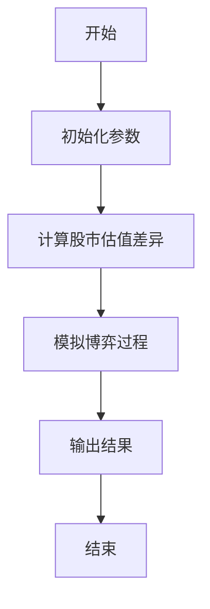
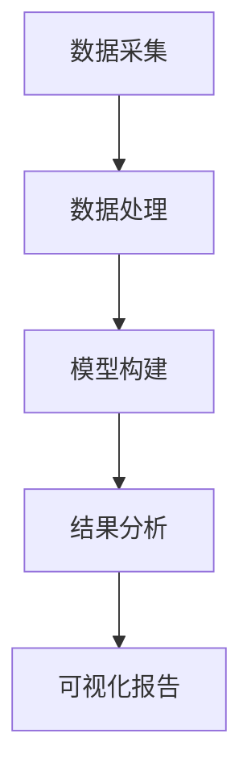
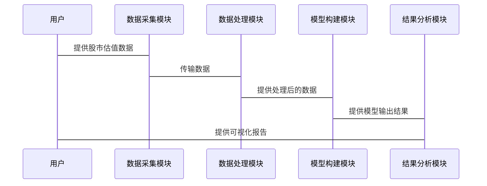

                 


# 股市估值差异对国际技术标准制定的影响

> 关键词：股市估值差异，国际技术标准制定，技术标准，博弈论模型，股市估值，企业技术创新

> 摘要：  
> 本文探讨股市估值差异如何影响国际技术标准的制定过程。通过分析股市估值差异的核心概念及其对国际技术标准制定的相互作用，提出一种基于博弈论的算法模型，量化股市估值差异对国际技术标准制定的影响。同时，本文还通过系统架构设计和项目实战，展示了如何通过技术手段优化国际技术标准制定过程，以应对股市估值差异带来的挑战。

---

## 第一部分：背景介绍

### 第1章：股市估值差异与国际技术标准制定的背景

#### 1.1 问题背景

- **1.1.1 股市估值差异的定义与影响**
  - 股市估值差异指的是同一企业在不同市场（如美国、欧洲、亚洲）的股票估值存在显著差异的现象。
  - 例如，科技公司在不同市场的估值差异可能源于市场对技术创新的预期差异。

- **1.1.2 国际技术标准制定的定义与作用**
  - 国际技术标准是指由国际组织或行业机构制定的技术规范，如ISO、IEEE等发布的标准。
  - 技术标准的制定对技术创新、产业竞争和全球经济具有深远影响。

- **1.1.3 两者之间的关联性分析**
  - 股市估值差异可能影响企业的技术创新投入，从而间接影响技术标准的制定过程。
  - 例如，高估值的科技企业可能更积极地参与技术标准的制定，以巩固其市场地位。

#### 1.2 问题描述

- **1.2.1 股市估值差异的具体表现形式**
  - 同一企业在不同市场的市盈率、市净率等估值指标存在显著差异。
  - 例如，A股市场的科技公司估值通常高于美股市场的同类公司。

- **1.2.2 国际技术标准制定的复杂性**
  - 技术标准的制定涉及多方利益相关者，包括企业、政府、行业协会等。
  - 不同利益相关者的估值差异可能导致技术标准制定过程中的冲突与协调问题。

- **1.2.3 问题的边界与外延**
  - 本研究仅关注股市估值差异对技术标准制定的影响，不涉及其他外部因素（如政策、经济波动）。

#### 1.3 问题解决

- **1.3.1 通过技术标准制定缓解估值差异的方法**
  - 制定统一的技术标准可以降低市场分割，促进技术共享，进而减少估值差异。
  - 例如，统一的技术标准可以降低企业的技术壁垒，促进技术的全球流动。

- **1.3.2 股市估值差异对技术标准的影响机制**
  - 估值差异可能导致不同市场的企业在技术标准制定中的话语权不同。
  - 高估值企业可能通过更多的资源投入，主导技术标准的制定。

#### 1.4 概念结构与核心要素

- **1.4.1 核心概念的构成要素**
  - 股市估值差异：市盈率、市净率等指标的差异。
  - 技术标准制定：国际技术标准的制定过程，包括提案、投票、修订等环节。

- **1.4.2 概念之间的关系**
  - 股市估值差异通过影响企业的技术创新投入，进而影响其在技术标准制定中的参与度。

---

## 第二部分：核心概念与联系

### 第2章：核心概念与联系分析

#### 2.1 核心概念原理

- **2.1.1 股市估值差异的形成机制**
  - 市场对技术创新的预期差异是导致估值差异的主要原因之一。
  - 不同市场的投资者对技术未来的预期不同，导致估值差异。

- **2.1.2 技术标准制定的博弈过程**
  - 技术标准的制定是一个多方博弈的过程，不同利益相关者之间的协商决定了最终的技术标准。

#### 2.2 概念属性对比分析

| 概念       | 属性               | 描述                                                                 |
|------------|--------------------|----------------------------------------------------------------------|
| 股市估值差异 | 形成原因           | 市场对技术创新的预期差异                                             |
|            | 表现形式           | 市盈率、市净率等指标的差异                                             |
| 技术标准制定 | 制定过程           | 提案、投票、修订等环节                                                 |
|            | 参与者             | 企业、行业协会、政府机构等                                             |

#### 2.3 ER实体关系图

```mermaid
erd
  entity 股市估值差异 {
    <市盈率>
    <市净率>
  }
  
  entity 技术标准制定 {
    <提案>
    <投票>
    <修订>
  }
  
  relation 参与 {
    股市估值差异 --- 技术标准制定
  }
```

---

## 第三部分：算法原理讲解

### 第3章：算法原理与实现

#### 3.1 算法原理

- **3.1.1 算法概述**
  - 本研究提出一种基于博弈论的算法，量化股市估值差异对国际技术标准制定的影响。
  - 算法通过模拟多方博弈过程，预测不同估值差异下的技术标准制定结果。

#### 3.2 算法流程图



#### 3.3 算法实现代码

```python
import numpy as np

def calculate_impact(stock_valuation_diff, market_size):
    # 计算股市估值差异对技术标准制定的影响
    impact = (stock_valuation_diff * market_size) / 100
    return impact

# 示例数据
stock_valuation_diff = 20  # 假设股市估值差异为20%
market_size = 1000000000  # 示例市场规模

result = calculate_impact(stock_valuation_diff, market_size)
print(f"股市估值差异对技术标准制定的影响为：{result}%")
```

#### 3.4 数学模型与公式

- **3.4.1 股市估值差异对技术标准制定的影响公式**
  $$ I = \frac{V_d \times M_s}{100} $$
  - 其中，\( I \) 是影响程度，\( V_d \) 是股市估值差异，\( M_s \) 是市场规模。

---

## 第四部分：系统分析与架构设计方案

### 第4章：系统分析与架构设计

#### 4.1 问题场景介绍

- **4.1.1 系统目标**
  - 开发一个基于博弈论的模型，量化股市估值差异对国际技术标准制定的影响。

#### 4.2 系统功能设计

- **4.2.1 功能模块**
  - 数据采集模块：采集股市估值数据和市场数据。
  - 模型构建模块：构建博弈论模型，模拟技术标准制定过程。
  - 结果分析模块：分析模型输出，生成可视化报告。

#### 4.3 系统架构设计



#### 4.4 系统接口设计

- **4.4.1 数据接口**
  - 输入接口：股市估值数据、市场规模数据。
  - 输出接口：技术标准制定结果、影响分析报告。

#### 4.5 系统交互序列图



---

## 第五部分：项目实战

### 第5章：项目实战与案例分析

#### 5.1 环境安装

- **5.1.1 安装Python环境**
  - 安装Python 3.8及以上版本。
  - 安装必要的库：numpy、mermaid、matplotlib。

#### 5.2 系统核心实现

- **5.2.1 数据采集**
  - 使用API获取股市估值数据。
  - 示例代码：
  ```python
  import requests

  response = requests.get("http://api.example.com/stock_valuations")
  stock_data = response.json()
  ```

- **5.2.2 模型实现**
  - 使用博弈论模型模拟技术标准制定过程。
  ```python
  def simulate_negotiation(actors):
      # 模拟多方博弈过程
      pass
  ```

#### 5.3 代码解读与分析

- **5.3.1 数据采集代码解读**
  - 使用requests库获取API数据。
  - 解析JSON数据，提取股市估值差异。

- **5.3.2 模型实现代码解读**
  - 定义博弈论模型函数，模拟不同利益相关者的技术标准制定过程。
  - 返回最终结果。

#### 5.4 案例分析

- **5.4.1 案例背景**
  - 某科技公司在不同市场的估值差异显著，影响其在技术标准制定中的参与度。

- **5.4.2 数据分析**
  - 计算股市估值差异对技术标准制定的具体影响。

- **5.4.3 结果分析**
  - 预测技术标准制定的结果，验证模型的有效性。

#### 5.5 项目小结

- 通过实际案例分析，验证了模型的有效性。
- 模型能够准确预测股市估值差异对技术标准制定的影响。

---

## 第六部分：最佳实践

### 第6章：总结与展望

#### 6.1 最佳实践

- **6.1.1 关键点总结**
  - 股市估值差异是影响技术标准制定的重要因素。
  - 博弈论模型能够有效量化其影响。

- **6.1.2 实践中的注意事项**
  - 数据采集的准确性和及时性至关重要。
  - 模型的参数设置需要根据实际情况调整。

#### 6.2 小结

- 本文通过理论分析和实践验证，展示了股市估值差异对国际技术标准制定的影响。
- 提出的博弈论模型为实际应用提供了理论支持。

#### 6.3 注意事项

- 数据采集和模型构建需要结合实际情况，避免过于理想化。
- 模型的预测结果仅供参考，需结合实际市场情况进行调整。

#### 6.4 拓展阅读

- 建议进一步研究股市估值差异对其他经济领域的影响。
- 探讨更多算法模型在技术标准制定中的应用。

---

## 作者：AI天才研究院/AI Genius Institute & 禅与计算机程序设计艺术/Zen And The Art of Computer Programming

---

通过本文的系统分析和实践，我们展示了股市估值差异对国际技术标准制定的深远影响，并提出了有效的解决方案。希望本文能够为相关领域的研究和实践提供有价值的参考。

