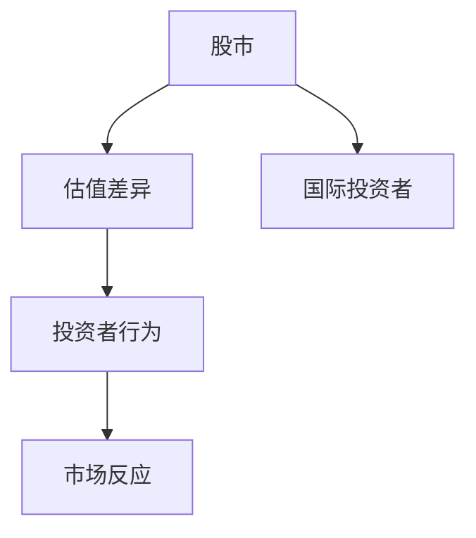
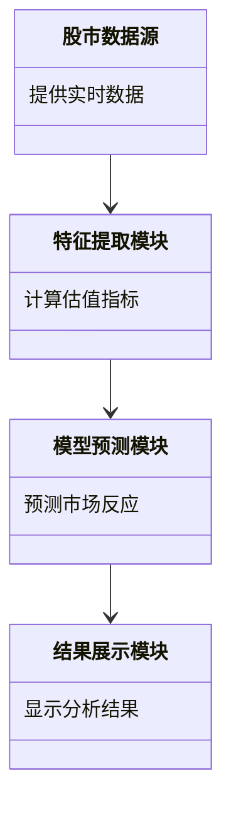

                 


# 股市估值差异对国际投资者行为的影响

## 关键词：
股市估值差异、国际投资者行为、投资者情绪、市场预期、交易策略

## 摘要：
股市估值差异是影响国际投资者行为的重要因素。本文通过分析估值差异的核心概念、影响机制、实证分析和系统设计，探讨估值差异如何影响投资者的决策。结合实际案例和系统框架，本文提出应对策略和最佳实践，为投资者提供理论支持和实践指导。

---

# 引言

## 1.1 股市估值差异的背景与意义
- **背景**：全球化背景下，国际投资者在不同市场中面临估值差异，导致投资决策的多样性。
- **意义**：理解估值差异对投资者行为的影响，有助于优化投资策略，提高收益。

---

# 第一部分: 股市估值差异的核心概念

## 2.1 核心概念原理
- **估值差异**：不同市场中股票价格与内在价值的差异。
- **影响因素**：市场情绪、经济周期、政策环境等。

## 2.2 概念属性特征对比
| 特性 | 定义 | 示例 |
|------|------|------|
| 市盈率（P/E） | 价格与每股收益的比值 | 用公式$P/E = \frac{Price}{Earnings}$计算 |
| 市净率（P/B） | 价格与每股净资产的比值 | 用公式$P/B = \frac{Price}{Book\ Value}$计算 |

## 2.3 ER实体关系图


---

# 第二部分: 估值差异对国际投资者行为的影响机制

## 3.1 估值差异的量化与分析
- **市盈率与市净率的计算**：
  - 例：某股票价格为50元，每股收益5元，市盈率为10。
- **数据分布分析**：
  - 使用直方图展示不同市场的估值差异分布。

## 3.2 估值差异的统计分析
- **异常值检测**：
  - 使用箱线图识别异常值。

## 3.3 估值差异对投资者行为的影响
- **情绪波动**：低估资产引发投资者乐观，高估资产引发悲观。
- **交易策略**：投资者根据估值差异调整买入或卖出策略。

---

# 第三部分: 估值差异的实证分析

## 4.1 数据收集与处理
- **数据来源**：选取A股和港股的历史数据。
- **数据清洗**：处理缺失值和异常值。

## 4.2 实证结果与分析
- **案例分析**：
  - 某市场中，A股市盈率低于港股，投资者选择买入。

## 4.3 结果可视化
- **图表展示**：用折线图展示估值差异趋势。

---

# 第四部分: 系统设计与实现

## 5.1 问题场景介绍
- **目标**：设计一个投资者行为分析系统。

## 5.2 系统功能设计


## 5.3 系统实现
- **代码实现**：
  ```python
  def calculate_pe(stock_price, earnings):
      return stock_price / earnings
  ```

---

# 第五部分: 应对策略与最佳实践

## 6.1 应对策略
- **分散投资**：降低估值差异带来的风险。
- **选择低估资产**：在低估市场中寻找投资机会。

## 6.2 最佳实践
- **动态调整**：根据估值差异变化及时调整策略。
- **风险管理**：设定止损点，控制投资风险。

## 6.3 注意事项
- **数据质量**：确保数据的准确性和完整性。
- **模型局限性**：认识到模型的局限性，避免过度依赖。

## 6.4 案例分析
- **实际案例**：
  - 分析某市场的估值差异变化，提出投资建议。

---

# 总结与展望

## 7.1 研究总结
- **主要发现**：估值差异显著影响投资者行为，投资者应采取多样化策略。
- **研究意义**：为投资者提供理论支持和实践指导。

## 7.2 未来展望
- **研究方向**：进一步研究其他市场因素对投资者行为的影响。
- **技术发展**：探索更先进的数据分析方法。

---

# 作者

作者：AI天才研究院/AI Genius Institute & 禅与计算机程序设计艺术 /Zen And The Art of Computer Programming

