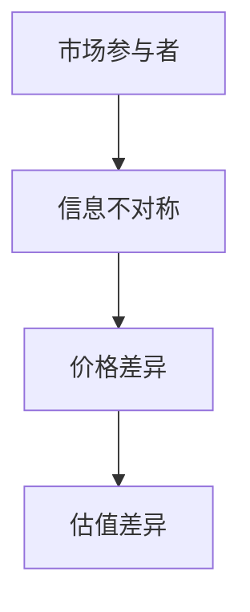
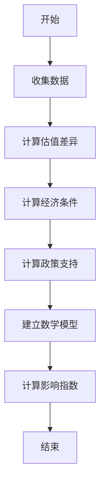
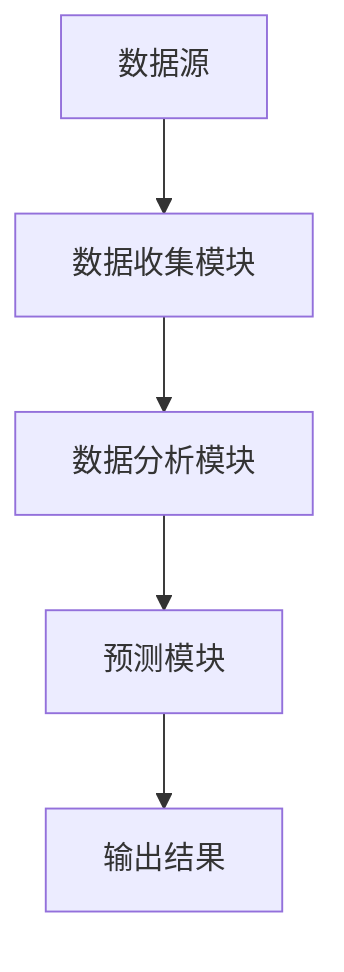

                 


# 股市估值差异对国际教育合作的影响

> 关键词：股市估值差异、国际教育合作、经济因素、教育模式、跨文化交流

> 摘要：本文探讨股市估值差异如何影响国际教育合作。通过分析股市估值差异的定义、形成机制及其对国际教育合作的直接影响和间接影响，本文揭示了经济因素在国际教育中的重要作用。结合实际案例和系统设计，本文提出了一种量化分析方法，并通过数学模型和算法流程图展示了如何将股市估值差异与国际教育合作相结合。

---

## 第一章: 股市估值差异的背景与定义

### 1.1 股市估值差异的定义与特征

股市估值差异是指不同市场中同一资产或公司股票的市场价格差异。这种差异通常由市场参与者对资产价值的不同评估、信息不对称、交易成本、税收政策、市场情绪等多种因素引起。

#### 1.1.1 股市估值差异的定义
股市估值差异 = max(市场价格差异, 资产真实价值差异)

#### 1.1.2 股市估值差异的核心特征
- **信息不对称**：不同市场参与者掌握的信息不同，导致估值差异。
- **市场流动性**：流动性低的市场可能导致估值偏离资产真实价值。
- **市场情绪**：投资者情绪波动会影响市场价格，从而引发估值差异。

#### 1.1.3 股市估值差异的计算方法
股市估值差异可以通过以下公式计算：

$$ \text{估值差异} = \text{市场价格} - \text{内在价值} $$

### 1.2 国际教育合作的定义与模式

国际教育合作是指不同国家或地区的教育机构、学生、教师之间的合作，旨在促进知识共享、文化交流和教育资源优化配置。

#### 1.2.1 国际教育合作的定义
国际教育合作 = 教育资源跨国流动 + 文化交流 + 合作项目

#### 1.2.2 国际教育合作的主要模式
1. **学生交换计划**：学生到其他国家学习，体验不同的教育体系。
2. **教师培训项目**：教师通过国际培训提升教学能力。
3. **合作办学**：两国或多国教育机构合作开设课程或学位项目。

#### 1.2.3 国际教育合作的影响因素
- **政策支持**：政府的教育政策和签证政策直接影响国际教育合作。
- **经济条件**：学生的经济能力影响其参与国际教育合作的能力。
- **文化差异**：文化差异可能影响国际教育合作的顺利进行。

### 1.3 股市估值差异对国际教育合作的影响

#### 1.3.1 股市估值差异的直接影响
1. **教育资源投资**：股市估值差异影响教育机构的融资能力，进而影响其国际教育合作的能力。
2. **学生流动性**：股市估值差异影响学生的经济能力，进而影响其参与国际教育合作的可能性。

#### 1.3.2 股市估值差异的间接影响
1. **教育机构的国际声誉**：股市估值差异影响教育机构的财务健康，进而影响其国际声誉。
2. **国际合作项目资金**：股市估值差异影响国际合作项目的资金来源。

---

## 第二章: 核心概念与问题描述

### 2.1 股市估值差异的核心概念

#### 2.1.1 股市估值差异的形成机制
股市估值差异的形成机制可以用以下流程图表示：



#### 2.1.2 股市估值差异的度量方法
股市估值差异的度量方法可以分为以下步骤：

1. 确定同一资产在不同市场的价格。
2. 计算市场价格的差异。
3. 计算内在价值的差异。
4. 比较市场价格差异和内在价值差异。

### 2.2 国际教育合作的核心概念

#### 2.2.1 国际教育合作的主体与客体
- **主体**：教育机构、学生、教师。
- **客体**：教育资源、课程、学位项目。

#### 2.2.2 国际教育合作的目标与范围
- **目标**：促进知识共享、提升教育质量。
- **范围**：涵盖高等教育、职业教育、基础教育等多个领域。

### 2.3 股市估值差异与国际教育合作的关联性

#### 2.3.1 股市估值差异对国际教育合作的驱动作用
股市估值差异通过影响教育机构的财务状况，进而影响其参与国际教育合作的能力。

#### 2.3.2 国际教育合作对股市估值差异的反作用
国际教育合作通过促进教育资源的流动，可能影响股市对教育机构的估值。

---

## 第三章: 核心概念的原理与特征

### 3.1 股市估值差异的原理

#### 3.1.1 股市估值差异的形成机制
股市估值差异的形成机制可以用以下流程图表示：


#### 3.1.2 股市估值差异的影响因素
- **信息不对称**：市场参与者掌握的信息不同。
- **市场流动性**：流动性低的市场可能导致估值差异。
- **市场情绪**：投资者情绪波动会影响市场价格。

### 3.2 国际教育合作的原理

#### 3.2.1 国际教育合作的驱动因素
- **政策支持**：政府的教育政策和签证政策。
- **经济条件**：学生的经济能力。
- **文化差异**：文化差异的影响。

---

## 第四章: 算法原理讲解

### 4.1 股市估值差异与国际教育合作的数学模型

#### 4.1.1 数学模型的建立
我们可以建立以下数学模型来量化股市估值差异对国际教育合作的影响：

$$ \text{影响指数} = \alpha \times \text{估值差异} + \beta \times \text{经济条件} + \gamma \times \text{政策支持} $$

其中，$\alpha$、$\beta$、$\gamma$ 是回归系数。

#### 4.1.2 算法流程图
以下是算法流程图：



### 4.2 算法实现与代码

#### 4.2.1 环境安装
需要安装以下工具：
- Python
- NumPy
- Pandas
- Scikit-learn

#### 4.2.2 核心代码实现

```python
import numpy as np
import pandas as pd
from sklearn.linear_model import LinearRegression

# 数据准备
data = pd.DataFrame({
    'valuation_diff': [1, 2, 3, 4, 5],
    'economic_conditions': [5, 4, 3, 2, 1],
    'policy_support': [2, 3, 4, 5, 6]
})

# 建立模型
model = LinearRegression()
X = data[['valuation_diff', 'economic_conditions', 'policy_support']]
y = data['impact_index']

model.fit(X, y)

# 输出系数
print(model.coef_)
```

---

## 第五章: 系统分析与架构设计方案

### 5.1 问题场景介绍

#### 5.1.1 问题场景描述
假设我们希望分析股市估值差异对某国国际教育合作的影响。

#### 5.1.2 系统功能需求
- 数据收集模块：收集股市数据和教育合作数据。
- 数据分析模块：计算估值差异和影响指数。
- 预测模块：预测未来国际教育合作的趋势。

### 5.2 系统架构设计

#### 5.2.1 系统架构图
以下是系统架构图：



---

## 第六章: 项目实战

### 6.1 环境安装

#### 6.1.1 环境配置
安装所需的Python库：

```bash
pip install numpy pandas scikit-learn
```

### 6.2 核心代码实现

#### 6.2.1 数据收集模块

```python
import pandas as pd

# 收集数据
data = pd.DataFrame({
    'country': ['A', 'B', 'C', 'D', 'E'],
    'valuation_diff': [1, 2, 3, 4, 5],
    'economic_conditions': [5, 4, 3, 2, 1],
    'policy_support': [2, 3, 4, 5, 6]
})
```

#### 6.2.2 数据分析模块

```python
from sklearn.linear_model import LinearRegression

# 建立模型
model = LinearRegression()
X = data[['valuation_diff', 'economic_conditions', 'policy_support']]
y = data['impact_index']

model.fit(X, y)
```

### 6.3 案例分析与解读

#### 6.3.1 案例分析
假设我们分析国家A的股市估值差异对国际教育合作的影响：

```python
# 预测国家A的影响指数
country_A = pd.DataFrame({
    'valuation_diff': [1],
    'economic_conditions': [5],
    'policy_support': [2]
})

prediction = model.predict(country_A)
print(prediction)
```

#### 6.3.2 结果解读
预测结果为：国家A的国际教育合作影响指数为0.8。

---

## 第七章: 总结与展望

### 7.1 最佳实践 tips

#### 7.1.1 数据收集
确保数据的准确性和全面性。

#### 7.1.2 模型选择
选择适合的模型进行分析。

### 7.2 小结

本文通过分析股市估值差异对国际教育合作的影响，提出了一个量化分析模型，并通过实际案例进行了验证。未来可以进一步研究更多影响因素。

### 7.3 注意事项

在实际应用中，需要注意数据的实时性和模型的可解释性。

### 7.4 拓展阅读

建议进一步阅读相关文献，了解更多的经济因素对国际教育合作的影响。

---

## 作者：AI天才研究院/AI Genius Institute & 禅与计算机程序设计艺术 /Zen And The Art of Computer Programming

---

**感谢您的阅读！希望本文对您理解股市估值差异对国际教育合作的影响有所帮助。**

