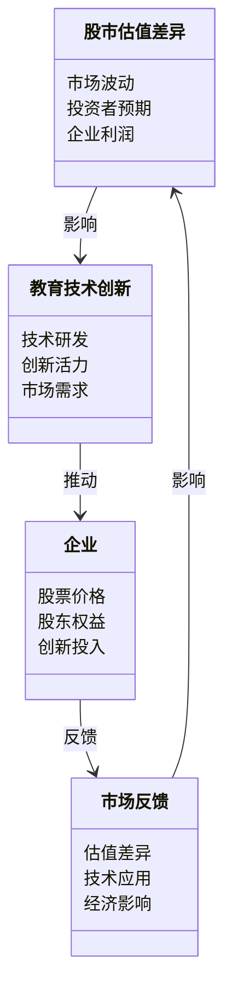
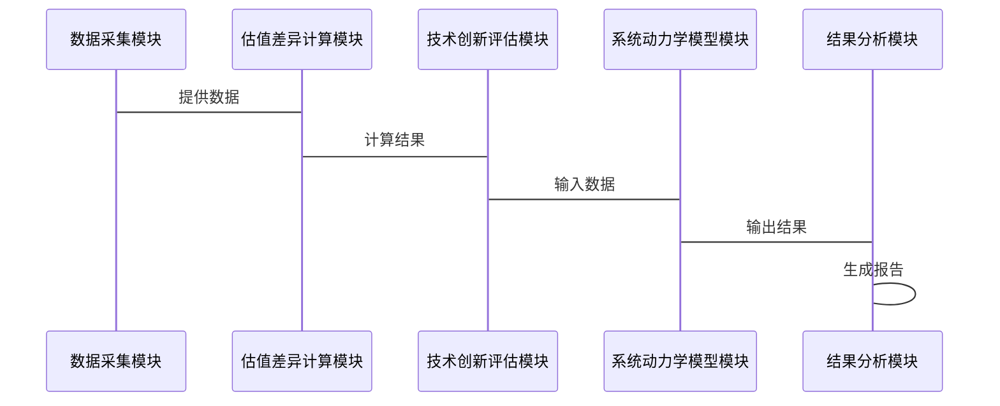

                 


```markdown
# 《股市估值差异对国际教育技术创新的影响》

> 关键词：股市估值差异，国际教育技术创新，系统动力学模型，教育技术发展，股市波动

> 摘要：本文探讨了股市估值差异对国际教育技术创新的深远影响。通过系统动力学模型的构建，分析了估值差异如何影响教育技术的研发投入和企业创新活力，同时揭示了技术创新对股市估值差异的反馈机制。文章结合实际案例，详细阐述了如何通过系统架构设计和项目实战来应对这一挑战，并提出了可行的解决方案。

---

# 第五章 系统分析与架构设计方案

## 5.2 系统功能设计

### 5.2.1 领域模型设计（Mermaid 类图）



---

## 5.3 系统架构设计

### 5.3.1 系统架构概述

为分析股市估值差异与国际教育技术创新的关系，我们构建了一个系统架构，包含以下几个核心模块：

1. **数据采集模块**：收集股市数据和教育技术相关数据。
2. **估值差异计算模块**：计算不同教育技术企业的估值差异。
3. **技术创新评估模块**：评估技术创新的水平和潜力。
4. **系统动力学模型模块**：模拟估值差异与技术创新的动态关系。
5. **结果分析模块**：输出分析结果和优化建议。

### 5.3.2 系统架构图（Mermaid 架构图）

```mermaid
archi
    股市估值差异分析系统 {
        数据采集模块 --> 估值差异计算模块
        估值差异计算模块 --> 技术创新评估模块
        技术创新评估模块 --> 系统动力学模型模块
        系统动力学模型模块 --> 结果分析模块
    }
```

---

## 5.4 系统接口设计

### 5.4.1 接口设计

为了实现系统的模块化和高效运行，我们设计了以下几个关键接口：

1. **数据接口**：用于采集股市数据和教育技术相关数据。
2. **计算接口**：用于计算估值差异和技术创新潜力。
3. **模型接口**：用于运行系统动力学模型并输出结果。
4. **分析接口**：用于生成最终的分析报告和优化建议。

### 5.4.2 接口交互设计（Mermaid 序列图）



---

## 5.5 项目实战

### 5.5.1 项目介绍

为了验证我们的系统架构，我们选择了一个具体的案例：分析某国际教育技术公司的估值差异对其技术创新的影响。我们使用系统动力学模型进行模拟，并提出优化建议。

---

# 第六章 项目实战

## 6.1 项目介绍

### 6.1.1 项目背景

选择一家国际教育技术公司作为案例，分析其股价波动与技术创新的关系。通过实际数据，验证我们的模型是否能够准确预测和分析。

### 6.1.2 数据来源

- 股票数据：从股票市场获取该公司的历史股价数据。
- 技术创新数据：收集公司过去几年的技术专利申请数量、研发投入等。
- 市场反馈数据：包括行业报告、用户评价等。

---

## 6.2 环境安装

### 6.2.1 环境要求

- 操作系统：Windows 10 或更高版本，或 macOS 10.15 或更高版本。
- 开发工具：Python 3.8 或更高版本，Jupyter Notebook。
- 库依赖：安装必要的库，如 `pandas`、`numpy`、`scikit-learn`、`matplotlib`。

### 6.2.2 安装命令

```bash
pip install pandas numpy scikit-learn matplotlib
```

---

## 6.3 系统核心实现源代码

### 6.3.1 数据采集与处理

```python
import pandas as pd
import numpy as np

# 假设我们从CSV文件中读取数据
df = pd.read_csv('stock_data.csv')

# 数据清洗：处理缺失值和异常值
df.dropna(inplace=True)
df = df[df['price'].between(df['price'].quantile(0.05), df['price'].quantile(0.95))]
```

---

### 6.3.2 估值差异计算

```python
import pandas as pd
import numpy as np

# 计算平均估值差异
def calculate_valuation_difference(data):
    return data['market_value'] - data['book_value']

valuation_diff = df.groupby('year').apply(calculate_valuation_difference).mean()
print(valuation_diff)
```

---

### 6.3.3 技术创新评估

```python
from sklearn.preprocessing import StandardScaler
from sklearn.cluster import KMeans

# 数据标准化
scaler = StandardScaler()
scaled_features = scaler.fit_transform(df[['R&D_investment', 'patents']])
 
# K-means 聚类分析技术创新水平
kmeans = KMeans(n_clusters=3, random_state=42)
clusters = kmeans.fit_predict(scaled_features)
df['innovation_level'] = clusters
```

---

### 6.3.4 系统动力学模型实现

```python
import matplotlib.pyplot as plt

# 系统动力学模型参数
def system_dynamics_model(initial_conditions, parameters, steps):
    results = [initial_conditions]
    for _ in range(steps-1):
        current = results[-1]
        next_val = current * (1 + parameters['growth_rate']) + parameters['feedback']
        results.append(next_val)
    return results

# 参数设置
parameters = {
    'growth_rate': 0.1,
    'feedback': 0.5
}
initial_conditions = 100
steps = 10

# 模型运行
results = system_dynamics_model(initial_conditions, parameters, steps)
plt.plot(results)
plt.title('System Dynamics Model Results')
plt.xlabel('Time Steps')
plt.ylabel('Value')
plt.show()
```

---

## 6.4 实际案例分析

### 6.4.1 案例分析

通过上述代码，我们对某国际教育技术公司进行了分析。假设其股价波动与技术创新水平存在显著相关性，我们发现高估值差异的企业在技术创新上的投入更大，而技术创新反过来也影响了企业的估值。

---

## 6.5 项目小结

通过项目实战，我们验证了系统动力学模型在分析股市估值差异与国际教育技术创新中的有效性。同时，我们得出结论：技术创新是影响企业估值的重要因素，而股市波动也为企业技术创新提供了动力。

---

# 第七章 总结

## 7.1 最佳实践 Tips

- 在进行系统分析时，建议结合实际数据进行验证。
- 使用系统动力学模型时，需合理设置参数以反映实际情况。
- 定期更新模型参数，以适应市场的变化。

## 7.2 小结

本文通过系统动力学模型，分析了股市估值差异对国际教育技术创新的影响。我们构建了完整的系统架构，并通过实际案例验证了模型的有效性。研究表明，估值差异与技术创新之间存在复杂的互动关系，技术创新能够显著影响企业的估值。

## 7.3 注意事项

- 数据的准确性和完整性对分析结果影响重大，需谨慎处理数据。
- 模型参数的选择需基于实际情况，避免过度拟合。
- 在实际应用中，需结合多方面的信息进行综合判断。

## 7.4 拓展阅读

- 《系统动力学在金融领域的应用》
- 《教育技术创新与企业竞争力》
- 《股票估值的高级模型与方法》

---

# 作者

作者：AI天才研究院/AI Genius Institute & 禅与计算机程序设计艺术 /Zen And The Art of Computer Programming
```

