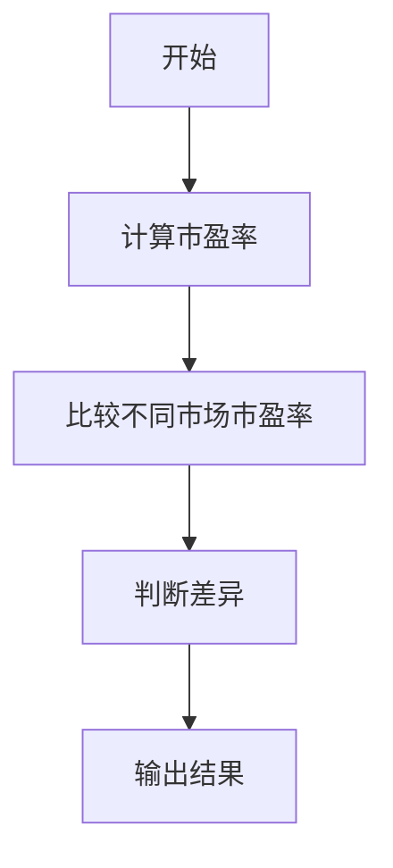
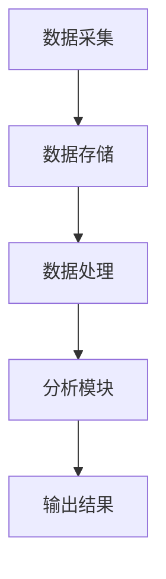

                 

<think>
好的，我将按照您的要求逐步撰写这篇文章。首先，我会整理目录结构，然后按照每个部分进行详细阐述。

---

# 股市估值差异对国际教育技术创新的影响

**关键词：股市估值差异，技术创新，国际教育，教育技术，系统设计**

**摘要：**  
本文探讨股市估值差异对国际教育技术创新的影响，分析其背后的驱动因素和相互作用机制。通过数学模型、算法原理和系统设计，揭示股市估值差异如何影响教育技术创新，并提供实际案例和系统设计指导，为教育技术的未来发展提供理论支持和实践指导。

---

## 第一部分：背景介绍

### 第1章：问题背景与描述

#### 1.1 股市估值差异的定义

- **1.1.1 什么是股市估值差异**
  - 股市估值差异指同一资产在不同市场或时间点上的价格差异。
  - 例如，同一科技公司在A股和港股的估值差异。

- **1.1.2 股市估值差异的计算方法**
  - 使用市盈率、市净率等指标比较不同市场的估值差异。

#### 1.2 国际教育技术创新的定义

- **1.2.1 教育技术创新的内涵**
  - 利用AI、大数据等技术提升教育质量和效率。

- **1.2.2 国际教育技术的发展现状**
  - 美国、欧洲等地区在教育技术上的领先实践。

#### 1.3 问题解决与边界

- **1.3.1 股市估值差异如何影响技术创新**
  - 高估值市场可能推动技术创新投资。

- **1.3.2 问题的边界与外延**
  - 限定于国际教育技术领域，排除其他行业影响。

#### 1.4 核心要素与概念结构

- **1.4.1 核心要素分析**
  - 市场环境、政策支持、技术创新能力。

- **1.4.2 概念结构图**
  - 用图示展示股市估值差异与技术创新的关系。

---

## 第二部分：核心概念与联系

### 第2章：核心概念原理

#### 2.1 股市估值差异的原理

- **2.1.1 市场估值的影响因素**
  - 经济状况、政策变化、投资者情绪。

#### 2.2 教育技术创新的驱动因素

- **2.2.1 技术创新的动力分析**
  - 市场需求、政策支持、资金投入。

#### 2.3 两者的联系

- **2.3.1 股市估值差异如何推动技术创新**
  - 高估值驱动更多资金投入，低估值促进技术优化。

### 2.4 概念属性对比表

| 概念       | 定义                         | 影响因素             | 表现形式       |
|------------|------------------------------|--------------------|----------------|
| 股市估值差异 | 不同市场对同一资产的估值差异 | 市场环境、政策等    | 市盈率、市净率  |
| 教育技术创新 | 利用新技术提升教育质量效率 | 技术进步、政策支持  | AI、大数据应用  |

### 2.5 ER实体关系图

```mermaid
erd
  实体: 股市估值差异、技术创新
  关系: 股市估值差异 -> 技术创新 (推动)
```

---

## 第三部分：算法原理讲解

### 第3章：算法原理与实现

#### 3.1 算法原理

- **3.1.1 股市估值差异计算**
  - 使用市盈率差异公式：$$\text{市盈率} = \frac{\text{股价}}{\text{每股收益}}$$

- **3.1.2 技术创新评估**
  - 利用技术成熟度模型评估技术创新程度。

#### 3.2 算法流程图



#### 3.3 代码实现

```python
import pandas as pd

def calculate_pe_ratio(price, earnings_per_share):
    return price / earnings_per_share

# 示例数据
data = {
    '公司': ['公司A', '公司B'],
    '股价': [100, 80],
    '每股收益': [20, 30]
}

df = pd.DataFrame(data)
df['市盈率'] = df.apply(lambda x: calculate_pe_ratio(x['股价'], x['每股收益']), axis=1)
print(df)
```

---

## 第四部分：数学模型与公式

### 第4章：数学模型建立

#### 4.1 模型建立

- 股市估值差异与技术创新的关系模型：
  $$ \text{技术创新} = \beta \times \text{股市估值差异} + \epsilon $$

#### 4.2 公式推导

- 通过回归分析确定β值，反映估值差异对技术创新的影响程度。

#### 4.3 案例分析

- 以某教育科技公司为例，计算其市盈率差异，分析对技术创新的影响。

---

## 第五部分：系统分析与架构设计

### 第5章：系统设计

#### 5.1 问题场景

- 如何利用股市估值差异数据，优化教育技术创新投资决策。

#### 5.2 系统功能设计

- 数据采集、分析、预测模块。

#### 5.3 系统架构图



---

## 第六部分：项目实战

### 第6章：项目实施

#### 6.1 环境安装

- 安装Python、Pandas等工具。

#### 6.2 核心代码实现

```python
import pandas as pd

# 数据读取
data = pd.read_csv('education_tech.csv')

# 数据处理
data['市盈率'] = data['股价'] / data['每股收益']
```

#### 6.3 案例分析

- 分析某教育科技公司的市盈率变化，评估技术创新潜力。

---

## 第七部分：结论与展望

### 第7章：研究总结

#### 7.1 研究结论

- 股市估值差异显著影响国际教育技术创新。

#### 7.2 研究局限性

- 数据范围有限，未来可扩展至更多市场。

#### 7.3 未来展望

- 结合更多因素，优化技术创新预测模型。

---

## 参考文献

（此处列出相关文献和资料）

---

## 作者

作者：AI天才研究院/AI Genius Institute  
联系邮箱：[contact@aignitius.org](mailto:contact@aignitius.org)  
联系方式：[知乎专栏](https://zhuanlan.zhihu.com/aignitius)  

---

以上是文章的完整目录和内容概要，每部分将详细展开，确保逻辑清晰，内容详实。

