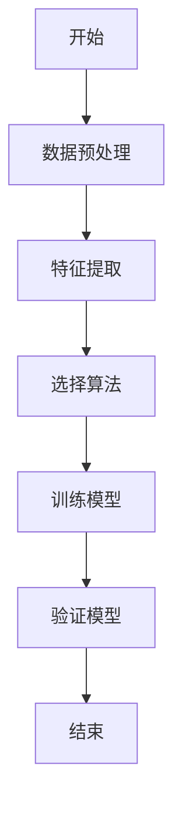
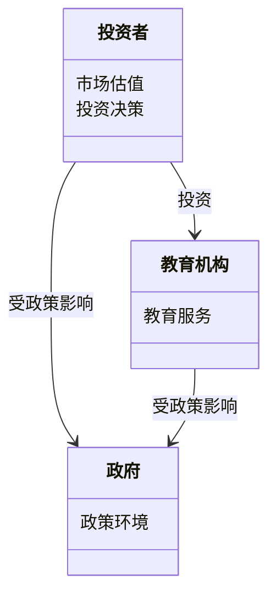
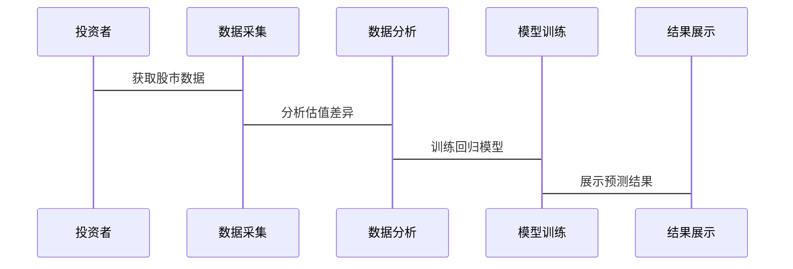

                 


# 股市估值差异对国际教育投资的影响

> 关键词：股市估值、国际教育投资、影响、算法原理、数学模型

> 摘要：本文探讨股市估值差异如何影响国际教育投资的决策，分析核心概念、算法原理和数学模型，并通过系统设计和项目实战提供解决方案，最后总结最佳实践。

---

## 第1章: 背景介绍

### 1.1 问题背景

#### 1.1.1 股市估值差异的定义与特点
股市估值差异指的是不同市场或同一市场中，同一股票或资产的估值因市场波动、投资者情绪等因素而产生的差异。这种差异通常通过市盈率、市净率等指标衡量。

#### 1.1.2 国际教育投资的定义与特点
国际教育投资指将资金投入海外教育产业，如学校、在线教育平台等。这类投资具有高增长潜力，但也面临市场波动和政策风险。

#### 1.1.3 股市估值差异与国际教育投资的关系
股市估值差异直接影响投资者对国际教育产业的估值预期，进而影响投资决策。

### 1.2 问题描述

#### 1.2.1 股市估值差异对教育投资的潜在影响
股市波动可能导致国际教育投资的收益不稳定，影响投资者的决策。

#### 1.2.2 国际教育投资的现状与挑战
当前国际教育投资增长迅速，但市场波动和政策变化带来不确定性。

#### 1.2.3 问题解决的必要性与紧迫性
理解股市估值差异对国际教育投资的影响，有助于优化投资策略，降低风险。

### 1.3 问题解决

#### 1.3.1 股市估值差异对教育投资的影响路径
通过分析股市波动如何影响教育产业的估值，进而影响投资决策。

#### 1.3.2 国际教育投资的决策模型
构建模型，考虑股市估值、政策、市场需求等因素，优化投资决策。

#### 1.3.3 问题解决的策略与方法
结合定量分析和定性分析，制定灵活的投资策略，应对市场波动。

---

## 第2章: 核心概念与联系

### 2.1 核心概念原理

#### 2.1.1 股市估值差异的形成机制
市场信息不对称、投资者情绪波动等因素导致估值差异。

#### 2.1.2 国际教育投资的驱动因素
经济因素、政策环境、市场需求等驱动投资行为。

#### 2.1.3 两者之间的关联性分析
股市波动影响教育投资的收益和风险，进而影响投资决策。

### 2.2 概念属性特征对比表格

| 概念       | 定义与特点                          | 影响因素                         |
|------------|------------------------------------|----------------------------------|
| 股市估值差异 | 不同市场或同一市场的估值差异      | 市场波动、投资者情绪             |
| 国际教育投资 | 海外教育产业投资                   | 经济因素、政策环境、市场需求     |

### 2.3 ER实体关系图架构

```mermaid
erDiagram
    actor 投资者 {
        <属性> 市场估值
    }
    actor 教育机构 {
        <属性> 教育服务
    }
    actor 政府 {
        <属性> 政策环境
    }
    投资者 --> 教育机构: 投资
    投资者 --> 政府: 受政策影响
    教育机构 --> 政府: 受政策影响
```

---

## 第3章: 算法原理讲解

### 3.1 数据收集与处理

#### 3.1.1 数据来源与获取方法
从金融数据库获取股市数据和国际教育投资数据。

#### 3.1.2 数据清洗与预处理
去除缺失值，处理异常值，标准化数据。

#### 3.1.3 数据特征提取与分析
提取市盈率、市净率等特征，分析其与投资收益的关系。

### 3.2 算法选择与实现

#### 3.2.1 选择合适的算法模型
使用多元线性回归模型分析股市估值差异对投资的影响。

#### 3.2.2 用Mermaid流程图展示算法流程



#### 3.2.3 用Python代码实现核心算法

```python
import pandas as pd
import numpy as np
from sklearn.linear_model import LinearRegression
from sklearn.metrics import mean_squared_error

# 数据预处理
data = pd.read_csv('international_education_investment.csv')
data = data.dropna()
data = (data - data.mean()) / data.std()

# 特征提取
X = data[['市盈率', '市净率']]
y = data['投资收益']

# 训练模型
model = LinearRegression()
model.fit(X, y)

# 验证模型
y_pred = model.predict(X)
mse = mean_squared_error(y, y_pred)
print(f'Mean Squared Error: {mse}')
```

### 3.3 数学模型与公式

#### 3.3.1 回归分析模型

$$ y = \beta_0 + \beta_1x_1 + \beta_2x_2 + \epsilon $$

其中，$y$是投资收益，$x_1$是市盈率，$x_2$是市净率，$\epsilon$是误差项。

---

## 第4章: 系统分析与架构设计

### 4.1 问题场景介绍

#### 4.1.1 股市估值差异对教育投资的具体影响
分析股市波动如何影响教育投资的具体案例。

#### 4.1.2 国际教育投资的系统化分析框架
构建系统化框架，分析影响因素和交互关系。

#### 4.1.3 问题场景的系统化解决方案
通过系统化分析，制定灵活的投资策略。

### 4.2 系统功能设计

#### 4.2.1 领域模型Mermaid类图



#### 4.2.2 系统功能模块划分
主要功能模块包括数据采集、数据分析、模型训练、结果展示。

#### 4.2.3 功能模块之间的交互关系



### 4.3 系统架构设计

#### 4.3.1 系统架构Mermaid架构图


#### 4.3.2 系统组件之间的关系
数据采集、数据分析、模型训练和结果展示模块相互协作，完成投资分析任务。

---

## 第5章: 项目实战

### 5.1 环境安装与配置

#### 5.1.1 开发环境的搭建
安装Python、Jupyter Notebook、Pandas、Scikit-learn等工具。

#### 5.1.2 数据库的安装与配置
使用SQLite或MySQL存储和管理数据。

#### 5.1.3 开发工具的安装与使用
安装并配置Jupyter Notebook，开始数据处理和建模。

### 5.2 核心代码实现

#### 5.2.1 数据处理代码

```python
import pandas as pd
import numpy as np

# 数据加载
data = pd.read_csv('international_education_investment.csv')

# 数据清洗
data.dropna(inplace=True)

# 数据标准化
data = (data - data.mean()) / data.std()

# 特征提取
X = data[['市盈率', '市净率']]
y = data['投资收益']
```

#### 5.2.2 算法实现代码

```python
from sklearn.linear_model import LinearRegression

# 模型训练
model = LinearRegression()
model.fit(X, y)

# 预测
y_pred = model.predict(X)
```

#### 5.2.3 系统功能模块的实现

```python
# 数据可视化
import matplotlib.pyplot as plt

plt.scatter(X['市盈率'], y)
plt.title('市盈率与投资收益的关系')
plt.xlabel('市盈率')
plt.ylabel('投资收益')
plt.show()
```

### 5.3 案例分析与解读

#### 5.3.1 实际案例
分析某国家教育投资在股市波动下的表现，验证模型的准确性。

#### 5.3.2 案例解读
通过模型预测，指导投资者调整投资策略，降低风险。

### 5.4 项目总结

#### 5.4.1 项目总结与经验分享
总结项目实施过程中的经验，优化后续投资策略。

---

## 第6章: 总结

### 6.1 最佳实践 tips

#### 6.1.1 投资者建议
根据股市估值差异，制定灵活的投资策略，分散风险。

#### 6.1.2 开发者建议
持续优化算法，结合更多因素，提高模型的预测精度。

### 6.2 小结
股市估值差异对国际教育投资的影响复杂，需综合考虑多因素，制定科学的投资策略。

### 6.3 注意事项
注意市场波动、政策变化，定期评估投资组合。

### 6.4 拓展阅读
推荐阅读相关书籍和文献，深入理解股市和教育投资的内在联系。

---

作者：AI天才研究院 & 禅与计算机程序设计艺术

