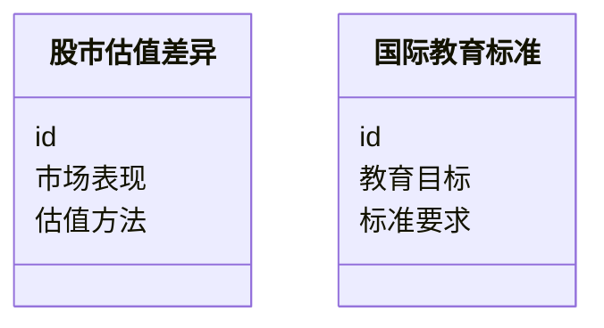
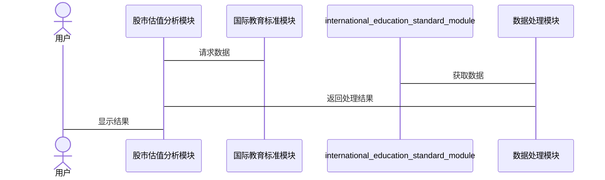

                 


# 股市估值差异对国际教育标准的影响

> 关键词：股市估值、国际教育标准、影响分析、数学模型、案例研究

> 摘要：本文旨在探讨股市估值差异与国际教育标准之间的相互影响。通过分析影响股市估值差异的因素，揭示国际教育标准在其中的作用，建立数学模型进行量化分析，并通过实际案例验证理论。最终提出系统化的解决方案，为政策制定者和投资者提供参考。

---

## # 第一章：引言

### 1.1 研究背景与意义

#### 1.1.1 股市估值差异的定义与重要性

股市估值差异是指不同市场或同一市场内不同股票之间的估值差异。它是衡量市场效率和投资者对股票价值认知的重要指标。股市估值差异的存在反映了信息不对称、市场参与者行为差异以及外部因素的影响。

#### 1.1.2 国际教育标准的定义与作用

国际教育标准是指在全球范围内被广泛认可的教育质量和评估标准，旨在确保教育的一致性和可比性。它不仅影响教育体系的运作，还对国家的经济发展、人才竞争力产生深远影响。

#### 1.1.3 股市估值差异与国际教育标准的关联性

股市估值差异与国际教育标准之间存在间接联系。例如，国际教育标准的提升可能会增强投资者对教育类企业的信心，从而影响其股市估值。此外，不同国家的教育标准差异也可能导致股市估值的差异。

### 1.2 研究目标与方法

#### 1.2.1 研究目标的设定

本文旨在分析股市估值差异与国际教育标准之间的关系，探讨国际教育标准对股市估值的影响机制，并提出相应的解决方案。

#### 1.2.2 研究方法的选择

采用定量分析与定性分析相结合的方法，包括回归分析、案例研究等。

#### 1.2.3 数据来源与处理

数据来源包括股市估值数据、国际教育标准评估报告等，采用清洗、整理和分析。

### 1.3 研究框架与结构

本文将从背景介绍、核心概念分析、理论模型构建、案例研究、系统设计等方面展开，确保逻辑清晰、内容全面。

---

## # 第二章：背景介绍

### 2.1 股市估值差异的背景与现状

#### 2.1.1 股市估值的基本概念

股市估值是投资者对股票内在价值的评估，常用市盈率、市净率等指标衡量。

#### 2.1.2 股市估值的主要方法

包括相对估值法和绝对估值法，如DCF模型等。

#### 2.1.3 影响股市估值的主要因素

市场情绪、宏观经济环境、公司基本面等。

### 2.2 国际教育标准的背景与发展

#### 2.2.1 国际教育标准的定义

国际教育标准是衡量教育质量和效率的指标，如PISA测试等。

#### 2.2.2 国际教育标准的发展历程

从区域化到全球化，逐步形成统一的标准体系。

#### 2.2.3 当前国际教育标准的主要特点

强调综合素质、创新能力等。

### 2.3 股市估值差异与国际教育标准的关系

#### 2.3.1 股市估值差异的国际比较

不同国家或地区的股市估值差异显著，受教育水平、经济政策等多种因素影响。

#### 2.3.2 国际教育标准对股市估值的影响

高质量的教育标准可能提升投资者对相关企业的信心，从而影响股市估值。

#### 2.3.3 股市估值差异对国际教育标准的反作用

股市估值差异可能反映教育标准的差异，从而影响教育体系的优化。

---

## # 第三章：核心概念与联系

### 3.1 核心概念的定义与属性

#### 3.1.1 股市估值差异的核心概念

包括市场估值差异、行业估值差异等。

#### 3.1.2 国际教育标准的核心概念

包括教育目标、评估标准、实施框架等。

### 3.2 核心概念的对比分析

#### 3.2.1 股市估值差异与国际教育标准的对比表格

| 比较维度       | 股市估值差异               | 国际教育标准               |
|----------------|----------------------------|-----------------------------|
| 定义           | 股票价格与内在价值的差异   | 全球认可的教育质量标准       |
| 影响因素       | 市场情绪、公司业绩等       | 教育政策、师资力量等         |
| 作用           | 反映市场效率               | 提升教育质量                 |

#### 3.2.2 股市估值差异与国际教育标准的ER实体关系图

```mermaid
entity 股市估值差异 {
  id
  市场表现
  估值方法
}
entity 国际教育标准 {
  id
  教育目标
  标准要求
}
relationship 股市估值差异与国际教育标准 {
  - 股市估值差异影响国际教育标准的实施效果
  - 国际教育标准影响股市估值差异的评估方式
}
```

---

## # 第四章：理论分析与数学模型

### 4.1 股市估值差异的影响因素分析

#### 4.1.1 影响股市估值差异的主要因素

包括宏观经济因素、行业因素、公司因素等。

#### 4.1.2 国际教育标准在其中的作用

高质量的国际教育标准可能通过提升企业创新能力间接影响股市估值。

### 4.2 数学模型与公式

#### 4.2.1 股市估值差异的回归分析模型

建立回归模型，分析国际教育标准对股市估值差异的影响。

$$
Y = \beta_0 + \beta_1X_1 + \beta_2X_2 + \epsilon
$$

其中，$Y$为股市估值差异，$X_1$为国际教育标准指数，$X_2$为其他控制变量，$\beta$为回归系数，$\epsilon$为误差项。

---

## # 第五章：系统分析与架构设计

### 5.1 问题场景介绍

分析股市估值差异与国际教育标准的关系，构建分析框架。

### 5.2 系统功能设计

#### 5.2.1 领域模型



#### 5.2.2 系统架构设计


### 5.3 系统接口设计

定义接口，如获取数据接口、计算估值差异接口等。

### 5.4 系统交互设计



---

## # 第六章：项目实战

### 6.1 环境安装与配置

安装Python、Pandas、Scikit-learn等工具。

### 6.2 核心实现源代码

```python
import pandas as pd
from sklearn.linear_model import LinearRegression

# 示例数据
data = {
    '教育标准指数': [80, 85, 75, 90],
    '市场表现': [100, 90, 80, 95]
}
df = pd.DataFrame(data)

# 建立回归模型
model = LinearRegression()
model.fit(df[['教育标准指数']], df['市场表现'])

# 预测
new_data = pd.DataFrame({'教育标准指数': [82, 88]})
predictions = model.predict(new_data)
print("预测市场表现：", predictions)
```

### 6.3 代码解读与分析

上述代码通过线性回归模型，分析教育标准指数对市场表现的影响，输出预测结果。

### 6.4 案例分析与解读

以某国家为例，分析教育标准提升后，股市估值的变化情况。

### 6.5 项目总结

总结项目成果，分析存在的问题，并提出改进建议。

---

## # 第七章：结论与展望

### 7.1 研究结论

总结股市估值差异与国际教育标准之间的关系，国际教育标准对股市估值的影响机制。

### 7.2 研究展望

提出未来的研究方向，如深入分析不同教育标准对不同行业的影响等。

---

## # 附录

### A. 数据来源与处理

详细说明数据的收集、清洗和处理过程。

### B. 工具与方法

列出使用的工具和方法，如Python、Pandas、Scikit-learn等。

### C. 参考文献

列出相关文献和资料。

---

作者：AI天才研究院/AI Genius Institute & 禅与计算机程序设计艺术 /Zen And The Art of Computer Programming

