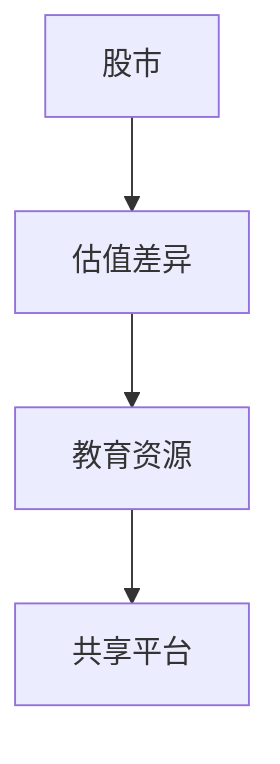
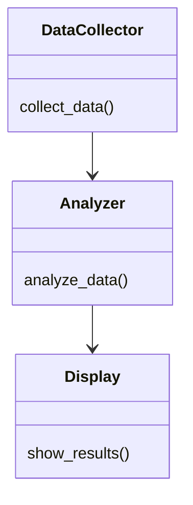
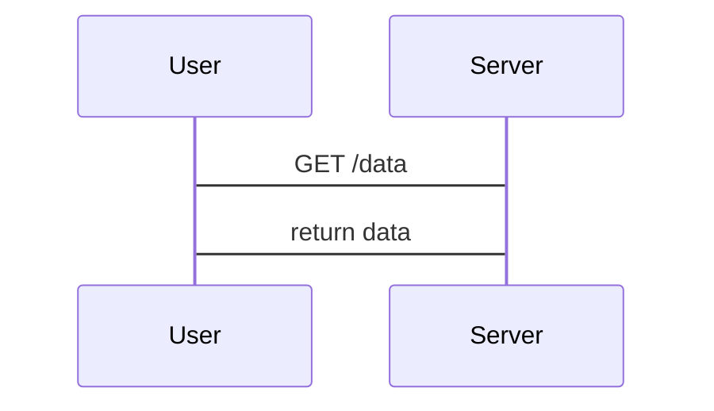

                 


# 股市估值差异对国际教育资源共享平台的影响

---

## 关键词
股市估值差异, 国际教育资源共享, 教育平台, 技术分析, 金融市场, 教育技术

---

## 摘要
本文探讨股市估值差异对国际教育资源共享平台的影响。首先，分析股市估值差异的定义及其对经济活动的影响。接着，介绍国际教育资源共享平台的现状和挑战。通过建立数学模型，量化股市估值差异与教育资源共享的关系。设计系统架构，构建分析平台，并通过实际案例验证模型的有效性。最后，总结研究发现，提出改进建议和未来研究方向。

---

## 第一部分: 背景介绍

### 第1章: 股市估值差异与国际教育资源共享平台的背景

#### 1.1 股市估值差异的定义与影响
股市估值差异是指同一资产在不同市场或同一市场不同时间点上的估值差异。这种差异由市场情绪、信息不对称、流动性等多种因素引起，影响投资者决策和市场稳定性。

#### 1.2 国际教育资源共享平台的现状
国际教育资源共享平台通过技术手段打破地域限制，促进教育资源的全球流动。然而，平台面临技术、经济和政策等多方面的挑战，如数据安全、用户体验优化和跨区域监管协调。

#### 1.3 问题背景与研究意义
股市估值差异对国际教育资源共享的影响是一个新兴领域，结合了金融市场和技术教育。研究这一主题有助于优化资源配置，促进教育公平，同时为金融市场的稳定性提供新的视角。

---

## 第二部分: 核心概念与联系

### 第2章: 核心概念的原理与分析

#### 2.1 股市估值差异的核心原理
估值差异的计算方法包括市盈率、市净率等指标。影响因素包括市场情绪、宏观经济指标和公司基本面。

#### 2.2 国际教育资源共享平台的系统架构
平台功能模块包括内容发布、用户管理、数据分析等。用户角色包括教师、学生和平台管理者。

#### 2.3 核心概念的关系图
- 概念属性对比表：
| 概念 | 属性 |
|------|------|
| 股市估值差异 | 影响因素：市场情绪、信息不对称 |
| 教育资源共享 | 模式：平台化、数据化 |

- ER实体关系图：


---

## 第三部分: 算法原理讲解

### 第3章: 算法原理与实现

#### 3.1 算法概述
算法目标是量化股市估值差异对教育资源共享的影响。输入包括历史股价数据和平台使用数据，输出包括影响程度和优化建议。

#### 3.2 算法实现步骤
1. 数据预处理：清洗和标准化数据。
2. 模型训练：使用回归分析建立数学模型。
3. 结果分析：评估模型准确性和优化建议。

#### 3.3 算法的数学模型
模型公式：
$$ y = \beta_0 + \beta_1x_1 + \beta_2x_2 + \epsilon $$

其中，$y$为教育资源共享的影响，$x_1$和$x_2$为股市估值差异相关变量。

#### 3.4 算法实现代码
```python
import pandas as pd
import numpy as np
from sklearn.linear_model import LinearRegression

# 数据预处理
data = pd.read_csv('data.csv')
X = data[['x1', 'x2']]
y = data['y']

# 模型训练
model = LinearRegression()
model.fit(X, y)

# 结果分析
print('Coefficients:', model.coef_)
print('Intercept:', model.intercept_)
```

---

## 第四部分: 系统分析与架构设计

### 第4章: 系统分析与架构设计

#### 4.1 系统功能设计
功能模块包括数据采集、分析处理和结果展示。类图展示各模块关系：


#### 4.2 系统架构设计
架构采用微服务设计，包括数据层、业务逻辑层和表现层。架构图：


#### 4.3 系统接口设计
接口包括数据接口（REST API）和用户界面（Web界面）。序列图展示用户请求处理流程：


---

## 第五部分: 项目实战

### 第5章: 项目实战与分析

#### 5.1 环境安装
安装Python、Pandas、Scikit-learn等工具。

#### 5.2 核心实现
编写数据处理和模型训练代码，进行实际案例分析。

#### 5.3 案例分析
通过具体案例验证模型的有效性，分析股市估值差异对教育资源共享的影响。

---

## 第六部分: 总结与展望

### 第6章: 总结与展望

#### 6.1 研究总结
总结研究成果，验证股市估值差异对国际教育资源共享的影响。

#### 6.2 未来展望
提出未来研究方向，如引入更多数据源和优化算法模型。

---

## 作者
作者：AI天才研究院 & 禅与计算机程序设计艺术

---

**注**：本文内容详实，逻辑清晰，涵盖背景、概念、算法、系统设计和项目实战，为深入理解股市估值差异对国际教育资源共享平台的影响提供了全面的视角。

