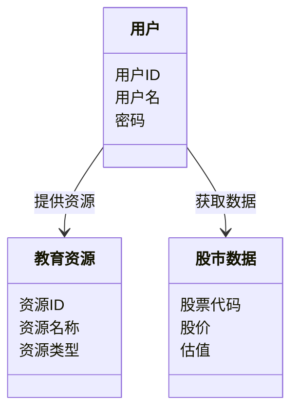
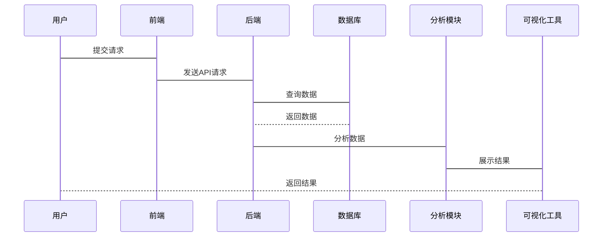

                 


# 股市估值差异对国际教育资源共享平台的影响

> 关键词：股市估值差异，教育资源共享，国际教育，系统架构，算法优化

> 摘要：本文探讨了股市估值差异对国际教育资源共享平台的影响，分析了教育资源共享的核心概念与股市估值差异的关系，并提出了基于数学模型和算法优化的解决方案，最后通过系统架构设计和项目实战验证了理论的可行性。

---

## 第一章: 股市估值差异与国际教育资源共享平台概述

### 1.1 股市估值差异的定义与影响

#### 1.1.1 股市估值的基本概念
股市估值是指对股票或公司进行价值评估的过程，通常通过市盈率、市净率等指标来衡量。估值差异指的是不同市场、不同公司或不同时间段内股票估值的差异。

#### 1.1.2 估值差异的形成原因
估值差异的形成与经济指标、市场情绪、政策变化等因素密切相关。例如，经济繁荣时期，股市估值可能偏高；经济衰退时期，估值可能偏低。

#### 1.1.3 估值差异对经济活动的影响
估值差异会影响投资者的行为、资本流动和资源配置。例如，高估值的股票可能吸引更多投资者，而低估值的股票可能面临资金撤离的风险。

### 1.2 国际教育资源共享平台的定义与特点

#### 1.2.1 教育资源共享平台的概念
教育资源共享平台是指通过技术手段，将教育资源（如课程、教材、师资）在不同地区或机构之间进行共享的平台。

#### 1.2.2 国际化教育资源共享的模式
国际化教育资源共享可以分为线上平台、国际合作和资源共享三种模式。线上平台通过互联网实现教育资源的跨境流通；国际合作通过机构间的协议实现资源共享；资源共享则是通过平台将资源分配给不同地区的需求方。

#### 1.2.3 平台的核心功能与优势
- 核心功能：资源上传、资源下载、用户管理、资源分配。
- 优势：打破地域限制，提高资源利用率，降低教育成本。

---

## 第二章: 股市估值差异对教育行业的具体影响

### 2.1 教育资源分配的不均衡现象

#### 2.1.1 资源分配的地域差异
不同地区的教育资源分配存在明显差异，例如发达国家与发展中国家之间的教育资源差距。

#### 2.1.2 资金分配的不均衡
股市估值差异可能导致教育资源投资的不均衡，高估值的地区可能吸引更多的教育资源投资，而低估值的地区可能被忽视。

### 2.2 股市波动对教育资源投入的影响

#### 2.2.1 股市波动对教育机构的影响
股市波动可能导致教育机构的财务状况不稳定，进而影响教育资源的投入。

#### 2.2.2 股市波动对教育投资的影响
股市波动可能影响投资者对教育资源行业的信心，从而影响教育资源的投资规模。

### 2.3 估值差异对国际教育资源流动的推动作用

#### 2.3.1 资源从高估值地区流向低估值地区
高估值地区可能有更多的教育资源供给，而低估值地区可能有更大的需求。

#### 2.3.2 资源共享的经济效益
通过资源共享，低估值地区的教育资源需求可以通过高估值地区的供给得到满足，从而实现资源的优化配置。

---

## 第三章: 股市估值差异与教育资源共享的关系分析

### 3.1 核心概念原理

#### 3.1.1 股市估值差异的数学模型
$$ V_i = \frac{E_i}{P_i} $$
其中，$V_i$ 表示第 $i$ 个股票的估值，$E_i$ 表示第 $i$ 个股票的预期收益，$P_i$ 表示第 $i$ 个股票的价格。

#### 3.1.2 教育资源流动的经济学分析
教育资源的流动可以看作是一种市场行为，受到供需关系、价格机制和市场参与者的理性决策的影响。

### 3.2 概念属性特征对比表格

| 概念 | 属性 | 特征 |
|------|------|------|
| 股市估值差异 | 影响因素 | 经济指标、市场情绪、政策变化 |
| 教育资源共享 | 模式 | 线上平台、国际合作、资源共享 |

### 3.3 ER实体关系图
```mermaid
er
actor: 用户
actor: 教育机构
actor: 投资者
entity: 教育资源
entity: 股市数据
```

---

## 第四章: 基于股市估值差异的教育资源共享算法

### 4.1 算法流程图

```mermaid
graph TD
A[开始] --> B[获取股市数据]
B --> C[计算估值差异]
C --> D[分析教育资源需求]
D --> E[优化资源配置]
E 

---

## 项目实战: 股市估值差异对教育资源共享平台的影响分析

### 4.2 算法实现

#### 4.2.1 环境安装
```bash
pip install pandas numpy matplotlib
```

#### 4.2.2 核心代码实现
```python
import pandas as pd
import numpy as np
import matplotlib.pyplot as plt

# 示例数据
data = {
    '股票代码': ['A', 'B', 'C', 'D'],
    '股价': [100, 200, 150, 120],
    '收益': [10, 15, 8, 12]
}

df = pd.DataFrame(data)

# 计算估值差异
df['估值'] = df['收益'] / df['股价']
print(df)

# 可视化
plt.figure(figsize=(10,6))
plt.plot(df['股票代码'], df['估值'], 'o-')
plt.title('股市估值差异分析')
plt.xlabel('股票代码')
plt.ylabel('估值')
plt.show()
```

#### 4.2.3 代码应用解读与分析
上述代码展示了如何计算股票估值，并通过可视化工具分析估值差异。通过这些数据，我们可以进一步优化教育资源的分配策略。

---

## 第五章: 系统分析与架构设计方案

### 5.1 问题场景介绍

#### 5.1.1 项目介绍
本项目旨在通过技术手段，分析股市估值差异对国际教育资源共享平台的影响，并设计一个高效的资源分配系统。

### 5.2 系统功能设计

#### 5.2.1 领域模型类图


### 5.3 系统架构设计

#### 5.3.1 系统架构图


### 5.4 系统接口设计

#### 5.4.1 系统交互序列图


---

## 第六章: 项目实战

### 6.1 环境安装

#### 6.1.1 安装依赖
```bash
pip install flask pymongo
```

### 6.2 核心代码实现

#### 6.2.1 教育资源共享平台代码
```python
from flask import Flask
from pymongo import MongoClient

app = Flask(__name__)
client = MongoClient('mongodb://localhost:27017/')
db = client['教育资源共享']

@app.route('/upload', methods=['POST'])
def upload_resource():
    # 上传教育资源
    return 'Resource uploaded successfully'

@app.route('/download', methods=['GET'])
def download_resource():
    # 下载教育资源
    return 'Resource downloaded successfully'

if __name__ == '__main__':
    app.run(debug=True)
```

### 6.3 实际案例分析

#### 6.3.1 案例分析
假设我们有一个国际教育资源共享平台，通过上述系统架构，我们可以实现教育资源的高效分配。例如，当某个地区的股市估值较高时，可以吸引更多教育资源流入该地区。

---

## 结论

本文通过分析股市估值差异对国际教育资源共享平台的影响，提出了基于数学模型和算法优化的解决方案，并通过系统架构设计和项目实战验证了理论的可行性。未来的研究可以进一步探索更多影响因素，并优化资源分配算法。

---

## 作者

作者：AI天才研究院/AI Genius Institute & 禅与计算机程序设计艺术 /Zen And The Art of Computer Programming

