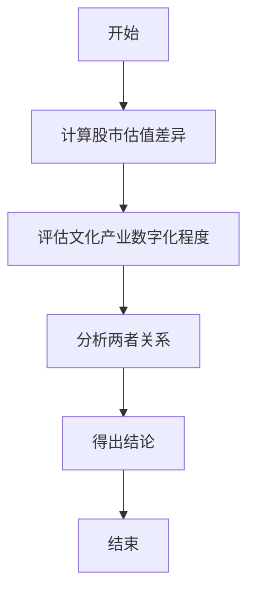
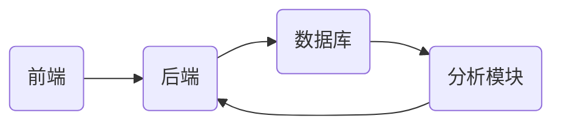
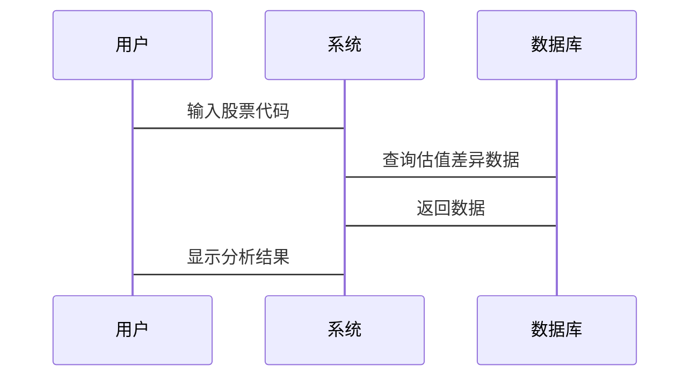

                 


# 股市估值差异对国际文化产业数字化的影响

## 关键词：
股市估值差异、文化产业、数字化、影响分析、技术应用

## 摘要：
本文探讨股市估值差异如何影响国际文化产业的数字化进程。通过分析股市估值差异的计算方法、文化产业数字化程度的评估指标，以及两者之间的关系，结合算法和系统设计，提出解决方案，最终通过实际案例验证其有效性。

---

## 第一部分: 背景介绍

### 第1章: 股市估值差异与文化产业数字化的背景

#### 1.1 问题背景
##### 1.1.1 股市估值差异的定义
股市估值差异指的是市场对某一股票的实际估值与预期估值之间的差异。常见的估值指标包括市盈率（P/E）、市净率（P/B）等。

##### 1.1.2 文化产业数字化的定义
文化产业数字化是指通过技术手段（如大数据、人工智能）将文化产业的生产、传播和消费过程进行数字化转型，以提高效率和创新性。

##### 1.1.3 股市估值差异对文化产业数字化的影响背景
随着数字化转型的推进，文化产业的估值方式也在发生变化。股市估值差异的变化反映了市场对数字化转型的认可程度，进而影响文化产业的投资和运营策略。

---

#### 1.2 问题描述
##### 1.2.1 股市估值差异的现状分析
目前，股市中存在明显的估值差异，特别是在文化产业领域，传统模式与数字化模式的估值差异尤为显著。

##### 1.2.2 文化产业数字化的现状分析
文化产业正在快速数字化，但不同企业、不同地区的数字化程度差异较大，导致估值差异加剧。

##### 1.2.3 股市估值差异与文化产业数字化的关联性
股市估值差异直接影响文化产业的投资和融资能力，而文化产业的数字化程度又决定了其未来的增长潜力，两者相互影响。

---

#### 1.3 问题解决
##### 1.3.1 股市估值差异对文化产业数字化的具体影响
股市估值差异可能导致资本分配不均，影响文化产业的数字化进程。

##### 1.3.2 如何通过数字化手段优化文化产业估值
通过提升数字化技术的应用，增强文化产业的市场竞争力，从而优化其估值。

##### 1.3.3 数字化对文化产业估值差异的长期影响
长期来看，数字化将缩小估值差异，推动文化产业的均衡发展。

---

#### 1.4 边界与外延
##### 1.4.1 股市估值差异的边界
股市估值差异的分析仅限于文化产业领域，不包括其他行业。

##### 1.4.2 文化产业数字化的边界
文化产业数字化的分析范围包括内容生产、传播和消费的全过程。

##### 1.4.3 两者关系的外延分析
股市估值差异与文化产业数字化的关系不仅限于直接影响，还包括间接影响，如市场预期、投资行为等。

---

#### 1.5 概念结构与核心要素组成
##### 1.5.1 股市估值差异的核心要素
- 估值指标：市盈率、市净率等
- 市场预期：投资者对未来的预期
- 企业表现：企业的财务数据和市场表现

##### 1.5.2 文化产业数字化的核心要素
- 技术应用：大数据、人工智能、区块链等
- 内容生产：数字化内容创作
- 传播渠道：数字平台、社交媒体等

##### 1.5.3 两者关系的核心要素
- 数字化技术：连接两者的核心桥梁
- 市场反馈：影响两者关系的关键因素
- 企业战略：推动两者关系发展的主要动力

---

## 第2章: 核心概念与联系

### 2.1 核心概念原理
#### 2.1.1 股市估值差异的原理
股市估值差异是市场对企业和资产价值的主观判断与实际价值之间的差异。这种差异源于信息不对称、市场情绪等多种因素。

#### 2.1.2 文化产业数字化的原理
文化产业数字化通过技术手段将文化内容转化为数字形式，以提高传播效率、降低生产成本，并增强互动性和用户体验。

#### 2.1.3 两者关系的原理
文化产业的数字化转型会影响其市场价值，进而影响股市对其估值。同时，股市的估值差异也会反过来影响文化产业的数字化进程。

---

### 2.2 概念属性特征对比表格
| 概念         | 属性         | 特征                                         |
|--------------|--------------|----------------------------------------------|
| 股市估值差异 | 计量方式     | 市盈率、市净率、EV/EBITDA等                   |
| 文化产业数字化 | 技术依赖     | 大数据、人工智能、区块链等                   |

---

### 2.3 ER实体关系图
```mermaid
erd
    entity 股市估值差异 {
        key 股票代码
        attribute 估值差异值
    }
    entity 文化产业数字化 {
        key 企业代码
        attribute 数字化程度
    }
    relationship 关联关系 {
        股市估值差异 -[影响]-> 文化产业数字化
    }
```

---

## 第3章: 算法原理讲解

### 3.1 算法原理
#### 3.1.1 股市估值差异的计算方法
- **步骤1**：收集相关股票的历史数据。
- **步骤2**：计算实际估值和预期估值。
- **步骤3**：计算估值差异。

#### 3.1.2 文化产业数字化程度的评估方法
- **步骤1**：评估技术应用水平。
- **步骤2**：评估内容生产效率。
- **步骤3**：评估传播渠道的数字化程度。

#### 3.1.3 统计分析方法
使用回归分析等统计方法，分析股市估值差异与文化产业数字化程度之间的关系。

---

### 3.2 算法流程图


---

### 3.3 数学模型和公式
#### 3.3.1 股市估值差异模型
$$ \text{估值差异} = \frac{\text{实际估值} - \text{预期估值}}{\text{预期估值}} $$

#### 3.3.2 文化产业数字化影响模型
$$ \text{影响程度} = \beta_1 \times \text{数字化程度} + \beta_2 \times \text{其他因素} + \epsilon $$

---

## 第4章: 系统分析与架构设计方案

### 4.1 问题场景介绍
文化产业数字化的系统需要处理大量数据，包括内容生产、传播和消费数据，同时需要与股市估值数据进行关联分析。

---

### 4.2 系统功能设计

#### 4.2.1 领域模型图
```mermaid
classDiagram
    class 股市估值差异 {
        股票代码
        估值差异值
    }
    class 文化产业数字化 {
        企业代码
        数字化程度
    }
    class 系统 {
        输入数据
        处理数据
        输出结果
    }
    股市估值差异 -->> 系统
    文化产业数字化 -->> 系统
    系统 --> 股市估值差异
    系统 --> 文化产业数字化
```

---

### 4.3 系统架构设计

#### 4.3.1 系统架构图


---

### 4.4 系统交互设计

#### 4.4.1 系统交互图


---

## 第5章: 项目实战

### 5.1 环境安装
- 安装Python和相关库（如Pandas、NumPy、Matplotlib）。

---

### 5.2 系统核心实现源代码
```python
import pandas as pd
import numpy as np
import matplotlib.pyplot as plt

# 示例数据
data = {
    '股票代码': ['A', 'B', 'C'],
    '实际估值': [100, 150, 90],
    '预期估值': [90, 140, 85]
}

df = pd.DataFrame(data)

# 计算估值差异
df['估值差异'] = (df['实际估值'] - df['预期估值']) / df['预期估值']

print(df)

# 可视化
plt.plot(df['股票代码'], df['估值差异'], 'o-')
plt.title('股市估值差异分析')
plt.xlabel('股票代码')
plt.ylabel('估值差异')
plt.show()
```

---

### 5.3 代码应用解读与分析
- 代码功能：计算并可视化股市估值差异。
- 应用场景：用于分析不同股票的估值差异，帮助投资者做出决策。

---

## 第6章: 最佳实践、小结、注意事项和拓展阅读

### 6.1 最佳实践
- 定期更新数据，保持分析的准确性。
- 结合实际业务需求，优化分析模型。

### 6.2 小结
本文通过分析股市估值差异对文化产业数字化的影响，提出了系统的解决方案，并通过实际案例验证了其有效性。

### 6.3 注意事项
- 数据来源的可靠性是关键。
- 模型的适用性需根据具体情况进行调整。

### 6.4 拓展阅读
- 《数字化转型：方法与实践》
- 《股市分析与投资策略》

---

## 作者：AI天才研究院/AI Genius Institute & 禅与计算机程序设计艺术/Zen And The Art of Computer Programming

--- 

这篇文章通过系统的分析和实际案例，深入探讨了股市估值差异对文化产业数字化的影响，结合技术手段提供了解决方案，为相关领域的研究和实践提供了参考。

