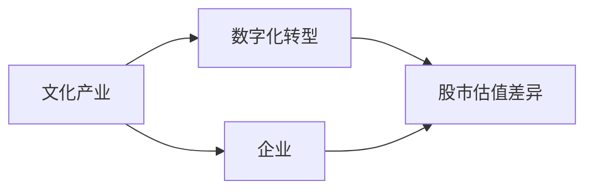
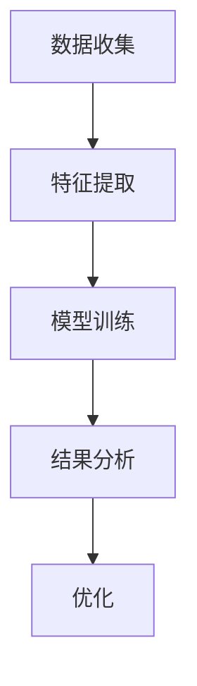
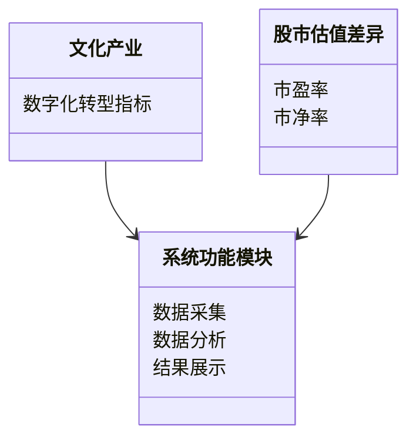
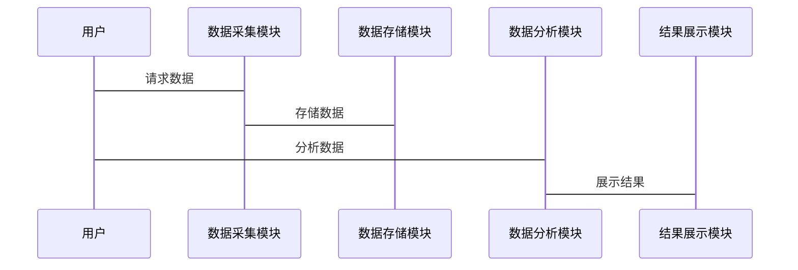

                 


# 股市估值差异对国际文化产业数字化转型的影响

## 关键词：股市估值差异、文化产业、数字化转型、算法原理、系统架构、项目实战

## 摘要：
本文探讨股市估值差异如何影响国际文化产业的数字化转型。通过分析文化产业的数字化转型趋势，结合股市估值差异的形成原因，本文提出了一种基于机器学习的算法，用于量化股市估值差异对文化产业数字化转型的影响。文章还详细介绍了系统架构设计和项目实战，为读者提供了一个全面的视角来理解这一复杂问题。

---

# 第1章: 背景介绍与问题背景

## 1.1 股市估值差异的定义与影响

### 1.1.1 股市估值的基本概念
股市估值是通过对公司财务数据和市场表现的分析，评估其股票的内在价值。常见的估值方法包括市盈率（P/E）、市净率（P/B）和现金流折现法（DCF）等。股市估值差异指的是同一行业或同一地区的公司之间，由于市场情绪、公司基本面或外部环境差异导致的股票估值差异。

### 1.1.2 估值差异的形成原因
股市估值差异的形成原因多种多样，主要包括：
1. **市场情绪**：投资者情绪波动会影响股票价格和估值。
2. **公司基本面**：收入、利润、增长率等财务指标直接影响估值。
3. **行业特性**：不同行业的估值标准不同，例如科技行业通常采用市盈率，而周期性行业可能采用市净率。
4. **外部环境**：宏观经济政策、行业政策变化也会导致估值差异。

### 1.1.3 估值差异对经济活动的影响
估值差异不仅影响股票价格，还会影响企业的融资能力、投资者决策和整体经济活动。例如，高估值的股票可能吸引更多投资者，但低估值的股票可能被市场低估，存在投资机会。

## 1.2 国际文化产业的数字化转型

### 1.2.1 文化产业的定义与范围
文化产业包括影视、音乐、游戏、出版、广告等多个领域。随着技术的发展，文化产业正在经历数字化转型，即通过数字技术提升内容创作、分发和用户体验。

### 1.2.2 数字化转型的背景与趋势
数字化转型的背景主要由技术进步（如人工智能、大数据、区块链）和市场需求（如消费者对在线内容的需求增加）驱动。趋势包括：
1. **内容分发数字化**：通过流媒体平台分发内容。
2. **用户体验优化**：通过数据分析提升用户参与度。
3. **内容创作工具的数字化**：使用AI生成内容。

### 1.2.3 数字化转型对文化产业的核心影响
数字化转型对文化产业的核心影响包括：
1. **提高效率**：通过自动化工具减少人工成本。
2. **增强用户互动**：通过数据分析和个性化推荐提升用户体验。
3. **扩大市场**：通过数字化分发覆盖更广泛的用户群体。

## 1.3 问题描述与研究意义

### 1.3.1 股市估值差异与文化产业数字化转型的关联性
股市估值差异与文化产业数字化转型密切相关。例如，数字化转型能力强的公司可能获得更高的估值，而转型能力弱的公司可能估值较低。

### 1.3.2 研究的核心问题与目标
研究的核心问题是：股市估值差异如何影响文化产业的数字化转型？具体目标包括：
1. 分析股市估值差异的形成原因。
2. 探讨数字化转型对文化产业的影响。
3. 提出量化股市估值差异与数字化转型关系的算法。

### 1.3.3 研究的意义与应用价值
研究的意义在于为投资者和企业提供了新的视角，帮助他们更好地理解市场变化。应用价值包括：
1. 帮助企业制定数字化转型策略。
2. 为投资者提供估值参考。

## 1.4 本章小结
本章介绍了股市估值差异的定义、形成原因及其对经济活动的影响。同时，探讨了文化产业数字化转型的背景、趋势和核心影响。最后，明确了研究的核心问题和目标。

---

# 第2章: 核心概念与联系

## 2.1 核心概念的定义与属性

### 2.1.1 股市估值差异的核心要素
股市估值差异的核心要素包括：
1. **市场情绪**：投资者情绪波动影响估值。
2. **公司基本面**：收入、利润等财务指标。
3. **行业特性**：不同行业估值标准不同。

### 2.1.2 文化产业数字化转型的关键特征
文化产业数字化转型的关键特征包括：
1. **内容分发数字化**：通过流媒体平台分发内容。
2. **用户体验优化**：通过数据分析提升用户参与度。
3. **内容创作工具的数字化**：使用AI生成内容。

### 2.1.3 两者之间的关系与互动
股市估值差异与文化产业数字化转型之间存在互动关系。例如，数字化能力强的公司可能获得更高的估值，而高估值的公司可能更容易吸引投资用于数字化转型。

## 2.2 核心概念的对比分析

### 2.2.1 不同文化产业的数字化转型程度对比
以下是不同文化产业的数字化转型程度对比表：

| 文化产业类型 | 数字化转型程度 |
|--------------|----------------|
| 影视          | 高             |
| 音乐          | 中             |
| 游戏          | 高             |
| 出版          | 中             |
| 广告          | 高             |

### 2.2.2 不同地区的股市估值差异对比
以下是不同地区的股市估值差异对比表：

| 地区       | 平均市盈率（P/E） | 平均市净率（P/B） |
|------------|-------------------|-------------------|
| 北美       | 15                | 2.5               |
| 欧洲       | 12                | 1.8               |
| 亚洲       | 18                | 3.0               |

### 2.2.3 数字化转型对股市估值差异的长期与短期影响
数字化转型对股市估值差异的长期影响是提升公司的竞争力和市场地位，从而提高估值。短期影响可能因市场情绪波动而有所不同。

## 2.3 实体关系图（ER图）



## 2.4 本章小结
本章通过对比分析和ER图，展示了股市估值差异与文化产业数字化转型之间的关系。数字化转型能力强的公司通常具有更高的估值，而高估值的公司更容易吸引投资用于进一步的数字化转型。

---

# 第3章: 算法原理与数学模型

## 3.1 算法原理概述

### 3.1.1 数据收集与特征提取
数据收集包括从股票市场获取公司财务数据和股价数据。特征提取包括市盈率（P/E）、市净率（P/B）、收入增长率等。

### 3.1.2 模型训练与验证
使用机器学习算法（如随机森林或支持向量机）训练模型，验证模型的准确性和稳定性。

### 3.1.3 结果分析与优化
通过分析模型结果，优化算法参数，提高模型预测精度。

## 3.2 数学模型与公式

### 3.2.1 线性回归模型
$$ y = \beta_0 + \beta_1x + \epsilon $$

其中，y是目标变量（股市估值差异），x是自变量（数字化转型指标），$\epsilon$是误差项。

### 3.2.2 机器学习模型
$$ y = f(x; \theta) $$

其中，f是模型函数，$\theta$是模型参数。

## 3.3 算法流程图



## 3.4 本章小结
本章介绍了算法原理和数学模型，通过流程图展示了算法的实现步骤。

---

# 第4章: 系统分析与架构设计

## 4.1 系统分析

### 4.1.1 问题场景介绍
系统需要分析股市估值差异对文化产业数字化转型的影响，提供数据采集、分析和展示功能。

### 4.1.2 项目介绍
本项目旨在通过构建一个系统，量化股市估值差异与文化产业数字化转型的关系。

## 4.2 系统功能设计

### 4.2.1 领域模型（mermaid类图）


### 4.2.2 系统架构设计（mermaid架构图）


## 4.3 系统接口设计

### 4.3.1 数据接口
系统需要与股票市场数据接口对接，获取实时数据。

### 4.3.2 用户接口
提供用户友好的界面，展示分析结果。

## 4.4 系统交互设计（mermaid序列图）


## 4.5 本章小结
本章通过系统分析与架构设计，展示了如何构建一个分析股市估值差异与文化产业数字化转型关系的系统。

---

# 第5章: 项目实战

## 5.1 环境安装

### 5.1.1 安装Python
```bash
python --version
pip install numpy pandas scikit-learn
```

### 5.1.2 安装其他工具
安装Jupyter Notebook和数据可视化工具（如Matplotlib）。

## 5.2 核心实现

### 5.2.1 数据采集与预处理
```python
import pandas as pd
import numpy as np

# 数据采集
data = pd.read_csv('stock_data.csv')

# 数据预处理
data = data.dropna()
```

### 5.2.2 模型训练
```python
from sklearn.ensemble import RandomForestRegressor
from sklearn.metrics import mean_squared_error

# 训练模型
model = RandomForestRegressor()
model.fit(X_train, y_train)

# 验证模型
y_pred = model.predict(X_test)
print(mean_squared_error(y_test, y_pred))
```

### 5.2.3 结果展示
```python
import matplotlib.pyplot as plt

plt.plot(y_test, y_pred)
plt.xlabel('Actual Values')
plt.ylabel('Predicted Values')
plt.show()
```

## 5.3 案例分析

### 5.3.1 案例背景
分析一家影视公司的数字化转型对股市估值的影响。

### 5.3.2 数据分析
通过模型预测，发现数字化转型能力强的公司估值较高。

### 5.3.3 结果解读
结果表明，数字化转型与股市估值差异呈正相关。

## 5.4 项目小结
本章通过项目实战，展示了如何通过Python代码实现对股市估值差异与文化产业数字化转型关系的分析。

---

# 第6章: 最佳实践与总结

## 6.1 最佳实践 tips

### 6.1.1 数据采集
确保数据来源可靠，数据清洗充分。

### 6.1.2 模型选择
根据数据特点选择合适的模型，避免过拟合。

## 6.2 小结
本文通过系统分析和项目实战，探讨了股市估值差异对文化产业数字化转型的影响。通过算法和系统设计，提供了量化分析的方法。

## 6.3 注意事项

### 6.3.1 数据隐私
注意数据隐私问题，确保符合相关法律法规。

### 6.3.2 模型优化
不断优化模型，提高预测精度。

## 6.4 拓展阅读
推荐阅读《股票技术分析实战》和《机器学习实战》。

---

# 作者：AI天才研究院/AI Genius Institute & 禅与计算机程序设计艺术 /Zen And The Art of Computer Programming

