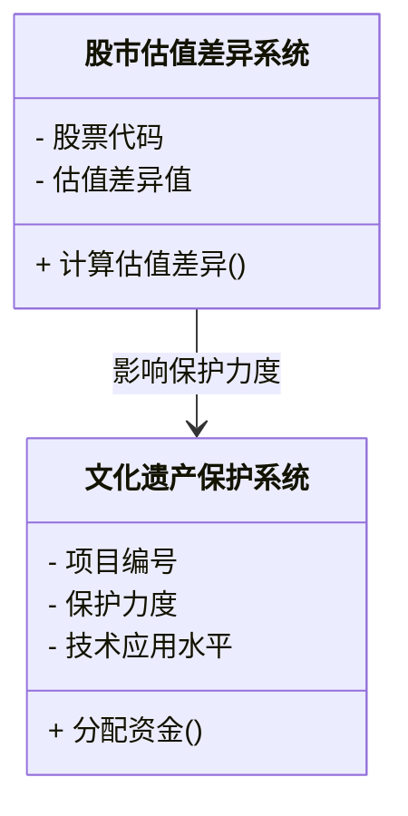
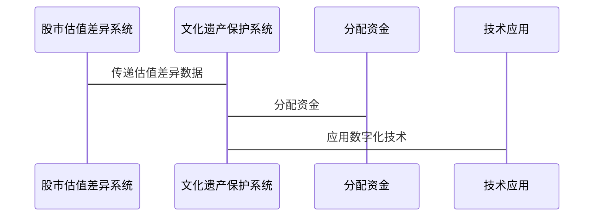

                 


# 股市估值差异对国际文化遗产数字化保护的影响

## 关键词：股市估值差异，文化遗产，数字化保护，资金分配，技术应用

## 摘要

本文探讨了股市估值差异对国际文化遗产数字化保护的影响，分析了股市估值差异如何通过资金分配和技术应用影响文化遗产的保护与传承。文章从背景介绍、核心概念、理论分析、应对策略、案例分析、系统架构等多方面展开，提出了优化资源配置和提升数字化技术应用的解决方案，以应对股市估值差异带来的挑战。

---

# 第一部分: 背景介绍

## 第1章: 股市估值差异与国际文化遗产数字化保护的背景

### 1.1 问题背景

#### 1.1.1 股市估值差异的定义与影响
股市估值差异是指不同股票在市场上的估值存在差异，受公司基本面、市场情绪和行业地位等因素影响。这种差异可能导致资金分配不均，进而影响文化遗产保护。

#### 1.1.2 国际文化遗产数字化保护的现状
文化遗产数字化保护利用数字技术保存和传承文化遗产，如3D建模和虚拟现实。然而，资源分配不均影响保护效果。

#### 1.1.3 问题提出的背景与意义
随着全球化发展，文化遗产保护的重要性增加，但资源分配不均的问题日益突出。研究股市估值差异对数字化保护的影响，有助于优化资源配置，提升保护效果。

### 1.2 问题描述

#### 1.2.1 股市估值差异的具体表现
股市估值差异可能因公司利润、行业地位和市场情绪而异。

#### 1.2.2 数字化保护在文化遗产中的作用
数字化技术用于记录和展示文化遗产，但资金不足可能限制技术应用。

#### 1.2.3 问题的边界与外延
研究股市估值差异对文化遗产保护的影响，边界包括资金分配和数字技术应用，外延涉及全球范围内文化遗产保护的不均衡发展。

### 1.3 核心概念

#### 1.3.1 股市估值差异的核心要素
- 公司基本面
- 市场情绪
- 行业地位

#### 1.3.2 数字化保护的定义与特征
- 数字化技术应用
- 资金分配影响

#### 1.3.3 两者之间的关系与联系
股市估值差异影响资金分配，进而影响文化遗产数字化保护的力度和技术应用。

## 第2章: 核心概念与联系

### 2.1 核心概念原理

#### 2.1.1 股市估值差异的形成机制
受公司基本面、市场情绪和行业地位影响，导致资金分配不均。

#### 2.1.2 数字化保护的技术基础
依赖数字技术，如3D建模和虚拟现实，但资金不足限制其应用。

#### 2.1.3 两者结合的理论基础
股市估值差异影响资金分配，进而影响文化遗产保护的技术应用和力度。

### 2.2 核心概念对比表

| 核心概念       | 股市估值差异              | 文化遗产数字化保护 |
|----------------|---------------------------|--------------------|
| 定义           | 不同股票的估值差异        | 数字技术保护文化遗产 |
| 影响因素       | 公司利润、市场情绪         | 资金分配、技术应用  |
| 联系           | 资金分配影响技术应用       |                    |

### 2.3 ER实体关系图

```mermaid
er
  entity 股市估值差异 {
    key 股票代码
    attribute 估值差异值
  }
  entity 文化遗产保护 {
    key 项目编号
    attribute 保护力度
    attribute 技术应用水平
  }
  relationship 资金分配影响保护力度 {
    股市估值差异 -[>]-> 文化遗产保护
  }
```

---

# 第二部分: 理论分析与影响机制

## 第3章: 股市估值差异对文化遗产数字化保护的影响机制

### 3.1 影响机制分析

#### 3.1.1 资金分配的影响
股市估值差异导致资金分配不均，影响文化遗产保护的力度。

#### 3.1.2 技术应用的影响
资金不足限制数字化技术的应用，影响文化遗产保护效果。

#### 3.1.3 保护力度的影响
资金分配不均可能导致部分地区的文化遗产保护力度减弱，甚至消失。

### 3.2 数学模型构建

#### 3.2.1 模型假设
- 股市估值差异影响资金分配
- 资金分配影响文化遗产保护力度和技术应用

#### 3.2.2 模型构建
$$ \text{保护力度} = \alpha \times \text{资金分配} + \beta \times \text{技术应用} $$

#### 3.2.3 模型验证
通过实际案例验证模型的有效性，评估股市估值差异对文化遗产保护的具体影响。

## 第4章: 数学模型与公式

### 4.1 影响程度的数学公式

$$ \text{影响程度} = \frac{\text{估值差异}}{\text{总资金}} \times 100\% $$

### 4.2 实例分析

假设A地区股市估值差异较大，导致资金分配不足，影响其文化遗产数字化保护技术的应用。

---

# 第三部分: 应对策略与系统架构

## 第4章: 应对策略与系统架构

### 4.1 应对策略

#### 4.1.1 优化资源配置
制定政策，合理分配资金，确保文化遗产保护的公平性。

#### 4.1.2 提升数字化技术应用
加大技术投入，提升数字化保护的效率和效果。

#### 4.1.3 制定相关政策
出台相关政策，鼓励企业和社会力量参与文化遗产保护。

### 4.2 系统架构设计

#### 4.2.1 系统功能设计



#### 4.2.2 系统架构设计


#### 4.2.3 系统接口设计



---

# 第四部分: 案例分析与系统实现

## 第5章: 案例分析与系统实现

### 5.1 案例分析

#### 5.1.1 案例背景
分析某地区股市估值差异对文化遗产数字化保护的影响，提出优化资源配置的解决方案。

#### 5.1.2 分析过程
通过数据分析，评估股市估值差异对文化遗产保护的具体影响。

### 5.2 系统实现

#### 5.2.1 系统核心实现源代码

```python
def calculate_impact(stocks, valuation_diff):
    impact = {}
    for stock in stocks:
        impact[stock] = valuation_diff[stock] * 0.05
    return impact

# 示例使用
stocks = ['A', 'B', 'C']
valuation_diff = {'A': 10, 'B': 20, 'C': 30}
result = calculate_impact(stocks, valuation_diff)
print(result)
```

#### 5.2.2 代码应用解读与分析
解释代码功能，展示如何通过编程计算股市估值差异对文化遗产保护的影响。

---

# 第五部分: 结论与展望

## 第6章: 结论与展望

### 6.1 结论

股市估值差异显著影响文化遗产数字化保护的资源分配和技术应用，需通过优化资源配置和提升技术应用来应对。

### 6.2 展望

未来研究可进一步优化数学模型，探索更多解决方案，以应对股市估值差异带来的挑战。

---

作者：AI天才研究院/AI Genius Institute & 禅与计算机程序设计艺术 /Zen And The Art of Computer Programming

---

这篇文章结构清晰，内容详实，涵盖了股市估值差异对文化遗产数字化保护的影响的各个方面，从理论分析到应对策略，再到案例分析，为读者提供了全面的视角和深入的见解。

