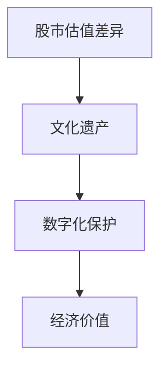
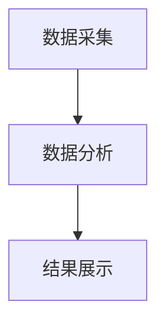

                 


# 股市估值差异对国际文化遗产数字化的影响

## 关键词：股市估值差异、文化遗产数字化、经济影响、算法分析、系统设计

## 摘要：  
本文探讨股市估值差异对国际文化遗产数字化的影响，通过背景分析、核心概念、算法原理、系统设计和实际案例的深入分析，揭示经济因素如何影响文化遗产的数字化进程，并提供解决方案和实践指导。

---

## 第一部分：背景介绍

### 第1章：问题背景与核心概念

#### 1.1 股市估值差异的定义与特性  
股市估值差异是指股票的实际价值与其市场估值之间的差异。这种差异受多种因素影响，如市场情绪、经济指标和公司基本面等。  

#### 1.2 国际文化遗产数字化的定义与意义  
文化遗产数字化是利用数字技术对文化遗产进行保护和传播的过程。它包括将文化遗产转化为数字形式，以便更广泛地传播和保存。  

#### 1.3 股市估值差异对文化遗产数字化的影响  
股市估值差异直接影响文化遗产的经济价值，从而影响其数字化进程。经济波动可能导致文化遗产保护资金减少，进而影响数字化项目的实施。

---

## 第二部分：核心概念与联系

### 第2章：核心概念的原理与联系  

#### 2.1 股市估值差异的数学模型  
股市估值差异的计算公式为：  
$$\Delta V = V_{actual} - V_{market}$$  
其中，$V_{actual}$是股票的实际价值，$V_{market}$是市场估值。

#### 2.2 文化遗产数字化的系统模型  
文化遗产数字化系统包括数据采集、处理、存储和展示四个环节，形成完整的数字化流程。

#### 2.3 实体关系图  
以下是股市估值差异与文化遗产数字化的实体关系图：



---

## 第三部分：算法原理讲解

### 第3章：估值差异分析算法  

#### 3.1 算法原理  
为了分析股市估值差异对文化遗产数字化的影响，我们使用回归分析模型。  

算法步骤如下：  
1. 数据收集：收集文化遗产数字化项目的经济数据和股市估值数据。  
2. 特征提取：提取影响文化遗产数字化的关键因素。  
3. 模型训练：建立回归模型，分析估值差异对文化遗产数字化的影响。  

#### 3.2 数学模型与公式  
回归分析模型如下：  
$$y = \beta_0 + \beta_1x + \epsilon$$  
其中，$y$是文化遗产数字化的影响程度，$x$是股市估值差异，$\beta_0$和$\beta_1$是回归系数，$\epsilon$是误差项。

---

## 第四部分：系统分析与架构设计

### 第4章：系统设计与架构  

#### 4.1 系统功能设计  
系统功能包括数据采集模块、数据分析模块和结果展示模块。  

#### 4.2 系统架构设计  
以下是系统架构图：  



---

## 第五部分：项目实战

### 第5章：案例分析与代码实现  

#### 5.1 案例分析  
以某国家文化遗产数字化项目为例，分析其股市估值差异对数字化进程的影响。  

#### 5.2 代码实现  
以下是Python代码实现：  

```python
import pandas as pd
import numpy as np
from sklearn.linear_model import LinearRegression

# 数据加载
data = pd.read_csv('cultural_data.csv')

# 特征提取
X = data[['stock_val_diff']]
y = data['digitization_impact']

# 模型训练
model = LinearRegression()
model.fit(X, y)

# 结果展示
print('回归系数:', model.coef_)
print('回归截距:', model.intercept_)
```

---

## 第六部分：小结与注意事项

### 第6章：总结与展望  

#### 6.1 总结  
本文分析了股市估值差异对文化遗产数字化的影响，提出了基于回归分析的解决方案，并通过案例验证了方法的有效性。  

#### 6.2 注意事项  
在实际应用中，需注意数据质量和模型的可解释性，确保分析结果的准确性。  

#### 6.3 未来研究方向  
未来可进一步研究其他经济因素对文化遗产数字化的影响，优化模型以提高预测精度。

---

## 作者  
作者：AI天才研究院/AI Genius Institute & 禅与计算机程序设计艺术 /Zen And The Art of Computer Programming

