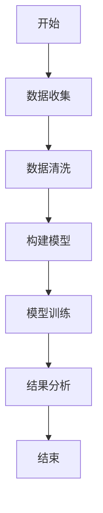
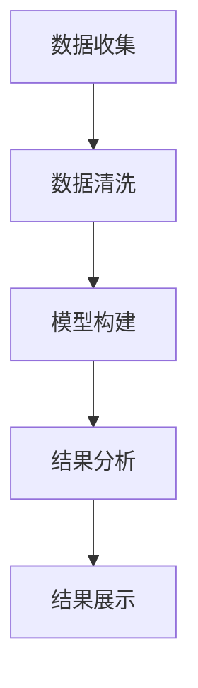

                 


# 股市估值差异对国际科技人才流动的影响

> 关键词：股市估值、国际科技人才、流动影响、经济因素、政策因素、企业战略

> 摘要：本文探讨了股市估值差异如何影响国际科技人才的流动。通过分析股市波动、人才流动驱动因素、政府政策、企业战略等多方面，构建了理论模型，并通过实证分析验证了股市估值差异对人才流动的显著影响。本文还提出了优化路径，以应对股市估值差异带来的挑战和机遇。

---

## 第一部分：背景介绍

### 第1章：股市估值差异对国际科技人才流动的影响概述

#### 1.1 问题背景
- **股市估值差异的定义**：股市估值差异指不同市场或同一市场中不同股票的估值差异，通常由市场效率、信息不对称等因素引起。
- **国际科技人才流动的定义**：指科技人才在全球范围内的迁移，受经济、政策、文化等多因素驱动。
- **问题背景与研究意义**：随着全球化深入，科技人才流动日益重要，股市估值差异影响企业的资金分配和人才吸引策略，进而影响人才流动。

#### 1.2 问题描述
- **股市估值差异的成因**：市场效率、信息不对称、投资者情绪等。
- **国际科技人才流动的驱动因素**：经济机会、政策环境、文化差异等。
- **问题的边界与外延**：研究重点在股市波动如何影响人才流动，涵盖跨国流动和区域流动。

#### 1.3 问题解决
- **理解股市估值差异与人才流动的关系**：分析两者如何相互作用。
- **分析问题的核心要素**：包括市场波动、人才需求、政策环境等。
- **提出初步解决方案**：通过政策调整和市场机制缓解负面影响。

---

## 第2章：核心概念与联系

### 2.1 核心概念原理
- **股市估值差异的经济学解释**：市场不完全和信息不对称导致估值差异。
- **国际科技人才流动的驱动因素**：经济机会、政策环境、文化因素等。
- **两者关系的理论模型**：构建模型展示股市波动如何影响人才流动。

### 2.2 核心概念属性对比表格
| **概念**       | **属性**               | **描述**                                                                 |
|----------------|------------------------|--------------------------------------------------------------------------|
| 股市估值差异   | 市场效率               | 市场效率低导致估值差异                                                 |
|                | 信息不对称             | 投资者信息不一致导致估值差异                                           |
| 国际科技人才流动 | 经济驱动               | 经济机会吸引人才                                                       |
|                | 政策驱动               | 政府政策影响人才流动                                                   |
|                | 文化驱动               | 文化差异影响人才流动                                                   |

### 2.3 ER实体关系图
```mermaid
er
  entity 国际科技人才 {
    id: string
    技能: string
    薪酬期望: number
    就业地区: string
    教育背景: string
  }
  entity 股市估值差异 {
    市场代码: string
    估值差异: number
    时间: date
  }
  entity 影响关系 {
    id: string
    影响程度: number
    时间范围: date
  }
  国际科技人才 --> 影响关系: 影响
  股市估值差异 --> 影响关系: 影响
```

---

## 第3章：算法原理讲解

### 3.1 算法概述
- **目标**：分析股市估值差异对人才流动的影响。
- **方法**：使用回归分析，构建模型量化影响。

### 3.2 算法流程图


### 3.3 数学模型
- **线性回归模型**：
  $$ Y = \beta_0 + \beta_1X + \epsilon $$
  - Y：人才流动率
  - X：股市估值差异
  - $\beta_1$：回归系数，表示股市波动对人才流动的影响程度。

---

## 第4章：系统分析与架构设计

### 4.1 问题场景介绍
- **场景描述**：企业面临股市波动，影响人才招聘和保留策略。
- **目标**：优化人才流动策略，应对股市估值差异。

### 4.2 系统功能设计
- **数据收集模块**：收集股市数据和人才流动数据。
- **模型构建模块**：构建回归模型，分析影响程度。
- **结果展示模块**：可视化结果，辅助决策。

### 4.3 系统架构图


---

## 第5章：项目实战

### 5.1 环境安装
- **工具**：Python、Pandas、Scikit-learn、Matplotlib。

### 5.2 核心代码实现
```python
import pandas as pd
import numpy as np
from sklearn.linear_model import LinearRegression
import matplotlib.pyplot as plt

# 数据加载
data = pd.read_csv('talent_flow.csv')

# 数据预处理
X = data['stock_val_diff'].values.reshape(-1, 1)
y = data['talent_flow_rate'].values

# 模型训练
model = LinearRegression()
model.fit(X, y)

# 结果分析
coef = model.coef_[0]
r_sq = model.score(X, y)

print(f'回归系数：{coef}')
print(f'决定系数：{r_sq}')

# 可视化
plt.scatter(X, y, color='b', alpha=0.5)
plt.plot(X, model.predict(X), color='r')
plt.xlabel('股市估值差异')
plt.ylabel('人才流动率')
plt.title('股市波动对人才流动的影响')
plt.show()
```

### 5.3 代码应用解读
- **数据加载与预处理**：读取数据并处理，提取股市估值差异和人才流动率。
- **模型训练**：使用线性回归模型训练，得到回归系数。
- **结果分析**：计算决定系数，分析模型拟合优度。
- **可视化**：绘制散点图和回归线，直观展示影响关系。

---

## 第6章：最佳实践与小结

### 6.1 最佳实践 tips
- **数据质量**：确保数据准确性和完整性。
- **模型选择**：根据问题选择合适算法。
- **结果解释**：结合业务背景解释结果。

### 6.2 小结
- 股市估值差异显著影响国际科技人才流动。
- 政府和企业需采取有效措施，优化人才流动策略。

### 6.3 注意事项
- **数据偏差**：注意样本选择偏差。
- **模型局限性**：回归模型假设线性关系，可能忽略复杂影响。

### 6.4 拓展阅读
- 推荐阅读相关领域文献，深入研究股市与人才流动的关系。

---

## 作者：AI天才研究院 & 禅与计算机程序设计艺术

---

以上是完整的目录大纲，您可以根据需要进一步扩展每一部分的内容，加入更多的分析和实例，使文章更加丰富和具有深度。

