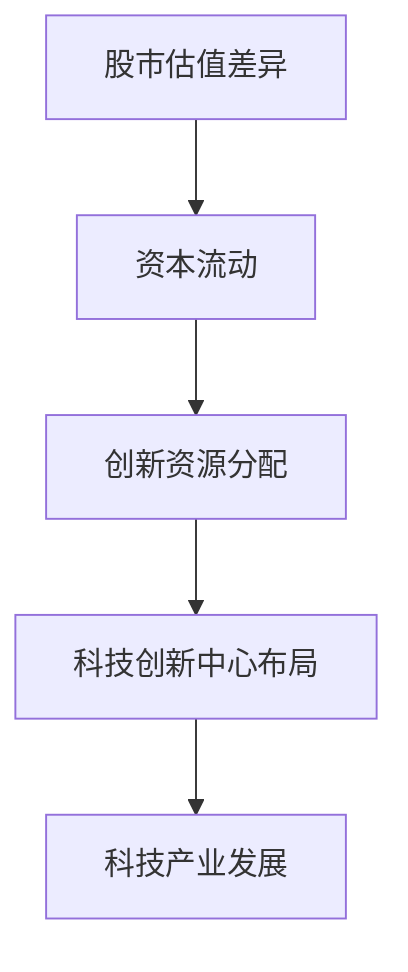
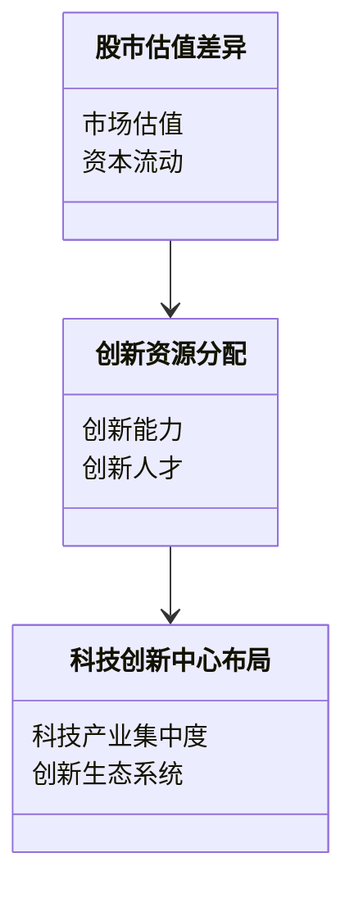
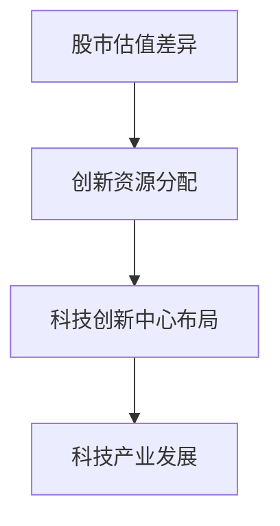
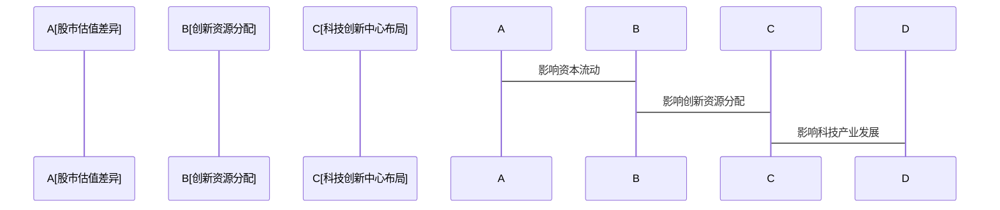

                 


# 股市估值差异对国际科技创新中心布局的影响

> **关键词**：股市估值、科技创新中心、区域经济、金融影响、城市规划

> **摘要**：本文探讨了股市估值差异对国际科技创新中心布局的影响，通过分析股市估值差异的形成机制、科技创新中心的定义与特征，以及两者之间的互动关系，结合实际案例和系统模型，深入剖析了股市估值差异如何影响科技产业的区域分布，并提出了相应的政策建议。

---

## 第一部分: 背景与概念

### 第1章: 背景介绍

#### 1.1 问题背景

##### 1.1.1 股市估值差异的定义与特征
股市估值差异指的是不同市场或公司股票的市场估值存在差异。这种差异可能由多种因素引起，包括市场流动性、投资者情绪、公司基本面等。股市估值差异的特征包括波动性、周期性、市场分割等。

##### 1.1.2 国际科技创新中心的定义与特征
科技创新中心是指在科技研发、创新企业聚集、科技成果转化等方面具有显著优势的城市或区域。其特征包括科技产业集中、创新能力强、人才资源丰富等。

##### 1.1.3 股市估值差异与科技创新中心布局的关联性
股市估值差异可能通过影响资本流动、企业融资能力等因素，进而影响科技创新中心的形成与布局。

#### 1.2 问题描述

##### 1.2.1 股市估值差异的现状分析
当前，全球股市中存在显著的估值差异，尤其是在新兴市场与发达市场之间。这种差异可能影响企业的融资成本和投资决策。

##### 1.2.2 国际科技创新中心布局的现状分析
全球科技创新中心主要集中在硅谷、纽约、东京等地，这些地区拥有强大的科技产业和创新生态系统。

##### 1.2.3 股市估值差异对创新中心布局的影响路径
股市估值差异可能通过影响资本流动、企业融资能力、创新资源分配等因素，进而影响科技创新中心的布局。

#### 1.3 问题解决

##### 1.3.1 理论框架的构建
构建一个包含股市估值差异、科技创新中心布局的理论框架，分析两者之间的互动关系。

##### 1.3.2 研究方法的选择
采用定量分析与定性分析相结合的方法，包括回归分析、案例研究等。

##### 1.3.3 数据来源与处理
数据来源包括全球股市数据、科技公司分布数据、区域经济指标等，需要进行清洗、整理和分析。

#### 1.4 边界与外延

##### 1.4.1 研究范围的界定
研究范围限定于股市估值差异对科技创新中心布局的影响，不涉及其他因素。

##### 1.4.2 相关概念的边界划分
明确股市估值差异与科技创新中心的定义和范围，避免混淆。

##### 1.4.3 研究的局限性与扩展方向
研究可能存在数据限制和模型简化的问题，未来可以考虑引入更多变量或采用更复杂的模型。

#### 1.5 概念结构与核心要素

##### 1.5.1 核心概念的构成
股市估值差异、科技创新中心、资本流动、创新资源分配。

##### 1.5.2 核心要素的关联性分析
通过构建概念结构图，展示各要素之间的关联关系。

##### 1.5.3 概念结构图


---

## 第二部分: 核心概念与联系

### 第2章: 核心概念与联系

#### 2.1 核心概念的原理

##### 2.1.1 股市估值差异的形成机制
股市估值差异的形成机制可能包括市场信息不对称、投资者情绪、市场结构等因素。

##### 2.1.2 科技创新中心的形成机制
科技创新中心的形成机制可能涉及政策支持、人才聚集、创新生态系统等。

##### 2.1.3 两者之间的互动关系
股市估值差异可能通过影响资本流动，进而影响科技创新中心的形成与布局。

#### 2.2 核心概念的属性特征对比

##### 2.2.1 股市估值差异的属性特征
- 波动性
- 市场分割性
- 信息依赖性

##### 2.2.2 科技创新中心的属性特征
- 创新能力强
- 产业集中
- 人才资源丰富

##### 2.2.3 概念属性特征对比表

| 属性 | 股市估值差异 | 科技创新中心 |
|------|--------------|--------------|
| 波动性 | 高           | 中           |
| 市场依赖 | 高           | 中           |
| 人才需求 | 中           | 高           |

##### 2.2.4 实体关系图


---

### 第3章: 理论分析与模型构建

#### 3.1 理论基础

##### 3.1.1 资本流动理论
资本流动理论认为，资本会流向回报率更高的地区，从而影响科技创新中心的布局。

##### 3.1.2 创新生态系统理论
创新生态系统理论认为，创新资源的集中和互动是科技创新中心形成的关键。

#### 3.2 理论分析

##### 3.2.1 股市估值差异对资本流动的影响
股市估值差异可能影响资本的流动方向，从而影响科技创新中心的布局。

##### 3.2.2 创新资源分配的影响
股市估值差异可能通过影响企业的融资能力，进而影响创新资源的分配。

#### 3.3 数学模型

##### 3.3.1 回归分析模型
$$ Y = \beta_0 + \beta_1 X + \epsilon $$
其中，$Y$ 表示科技创新中心的布局指数，$X$ 表示股市估值差异，$\beta_1$ 是回归系数。

##### 3.3.2 解释
通过回归分析，可以量化股市估值差异对科技创新中心布局的影响程度。

#### 3.4 实例分析

##### 3.4.1 硅谷案例
硅谷作为全球科技创新中心，其形成与股市估值差异密切相关。

##### 3.4.2 纽约案例
纽约作为金融中心，其股市估值差异对科技创新中心的布局有重要影响。

---

## 第三部分: 案例分析与系统设计

### 第4章: 案例分析

#### 4.1 硅谷的股市估值差异与科技创新中心布局

##### 4.1.1 硅谷的股市估值差异
硅谷的科技公司通常享有较高的市场估值，吸引了大量资本流入。

##### 4.1.2 对科技创新中心布局的影响
高估值吸引了更多创新资源，推动了硅谷的科技产业发展。

#### 4.2 纽约的股市估值差异与科技创新中心布局

##### 4.2.1 纽约的股市估值差异
作为金融中心，纽约的股市估值通常较高，但科技公司的估值可能受到市场波动的影响。

##### 4.2.2 对科技创新中心布局的影响
高估值可能吸引更多的科技公司和创新资源，但同时也可能面临更高的竞争压力。

### 第5章: 系统分析与架构设计

#### 5.1 系统分析

##### 5.1.1 问题场景介绍
通过分析股市估值差异对科技创新中心布局的影响，构建一个系统模型。

##### 5.1.2 项目介绍
本项目旨在通过系统分析，量化股市估值差异对科技创新中心布局的影响。

#### 5.2 系统功能设计

##### 5.2.1 领域模型


##### 5.2.2 系统架构设计


##### 5.2.3 系统接口设计
- 输入接口：股市估值数据、科技公司分布数据
- 输出接口：科技创新中心布局指数

##### 5.2.4 系统交互设计


---

## 第四部分: 项目实战

### 第6章: 项目实战

#### 6.1 环境安装

##### 6.1.1 数据获取
获取全球股市数据和科技公司分布数据。

##### 6.1.2 工具安装
安装Python、Pandas、Matplotlib等工具。

#### 6.2 核心代码实现

##### 6.2.1 数据清洗与整理
```python
import pandas as pd

# 读取数据
data = pd.read_csv('stock_valuation.csv')

# 数据清洗
data.dropna(inplace=True)
data = data[['Market', 'Valuation', 'Tech_Companies']]
```

##### 6.2.2 模型实现
```python
from sklearn.linear_model import LinearRegression

# 数据准备
X = data[['Valuation']]
y = data['Tech_Companies']

# 模型训练
model = LinearRegression()
model.fit(X, y)

# 预测结果
predictions = model.predict(X)
```

##### 6.2.3 数据可视化
```python
import matplotlib.pyplot as plt

plt.scatter(X, y)
plt.plot(X, model.predict(X), color='red')
plt.xlabel('Valuation')
plt.ylabel('Tech_Companies')
plt.show()
```

#### 6.3 实例分析与解读

##### 6.3.1 案例分析
分析硅谷和纽约的股市估值差异对科技创新中心布局的影响。

##### 6.3.2 数据分析
通过回归模型，量化股市估值差异对科技创新中心布局的影响。

#### 6.4 项目小结
总结项目成果，提出改进建议。

---

## 第五部分: 结论与建议

### 第7章: 结论与建议

#### 7.1 研究结论

##### 7.1.1 核心发现
股市估值差异对科技创新中心布局有显著影响，高估值吸引了更多创新资源。

##### 7.1.2 研究局限
研究可能存在数据限制和模型简化的不足。

#### 7.2 政策建议

##### 7.2.1 宏观政策建议
政府可以通过调整股市机制，优化科技创新中心的布局。

##### 7.2.2 微观企业建议
企业应充分利用股市估值差异，优化融资策略。

#### 7.3 小结

##### 7.3.1 研究总结
股市估值差异是影响科技创新中心布局的重要因素。

##### 7.3.2 展望未来
未来可以进一步研究其他因素对科技创新中心布局的影响。

#### 7.4 注意事项

##### 7.4.1 数据准确性
确保数据来源的准确性和可靠性。

##### 7.4.2 模型适用性
注意模型的适用性和局限性，避免过度推广。

#### 7.5 拓展阅读
建议读者进一步阅读相关领域的文献，深入理解股市估值差异与科技创新中心布局的关系。

---

## 作者信息

**作者：** AI天才研究院/AI Genius Institute & 禅与计算机程序设计艺术/Zen And The Art of Computer Programming

---

以上是《股市估值差异对国际科技创新中心布局的影响》的技术博客文章的完整内容，涵盖背景、理论、案例、系统设计和项目实战等部分，语言简洁明了，逻辑清晰，适合专业人士阅读。

