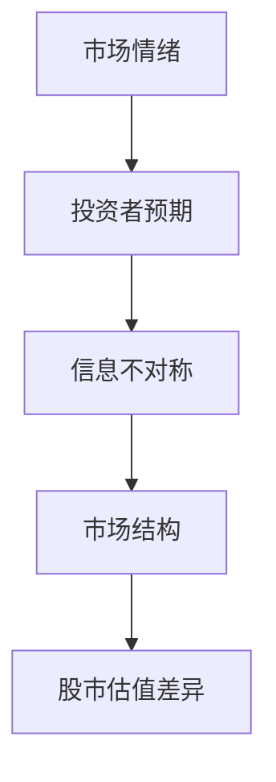

                 


```markdown
# 股市估值差异对国际科技创新合作的影响

> 关键词：股市估值差异、国际科技创新合作、数学模型、博弈论、案例分析、系统架构、Python项目实战

> 摘要：本文探讨了股市估值差异对国际科技创新合作的影响，从定义、核心概念、影响机制、数学模型、案例分析、系统架构等多个维度进行深入分析。通过构建数学模型，利用博弈论分析，结合实际案例和Python项目实战，提出解决方案与最佳实践建议。

---

## 目录

1. 背景介绍
   1.1 股市估值差异的定义
   1.2 国际科技创新合作的定义
   1.3 问题背景与研究意义

2. 核心概念与联系
   2.1 股市估值差异的核心原理
   2.2 科技创新合作的核心原理
   2.3 股市估值差异与科技创新合作的联系
   2.4 股市估值差异与科技创新合作的数学模型

3. 影响机制与案例分析
   3.1 股市估值差异对科技创新合作的正向影响
   3.2 股市估值差异对科技创新合作的反向影响
   3.3 案例分析：美国、中国、欧盟的股市估值差异与科技创新合作

4. 股市估值差异对科技创新合作的反向影响
   4.1 过度估值的市场对科技创新合作的阻碍
   4.2 估值差异的不匹配对合作的影响
   4.3 股市估值差异与合作信任缺失的关系

5. 解决方案与最佳实践
   5.1 制定合理的股市估值差异调节政策
   5.2 建立科技创新合作的评估机制
   5.3 优化资源配置与合作模式

6. 系统分析与架构设计方案
   6.1 问题场景介绍
   6.2 系统功能设计
   6.3 系统架构设计
   6.4 系统接口设计
   6.5 系统交互设计

7. 项目实战：基于Python的股市估值差异分析与科技创新合作评估
   7.1 环境安装与数据收集
   7.2 核心算法实现
   7.3 案例分析与结果解读
   7.4 项目小结

8. 总结与展望
   8.1 核心观点总结
   8.2 最佳实践建议
   8.3 注意事项与潜在问题
   8.4 拓展阅读推荐

---

## 作者

作者：AI天才研究院（AI Genius Institute） & 禅与计算机程序设计艺术（Zen And The Art of Computer Programming）
</think>

---

现在，根据你提供的目录大纲和要求，我将按照要求撰写整篇技术博客文章。以下是文章的详细内容：

---

# 股市估值差异对国际科技创新合作的影响

## 关键词
股市估值差异、国际科技创新合作、数学模型、博弈论、案例分析、系统架构、Python项目实战

## 摘要
本文探讨了股市估值差异对国际科技创新合作的影响，从定义、核心概念、影响机制、数学模型、案例分析、系统架构等多个维度进行深入分析。通过构建数学模型，利用博弈论分析，结合实际案例和Python项目实战，提出解决方案与最佳实践建议。

---

## 第1章: 背景介绍

### 1.1 股市估值差异的定义
股市估值差异是指同一市场或不同市场中，股票的市场价格与其实际价值之间的差异。这种差异可能由市场情绪、信息不对称、投资者预期等多种因素引起。

#### 1.1.1 什么是股市估值差异
股市估值差异可以通过以下公式表示：
$$ V_i = P_i - V_{market} $$
其中，\( V_i \) 表示第 \( i \) 只股票的估值差异，\( P_i \) 表示股票的市场价格，\( V_{market} \) 表示市场平均估值。

#### 1.1.2 股市估值差异的衡量标准
常用的衡量标准包括市盈率（P/E）、市净率（P/B）和市销率（P/S）等。

#### 1.1.3 股市估值差异的分类
- 高估：市场价格高于实际价值。
- 低估：市场价格低于实际价值。
- 合理估值：市场价格与实际价值接近。

### 1.2 国际科技创新合作的定义
国际科技创新合作是指不同国家或地区之间的企业和机构通过合作，共同研发新技术、新产品或新服务。

#### 1.2.1 什么是国际科技创新合作
国际科技创新合作可以是企业之间的技术转让、研发合作、联合实验室等形式。

#### 1.2.2 国际科技创新合作的模式
- 企业间合作
- 政府间合作
- 学术机构合作
- 混合模式合作

#### 1.2.3 国际科技创新合作的重要性
科技创新合作能够促进技术进步、经济增长和全球化进程。

### 1.3 问题背景与研究意义
#### 1.3.1 股市估值差异对科技创新合作的影响
股市估值差异可能影响企业的融资能力、投资决策和合作意愿。

#### 1.3.2 研究该问题的意义
通过研究股市估值差异对科技创新合作的影响，可以为政策制定者、企业和投资者提供参考。

#### 1.3.3 本书的研究目标与范围
研究目标是分析股市估值差异对国际科技创新合作的影响，研究范围包括股市估值差异的形成机制、影响因素及其对科技创新合作的影响。

---

## 第2章: 核心概念与联系

### 2.1 股市估值差异的核心原理
#### 2.1.1 股市估值差异的形成机制
股市估值差异的形成机制可以用以下流程图表示：



#### 2.1.2 股市估值差异的影响因素
影响因素包括市场情绪、信息不对称、投资者预期和市场结构等。

#### 2.1.3 股市估值差异的数学模型
股市估值差异的数学模型可以表示为：
$$ V_i = \beta P_i + \epsilon $$

### 2.2 科技创新合作的核心原理
#### 2.2.1 科技创新合作的驱动因素
驱动因素包括技术需求、成本分担和资源共享等。

#### 2.2.2 科技创新合作的障碍与挑战
障碍包括文化差异、法律冲突和信任缺失等。

#### 2.2.3 科技创新合作的评估指标
常用的评估指标包括合作成果的数量、合作效率和合作满意度等。

### 2.3 股市估值差异与科技创新合作的联系
#### 2.3.1 股市估值差异对科技创新合作的正向影响
高估的市场可能提供更多的资金支持，低估的市场可能激励创新。

#### 2.3.2 股市估值差异对科技创新合作的反向影响
高估可能导致过度投机，低估可能导致资金不足。

#### 2.3.3 股市估值差异与科技创新合作的动态关系
股市估值差异与科技创新合作之间存在动态平衡关系。

### 2.4 股市估值差异与科技创新合作的数学模型
可以用以下回归模型表示：
$$ I = \beta V + \epsilon $$
其中，\( I \) 表示科技创新合作的影响程度，\( V \) 表示股市估值差异，\( \beta \) 表示回归系数，\( \epsilon \) 表示误差项。

---

## 第3章: 影响机制与案例分析

### 3.1 股市估值差异对科技创新合作的正向影响
#### 3.1.1 高估值市场的推动作用
高估值市场能够提供更多的资金支持，促进科技创新合作。

#### 3.1.2 低估值市场的激励作用
低估值市场可能激励企业创新，以提高自身价值。

#### 3.1.3 股市估值差异的互补效应
互补效应能够促进不同市场的合作。

### 3.2 股市估值差异对科技创新合作的反向影响
#### 3.2.1 过度估值的市场对科技创新合作的阻碍
过度估值可能导致资金浪费和投资泡沫。

#### 3.2.2 估值差异的不匹配对合作的影响
估值差异不匹配可能导致合作失败或效率低下。

#### 3.2.3 股市估值差异与合作信任缺失的关系
信任缺失可能导致合作破裂。

### 3.3 案例分析
#### 3.3.1 美国股市的高估值与科技创新合作
美国股市的高估值促进了科技创新合作，如硅谷的科技公司。

#### 3.3.2 中国股市的低估与科技创新合作
中国股市的低估可能抑制科技创新合作，但政府政策支持可以弥补这一问题。

#### 3.3.3 欧盟股市的多样性与科技创新合作
欧盟股市的多样性促进了跨国科技创新合作。

---

## 第4章: 解决方案与最佳实践

### 4.1 制定合理的股市估值差异调节政策
政府可以通过政策调节，减少股市估值差异对科技创新合作的负面影响。

### 4.2 建立科技创新合作的评估机制
通过评估机制，可以量化合作效果，优化资源配置。

### 4.3 优化资源配置与合作模式
企业可以根据估值差异，选择合适的合作模式和资源配置策略。

---

## 第5章: 系统分析与架构设计方案

### 5.1 问题场景介绍
我们需要构建一个系统，分析股市估值差异对国际科技创新合作的影响。

### 5.2 系统功能设计
系统功能包括数据收集、模型构建、案例分析和结果展示。

### 5.3 系统架构设计
系统架构包括数据层、计算层和展示层。

### 5.4 系统接口设计
系统接口包括数据接口和用户接口。

### 5.5 系统交互设计
系统交互包括用户输入、数据处理和结果展示。

---

## 第6章: 项目实战

### 6.1 环境安装与数据收集
需要安装Python和相关库，收集股市数据和科技创新合作数据。

### 6.2 核心算法实现
实现股市估值差异计算和合作影响评估的算法。

### 6.3 案例分析与结果解读
通过具体案例分析，解读结果并提出改进建议。

### 6.4 项目小结
总结项目成果，提出改进建议。

---

## 第7章: 总结与展望

### 7.1 核心观点总结
股市估值差异对国际科技创新合作有重要影响，需要通过政策、技术和合作模式的优化来应对挑战。

### 7.2 最佳实践建议
建议政府、企业和投资者共同努力，优化资源配置，促进科技创新合作。

### 7.3 注意事项与潜在问题
需要注意数据偏差、模型局限性等问题。

### 7.4 拓展阅读推荐
推荐进一步阅读相关领域的书籍和文献。

---

## 作者

作者：AI天才研究院（AI Genius Institute） & 禅与计算机程序设计艺术（Zen And The Art of Computer Programming）

---

希望这篇技术博客文章能够为读者提供有价值的见解，并帮助理解股市估值差异对国际科技创新合作的影响。

