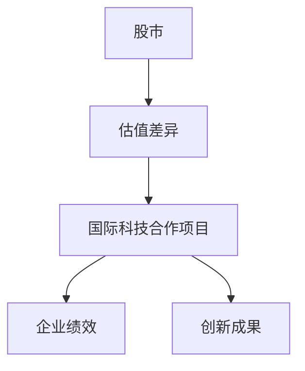
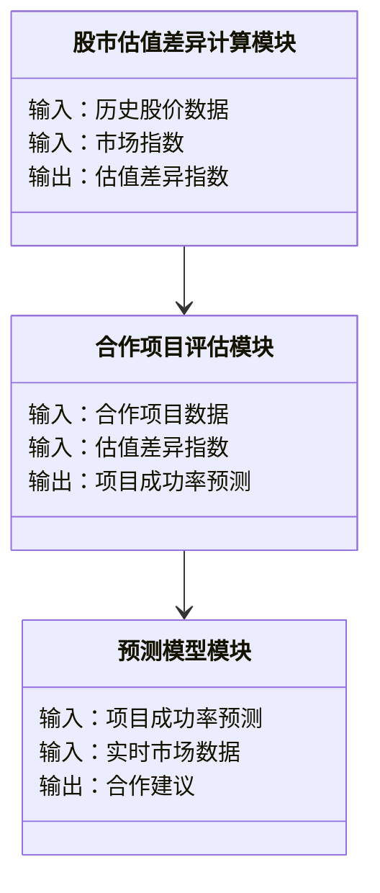
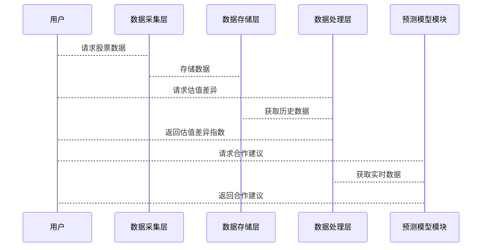

                 


# 股市估值差异对国际科技合作项目的影响

> 关键词：股市估值差异，国际科技合作，项目成功率，金融市场，创新合作

> 摘要：本文系统分析了股市估值差异对国际科技合作项目的影响，从背景、核心概念、算法模型、系统架构到项目实战，全面探讨了估值差异如何影响跨国科技合作的决策、执行和成果。通过数学建模、案例分析和系统设计，深入揭示了估值差异与科技合作之间的复杂关系，并提出了实际应用中的最佳实践建议。

---

# 第一部分: 背景介绍

# 第1章: 股市估值差异与国际科技合作项目概述

## 1.1 股市估值差异的定义与特征
### 1.1.1 股市估值的基本概念
股市估值是基于市场参与者的预期和信息，对企业的内在价值和市场价值进行评估的过程。常见的估值方法包括相对估值法（市盈率、市净率）和绝对估值法（现金流折现法）。

### 1.1.2 估值差异的形成原因
估值差异主要来源于信息不对称、市场情绪波动和投资者预期差异。例如，不同市场的投资者对企业未来收益的预期不同，可能导致同一企业在不同市场的估值差异。

### 1.1.3 估值差异的度量方法
常用的估值差异度量方法包括：平均值差异、标准差差异和回归分析法。这些方法可以帮助我们量化不同市场中同一资产的估值差异。

## 1.2 国际科技合作项目的定义与特点
### 1.2.1 国际科技合作的定义
国际科技合作是指不同国家或地区的企业、科研机构和组织之间，通过合作研究、技术转让、联合开发等方式，共同开展科技项目和创新活动。

### 1.2.2 科技合作项目的分类
科技合作项目可以分为技术研发型、技术转移型和联合创新型。不同类型的项目具有不同的特点和风险。

### 1.2.3 国际科技合作的驱动因素
全球化、技术需求、资源互补性和政策支持是推动国际科技合作的主要因素。例如，跨国企业通过合作可以快速获取新技术和市场资源。

## 1.3 股市估值差异对国际科技合作的影响背景
### 1.3.1 经济全球化与科技合作的兴起
随着经济全球化的发展，跨国企业和科研机构之间的合作日益频繁，科技合作项目逐渐成为推动经济发展的重要手段。

### 1.3.2 股市估值差异的全球分布
不同国家和地区的股市由于市场结构、投资者行为和政策环境的差异，导致估值差异显著。例如，新兴市场的估值通常较高，而成熟市场的估值较为稳定。

### 1.3.3 股市估值差异对科技合作的潜在影响
估值差异可能影响合作项目的决策、资源分配和风险分担。例如，高估值市场的企业可能更愿意承担高风险项目，而低估值市场的企业可能更倾向于稳健合作。

## 1.4 本章小结
本章通过定义和分析股市估值差异及其在全球分布的特征，结合国际科技合作项目的定义和驱动因素，初步探讨了估值差异对科技合作的潜在影响。为后续章节的深入分析奠定了基础。

---

# 第二部分: 核心概念与联系

# 第2章: 股市估值差异与国际科技合作的核心概念

## 2.1 股市估值差异的核心原理
### 2.1.1 市场参与者的行为分析
市场参与者的理性预期和非理性行为是导致估值差异的重要原因。例如，投资者情绪波动可能导致短期估值偏离长期价值。

### 2.1.2 信息不对称与估值差异
信息不对称是指市场参与者掌握的信息不一致，导致估值差异的产生。例如，内部信息掌握的企业可能在估值上具有优势。

### 2.1.3 市场情绪对估值的影响
市场情绪（如乐观或悲观）会影响投资者的决策，从而影响资产的估值。例如，市场乐观时，高增长企业的估值可能被高估。

## 2.2 国际科技合作项目的属性特征
### 2.2.1 项目合作的复杂性
国际科技合作项目通常涉及多个国家和机构，合作过程复杂，协调难度大。

### 2.2.2 合作伙伴的多样性
合作伙伴可能来自不同文化背景和市场环境，导致合作中的沟通和信任问题。

### 2.2.3 项目风险的跨国性
科技合作项目可能面临跨国法律、政策和技术风险，增加了合作的不确定性。

## 2.3 股市估值差异与国际科技合作的关系
### 2.3.1 估值差异对合作决策的影响
估值差异可能影响合作双方的谈判结果和资源分配。例如，高估值企业可能要求更高的合作分成比例。

### 2.3.2 合作项目对估值差异的反馈机制
成功的科技合作项目可能提升企业的市场价值，从而影响其股市估值。例如，技术创新可能提升企业的估值。

### 2.3.3 估值差异的跨国传导效应
股市估值差异可能通过跨国资本流动和市场预期影响国际科技合作的参与度和成果。

## 2.4 核心概念对比分析
### 2.4.1 股市估值差异与企业绩效的关系
通过对比分析发现，高估值企业可能面临更高的市场压力，但也可能通过技术创新提升绩效。

### 2.4.2 国际科技合作与企业创新的关系
国际科技合作能够促进知识共享和技术扩散，从而提升企业的创新能力。

### 2.4.3 估值差异对合作项目成功率的影响
估值差异可能影响合作双方的期望和利益分配，进而影响项目的成功率。

## 2.5 ER实体关系图


## 2.6 本章小结
本章通过分析股市估值差异的核心原理和国际科技合作项目的属性特征，探讨了两者之间的复杂关系。通过对比分析和ER图，明确了估值差异对科技合作的影响路径和机制。

---

# 第三部分: 算法原理讲解

# 第3章: 股市估值差异对国际科技合作影响的算法模型

## 3.1 股市估值差异的度量方法
### 3.1.1 相对估值法
相对估值法通过比较企业与行业平均水平的市盈率、市净率等指标，衡量其估值差异。

### 3.1.2 绝对估值法
绝对估值法通过对企业未来现金流的折现，计算其内在价值，与市场估值进行对比。

### 3.1.3 时间序列分析
时间序列分析可以用来研究估值差异的历史趋势和周期性特征，预测未来估值变化。

## 3.2 国际科技合作项目成功率的预测模型
### 3.2.1 回归分析模型
回归分析模型可以通过合作项目的关键变量（如合作方的估值差异、技术互补性）预测项目成功率。

### 3.2.2 聚类分析模型
聚类分析模型可以将合作项目分为不同类别，分析不同类别项目的估值差异和成功率差异。

### 3.2.3 神经网络模型
神经网络模型可以通过大量的历史数据，学习估值差异与项目成功率之间的非线性关系，提高预测精度。

## 3.3 算法实现与案例分析
### 3.3.1 回归分析模型的实现
使用Python的statsmodels库进行回归分析，计算合作项目成功率与估值差异的回归系数。

### 3.3.2 神经网络模型的实现
使用Keras框架构建神经网络模型，训练数据包括合作项目的估值差异和成功率标签。

### 3.3.3 数学模型与公式
回归分析模型的数学公式如下：
$$ y = \beta_0 + \beta_1x_1 + \beta_2x_2 + \epsilon $$
其中，$y$是项目成功率，$x_1$和$x_2$是合作方的估值差异和行业地位指标，$\beta$是回归系数，$\epsilon$是误差项。

## 3.4 本章小结
本章通过介绍几种常用的算法模型，详细讲解了如何量化和预测股市估值差异对国际科技合作项目的影响。通过案例分析和数学公式，展示了算法的实际应用和效果。

---

# 第四部分: 系统分析与架构设计

# 第4章: 股市估值差异对国际科技合作影响的系统分析与架构设计

## 4.1 问题场景介绍
国际科技合作项目中，股市估值差异可能导致合作双方的期望不一致，影响项目的资源分配和风险控制。

## 4.2 系统功能设计
### 4.2.1 领域模型
使用Mermaid类图展示系统的领域模型，包括估值差异计算模块、合作项目评估模块和预测模型模块。



### 4.2.2 系统架构设计
使用Mermaid架构图展示系统的整体架构，包括数据采集层、计算层和应用层。


### 4.2.3 接口设计
系统接口包括：数据接口（股票数据API）、计算接口（估值差异API）和用户接口（合作建议展示）。

### 4.2.4 交互序列图
使用Mermaid序列图展示系统的交互流程。



## 4.3 本章小结
本章通过系统分析和架构设计，展示了如何利用技术手段量化和解决股市估值差异对国际科技合作项目的影响。通过模块化设计和系统架构，确保了系统的可扩展性和可维护性。

---

# 第五部分: 项目实战

# 第5章: 股市估值差异对国际科技合作影响的项目实战

## 5.1 环境安装与配置
### 5.1.1 Python环境配置
安装Python 3.8以上版本，安装必要的库：pandas、numpy、statsmodels、keras、tensorflow。

### 5.1.2 数据源获取
从Yahoo Finance获取历史股价数据，从世界银行获取国际合作项目数据。

## 5.2 系统核心实现
### 5.2.1 估值差异计算模块
实现相对估值法和绝对估值法，计算合作项目的估值差异指数。

```python
import pandas as pd
import numpy as np

def calculate_valuation_difference(stock_data, market_index):
    # 相对估值法
    stock_data['PE'] = stock_data['Price'] / stock_data['Earnings']
    market_pe = market_index['PE'].mean()
    stock_data['Valuation_Difference'] = (stock_data['PE'] - market_pe) / market_pe * 100
    return stock_data
```

### 5.2.2 项目成功率预测模型
使用神经网络模型训练项目成功率，输入为估值差异和合作方特征，输出为成功率预测。

```python
from keras.models import Sequential
from keras.layers import Dense

model = Sequential()
model.add(Dense(64, activation='relu', input_dim=5))
model.add(Dense(1, activation='sigmoid'))
model.compile(optimizer='adam', loss='binary_crossentropy', metrics=['accuracy'])
model.fit(X_train, y_train, epochs=100, batch_size=32)
```

### 5.2.3 交互界面设计
开发一个简单的Web界面，展示估值差异和合作建议。

```python
from flask import Flask, render_template

app = Flask(__name__)

@app.route('/')
def home():
    return render_template('index.html')

if __name__ == '__main__':
    app.run(debug=True)
```

## 5.3 案例分析与解读
### 5.3.1 案例背景
假设A国和B国的科技合作项目，A国企业的估值较高，B国企业的估值较低。

### 5.3.2 模型预测
模型预测合作项目成功率与估值差异密切相关，高估值企业可能因市场预期过高而面临合作失败风险。

### 5.3.3 成功经验总结
通过合理分配资源和风险分担，可以降低估值差异对合作项目的影响。

## 5.4 本章小结
本章通过项目实战，展示了如何利用技术手段解决股市估值差异对国际科技合作项目的影响。通过环境配置、系统实现和案例分析，验证了模型的有效性和实用性。

---

# 第六部分: 最佳实践

# 第6章: 股市估值差异对国际科技合作影响的最佳实践

## 6.1 最佳实践总结
### 6.1.1 估值差异的动态监控
定期监控估值差异，及时调整合作策略。

### 6.1.2 资源分配的合理性
根据估值差异合理分配资源，避免因估值差异导致的合作失衡。

### 6.1.3 风险分担机制
建立合理的风险分担机制，降低估值差异带来的合作风险。

## 6.2 小结
通过本文的系统分析和项目实战，我们得出以下结论：
1. 股市估值差异是影响国际科技合作项目的重要因素。
2. 合理的技术手段和管理策略可以有效降低估值差异的影响。
3. 需要结合实际案例，不断优化合作模式和估值模型。

## 6.3 注意事项
在实际应用中，需要注意数据的准确性和模型的可解释性。同时，要关注国际合作的法律和政策风险。

## 6.4 拓展阅读
推荐阅读以下书籍和论文：
- 《国际科技合作与创新管理》
- 《金融市场与估值分析》
- 相关学术论文：利用博弈论模型分析估值差异对合作项目的影响。

---

# 结语

本文通过系统分析和实践验证，全面探讨了股市估值差异对国际科技合作项目的影响。从背景分析到算法实现，从系统设计到项目实战，为读者提供了全面的技术视角和实用的解决方案。希望本文能为相关领域的研究和实践提供有价值的参考。

---

作者：AI天才研究院/AI Genius Institute & 禅与计算机程序设计艺术 /Zen And The Art of Computer Programming

