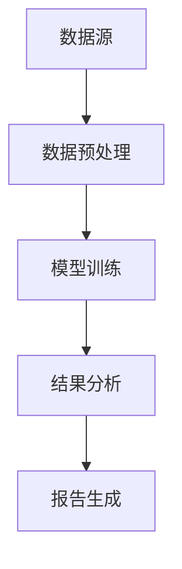

                 


# 股市估值差异对国际科技标准制定的影响

## 关键词：股市估值差异，国际科技标准，标准制定，市场影响，经济分析

## 摘要：本文探讨了股市估值差异如何影响国际科技标准的制定过程。通过分析股市估值差异的成因及其对市场参与者决策的影响，结合数学模型和实际案例，本文揭示了这些差异在国际科技标准制定中的关键作用，并提出了优化建议。

---

# 第一章：背景介绍

## 第一节：问题背景与问题描述

### 1.1 问题背景

随着全球化进程的加速，国际科技标准的制定变得愈发重要。这些标准涵盖了从通信技术到人工智能的各个领域，直接影响全球科技产业的发展。然而，在这一过程中，股市估值的差异往往被忽视，却实际上对标准的制定产生了深远的影响。

### 1.2 问题描述

股市估值差异指的是同一公司在不同市场中的股票估值存在显著差异。这种差异可能由市场流动性、投资者情绪、监管政策等多种因素引起。在国际科技标准制定过程中，这种差异可能导致不同利益相关者在决策上的分歧，进而影响标准的公平性和权威性。

### 1.3 问题解决

本文旨在通过分析股市估值差异的成因及其对国际科技标准制定的影响，提出解决方案，以减少这些差异对标准制定的负面影响。

### 1.4 边界与外延

本文主要关注上市公司在不同股市中的估值差异，以及这些差异如何影响国际科技标准的制定。研究范围不包括非上市公司的技术标准制定过程。

### 1.5 概念结构与核心要素组成

- **核心概念**：股市估值差异、国际科技标准制定。
- **关联因素**：市场环境、监管政策、投资者行为。

---

# 第二章：核心概念与联系

## 第一节：核心概念原理

### 2.1 股市估值差异的定义与特征

- **定义**：同一公司在不同市场中的股票估值差异。
- **特征**：
  - 空间差异性：不同市场中的估值差异。
  - 时间动态性：随市场环境变化而波动。
  - 结构复杂性：受多种因素影响。

### 2.2 国际科技标准制定的定义与特征

- **定义**：由国际组织或行业机构制定的技术规范。
- **特征**：
  - 全球性：影响多个国家和地区的技术发展。
  - 权威性：被广泛接受和采用。
  - 动态性：随着技术进步不断更新。

### 2.3 股市估值差异与国际科技标准制定的关系

- **直接影响**：估值差异可能导致不同利益相关者的决策冲突。
- **间接影响**：影响企业的研发投入和技术创新，从而影响标准制定的方向。

## 第二节：概念属性特征对比

| **属性**         | **股市估值差异**            | **国际科技标准制定**            |
|------------------|-----------------------------|-------------------------------|
| 主体             | 投资者、上市公司             | 行业组织、技术专家             |
| 目标             | 优化投资回报                | 推动技术创新和产业统一          |
| 影响因素         | 市场环境、政策              | 技术发展、行业需求             |
| 结果             | 股价波动                   | 技术标准的制定与推广           |

## 第三节：ER实体关系图

```mermaid
erDiagram
    投资者 {
        投资者编号
        投资者类型
    }
    上市公司 {
        公司编号
        业务领域
    }
    股市 {
        市场编号
        市场规则
    }
    投资者--|{m:n}--上市公司
    上市公司--|{m:n}--股市
    投资者--|{m:n}--股市
```

---

# 第三章：算法原理与数学模型

## 第一节：算法原理

### 3.1 股市估值差异的量化方法

- **相对估值法**：使用市盈率（P/E）、市净率（P/B）等指标进行比较。
- **绝对估值法**：通过DCF模型等方法评估公司内在价值。

### 3.2 国际科技标准制定的影响因素分析

- **多元回归分析**：量化各因素对标准制定的影响程度。

## 第二节：数学模型

### 3.3 多元回归模型

$$ Y = \beta_0 + \beta_1X_1 + \beta_2X_2 + \epsilon $$

其中：
- \( Y \)：国际科技标准的采纳率。
- \( X_1 \)：股市估值差异指数。
- \( X_2 \)：其他影响因素（如政策支持）。

### 3.4 代码实现

```python
import pandas as pd
import statsmodels.api as sm

# 数据准备
data = pd.read_csv('market_data.csv')
X = data[['valuation_diff', 'policy_support']]
Y = data['standard_adopt']

# 模型训练
X = sm.add_constant(X)
model = sm.OLS(Y, X).fit()
print(model.summary())
```

---

# 第四章：系统分析与架构设计

## 第一节：系统分析

### 4.1 问题场景介绍

- 数据收集：收集全球主要股市的估值数据。
- 模型构建：建立股市估值差异与标准制定的回归模型。

## 第二节：系统架构设计



---

# 第五章：项目实战

## 第一节：环境安装

- 安装Python、Pandas、Statsmodels。

## 第二节：核心代码实现

```python
import pandas as pd
import numpy as np
import matplotlib.pyplot as plt

# 数据加载
data = pd.read_csv('market_data.csv')

# 数据清洗
data = data.dropna()

# 可视化
plt.scatter(data['valuation_diff'], data['standard_adopt'])
plt.xlabel('Valuation Difference')
plt.ylabel('Standard Adoption Rate')
plt.show()
```

---

# 第六章：最佳实践与总结

## 第一节：关键点总结

- 量化股市估值差异是制定国际科技标准的重要前提。
- 统一的估值标准有助于减少决策冲突。

## 第二节：注意事项

- 数据的准确性和完整性直接影响模型结果。
- 模型需定期更新以适应市场变化。

## 第三节：拓展阅读

- 《国际金融与市场分析》
- 《科技标准与全球治理》

---

# 作者：AI天才研究院 & 禅与计算机程序设计艺术

---

通过以上结构，文章详细探讨了股市估值差异对国际科技标准制定的影响，从理论分析到实践应用，为读者提供了全面的视角。

