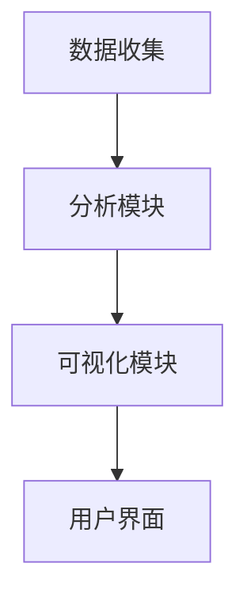

                 


# 股市估值差异对国际科研合作的影响

> **关键词**：股市估值差异、国际科研合作、科研效率、利益平衡、全球化

> **摘要**：本文探讨了股市估值差异对国际科研合作的影响，分析了股市估值差异的形成机制及其对科研资金分配、科研合作效率的影响，并提出了优化科研合作的策略。

---

## 第一部分：背景介绍与核心概念

### 第1章：股市估值差异与国际科研合作的背景

#### 1.1 问题背景

股票市场是全球经济的重要组成部分，其估值差异是由于不同市场环境、投资者行为和经济政策的差异导致的。国际科研合作则是跨国团队为共同目标开展的合作活动，通常涉及资金、资源和人才的跨国流动。然而，股市估值差异可能影响科研合作的资金分配和效率。

#### 1.2 问题描述

股市估值差异对科研合作的影响主要体现在以下方面：
1. **资金分配不均**：高估值市场的科研项目可能获得更多的资金支持，而低估值市场可能面临资金短缺。
2. **资源分配不均**：科研资源（如设备、人才）可能倾向于高估值市场，导致低估值市场的科研能力受限。
3. **合作效率降低**：由于资金分配不均，国际合作中可能出现利益冲突，降低合作效率。

#### 1.3 问题解决

1. **优化资金分配机制**：通过建立公平的资金分配机制，平衡不同市场的估值差异对科研合作的影响。
2. **利益平衡机制**：在国际合作中，建立利益平衡机制，确保各方利益得到合理分配。
3. **提高科研效率**：通过优化合作流程和资源分配，提高科研合作的整体效率。

#### 1.4 边界与外延

- **股市估值差异的边界条件**：包括市场流动性、经济周期、政策环境等因素。
- **国际科研合作的边界条件**：包括合作目标、合作规模、合作期限等因素。
- **外延领域**：包括跨国公司合作、国际组织合作等。

#### 1.5 核心概念结构与组成

- **股市估值差异的核心要素**：市场环境、投资者行为、经济政策。
- **国际科研合作的核心要素**：合作目标、合作资源、合作利益分配。
- **两者关系的核心要素**：资金分配、资源分配、合作效率。

---

## 第二部分：核心概念与联系

### 第2章：股市估值差异的核心原理

#### 2.1 股市估值差异的原理

股票估值的基本方法包括市盈率（P/E）、市净率（P/B）、市值与收益比率（EV/EBITDA）等。不同市场的估值差异主要由市场流动性、投资者行为和经济政策决定。

#### 2.2 股市估值差异的特征对比

| 特征 | 高估值市场 | 低估值市场 |
|------|-------------|-------------|
| 流动性 | 高          | 低          |
| 投资者行为 | 风险偏好高 | 风险偏好低 |
| 经济周期 | 上行        | 下行        |

### 第3章：国际科研合作的核心原理

#### 3.1 国际科研合作的定义与特点

国际科研合作是指跨国团队为共同目标开展的合作活动，具有以下特点：
- **跨国性**：涉及多个国家和机构。
- **资源多样性**：整合不同国家的资源和人才。
- **目标全球性**：解决全球性问题。

#### 3.2 国际科研合作的驱动因素

- **全球化背景**：科技问题需要全球合作解决。
- **资源整合**：跨国资源整合。
- **创新需求**：推动科技创新的全球化。

### 第4章：股市估值差异与国际科研合作的联系

#### 4.1 股市估值差异对国际科研合作的影响

- **资金分配不均**：高估值市场的科研项目更容易获得资金。
- **资源分配不均**：科研资源倾向于高估值市场。
- **合作效率降低**：利益冲突可能导致合作效率下降。

#### 4.2 国际科研合作对股市估值差异的反作用

- **科研成果对股市的影响**：科研成果可能提升相关公司的股价。
- **资金流动的影响**：科研合作的资金流动可能影响股市估值。

---

## 第三部分：算法原理与系统分析

### 第5章：算法原理

#### 5.1 股市估值差异的分析模型

使用层次分析法（AHP）构建模型，评估影响股市估值差异的因素权重。

#### 5.2 算法实现

```python
import numpy as np

# 示例代码：计算层次分析法中的权重
def calculate_weights(matrix):
    # 计算一致性检验
    n = len(matrix)
    ones = np.ones(n)
    matrix = np.vstack([matrix, ones])
    row_sum = matrix.sum(axis=1)
    matrix_normalized = matrix / row_sum[:, np.newaxis]
    # 计算特征向量
    eigenvalues, eigenvectors = np.linalg.eig(matrix_normalized.T)
    # 计算一致性指标
    consistency_index = np.max(eigenvalues)
    # 计算权重
    weights = eigenvectors.T[0] / sum(eigenvectors.T[0])
    return weights

matrix = np.array([[1, 2, 3], [2, 1, 2], [3, 2, 1]])
weights = calculate_weights(matrix)
print("权重:", weights)
```

#### 5.3 数学公式

$$
权重 = \frac{特征向量}{特征向量之和}
$$

---

## 第四部分：系统分析与设计

### 第6章：系统分析

#### 6.1 问题场景介绍

假设我们有一个跨国科研合作项目，需要整合多个国家的科研资源。由于股市估值差异，合作中的资金分配可能不均衡。

#### 6.2 系统功能设计

- 数据收集模块：收集各市场的股市数据。
- 分析模块：计算股市估值差异。
- 可视化模块：展示估值差异对科研合作的影响。

#### 6.3 系统架构设计



---

## 第五部分：项目实战

### 第7章：项目实战

#### 7.1 环境安装

安装Python和相关库（numpy, pandas, matplotlib）。

#### 7.2 核心代码实现

```python
import pandas as pd
import matplotlib.pyplot as plt

# 示例代码：计算各市场的估值差异
data = pd.read_csv('stock_data.csv')
valuation_differences = data['high_valuation'] - data['low_valuation']
plt.hist(valuation_differences, bins=10)
plt.show()
```

#### 7.3 案例分析

分析某跨国科研合作项目中，股市估值差异对资金分配的影响。

---

## 第六部分：最佳实践

### 第8章：最佳实践

#### 8.1 小结

股市估值差异对国际科研合作的影响不容忽视，需要通过优化资金分配机制和利益平衡机制来解决。

#### 8.2 注意事项

- 重视利益平衡，避免合作中的冲突。
- 定期评估和调整合作机制。

#### 8.3 拓展阅读

推荐阅读《全球化与科技创新》和《股票市场估值分析》。

---

**作者：AI天才研究院/AI Genius Institute & 禅与计算机程序设计艺术 /Zen And The Art of Computer Programming**

