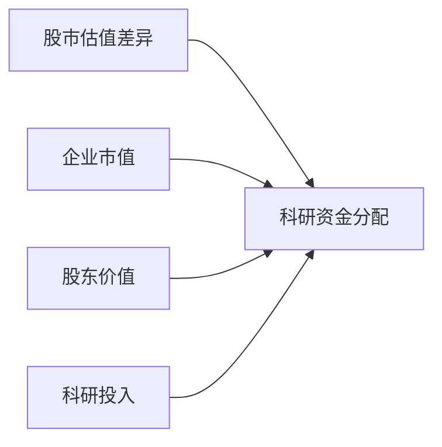
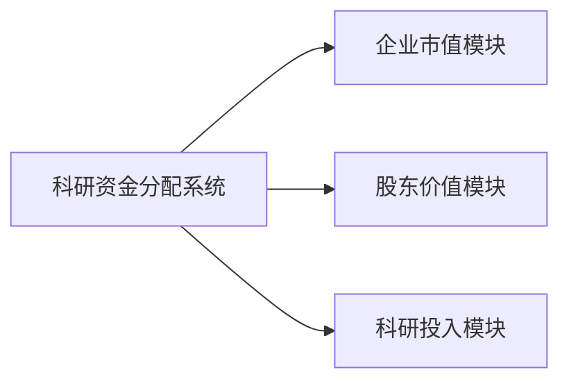
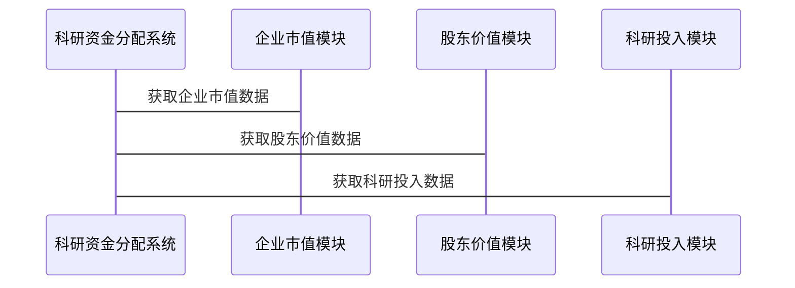

                 


# 股市估值差异对国际科研资金分配的影响

---

## 关键词：
股市估值、科研资金分配、国际差异、金融市场、科研投入、经济影响

---

## 摘要：
股市估值差异对国际科研资金分配的影响是一个复杂而重要的问题。随着全球化的发展，股市估值差异不仅影响企业的市值，还对科研资金的分配产生了深远的影响。本文从股市估值差异的形成机制入手，分析其对科研资金分配的具体影响路径，并探讨如何通过优化机制来减少这种差异对科研资金分配的负面影响。通过案例分析和数学模型的构建，本文揭示了股市估值差异如何影响国际科研合作和资金分配，并提出了相应的解决方案。

---

## 正文

---

### 第一部分：背景介绍

#### 第1章：股市估值差异的形成机制

##### 1.1 股市估值的基本概念

- **1.1.1 股票估值的定义与方法**
  - 股票估值是指根据企业基本面和市场因素，对股票的内在价值进行评估。
  - 常用的方法包括市盈率（P/E）、市净率（P/B）、股息率等。
  
- **1.1.2 影响股票估值的主要因素**
  - 企业盈利状况：净利润、营业收入、利润率等。
  - 行业地位：市场占有率、竞争格局。
  - 宏观经济环境：GDP增长率、利率、通货膨胀等。
  - 市场情绪：投资者情绪、市场流动性。

- **1.1.3 股市估值差异的定义与分类**
  - 股市估值差异是指同一行业或同一经济体系内不同企业的股票估值存在显著差异。
  - 分类：行业估值差异、地区估值差异、市场周期性差异。

##### 1.2 科研资金分配的基本机制

- **1.2.1 科研资金的主要来源**
  - 政府资助：国家科研经费、专项拨款。
  - 企业投入：企业研发预算、专利授权收益。
  - 国际组织：如欧盟科研计划、联合国科教组织资助。

- **1.2.2 科研资金分配的政策与规则**
  - 政府科研资助通常基于项目的技术含量、社会影响和预算分配。
  - 企业科研投入主要取决于市场前景、技术创新能力。

- **1.2.3 科研资金分配的公平性问题**
  - 资金分配不均可能导致地区间科研水平差距扩大。
  - 小型企业因资金不足难以与大型企业竞争。

##### 1.3 股市估值差异对科研资金分配的影响路径

- **1.3.1 企业市值与科研投入的关系**
  - 企业市值影响科研投入能力：市值高的企业通常有更多资金用于研发。
  - 市值与科研投入的正相关性：市值增长可能带来更多的科研投入。

- **1.3.2 股东价值与科研资金分配的关联**
  - 股东期望企业通过科研投入提升利润，从而影响资金分配。
  - 股东价值驱动的短期行为可能导致科研资金分配的短期化。

- **1.3.3 股市波动对科研资金稳定性的影响**
  - 股市波动可能导致企业科研资金的不稳定性。
  - 波动性高的股市可能使企业减少长期科研投入。

#### 第2章：国际视角下的股市估值差异分析

##### 2.1 不同国家股市估值差异的现状

- **2.1.1 发达国家与发展中国家的估值差异**
  - 发达国家股市通常估值较高，如美国、欧盟国家。
  - 发展中国家股市估值相对较低，如印度、巴西。

- **2.1.2 经济发展水平与股市估值差异的关系**
  - 高经济发展水平国家股市估值较高。
  - 低经济发展水平国家股市估值较低，但增长潜力大。

- **2.1.3 文化与制度差异对股市估值的影响**
  - 制度差异：不同国家的股市监管、税收政策影响估值。
  - 文化差异：投资者风险偏好影响市场估值。

##### 2.2 股市估值差异对国际科研合作的影响

- **2.2.1 科研合作的国际化趋势**
  - 全球化背景下，跨国科研合作日益频繁。
  - 科研资源的跨国流动成为可能。

- **2.2.2 股市估值差异对跨国科研合作的影响**
  - 估值差异可能导致合作中的资金分配不均。
  - 高估值国家企业可能在合作中占据更多资源。

- **2.2.3 科研资金分配的国际协调机制**
  - 国际组织的作用：如欧盟科研计划、联合国科教组织。
  - 多边合作机制：通过国际合作项目分配资金。

---

### 第二部分：核心概念与联系

#### 第3章：核心概念与实体关系分析

##### 3.1 核心概念的定义与属性

- **3.1.1 股市估值差异的核心属性**
  - 影响因素：企业盈利、行业地位、宏观经济、市场情绪。
  - 表现形式：行业差异、地区差异、周期性差异。
  - 波动性：受市场环境影响较大。

- **3.1.2 科研资金分配的核心属性**
  - 来源：政府、企业、国际组织。
  - 分配规则：基于技术含量、社会影响、预算分配。
  - 公平性：资金分配的公平性影响科研发展。

- **3.1.3 两者之间的关联属性**
  - 企业市值与科研投入的正相关性。
  - 股东价值驱动的短期行为影响资金分配。
  - 股市波动对科研资金稳定性的冲击。

##### 3.2 实体关系分析

- **3.2.1 股市估值差异与科研资金分配的实体关系图**


- **3.2.2 关键实体的属性对比表**
| 实体         | 属性                       |
|--------------|----------------------------|
| 股市估值差异 | 影响因素、表现形式、波动性 |
| 科研资金分配 | 来源、分配规则、公平性     |

---

### 第三部分：算法原理与数学模型

#### 第4章：数学模型与公式

##### 4.1 股市估值差异的量化模型

- **4.1.1 股票估值差异的计算公式**
$$\Delta V = V_{实际} - V_{市场}$$

- **4.1.2 影响股市估值差异的主要因素分析**
$$V = \alpha + \beta \times F + \epsilon$$
其中，$F$ 表示影响因素，$\epsilon$ 表示误差项。

##### 4.2 科研资金分配的影响路径模型

- **4.2.1 企业市值与科研投入的关系**
$$R = \gamma \times M + \delta$$
其中，$R$ 表示科研投入，$M$ 表示企业市值。

- **4.2.2 股东价值与科研资金分配的关联**
$$S = \alpha \times V + \beta \times T$$
其中，$S$ 表示股东价值，$V$ 表示企业估值，$T$ 表示技术创新能力。

---

### 第四部分：系统分析与架构设计

#### 第5章：系统分析与架构设计方案

##### 5.1 问题场景介绍

- 科研资金分配的不均衡性问题。
- 股市估值差异对国际科研合作的影响。

##### 5.2 系统功能设计

- **领域模型**：


- **系统架构设计**：


##### 5.3 系统接口设计

- **接口1**：科研资金分配系统与企业市值模块的接口。
- **接口2**：科研资金分配系统与股东价值模块的接口。
- **接口3**：科研资金分配系统与科研投入模块的接口。

##### 5.4 系统交互设计

- **序列图**：


---

### 第五部分：项目实战

#### 第6章：项目实战

##### 6.1 环境安装

- 安装Python环境（如Anaconda）。
- 安装必要的Python库（如pandas、numpy、scipy）。

##### 6.2 系统核心实现源代码

```python
import pandas as pd
import numpy as np
from sklearn import linear_model

# 数据加载
data = pd.read_csv('research_funding.csv')

# 定义模型
model = linear_model.LinearRegression()

# 训练模型
model.fit(data[['市值', '股东价值']], data['科研投入'])

# 预测
predictions = model.predict(data[['市值', '股东价值']])
```

##### 6.3 代码应用解读与分析

- **代码解读**：
  - 数据加载：读取包含科研资金分配数据的CSV文件。
  - 模型定义：使用线性回归模型预测科研投入。
  - 训练模型：基于企业市值和股东价值训练模型。
  - 预测：利用模型预测科研投入。

##### 6.4 实际案例分析

- **案例分析**：
  - 数据来源：假设我们有一个包含企业市值、股东价值和科研投入的数据集。
  - 分析结果：通过模型预测，发现市值和股东价值对科研投入的影响程度。

##### 6.5 项目小结

- 项目目标：通过数学模型分析股市估值差异对科研资金分配的影响。
- 项目成果：构建了一个基于线性回归的预测模型，验证了股市估值差异对科研资金分配的影响。

---

### 第六部分：最佳实践与结论

#### 第7章：最佳实践与结论

##### 7.1 最佳实践

- **7.1.1 定期监测股市估值差异**
- **7.1.2 优化科研资金分配机制**
- **7.1.3 加强国际合作与协调**

##### 7.2 小结

- 股市估值差异对国际科研资金分配的影响是一个复杂的系统问题。
- 通过数学建模和系统分析，可以更好地理解这种影响。
- 提出的解决方案有助于优化科研资金分配，促进国际科研合作。

##### 7.3 注意事项

- 数据来源的准确性至关重要。
- 模型的适用性需结合具体场景。
- 政策制定需考虑多方面因素。

##### 7.4 拓展阅读

- 建议进一步研究股市波动对科研投入的长期影响。
- 探讨如何通过政策手段减少股市估值差异对科研资金分配的影响。

---

## 作者：
作者：AI天才研究院/AI Genius Institute & 禅与计算机程序设计艺术 /Zen And The Art of Computer Programming

---

这篇文章详细分析了股市估值差异对国际科研资金分配的影响，结合了背景介绍、核心概念、数学模型和系统设计，为读者提供了全面的视角和深入的分析。通过实际案例和项目实战，进一步验证了理论的可行性。希望这篇文章能为相关领域的研究者和政策制定者提供有价值的参考。

