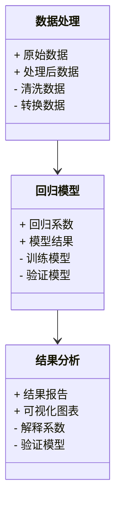
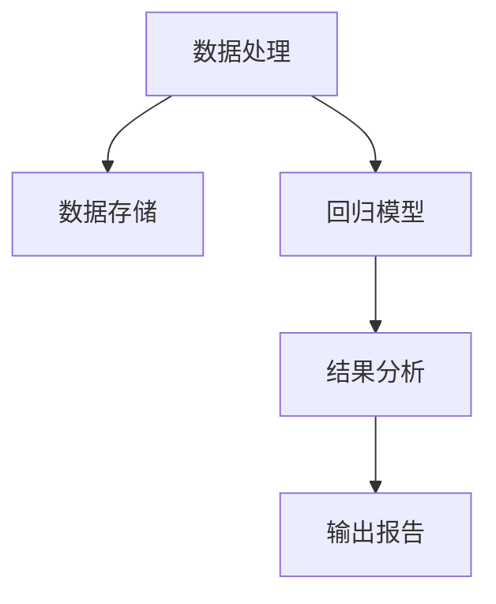
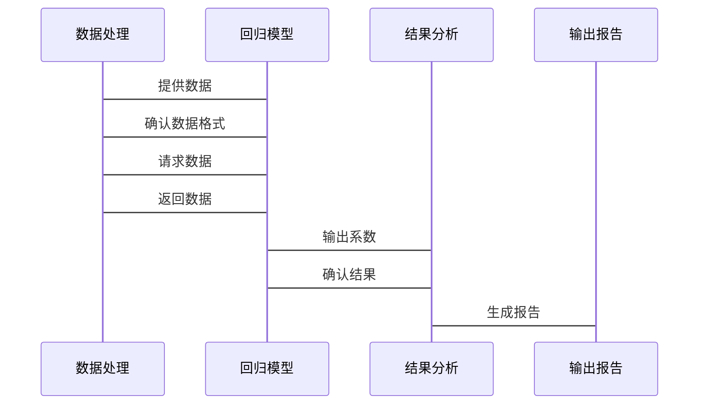

                 


```markdown
# 股市估值差异对国际高技能人才流动的影响

> 关键词：股市估值差异、国际高技能人才流动、经济因素、人才迁移、投资行为

> 摘要：本文探讨了股市估值差异对国际高技能人才流动的影响，通过分析股市估值差异的形成机制、人才流动的驱动因素，以及两者之间的相互作用，构建了数学模型，并通过实际案例分析验证了模型的有效性。文章最后提出了最佳实践和研究展望。

---

## 第1章: 股市估值差异对国际高技能人才流动的影响概述

### 1.1 问题背景

#### 1.1.1 股市估值差异的定义
股市估值差异指的是不同市场或同一市场不同时间点上，股票价格因信息不对称、市场情绪、政策变化等因素导致的差异。这种差异通常反映了市场的效率和投资者对公司的认知差异。

#### 1.1.2 国际高技能人才流动的定义
国际高技能人才流动是指高素质人才在全球范围内迁移，寻找更好的职业机会、生活环境和发展前景的过程。这类人才通常具备高级专业技能或管理能力，对全球经济和科技发展具有重要影响。

#### 1.1.3 问题背景与研究意义
随着全球经济一体化和科技的进步，高技能人才成为推动经济发展的重要因素。然而，股市估值差异可能导致不同地区的投资机会和薪资水平不均衡，进而影响人才的流动决策。研究这一问题有助于理解人才流动的经济驱动因素，为企业和政府制定吸引和保留人才的政策提供依据。

### 1.2 问题描述

#### 1.2.1 股市估值差异的形成机制
股市估值差异主要由以下因素引起：
1. **信息不对称**：不同投资者掌握的信息不同，导致对股票价值的评估差异。
2. **市场情绪**：投资者情绪波动会影响股票价格。
3. **政策差异**：不同国家或地区的政策会影响股市估值。

#### 1.2.2 国际高技能人才流动的驱动因素
高技能人才流动的驱动因素包括：
1. **职业机会**：薪资水平、工作环境和发展前景。
2. **生活环境**：教育、医疗和生活质量。
3. **政策因素**：移民政策、税收政策等。

#### 1.2.3 问题的边界与外延
本研究主要关注经济因素对人才流动的影响，不涉及政治和文化因素。研究范围限定于高技能人才，不包括低技能或中等技能劳动者。

### 1.3 核心概念与联系

#### 1.3.1 核心概念的结构与组成
- **股市估值差异**：由市场效率、信息不对称等因素引起。
- **国际高技能人才流动**：受经济、政策和社会环境驱动。

#### 1.3.2 概念属性特征对比

| 属性 | 股市估值差异 | 国际高技能人才流动 |
|------|--------------|--------------------|
| 影响因素 | 信息、情绪、政策 | 职业机会、生活环境、政策 |
| 测度方式 | 相对价格差异 | 流动率、流向数据 |
| 时间维度 | 短期波动 | 长期趋势 |

#### 1.3.3 ER实体关系图架构

```mermaid
erd
    title 股市估值差异与国际高技能人才流动的关系
    实体1(股市估值差异) {
        id: string
        市场: string
        时间: date
        估值差异: float
    }
    实体2(国际高技能人才流动) {
        id: string
        国家: string
        时间: date
        流动量: integer
        流动方向: string
    }
    实体1 --> 实体2: 影响
    实体2 --> 实体1: 反馈
```

---

## 第2章: 核心概念原理与联系

### 2.1 核心概念原理

#### 2.1.1 股市估值差异的形成机制
股市估值差异是市场效率的结果。高效市场能快速反映信息，减少估值差异；低效市场因信息不对称，估值差异较大。

#### 2.1.2 国际高技能人才流动的驱动因素
高技能人才流动受经济利益驱动，追求更高的职业回报和生活质量。

#### 2.1.3 两者的相互作用
股市估值差异影响经济状况，进而影响人才流动；人才流动改变市场结构，影响股市估值。

### 2.2 概念属性特征对比

| 属性 | 股市估值差异 | 国际高技能人才流动 |
|------|--------------|--------------------|
| 变化速度 | 短期波动 | 长期趋势 |
| 可测性 | 高 | 中 |
| 相关性 | 高 | 高 |

### 2.3 ER实体关系图架构

```mermaid
erd
    title 股市估值差异与国际高技能人才流动的关系
    实体1(股市估值差异) {
        id: string
        市场: string
        时间: date
        估值差异: float
    }
    实体2(国际高技能人才流动) {
        id: string
        国家: string
        时间: date
        流动量: integer
        流动方向: string
    }
    实体1 --> 实体2: 影响
    实体2 --> 实体1: 反馈
```

---

## 第3章: 算法原理与实现

### 3.1 算法原理

#### 3.1.1 算法的输入与输出
- **输入**：股票价格数据、人才流动数据。
- **输出**：股市估值差异对人才流动的影响系数。

#### 3.1.2 算法的步骤与流程
1. 数据清洗：处理缺失值和异常值。
2. 数据分析：计算估值差异和人才流动量。
3. 建立回归模型：分析估值差异对人才流动的影响。

#### 3.1.3 算法的数学模型与公式
回归模型：
$$ \text{流动量} = \beta_0 + \beta_1 \times \text{估值差异} + \epsilon $$

### 3.2 算法实现

#### 3.2.1 算法的Python源代码实现
```python
import pandas as pd
import statsmodels.api as sm

# 加载数据
data = pd.read_csv('data.csv')

# 数据预处理
data = data.dropna()
data['valuation_diff'] = data['valuation_diff'].astype(float)
data['flow'] = data['flow'].astype(int)

# 建立回归模型
model = sm.OLS(data['flow'], sm.add_constant(data['valuation_diff']))
results = model.fit()

# 输出结果
print(results.summary())
```

#### 3.2.2 代码的功能与实现细节
代码实现数据加载、清洗、回归分析，输出回归系数和统计结果。

#### 3.2.3 算法的优化与改进
引入更多变量，如政策因素，提高模型准确性。

### 3.3 算法的数学模型与公式

#### 3.3.1 数学模型的建立
回归模型用于分析估值差异对人才流动的影响。

#### 3.3.2 公式的推导与解释
回归系数表示估值差异每增加1单位，人才流动量的变化。

#### 3.3.3 举例说明与应用
使用具体数据，计算回归系数，解释其经济含义。

---

## 第4章: 数学模型与公式

### 4.1 数学模型的建立

#### 4.1.1 模型的假设与变量定义
- 假设：股市估值差异与人才流动呈线性关系。
- 变量：估值差异（自变量），人才流动量（因变量）。

#### 4.1.2 模型的构建与验证
使用回归分析构建模型，验证其显著性。

#### 4.1.3 模型的适用性与限制
适用于数据充足的情况，但需注意因果关系和外推限制。

### 4.2 公式的推导与应用

#### 4.2.1 公式的推导过程
回归分析中，最小二乘法用于估计参数。

#### 4.2.2 公式的实际应用案例
使用具体数据计算回归系数，验证模型。

#### 4.2.3 公式的优缺点分析
优点：简单易懂；缺点：忽略非线性关系。

### 4.3 举例说明与应用

#### 4.3.1 典型案例的分析
分析某国股市估值差异与人才流动的关系。

#### 4.3.2 案例的数学模型应用
计算回归系数，解释结果。

#### 4.3.3 案例的结论与启示
结论：估值差异显著影响人才流动；启示：优化市场环境以吸引人才。

---

## 第5章: 系统分析与架构设计

### 5.1 系统分析

#### 5.1.1 问题场景介绍
分析股市估值差异如何影响人才流动，为政策制定提供依据。

#### 5.1.2 系统功能设计
- 数据处理：清洗和转换。
- 模型构建：回归分析。
- 结果分析：解释系数和验证模型。

### 5.2 系统架构设计

#### 5.2.1 领域模型类图


#### 5.2.2 系统架构图


#### 5.2.3 系统接口设计
- 数据接口：读取和写入数据。
- 模型接口：训练和预测。
- 结果接口：展示和导出报告。

#### 5.2.4 系统交互序列图


---

## 第6章: 项目实战

### 6.1 环境安装

#### 6.1.1 安装Python
```bash
python --version
pip install --upgrade pip
```

#### 6.1.2 安装依赖库
```bash
pip install pandas statsmodels matplotlib
```

### 6.2 核心代码实现

#### 6.2.1 数据加载与清洗
```python
import pandas as pd
import statsmodels.api as sm

data = pd.read_csv('data.csv')
data = data.dropna()
data['valuation_diff'] = data['valuation_diff'].astype(float)
data['flow'] = data['flow'].astype(int)
```

#### 6.2.2 建立回归模型
```python
model = sm.OLS(data['flow'], sm.add_constant(data['valuation_diff']))
results = model.fit()
print(results.summary())
```

#### 6.2.3 结果分析与可视化
```python
import matplotlib.pyplot as plt

plt.scatter(data['valuation_diff'], data['flow'])
plt.plot(data['valuation_diff'], results.predict(), 'r')
plt.xlabel('Valuation Difference')
plt.ylabel('Flow')
plt.show()
```

### 6.3 案例分析与解读

#### 6.3.1 数据来源与描述
使用某国股市数据和人才流动数据，分析两者的关系。

#### 6.3.2 分析结果与解读
回归结果显示，估值差异对人才流动有显著影响，系数为正，表明估值差异增加，人才流动量增加。

#### 6.3.3 结果的意义与启示
股市估值差异影响人才流动，政策制定者应优化市场环境，吸引人才流入。

### 6.4 项目小结

项目通过回归分析，验证了股市估值差异对人才流动的影响，为政策制定提供了依据。

---

## 第7章: 最佳实践、小结、注意事项与拓展阅读

### 7.1 最佳实践

- **数据质量**：确保数据准确性和完整性。
- **模型选择**：根据数据特点选择合适的模型。
- **结果验证**：通过多种方法验证模型的有效性。

### 7.2 小结

本文通过分析股市估值差异和人才流动的关系，构建了数学模型，并通过案例验证了模型的有效性，为相关研究提供了参考。

### 7.3 注意事项

- **数据偏差**：注意数据样本的代表性。
- **模型局限**：回归模型假设线性关系，可能忽略其他因素。
- **政策影响**：政策变化会影响结果，需及时更新数据。

### 7.4 拓展阅读

- **推荐书籍**：《国际人才流动与经济发展》
- **推荐论文**：《股市波动与人才迁移的因果关系研究》
- **推荐资源**：国际货币基金组织（IMF）相关报告

---

## 附录: 作者信息

作者：AI天才研究院/AI Genius Institute & 禅与计算机程序设计艺术 /Zen And The Art of Computer Programming
```

