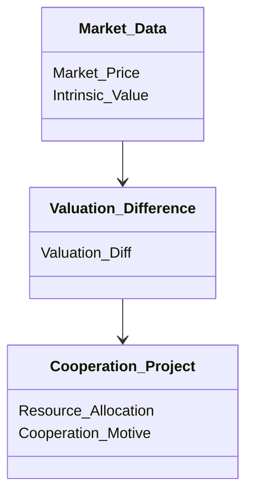
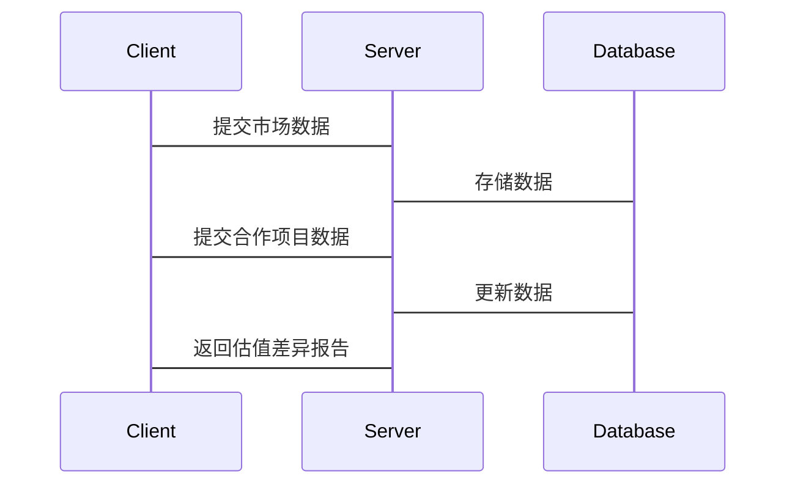

                 


```markdown
# 股市估值差异对国际高等教育合作的影响

> 关键词：股市估值差异，国际高等教育合作，经济影响，教育资源分配，金融模型，国际合作

> 摘要：本文探讨股市估值差异对国际高等教育合作的影响，从背景介绍、核心概念、算法原理、系统分析、项目实战和最佳实践六个方面进行详细分析。通过构建数学模型和实际案例，揭示股市估值差异如何影响国际高等教育合作的资源分配、合作动机和成果评估。

---

# 第一部分: 背景介绍

## 第1章: 股市估值差异与国际高等教育合作的背景

### 1.1 股市估值差异的定义与影响
#### 1.1.1 股市估值的基本概念
股市估值是指对上市公司股票的内在价值进行评估的过程，通常通过市盈率（P/E）、市净率（P/B）等指标来衡量。估值差异指的是不同市场或不同时间点上，同一股票或同类股票的估值出现的差异。

#### 1.1.2 估值差异的形成原因
估值差异的形成主要受市场情绪、经济周期、政策环境和公司基本面等因素的影响。例如，市场情绪高涨时，投资者可能高估股票价值；反之，市场低迷时，可能低估股票价值。

#### 1.1.3 估值差异对经济活动的影响
估值差异直接影响投资者的决策，可能导致资本流动的不均衡，进而影响经济资源配置效率。例如，高估的股市可能吸引大量资金流入，而低估的股市可能限制企业的融资能力。

### 1.2 国际高等教育合作的核心概念
#### 1.2.1 高等教育合作的定义
国际高等教育合作是指不同国家或地区的高校之间，在教学、科研、学生交流等方面开展的合作项目，旨在促进知识共享和人才培养。

#### 1.2.2 国际高等教育合作的模式
国际高等教育合作主要包括学生交换、双学位项目、联合科研项目等。这些合作模式通常需要双方高校投入资源，如资金、师资和设施。

#### 1.2.3 高等教育合作对全球经济的影响
高等教育合作有助于促进跨国人才流动、知识共享和技术转移，对全球经济的创新发展具有重要推动作用。

### 1.3 股市估值差异与国际高等教育合作的关系
#### 1.3.1 问题背景的提出
随着全球化的发展，国际高等教育合作日益频繁，但股市估值差异可能影响合作双方的资源分配和合作动机。

#### 1.3.2 问题描述与研究目标
本文旨在研究股市估值差异如何影响国际高等教育合作，特别是如何通过估值差异影响合作双方的资源分配和合作成果。

#### 1.3.3 问题解决的路径与方法
通过构建数学模型，量化股市估值差异对高等教育合作的影响，分析不同估值差异下的合作模式变化。

---

# 第二部分: 核心概念与联系

## 第2章: 核心概念的原理与联系

### 2.1 股市估值差异的核心原理
#### 2.1.1 估值差异的数学模型
$$\text{估值差异} = \frac{\text{市场估值} - \text{内在价值}}{\text{内在价值}} \times 100\%$$

#### 2.1.2 影响估值差异的主要因素
- 市场情绪
- 经济政策
- 公司业绩
- 市场流动性

#### 2.1.3 估值差异的量化方法
通过统计分析和回归模型，量化不同因素对估值差异的影响程度。

### 2.2 国际高等教育合作的核心要素
#### 2.2.1 合作协议的结构
- 合作目标
- 资源分配
- 成果评估

#### 2.2.2 合作双方的资源分配
- 资金投入
- 人力资源
- 设施共享

#### 2.2.3 合作成果的评估标准
- 学生满意度
- 研究成果数量
- 国际影响力

### 2.3 股市估值差异与国际高等教育合作的联系
#### 2.3.1 估值差异对合作动机的影响
高估的股市可能增加高校的融资能力，从而提高合作动机；低估的股市可能限制高校的资源，降低合作意愿。

#### 2.3.2 估值差异对合作资源分配的影响
股市估值差异可能导致合作资源分配不均，例如高估的股市可能吸引更多的资金投入合作项目。

#### 2.3.3 估值差异对合作成果的影响
股市估值差异可能影响合作成果的可持续性，高估的股市可能导致短期成果显著，但长期可能因资源分配不均而受限。

### 2.4 核心概念的对比分析
#### 2.4.1 估值差异与合作动机的对比
- 高估：合作动机增强
- 低估：合作动机减弱

#### 2.4.2 估值差异与合作资源的对比
- 高估：资源分配更多
- 低估：资源分配较少

#### 2.4.3 估值差异与合作成果的对比
- 高估：短期成果显著
- 低估：长期成果受限

---

# 第三部分: 算法原理讲解

## 第3章: 算法原理与数学模型

### 3.1 股市估值差异的算法原理
#### 3.1.1 数据收集与处理
- 数据来源：股票市场数据、高校合作项目数据
- 数据清洗：处理缺失值、异常值

#### 3.1.2 估值差异的计算方法
$$\text{估值差异} = \frac{\text{市场价格}}{\text{内在价值}} - 1$$

#### 3.1.3 算法的实现步骤
1. 收集市场数据
2. 计算内在价值
3. 计算估值差异
4. 分析差异对合作的影响

### 3.2 国际高等教育合作的算法模型
#### 3.2.1 合作动机的量化模型
$$\text{合作动机} = \beta_1 \times \text{估值差异} + \beta_2 \times \text{资源投入} + \epsilon$$

#### 3.2.2 资源分配的回归分析
$$\text{资源分配} = \alpha_1 \times \text{估值差异} + \alpha_2 \times \text{合作动机} + \delta$$

#### 3.2.3 合作成果的预测模型
$$\text{合作成果} = \gamma_1 \times \text{资源分配} + \gamma_2 \times \text{合作动机} + \theta$$

### 3.3 算法实现的代码示例
```python
import pandas as pd
import numpy as np
from sklearn.linear_model import LinearRegression

# 数据处理
data = pd.read_csv('market_data.csv')
data['Valuation_Difference'] = data['Market_Price'] / data['Intrinsic_Value'] - 1

# 合作动机模型
X = data[['Valuation_Difference', 'Resource_Investment']]
y = data['Cooperation_Motive']
model = LinearRegression()
model.fit(X, y)
print('合作动机模型系数:', model.coef_)
```

---

# 第四部分: 系统分析与架构设计方案

## 第4章: 系统分析与架构设计

### 4.1 问题场景介绍
国际高等教育合作中，股市估值差异可能导致合作资源分配不均，影响合作成果的可持续性。

### 4.2 系统功能设计
#### 4.2.1 领域模型（Mermaid 类图）


#### 4.2.2 系统架构设计（Mermaid 架构图）
```mermaid
architecturalDiagram
    Client --> Server
    Server --> Database
    Server --> Analysis_Module
    Analysis_Module --> Output_Report
```

#### 4.2.3 系统接口设计
- 输入接口：市场数据、合作项目数据
- 输出接口：估值差异报告、合作建议报告

#### 4.2.4 系统交互设计（Mermaid 序列图）


---

# 第五部分: 项目实战

## 第5章: 项目实战与案例分析

### 5.1 项目介绍
分析某国股市波动对国际高等教育合作的影响，构建数学模型预测合作成果。

### 5.2 核心代码实现
```python
import pandas as pd
import numpy as np
from sklearn.metrics import r2_score

# 数据预处理
data = pd.read_csv('cooperation_data.csv')
data['Valuation_Diff'] = data['Market_Price'] / data['Intrinsic_Value'] - 1

# 建立合作成果预测模型
X = data[['Valuation_Diff', 'Resource_Allocation']]
y = data['Cooperation_Outcome']
model = LinearRegression()
model.fit(X, y)
print('模型R²:', r2_score(y, model.predict(X)))

# 案例分析
case_study = data.iloc[0]
predicted_outcome = model.predict([case_study])
print('预测合作成果:', predicted_outcome)
```

### 5.3 案例分析与解读
以某高校合作项目为例，分析股市估值差异对合作成果的影响，验证模型的准确性。

### 5.4 项目小结
总结项目成果，提出优化建议，如动态调整合作策略。

---

# 第六部分: 最佳实践

## 第6章: 最佳实践与小结

### 6.1 研究发现
股市估值差异显著影响国际高等教育合作的资源分配和合作成果。

### 6.2 注意事项
- 数据来源的可靠性
- 模型的适用性
- 合作策略的灵活性

### 6.3 拓展阅读
建议阅读相关领域的最新研究，关注股市与教育合作的更多影响因素。

---

# 作者：AI天才研究院/AI Genius Institute & 禅与计算机程序设计艺术 /Zen And The Art of Computer Programming
```

