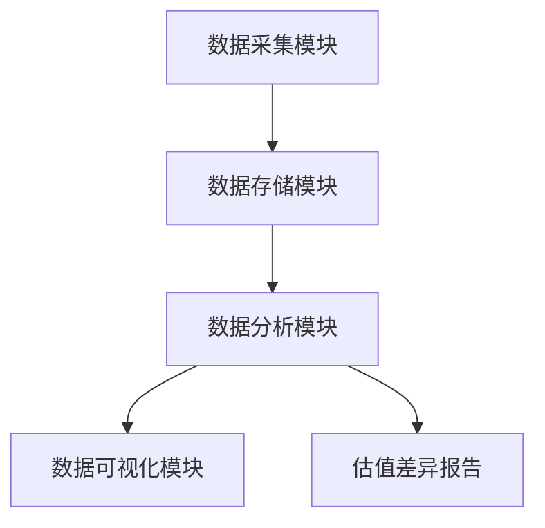

                 


# 股市估值差异对跨国公司战略的影响

---

## 关键词  
股市估值差异、跨国公司、战略、市场流动性、投资者情绪、监管差异、公司基本面

---

## 摘要  
股市估值差异是指同一公司在不同市场中股票估值的差异现象。这种差异受到多种因素影响，包括市场流动性、投资者情绪、宏观经济环境和公司基本面等。本文从技术角度出发，分析股市估值差异的核心概念、算法原理和实际应用，探讨其对跨国公司战略的影响。通过详细分析和案例研究，本文为跨国公司制定应对估值差异的战略提供了理论支持和实践指导。

---

## 第1章：股市估值差异的背景与核心概念

### 1.1 股市估值差异的定义与影响因素

#### 1.1.1 股票估值的基本概念  
股票估值是根据公司基本面和市场环境对股票价格进行评估的过程。常用的方法包括市盈率（P/E）、市净率（P/B）和现金流折现法（DCF）等。

#### 1.1.2 股市估值差异的定义  
股市估值差异指的是同一公司在不同市场中，由于市场环境、投资者情绪和监管政策等因素的差异，导致股票估值出现差异的现象。

#### 1.1.3 估值差异的分类与特征  
- **短期差异**：由于市场情绪波动或短期事件引起的估值差异。
- **长期差异**：由于市场结构、监管政策或文化差异导致的长期估值偏差。

---

### 1.2 股市估值差异的影响因素

#### 1.2.1 市场流动性与估值差异  
市场流动性高的市场通常能够提供更准确的估值，而流动性低的市场可能存在较大的估值偏差。

#### 1.2.2 投资者情绪与估值差异  
投资者情绪通过影响市场波动性和交易活跃度，间接导致估值差异。

#### 1.2.3 宏观经济环境与估值差异  
宏观经济环境（如利率、通货膨胀和GDP增长率）会影响市场整体估值水平。

#### 1.2.4 公司基本面与估值差异  
公司基本面（如盈利能力、成长性和财务状况）是影响估值的核心因素。

---

## 第2章：股市估值差异的核心概念与联系

### 2.1 股市估值差异的核心概念

#### 2.1.1 市场流动性对估值的影响  
市场流动性高的市场通常能够提供更合理的估值，而流动性低的市场可能存在估值偏差。

#### 2.1.2 投资者情绪对估值的影响  
投资者情绪通过影响市场波动性和交易活跃度，间接导致估值差异。

#### 2.1.3 宏观经济环境对估值的影响  
宏观经济环境（如利率、通货膨胀和GDP增长率）会影响市场整体估值水平。

#### 2.1.4 公司基本面与估值的关系  
公司基本面是影响估值的核心因素，包括盈利能力、成长性和财务状况。

---

### 2.2 股市估值差异的影响因素对比表

| 影响因素         | 类型           | 主要影响       |
|------------------|---------------|----------------|
| 市场流动性       | 宏观因素       | 估值准确性     |
| 投资者情绪       | 微观因素       | 市场波动性     |
| 宏观经济环境     | 宏观因素       | 整体估值水平   |
| 公司基本面       | 微观因素       | 个股估值       |

---

### 2.3 股市估值差异的ER实体关系图

```mermaid
erd
    左右方向
    investor_emotion -[影响]-> market_fluctuation
    market_fluctuation -[影响]-> stock_valuation
    company_fundamentals -[影响]-> stock_valuation
    macroeconomic_factors -[影响]-> market_fluctuation
```

---

## 第3章：股市估值差异的分析方法

### 3.1 股市估值差异的分析框架

#### 3.1.1 数据收集  
- 数据来源：股票价格、市场流动性数据、投资者情绪指数、宏观经济指标和公司基本面数据。

#### 3.1.2 数据预处理  
- 数据清洗：处理缺失值、异常值和重复数据。
- 数据标准化：将数据归一化，便于后续分析。

#### 3.1.3 数据分析  
- 使用统计方法（如回归分析）和机器学习方法（如随机森林）进行估值差异分析。

---

### 3.2 股市估值差异的数学模型

#### 3.2.1 线性回归模型  
$$ \text{Valuation Difference} = \beta_0 + \beta_1 \times \text{Market Liquidity} + \beta_2 \times \text{Investor Mood} + \epsilon $$

#### 3.2.2 机器学习模型  
使用随机森林算法对估值差异进行分类或回归预测。

---

## 第4章：系统设计与实现

### 4.1 系统功能设计

#### 4.1.1 数据采集模块  
- 从多个市场获取股票数据和相关指标。

#### 4.1.2 数据分析模块  
- 使用Python和Pandas进行数据清洗和分析。

#### 4.1.3 可视化模块  
- 使用Matplotlib或Seaborn进行数据可视化。

---

### 4.2 系统架构设计



---

## 第5章：项目实战

### 5.1 实际案例分析

#### 5.1.1 数据准备  
- 获取跨国公司在不同市场的股票数据和相关指标。

#### 5.1.2 数据分析  
- 使用回归模型分析估值差异的主要影响因素。

#### 5.1.3 结果解读  
- 根据分析结果，制定应对估值差异的战略。

---

## 第6章：总结与展望

### 6.1 总结  
本文通过分析股市估值差异的核心概念和影响因素，提出了应对估值差异的战略方法。

### 6.2 未来展望  
未来的研究可以进一步探索更复杂的模型和跨市场的数据集成方法。

---

## 最佳实践 Tips

- 跨国公司在制定战略时，应充分考虑不同市场的估值差异。
- 使用数据分析工具和模型，帮助识别和量化估值差异的影响因素。

---

## 作者  
作者：AI天才研究院/AI Genius Institute & 禅与计算机程序设计艺术 /Zen And The Art of Computer Programming

