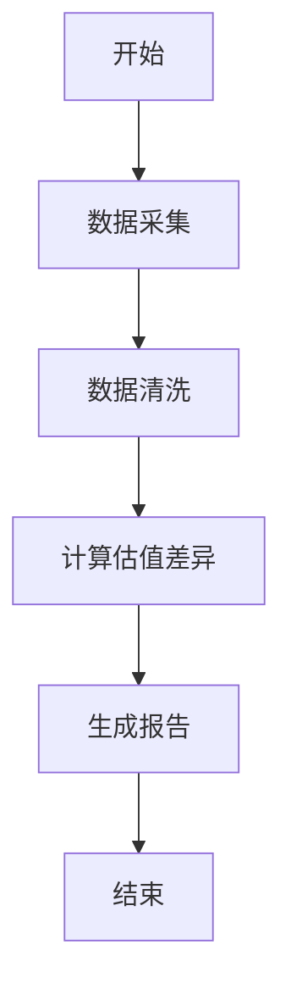

                 


# 股市估值差异对跨境并购活动的影响

> 关键词：股市估值差异、跨境并购、市场效率、信息不对称、并购决策

> 摘要：本文探讨股市估值差异如何影响跨境并购活动。通过分析估值差异的形成机制、市场参与者行为及并购决策过程，揭示估值差异对并购活动的深远影响。结合实际案例和系统架构设计，提供深入的分析与见解。

---

## 第一部分：背景介绍

### 1.1 股市估值差异的定义与概念

#### 1.1.1 股市估值的基本概念
股市估值是通过对公司财务数据和市场因素的分析，确定公司股票的合理价格。常用的估值方法包括市盈率（P/E）、市净率（P/B）、股息率等。估值差异指同一公司股票在不同市场上的价格差异。

#### 1.1.2 估值差异的形成原因
1. 市场效率差异：不同市场的信息不对称导致价格差异。
2. 经济环境差异：GDP增长率、利率等宏观经济因素影响估值。
3. 投资者行为差异：不同投资者的风险偏好和交易策略影响价格。

#### 1.1.3 估值差异的度量方法
常用度量方法包括：
- 相对估值法：比较不同市场的P/E、P/B等指标。
- 绝对估值法：DCF模型评估公司内在价值。

### 1.2 跨境并购的基本概念

#### 1.2.1 跨境并购的定义
跨境并购是指一家公司收购另一家不同国家的公司，涉及跨国界资产和股权交易。

#### 1.2.2 跨境并购的分类
1. 横向并购：收购同行业竞争对手。
2. 纵向并购：收购供应链上下游企业。
3. 多元化并购：收购不同行业的企业。

#### 1.2.3 跨境并购的驱动因素
1. 市场扩展：进入新市场。
2. 资源获取：获取技术、品牌或劳动力。
3. 成本优势：利用目标国的成本优势。

### 1.3 股市估值差异与跨境并购的关系

#### 1.3.1 估值差异对并购活动的影响
1. 低估目标公司：估值差异可能导致并购方低估目标公司价值，影响并购决策。
2. 高估风险：高估可能导致并购方支付过高，增加财务风险。

#### 1.3.2 并购活动对估值差异的反馈作用
1. 并购后整合：整合过程可能影响目标公司估值。
2. 市场信息反馈：并购活动可能改变市场对公司的估值预期。

---

## 第二部分：股市估值差异的形成机制

### 2.1 市场效率与估值差异

#### 2.1.1 市场效率的定义
市场效率指市场反映信息的速度和程度，高效市场能快速反映所有相关信息。

#### 2.1.2 不同市场效率对估值差异的影响
1. 低效市场：信息不对称导致价格偏离真实价值。
2. 高效市场：价格反映所有公开信息，估值差异较小。

### 2.2 信息不对称与估值差异

#### 2.2.1 信息不对称的定义
信息不对称指市场参与者掌握的信息不一致，导致价格差异。

#### 2.2.2 信息不对称对估值差异的影响
1. 买方劣势：买家掌握信息少于卖家，可能导致高估。
2. 卖方优势：卖家利用信息优势影响价格。

### 2.3 市场参与者行为对估值差异的影响

#### 2.3.1 投资者行为
1. 投资者情绪：情绪波动影响价格，导致估值差异。
2. 群体思维：从众心理加剧估值差异。

#### 2.3.2 机构投资者的作用
1. 机构投资者通过专业分析减少估值差异。
2. 机构行为可能加剧短期波动，扩大估值差异。

#### 2.3.3 市场操纵与估值差异
1. 操纵行为：通过虚假信息影响价格，扩大估值差异。
2. 监管措施：监管机构打击操纵行为，减少估值差异。

---

## 第三部分：股市估值差异对跨境并购决策的影响

### 3.1 估值差异对并购目标选择的影响

#### 3.1.1 目标公司估值差异的分析
1. 通过相对估值法识别低估公司。
2. 通过DCF模型评估内在价值。

#### 3.1.2 不同估值差异下的并购决策
1. 低估目标：并购方可能低估目标公司价值，导致并购决策失误。
2. 高估目标：并购方可能支付过高，增加财务风险。

### 3.2 估值差异对并购支付方式的影响

#### 3.2.1 现金支付与估值差异
1. 现金支付直接反映市场对目标公司的估值。
2. 高估目标可能导致现金支付过高，增加并购方的财务负担。

#### 3.2.2 股权支付与估值差异
1. 股权支付基于市场对公司股票的估值。
2. 高估目标可能导致股权支付比例过高，稀释并购方股权。

### 3.3 估值差异对并购整合的影响

#### 3.3.1 估值差异对整合策略的影响
1. 低估目标可能导致整合资源分配不合理。
2. 高估目标可能导致整合成本过高。

#### 3.3.2 估值差异对整合风险的影响
1. 低估目标可能导致整合后业绩不达预期。
2. 高估目标可能导致整合后资产减值风险。

---

## 第四部分：系统架构与算法设计

### 4.1 系统功能设计

#### 4.1.1 系统模块划分
1. 数据采集模块：收集相关股票数据。
2. 估值计算模块：计算估值差异。
3. 并购决策模块：基于估值差异做出并购决策。

#### 4.1.2 系统功能流程图


### 4.2 算法设计

#### 4.2.1 估值差异计算算法
```python
def calculate_valuation_difference(stock_price_domestic, stock_price_foreign):
    difference = stock_price_domestic - stock_price_foreign
    return difference
```

#### 4.2.2 并购决策算法
```python
def merger_decision(valuation_diff, threshold):
    if valuation_diff < threshold:
        return "并购"
    else:
        return "不并购"
```

---

## 第五部分：案例分析与项目实战

### 5.1 案例分析

#### 5.1.1 案例背景
某公司A在本国股市估值为100亿元，而在目标国股市估值为80亿元。

#### 5.1.2 估值差异分析
使用DCF模型计算公司A的内在价值为90亿元，目标国股市估值低于内在价值，存在低估。

#### 5.1.3 并购决策
基于低估，公司A决定收购目标公司，支付方式为现金支付，减少整合风险。

---

## 第六部分：总结与展望

### 6.1 总结
股市估值差异对跨境并购活动具有重要影响，准确的估值差异分析是制定并购决策的关键。

### 6.2 展望
未来研究可结合大数据和人工智能技术，提高估值差异分析的准确性，优化并购决策过程。

---

## 作者：AI天才研究院 & 禅与计算机程序设计艺术

---

这篇文章通过系统分析股市估值差异对跨境并购的影响，结合实际案例和系统架构设计，为读者提供了全面的分析与见解。

