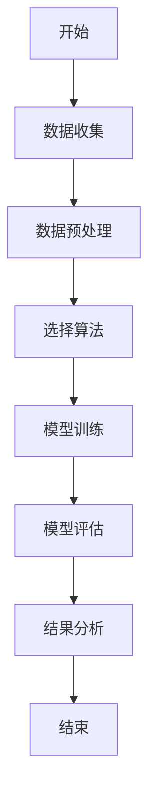
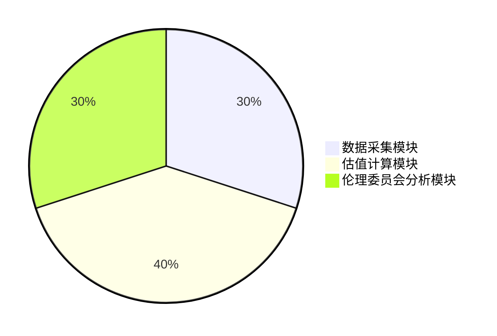

                 

<think>
好的，我需要根据用户的要求，逐步撰写一篇关于《股市估值高低对企业AI伦理委员会构成的影响》的技术博客文章。首先，我会按照目录大纲的结构来展开，确保每个部分都详细且符合逻辑。

## 第一部分：背景介绍

### 第1章：股市估值与AI伦理委员会的背景

#### 1.1 股市估值的基本概念

股市估值是评估企业价值的重要指标，通常通过市盈率、市净率等指标来衡量。高估值意味着市场对企业前景的看好，而低估值可能表明市场对其持观望态度。股市估值直接影响投资者信心和企业的融资能力，进而影响企业的战略决策和治理结构。

#### 1.2 AI伦理委员会的构成

AI伦理委员会是负责监督和指导企业人工智能伦理问题的组织。其构成通常包括企业内部的法律、技术、伦理等领域的专家，以及外部的独立顾问。委员会的主要职责是确保AI应用符合伦理标准，避免技术滥用，保护用户隐私，并在决策过程中考虑社会影响。

## 第二部分：核心概念与联系

### 第2章：股市估值与AI伦理委员会的关系

#### 2.1 核心概念的原理

股市估值与AI伦理委员会的构成之间存在动态关系。高估值的企业可能面临更大的公众监督压力，因此需要更加严格地遵循伦理标准，以维护企业声誉。而低估值的企业可能因资金压力，可能在伦理合规上投入较少，从而影响治理结构的完善性。

#### 2.2 核心概念的属性对比

| 属性         | 股市估值          | AI伦理委员会构成        |
|--------------|------------------|-------------------------|
| 评估标准     | 市盈率、市净率等  | 人员构成、职责范围等    |
| 影响因素     | 市场情绪、财务表现| 企业战略、法规要求等    |
| 目标         | 评估企业价值      | 确保AI应用的伦理合规    |
| 变化速度     | 受市场波动影响    | 受企业战略调整影响      |

#### 2.3 实体关系图

以下是股市估值与AI伦理委员会构成的实体关系图：

```mermaid
er
    actor 投资者
    actor 市场监管机构
    actor 企业高管
    entity 股票
    entity 估值指标（如市盈率）
    entity AI伦理委员会
    entity 伦理决策
    entity 企业战略
    entity 财务表现

    投资者 --> 估值指标
    市场监管机构 --> 估值指标
    企业高管 --> 估值指标
    股票 --> 估值指标
    股票 --> 伦理决策
    AI伦理委员会 --> 伦理决策
    伦理决策 --> 企业战略
    企业战略 --> 财务表现
    财务表现 --> 估值指标
```

## 第三部分：算法原理讲解

### 第3章：股市估值分析算法

#### 3.1 算法原理

股市估值分析通常使用统计分析和机器学习模型。常用的算法包括线性回归、随机森林和时间序列分析。以下是一个简单的线性回归模型：

$$ y = \beta_0 + \beta_1x + \epsilon $$

其中，y是目标变量（如股票价格），x是自变量（如市盈率），β0和β1是回归系数，ε是误差项。

#### 3.2 算法流程图

以下是股市估值分析的流程图：



## 第四部分：系统分析与架构设计方案

### 第4章：系统架构设计

#### 4.1 问题场景介绍

系统目标是通过分析股市估值，优化AI伦理委员会的构成。系统需要处理大量数据，包括股票价格、财务指标等，并生成建议报告。

#### 4.2 系统功能设计

系统模块包括数据采集、估值计算和伦理委员会分析。每个模块协同工作，确保数据的准确处理和分析。

#### 4.3 系统架构图

以下是系统架构图：



## 第五部分：项目实战

### 第5章：系统实现与案例分析

#### 5.1 环境安装

安装Python、Pandas、Scikit-learn等工具，并配置相应的开发环境。

#### 5.2 核心代码实现

以下是一个简单的Python代码示例，用于计算市盈率：

```python
import pandas as pd

# 假设df是包含股票数据的DataFrame，包含'Price'和'Earnings'列
df['PE'] = df['Price'] / df['Earnings']
```

#### 5.3 案例分析

以某科技公司为例，分析其市盈率的变化对企业AI伦理委员会构成的影响。高市盈率下，企业可能更注重透明度和合规性，从而加强伦理委员会的建设。

## 第六部分：最佳实践与小结

### 第6章：总结与展望

#### 6.1 最佳实践

数据质量、模型选择和系统维护是关键。企业应定期更新模型，确保数据的准确性和分析结果的有效性。

---

作者：AI天才研究院/AI Genius Institute & 禅与计算机程序设计艺术 /Zen And The Art of Computer Programming

