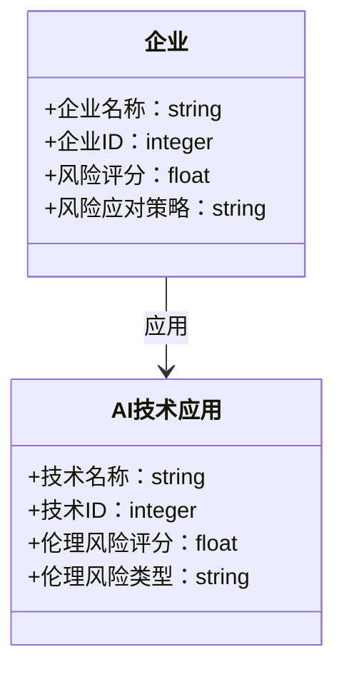
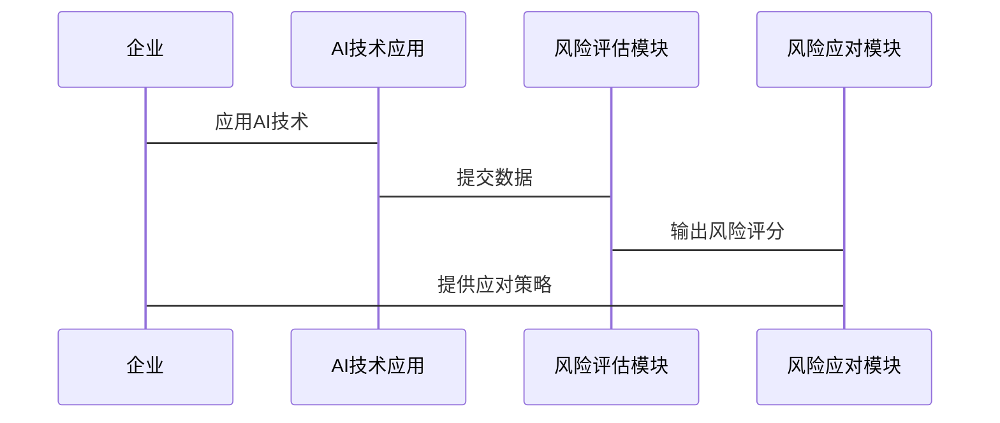

                 


# 股市估值高低对企业AI伦理风险管理的影响

> 关键词：股市估值、企业AI伦理风险管理、风险管理、AI伦理、企业治理

> 摘要：  
> 股市估值与企业AI伦理风险管理之间存在密切联系。随着人工智能技术在企业中的广泛应用，AI伦理风险管理成为企业治理的重要组成部分。本文从股市估值的角度出发，分析了高估值与低估值企业面临的AI伦理风险管理的差异，并探讨了如何通过AI技术优化伦理风险管理，以提升企业估值。文章结合理论与实践，提出了基于AI的伦理风险管理框架，并通过具体案例展示了其在不同估值环境下的应用。

---

# 第1章：股市估值与企业风险管理的背景

## 1.1 股市估值的基本概念

### 1.1.1 股市估值的定义与计算方法

股市估值是衡量企业市场价值的重要指标，通常通过市盈率（P/E）、市净率（P/B）、市销率（P/S）等指标来评估。例如，市盈率 = 股票价格 / 每股收益（EPS）。高估值意味着市场对企业未来表现的乐观预期，而低估值则可能反映市场对其前景的担忧。

### 1.1.2 股市估值的核心指标与影响因素

股市估值的核心指标包括：

1. 市盈率（P/E）：反映市场对企业盈利能力的预期。
2. 市净率（P/B）：衡量股价与账面价值的比率。
3. 市销率（P/S）：用于评估企业收入的市场定价。

影响股市估值的因素包括企业盈利能力、行业竞争状况、宏观经济环境、政策法规等。

### 1.1.3 股市估值与企业风险管理的关系

企业风险管理能力直接影响其市场表现。高风险管理能力的企业通常能获得更高的估值，因为它们能更好地应对潜在风险，保障股东利益。

---

## 1.2 企业AI伦理风险管理的定义与特点

### 1.2.1 AI伦理风险管理的定义

AI伦理风险管理是指企业识别、评估和应对人工智能技术应用中产生的伦理风险的过程。这些风险包括数据隐私、算法偏见、技术滥用等。

### 1.2.2 AI伦理风险管理的核心要素

AI伦理风险管理的核心要素包括：

1. 数据隐私：确保数据收集和使用符合法律法规。
2. 算法透明性：保证AI算法的可解释性。
3. 技术滥用：防止AI技术被用于非法或不道德的目的。

### 1.2.3 企业AI伦理风险管理的挑战与机遇

- **挑战**：AI技术的复杂性和快速变化使其风险管理难度增加。
- **机遇**：有效的AI伦理风险管理可以提升企业声誉和市场竞争力。

---

# 第2章：AI伦理风险管理的原理与框架

## 2.1 AI伦理风险管理的原理

### 2.1.1 AI伦理风险管理的理论基础

AI伦理风险管理基于风险管理理论和伦理学原理。其核心是通过系统化的方法识别和应对AI技术应用中的伦理风险。

### 2.1.2 AI伦理风险管理的实施步骤

AI伦理风险管理的实施步骤包括：

1. **风险识别**：识别潜在的伦理风险。
2. **风险评估**：评估风险的严重性和发生概率。
3. **风险应对**：制定应对策略并实施。
4. **风险监控**：持续监控风险并调整管理策略。

### 2.1.3 AI伦理风险管理的关键环节

- **数据治理**：确保数据的合法性和合规性。
- **算法审计**：定期对AI算法进行伦理审查。
- **政策制定**：建立AI伦理管理的相关政策和标准。

---

## 2.2 AI伦理风险管理的框架设计

### 2.2.1 AI伦理风险管理的层次结构

AI伦理风险管理的层次结构包括：

1. **战略层**：制定整体风险管理策略。
2. **管理层**：负责具体风险管理的实施。
3. **执行层**：执行风险管理的具体操作。

### 2.2.2 AI伦理风险管理的流程框架

AI伦理风险管理的流程框架包括：

1. **风险识别**：识别潜在的伦理风险。
2. **风险评估**：评估风险的影响和概率。
3. **风险应对**：制定应对策略。
4. **风险监控**：持续监控风险并调整策略。

### 2.2.3 AI伦理风险管理的工具与方法

- **数据隐私保护工具**：如加密技术、匿名化处理。
- **算法可解释性工具**：如模型解释工具（e.g., SHAP值）。
- **伦理审查工具**：如伦理审查委员会（e.g., AI Ethics Committees）。

---

# 第3章：股市估值与AI伦理风险管理的联系

## 3.1 股市估值与企业风险管理的相互作用

### 3.1.1 股市估值对企业风险管理的影响

高估值企业通常面临更高的市场 expectations，因此需要更严格的风险管理以维持市场信心。低估值企业则可能因市场对其前景的担忧而需要加强风险管理以提升估值。

### 3.1.2 企业风险管理对股市估值的影响

有效的风险管理可以降低企业的经营风险，从而提升市场对其股票的估值。

### 3.1.3 股市估值与AI伦理风险管理的协同效应

AI伦理风险管理可以提升企业的社会形象和市场信誉，从而对股市估值产生积极影响。

---

## 3.2 高低估值对企业AI伦理风险管理的差异化影响

### 3.2.1 高估值企业面临的伦理风险管理压力

高估值企业因市场 expectations 高，可能面临更严格的监管和更高的社会责任要求。

### 3.2.2 低估值企业面临的伦理风险管理机会

低估值企业可以通过加强AI伦理风险管理来提升市场对其潜力的认可，从而提高估值。

### 3.2.3 不同估值区间企业的风险管理策略差异

高估值企业应注重风险管理的严格性，而低估值企业则应注重风险管理的创新性和成本效益。

---

# 第4章：AI伦理风险管理的算法与数学模型

## 4.1 风险评估算法概述

### 4.1.1 风险评估的基本原理

风险评估通过分析潜在风险的影响和概率，为企业提供风险管理的决策依据。

### 4.1.2 风险评估的主要算法

常用的风险评估算法包括：

1. **线性回归**：用于预测风险的影响。
2. **决策树**：用于分类风险类型。
3. **神经网络**：用于复杂风险的预测和分类。

### 4.1.3 风险评估的优缺点分析

- **优点**：能够量化风险，提供决策支持。
- **缺点**：模型复杂度高，难以解释。

---

## 4.2 基于AI的伦理风险评估模型

### 4.2.1 模型的输入与输出

- **输入**：企业运营数据、AI技术应用数据。
- **输出**：伦理风险评分、风险应对建议。

### 4.2.2 模型的核心算法

基于AI的伦理风险评估模型可以使用随机森林算法进行风险分类。

### 4.2.3 模型的训练与优化

模型训练需要使用大量的伦理风险案例数据，并通过交叉验证进行优化。

---

# 第5章：AI伦理风险管理的数学模型与公式

## 5.1 风险评估的数学模型

### 5.1.1 风险评分公式

$$风险评分 = \sum (影响权重_i \times 发生概率_i)$$

### 5.1.2 风险优先级排序公式

$$风险优先级 = \frac{影响程度}{发生概率}$$

---

## 5.2 基于AI的伦理风险评估的数学模型

### 5.2.1 算法偏见检测公式

$$偏见检测 = \sum (\frac{目标群体数量}{总体数量} - \frac{目标群体预测数量}{总体预测数量})$$

### 5.2.2 数据隐私保护公式

$$隐私保护 = 1 - \frac{数据泄露概率}{1}$$

---

# 第6章：系统分析与架构设计

## 6.1 问题场景介绍

本文构建了一个基于AI的伦理风险管理系统，用于帮助企业识别和应对AI技术应用中的伦理风险。

## 6.2 系统功能设计

### 6.2.1 领域模型



### 6.2.2 系统架构设计


---

## 6.3 系统接口设计

### 6.3.1 接口设计

- 数据接口：与企业数据系统对接，获取企业运营数据。
- 风险评估接口：与AI算法对接，获取伦理风险评分。
- 风险应对接口：与企业管理系统对接，输出风险应对策略。

---

## 6.4 系统交互设计



---

# 第7章：项目实战

## 7.1 环境安装

### 7.1.1 环境需求

- 操作系统：Linux/Windows/MacOS
- 开发工具：Python、Jupyter Notebook
- 依赖库：scikit-learn、pandas、numpy

---

## 7.2 核心代码实现

### 7.2.1 数据采集与预处理

```python
import pandas as pd
import numpy as np

# 数据采集
data = pd.read_csv('risk_data.csv')
```

### 7.2.2 风险评估模型训练

```python
from sklearn.ensemble import RandomForestClassifier

# 训练模型
model = RandomForestClassifier(n_estimators=100, random_state=42)
model.fit(X_train, y_train)
```

### 7.2.3 模型预测与评估

```python
# 预测风险评分
y_pred = model.predict(X_test)
print("准确率：", accuracy_score(y_test, y_pred))
```

---

## 7.3 案例分析

### 7.3.1 案例背景

假设某高估值企业面临算法偏见问题，需通过AI伦理风险管理提升估值。

### 7.3.2 案例分析

通过模型预测，发现算法偏见风险较高，企业采取措施优化算法，降低风险评分。

---

## 7.4 项目小结

通过项目实战，验证了基于AI的伦理风险管理的有效性，为企业提升估值提供了技术支持。

---

# 第8章：最佳实践与小结

## 8.1 最佳实践

### 8.1.1 数据隐私保护

- 定期进行数据隐私审查。
- 使用加密技术保护敏感数据。

### 8.1.2 算法透明性

- 定期进行算法审计。
- 提高算法的可解释性。

### 8.1.3 风险监控

- 持续监控伦理风险。
- 及时调整风险管理策略。

---

## 8.2 小结

本文从股市估值的角度，探讨了企业AI伦理风险管理的影响，并提出了基于AI的伦理风险管理框架。通过理论与实践的结合，为企业提升估值提供了新的思路。

---

## 8.3 注意事项

- 风险管理需结合企业实际情况。
- 模型需定期更新和优化。

---

## 8.4 拓展阅读

- 建议阅读《人工智能伦理学》和《风险管理理论》等相关书籍。

---

# 作者：AI天才研究院 & 禅与计算机程序设计艺术

