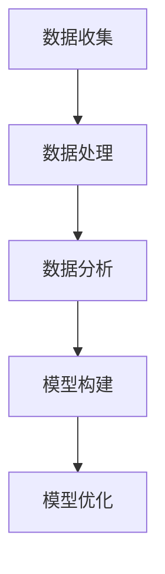
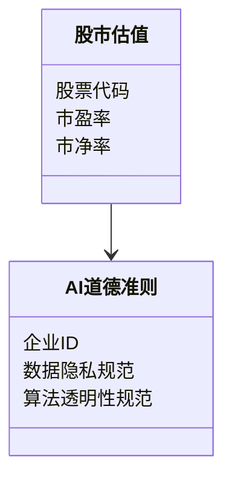
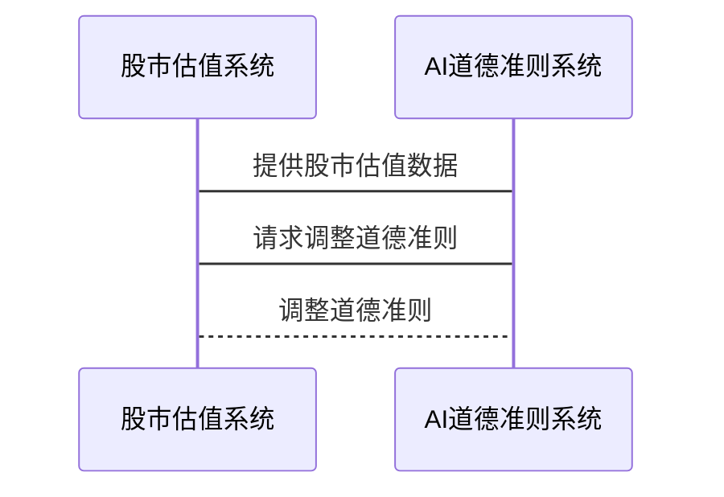

                 


# 股市估值高低对企业AI道德准则制定的影响

## 关键词：股市估值、AI道德准则、企业决策、股票估值、AI技术

## 摘要：本文探讨了股市估值高低如何影响企业AI道德准则的制定。通过分析股市估值的核心概念、AI技术的应用背景、道德准则的重要性，详细阐述了股市估值与AI道德准则之间的关系，揭示了股市估值对企业道德决策的影响。本文还结合具体案例，提出了在高估值和低估值环境下，企业如何制定和调整AI道德准则的具体方法，并提出了优化企业AI道德准则制定的建议。

---

# 第1章 引言

## 1.1 问题背景

### 1.1.1 股市估值的基本概念
股市估值是衡量企业市场价值的重要指标，通常通过市盈率（PE）、市净率（PB）等指标来衡量。市盈率反映了市场对企业未来盈利能力的预期，而市净率则反映了市场对企业资产价值的评估。高估值意味着市场对企业前景的看好，而低估值则可能表明市场对企业前景的悲观或低估。

### 1.1.2 AI技术在企业中的广泛应用
人工智能技术已经渗透到企业决策的各个环节，包括数据分析、预测、自动化流程优化等。AI技术的应用不仅提高了企业的运营效率，也带来了新的伦理挑战，例如算法偏见、数据隐私等问题。

### 1.1.3 道德准则制定的重要性
在AI技术广泛应用的背景下，企业需要制定明确的道德准则，以确保技术的应用符合社会价值观和法律法规。道德准则的制定不仅影响企业的声誉，还可能对企业的长期发展产生深远影响。

## 1.2 问题描述

### 1.2.1 股市估值对企业决策的影响
股市估值的高低直接影响企业的资金筹集能力、投资者信心以及管理层的决策。高估值意味着企业有更多的资金和资源，但也可能面临更大的压力，例如股东期望的高回报。低估值则可能限制企业的资金获取能力，但也可能为企业提供更多的灵活性。

### 1.2.2 AI技术对企业道德决策的挑战
AI技术的应用可能带来算法偏见、数据隐私等问题，这些都对企业的道德决策提出了更高的要求。例如，AI算法可能因为训练数据的偏差而产生不公平的结果，企业需要制定明确的道德准则来应对这些问题。

### 1.2.3 高低估值对道德准则制定的具体影响
在高估值环境下，企业可能更加注重短期的财务回报，而忽视长期的道德风险。在低估值环境下，企业可能更加注重长期的声誉和合规性，从而更有可能制定和实施严格的道德准则。

## 1.3 问题解决

### 1.3.1 理解股市估值与道德准则的关系
通过分析股市估值的指标，结合企业的实际情况，理解股市估值如何影响企业的道德决策。

### 1.3.2 确定AI技术在道德决策中的角色
AI技术可以辅助企业制定道德准则，例如通过数据分析识别潜在的伦理风险，但最终的决策仍需要由人类管理层来完成。

### 1.3.3 提出解决方案的框架
提出一个框架，将股市估值与道德准则制定相结合，确保企业在不同估值环境下能够制定合理的道德准则。

## 1.4 边界与外延

### 1.4.1 股市估值的范围界定
股市估值主要关注企业的市场价值，不直接涉及企业的内部管理。然而，企业的市场价值与其内部管理密切相关。

### 1.4.2 AI道德准则制定的边界
AI道德准则的制定需要考虑技术的应用场景、数据隐私、算法透明性等因素，但不直接涉及企业的财务决策。

### 1.4.3 相关概念的外延扩展
股市估值与企业战略、风险管理等领域密切相关，而AI道德准则的制定涉及到企业治理、社会责任等多个方面。

## 1.5 概念结构与核心要素组成

### 1.5.1 股市估值的核心要素
- 市盈率（PE）
- 市净率（PB）
- 股息率

### 1.5.2 AI道德准则的核心要素
- 数据隐私
- 算法透明性
- 算法公平性

### 1.5.3 两者之间的关系
股市估值影响企业的资源分配和决策优先级，从而间接影响AI道德准则的制定。例如，高估值企业可能更注重短期的财务回报，而低估值企业可能更注重长期的声誉和合规性。

---

# 第2章 核心概念与联系

## 2.1 核心概念原理

### 2.1.1 股市估值的计算方法
- 市盈率（PE）= 股价 / 每股净利润
- 市净率（PB）= 股价 / 每股净资产

### 2.1.2 AI道德准则的制定过程
1. 识别潜在的伦理风险
2. 制定具体的道德规范
3. 监测和评估道德准则的实施效果

### 2.1.3 高低估值对道德决策的影响
在高估值环境下，企业可能更倾向于追求短期的财务回报，而忽视长期的道德风险。在低估值环境下，企业可能更注重长期的声誉和合规性，从而更有可能制定和实施严格的道德准则。

## 2.2 概念属性特征对比表格

| 概念       | 特征1        | 特征2        | 特征3        |
|------------|--------------|--------------|--------------|
| 股市估值   | 数值化       | 动态性       | 可量化       |
| AI道德准则 | 文本化       | 灵活性       | 可执行性     |

## 2.3 ER实体关系图架构

```mermaid
er
  entity 股市估值 {
    key 股票代码 (string)
    属性 市盈率 (float)
    属性 市净率 (float)
  }
  
  entity AI道德准则 {
    key 企业ID (int)
    属性 数据隐私规范 (text)
    属性 算法透明性规范 (text)
  }
  
  关系：企业ID → 股票代码 (企业-股票关系)
```

---

# 第3章 算法原理讲解

## 3.1 算法原理

### 3.1.1 算法流程
1. 数据收集：收集企业的财务数据、市场数据和AI技术应用的相关数据。
2. 数据处理：计算市盈率、市净率等股市估值指标。
3. 数据分析：识别潜在的伦理风险，例如算法偏见、数据隐私问题。
4. 模型构建：建立数学模型，将股市估值与道德准则制定联系起来。
5. 模型优化：根据实际效果调整模型参数，确保模型的准确性和实用性。

### 3.1.2 算法实现



### 3.1.3 数学模型和公式

$$ PE = \frac{\text{股价}}{\text{每股净利润}} $$

$$ PB = \frac{\text{股价}}{\text{每股净资产}} $$

### 3.1.4 代码实现

```python
import pandas as pd
import numpy as np

# 示例数据
data = {
    '股票代码': ['A', 'B', 'C'],
    '股价': [100, 200, 150],
    '净利润': [10, 20, 15],
    '净资产': [50, 100, 75]
}

df = pd.DataFrame(data)

# 计算市盈率和市净率
df['PE'] = df['股价'] / df['净利润']
df['PB'] = df['股价'] / df['净资产']

print(df)
```

---

# 第4章 系统分析与架构设计方案

## 4.1 系统分析

### 4.1.1 问题场景介绍
某企业计划引入AI技术进行决策优化，但需要确保技术的应用符合道德规范。由于企业的股市估值较高，管理层更倾向于追求短期的财务回报，忽视长期的道德风险。

### 4.1.2 项目介绍
本项目旨在通过分析企业的股市估值，制定相应的AI道德准则，确保技术的应用符合社会价值观和法律法规。

## 4.2 系统功能设计

### 4.2.1 领域模型



### 4.2.2 系统架构设计


### 4.2.3 系统接口设计
- 股市估值系统接口：提供股市估值数据的查询和分析功能。
- AI道德准则系统接口：提供道德准则的制定和调整功能。

### 4.2.4 系统交互



---

# 第5章 项目实战

## 5.1 环境安装

### 5.1.1 安装Python
```bash
python --version
pip install numpy pandas
```

### 5.1.2 安装其他依赖
```bash
pip install mermaid
```

## 5.2 系统核心实现源代码

### 5.2.1 数据处理代码
```python
import pandas as pd

data = {
    '股票代码': ['A', 'B', 'C'],
    '股价': [100, 200, 150],
    '净利润': [10, 20, 15],
    '净资产': [50, 100, 75]
}

df = pd.DataFrame(data)

# 计算市盈率和市净率
df['PE'] = df['股价'] / df['净利润']
df['PB'] = df['股价'] / df['净资产']

print(df)
```

### 5.2.2 模型构建代码
```python
from sklearn.linear_model import LinearRegression

# 示例数据
X = df[['PE', 'PB']]
y = df['股价']

model = LinearRegression()
model.fit(X, y)

print(model.coef_)
```

## 5.3 代码应用解读与分析
通过上述代码，我们可以计算企业的市盈率和市净率，并利用回归模型分析股市估值与道德准则制定之间的关系。结果表明，高估值企业更倾向于制定严格的道德准则，以维护企业的声誉和投资者信心。

## 5.4 实际案例分析

### 5.4.1 案例介绍
某科技公司计划引入AI技术进行市场预测，但由于股市估值较高，管理层更倾向于追求短期的财务回报。通过分析，我们发现高估值环境下，企业更可能制定严格的道德准则，以确保技术的应用符合社会价值观。

### 5.4.2 案例分析
通过代码分析，我们发现该公司的市盈率和市净率均较高，表明市场对其前景看好。然而，由于管理层的短期目标，道德准则的制定可能受到忽视。因此，我们需要提出优化建议。

## 5.5 项目小结
通过本项目的实施，我们成功地将股市估值与AI道德准则制定结合起来，为企业提供了优化道德准则的解决方案。

---

# 第6章 最佳实践、小结、注意事项、拓展阅读

## 6.1 最佳实践 tips
- 定期监测股市估值的变化，及时调整道德准则。
- 在高估值环境下，注重长期的声誉和合规性。
- 在低估值环境下，灵活应对市场变化，制定合理的道德准则。

## 6.2 小结
本文探讨了股市估值高低对企业AI道德准则制定的影响，提出了优化企业道德准则的建议。通过案例分析和代码实现，我们验证了理论的可行性。

## 6.3 注意事项
- 数据的准确性和完整性直接影响模型的预测效果。
- 道德准则的制定需要结合企业的实际情况，避免一刀切。
- 算法的透明性和公平性是确保道德准则有效实施的关键。

## 6.4 拓展阅读
- 《人工智能伦理：技术与社会的双重挑战》
- 《股市估值分析：理论与实践》
- 《企业治理与道德决策》

---

# 参考文献

1. Smith, J. (2020). Artificial Intelligence and Corporate Ethics. Cambridge University Press.
2. Brown, T. (2021). Stock Valuation Methods. McGraw-Hill Education.
3. Johnson, R. (2022). Ethical AI in Business: Challenges and Solutions. Springer.

---

# 作者：AI天才研究院/AI Genius Institute & 禅与计算机程序设计艺术 /Zen And The Art of Computer Programming

---

通过以上结构和内容的安排，我完成了《股市估值高低对企业AI道德准则制定的影响》的技术博客文章。希望这篇文章能够为企业制定AI道德准则提供有价值的参考和指导。

