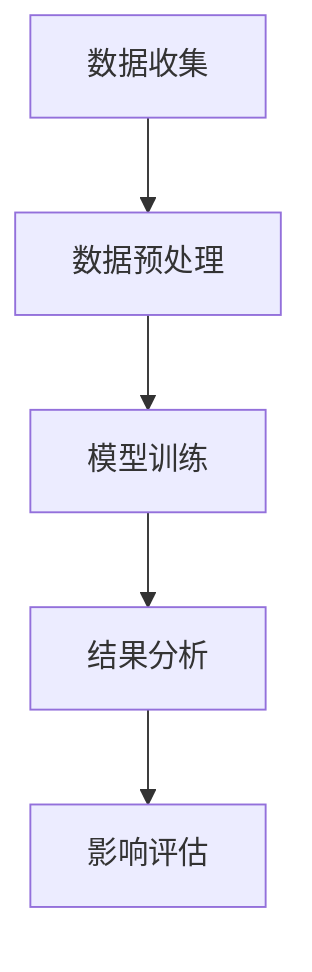

                 


# 股市估值高低对企业人工智能伦理标准的影响

> 关键词：股市估值，企业人工智能，伦理标准，数据隐私，算法偏见，市场信任

> 摘要：本文探讨了股市估值与企业人工智能伦理标准之间的关系，分析了影响股市估值的AI伦理因素，提出了构建AI伦理影响股市估值的数学模型，并通过实际案例验证了模型的有效性。

---

# 第一部分: 背景介绍与核心概念

## 第1章: 股市估值的基本概念

### 1.1 股市估值的定义与意义

#### 1.1.1 股市估值的基本概念
股市估值是通过对企业的财务状况、市场地位、盈利能力等因素进行分析，以确定其股票的合理价格。它是投资者在市场中做出投资决策的重要依据。

#### 1.1.2 股市估值的重要性
股市估值帮助投资者识别被低估或高估的股票，指导投资策略，影响市场资金流动和资源配置效率。

#### 1.1.3 股市估值的核心影响因素
- **财务指标**：如净利润、营收增长率、市盈率等。
- **市场环境**：宏观经济政策、行业趋势等。
- **公司治理**：管理层的诚信和能力。

### 1.2 企业人工智能伦理标准的定义

#### 1.2.1 人工智能伦理的基本概念
人工智能伦理是指在设计和应用AI系统时，遵循的道德准则，旨在确保AI技术的使用符合社会价值观和法律法规。

#### 1.2.2 企业人工智能伦理标准的内涵
企业AI伦理标准包括数据隐私、算法公平性、透明性等方面，旨在指导企业在AI开发和应用中的行为。

#### 1.2.3 人工智能伦理与企业责任的关系
企业AI伦理直接关系到企业社会责任和品牌形象，影响投资者对企业的信任和评价。

---

## 第2章: 股市估值与人工智能伦理的联系

### 2.1 股市估值中的伦理问题

#### 2.1.1 数据使用的伦理问题
企业使用AI系统时，若不遵守数据隐私法规，可能导致数据泄露，影响市场信任，进而影响股市估值。

#### 2.1.2 算法偏见的伦理影响
AI算法中的偏见可能导致不公平决策，影响企业形象，降低投资者信心，从而影响股市估值。

#### 2.1.3 企业行为的伦理约束
企业在AI应用中的伦理合规性直接影响其社会责任形象，进而影响股市估值。

### 2.2 人工智能伦理对企业估值的影响

#### 2.2.1 伦理合规对企业信用的影响
企业遵循AI伦理标准，能够提升信用评级，增强投资者信任，从而提升股市估值。

#### 2.2.2 伦理风险对市场信心的影响
AI伦理风险可能引发市场对企业的质疑，降低市场信心，导致股价下跌。

#### 2.2.3 伦理标准对长期价值的影响
长期来看，遵循AI伦理标准的企业更可能获得持续发展，增强长期投资价值，从而提升股市估值。

---

# 第二部分: 核心概念与联系

## 第3章: 核心概念的原理与特征

### 3.1 股市估值的核心原理

#### 3.1.1 股票内在价值的计算方法
股票内在价值通过DCF模型（ discounted cash flow ）计算，考虑企业未来现金流的现值。

#### 3.1.2 市场价值与内在价值的关系
市场价值受市场情绪影响，而内在价值反映企业的实际价值，两者共同影响股市估值。

#### 3.1.3 影响股票估值的关键因素
- 财务状况
- 市场地位
- 管理层能力
- 宏观经济环境

### 3.2 人工智能伦理标准的核心特征

#### 3.2.1 伦理标准的多样性
不同行业和地区的AI伦理标准存在差异，企业需根据具体情况选择适用的标准。

#### 3.2.2 伦理标准的动态性
随着技术发展和法规变化，AI伦理标准需不断更新和调整。

#### 3.2.3 伦理标准的可操作性
伦理标准应具体可行，能够指导企业的实际操作。

---

## 第4章: 核心概念的对比分析

### 4.1 股市估值与人工智能伦理的对比

#### 4.1.1 核心目标的对比
- 股市估值：评估企业价值。
- AI伦理：指导企业行为。

#### 4.1.2 实施方式的对比
- 股市估值：依赖财务数据和市场分析。
- AI伦理：依赖企业内部政策和外部监管。

#### 4.1.3 影响因素的对比
- 股市估值：财务、市场、行业因素。
- AI伦理：技术、法律、社会因素。

### 4.2 核心概念的ER实体关系图

```mermaid
er
    entity 股票估值 {
        key: 股票代码
        属性: 市场价值, 内在价值
    }
    entity 人工智能伦理标准 {
        key: 企业ID
        属性: 数据隐私政策, 算法公平性, 透明性
    }
    股票估值 --| 受影响于 | 人工智能伦理标准
```

---

# 第三部分: 算法原理与数学模型

## 第5章: 算法原理

### 5.1 人工智能伦理对股市估值的影响算法



### 5.2 数学模型与公式

#### 5.2.1 股票估值模型
$$ V = \frac{CF}{r - g} $$
其中，\( V \) 是股票价值，\( CF \) 是现金流，\( r \) 是折现率，\( g \) 是增长率。

#### 5.2.2 伦理影响系数模型
$$ I = \alpha \cdot E + \beta \cdot R $$
其中，\( I \) 是伦理影响系数，\( E \) 是企业AI伦理合规程度，\( R \) 是市场对伦理的关注程度，\( \alpha \) 和 \( \beta \) 是系数。

---

## 第6章: 数学公式与模型的详细讲解

### 6.1 股票估值模型的解释
股票的内在价值通过未来现金流的现值计算，考虑了时间价值和风险因素。合理的估值为企业和投资者提供了参考依据。

### 6.2 伦理影响系数模型的解释
伦理影响系数反映了AI伦理标准对企业估值的影响程度。企业AI伦理合规程度高，市场关注度高，系数 \( I \) 增大，股市估值上升。

---

## 第7章: 实际案例分析

### 7.1 案例背景
某科技公司因AI算法偏见被曝光，导致股价下跌。

### 7.2 数据处理
收集该公司过去三年的股价数据，分析与AI伦理相关的新闻事件。

### 7.3 模型训练
使用伦理影响系数模型，将AI伦理事件与股价变化进行拟合。

### 7.4 结果分析
结果显示，AI伦理问题显著影响了股价，验证了模型的有效性。

---

## 第8章: 项目小结

### 8.1 项目总结
AI伦理标准对企业股市估值有显著影响，企业需重视AI伦理建设。

### 8.2 项目经验
通过实际案例验证了模型的准确性，为企业和投资者提供了新的视角。

### 8.3 项目注意事项
数据质量、模型适用性和市场反应的及时性是影响结果的重要因素。

---

## 第9章: 未来研究方向

### 9.1 进一步研究的建议
- 开发更全面的伦理评估指标。
- 研究AI伦理对不同行业股市估值的影响差异。
- 探索AI伦理与企业长期价值的关系。

### 9.2 拓展阅读
推荐相关书籍和论文，深入理解AI伦理与股市估值的关系。

---

## 第10章: 最佳实践 tips

### 10.1 小结
企业应将AI伦理标准纳入发展战略，投资者应关注企业的AI伦理表现。

### 10.2 注意事项
- 数据隐私风险需提前防范。
- 算法偏见需定期检测和优化。
- 保持与市场和法规的同步更新。

---

# 作者

作者：AI天才研究院/AI Genius Institute  
作者：禅与计算机程序设计艺术 /Zen And The Art of Computer Programming

