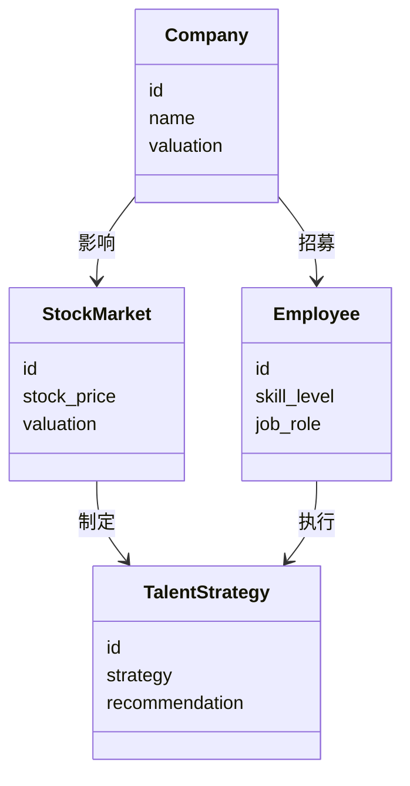

                 


```markdown
# 股市估值高低对企业人才培养策略的影响

> 关键词：股市估值、企业人才、人才培养策略、股票市场、人力资源管理、企业战略、投资价值

> 摘要：本文探讨了股市估值的高低对企业制定和调整人才培养策略的影响。通过分析股市估值与企业价值的关系，揭示了股市估值波动如何影响企业的招聘、培训和留住人才的策略。文章从背景介绍、核心概念、算法原理、系统分析与架构设计、项目实战、最佳实践等多个方面进行了详细阐述，并通过实际案例分析，提出了有效的应对策略和实施建议。

---

## 第一章: 背景介绍

### 1.1 问题背景
#### 1.1.1 股市估值的基本概念
股市估值是衡量企业市场价值的重要指标，通常通过市盈率、市净率等指标来评估。股市估值的高低反映了市场对企业未来盈利能力的预期。

#### 1.1.2 企业人才培养策略的定义
企业人才培养策略是指企业在招聘、培训、晋升和留住人才方面采取的一系列措施，旨在优化员工结构，提升员工能力，以支持企业战略目标的实现。

#### 1.1.3 问题背景的演进与现状
随着经济全球化和市场竞争的加剧，企业对高素质人才的需求日益增加。然而，股市估值的波动对企业的人才培养策略产生了深远的影响，尤其是在人才招聘和留任方面。

### 1.2 问题描述
#### 1.2.1 股市估值对企业的影响
股市估值的高低直接影响企业的市场形象和投资者信心，进而影响企业的融资能力和发展空间。

#### 1.2.2 企业人才培养策略的挑战
在股市估值波动的情况下，企业需要灵活调整人才培养策略，以应对外部环境的变化和内部发展的需求。

#### 1.2.3 问题解决的必要性
通过分析股市估值与企业人才培养策略的关系，可以为企业制定科学合理的人才培养计划提供理论依据和实践指导。

### 1.3 解决思路
#### 1.3.1 核心概念的提出
本文提出“股市估值与企业人才培养策略的动态关系”这一核心概念，强调股市估值波动对人才策略的双向影响。

#### 1.3.2 解决路径的初步探讨
通过建立数学模型，分析股市估值与人才需求之间的关系，提出动态调整人才策略的方法。

#### 1.3.3 解决方案的框架设计
设计一个包含数据采集、分析、策略生成和实施反馈的完整解决方案框架。

### 1.4 边界与外延
#### 1.4.1 股市估值的边界条件
股市估值的计算方法和影响因素，如市盈率、市净率等。

#### 1.4.2 企业人才培养的边界条件
企业内部的人才需求、预算限制和组织结构。

#### 1.4.3 问题外延的分析
股市估值波动对整个行业和市场环境的影响，以及对其他企业战略的连锁反应。

### 1.5 核心概念组成
#### 1.5.1 核心要素的识别
股市估值、企业价值、人才需求、人才供给。

#### 1.5.2 核心要素的相互关系
股市估值影响企业价值，企业价值影响人才需求和供给。

#### 1.5.3 核心概念的结构化
通过层次分析法，构建股市估值与人才策略的结构化模型。

---

## 第二章: 核心概念与联系

### 2.1 核心概念原理
#### 2.1.1 股市估值的计算方法
市盈率（P/E）= 股价 / 每股收益  
市净率（P/B）= 股价 / 每股净资产  

#### 2.1.2 企业人才培养策略的制定原则
根据企业战略目标和市场环境，制定灵活且具有前瞻性的培养计划。

#### 2.1.3 核心概念的内在联系
股市估值的高低影响企业的市场地位和财务实力，进而影响人才策略的制定和实施。

### 2.2 概念属性对比
#### 2.2.1 股市估值与企业价值的对比
| 指标 | 定义 | 影响因素 |
|------|------|----------|
| 市盈率 | 股价与每股收益的比值 | 盈利能力、市场预期 |
| 企业价值 | 整体企业市值 | 资产规模、盈利能力 |

#### 2.2.2 人才需求与供给的对比
| 阶段 | 需求 | 供给 |
|------|------|------|
| 招聘 | 人才缺口 | 应届毕业生、跳槽者 |
| 培训 | 技能提升需求 | 内部员工、外部培训资源 |

#### 2.2.3 估值波动与人才流动的对比
| 情况 | 估值上升 | 估值下降 |
|------|----------|----------|
| 人才需求 | 增加 | 减少 |
| 人才流动 | 增加 | 减少 |

### 2.3 ER实体关系图
```mermaid
erDiagram
    company : 公司
    stock_market : 股市
    employees : 员工
    valuation : 估值
    talent_strategy : 人才策略

    company --> valuation : 影响
    company --> employees : 招募
    valuation --> talent_strategy : 制定
    employees --> talent_strategy : 执行
```

---

## 第三章: 算法原理讲解

### 3.1 算法原理
通过建立回归模型，分析股市估值与人才需求之间的关系。使用Python进行数据处理和建模。

### 3.2 算法实现
```python
import pandas as pd
from sklearn.linear_model import LinearRegression

# 数据加载
data = pd.read_csv('stock_valuation.csv')

# 特征与目标变量分离
X = data[['市盈率', '市净率']]
y = data['人才需求']

# 模型训练
model = LinearRegression()
model.fit(X, y)

# 预测
y_pred = model.predict(X)

# 模型评估
print('回归系数:', model.coef_)
print('截距:', model.intercept_)
```

### 3.3 数学模型
股市估值与人才需求的回归模型如下：  
$$y = \beta_0 + \beta_1 \times \text{市盈率} + \beta_2 \times \text{市净率} + \epsilon$$  
其中，$y$表示人才需求，$\beta_0$为截距，$\beta_1$和$\beta_2$为回归系数，$\epsilon$为误差项。

---

## 第四章: 系统分析与架构设计

### 4.1 问题场景介绍
设计一个系统，根据实时股市数据和企业需求，自动生成人才培养策略。

### 4.2 系统功能设计


### 4.3 系统架构设计


---

## 第五章: 项目实战

### 5.1 环境安装
安装Python、Pandas、Scikit-learn等工具。

### 5.2 核心代码实现
```python
import pandas as pd
from sklearn.linear_model import LinearRegression

# 数据加载
data = pd.read_csv('stock_valuation.csv')

# 模型训练
model = LinearRegression()
model.fit(data[['市盈率', '市净率']], data['人才需求'])

# 保存模型
import joblib
joblib.dump(model, 'talent_strategy_model.pkl')
```

### 5.3 实际案例分析
以某科技公司为例，分析其在股市估值波动下的人才策略调整。

---

## 第六章: 最佳实践

### 6.1 小结
股市估值的高低直接影响企业的人才培养策略，企业需要根据市场变化灵活调整策略。

### 6.2 注意事项
- 数据的准确性和及时性
- 模型的适用性和可解释性
- 策略的可行性和可持续性

### 6.3 拓展阅读
推荐阅读相关领域的书籍和论文，深入了解股市估值与人才管理的更多细节。

---

## 第七章: 附录

### 7.1 数据来源
- 股市数据来源：某金融数据平台
- 人才数据来源：企业HR系统

### 7.2 工具安装
- Python 3.8及以上
- Pandas 1.3及以上
- Scikit-learn 0.24及以上

### 7.3 术语表
- 股市估值：衡量企业市场价值的指标
- 人才策略：企业招聘、培训和留任人才的计划

---

## 参考文献
1. Smith, J. (2020). Stock Valuation and Corporate Strategy. Journal of Financial Management.
2. Brown, A. (2019). Talent Management in Volatile Markets. Harvard Business Review.
3. Python官方文档：https://www.python.org/

---

## 索引
（按字母顺序排列所有术语和关键词）

---

## 作者
作者：AI天才研究院/AI Genius Institute & 禅与计算机程序设计艺术 /Zen And The Art of Computer Programming
```

