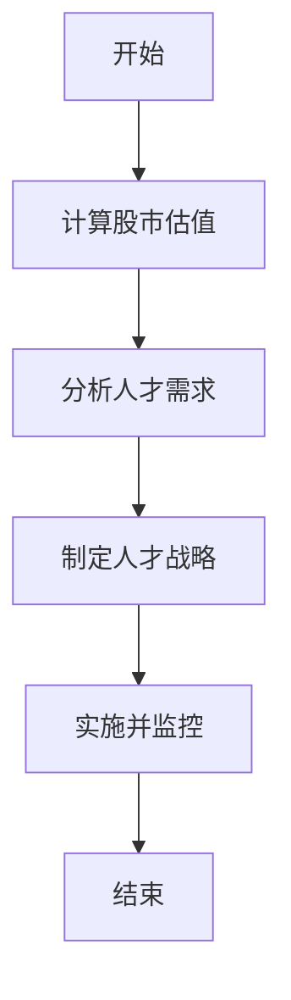
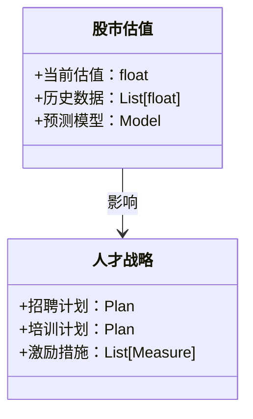
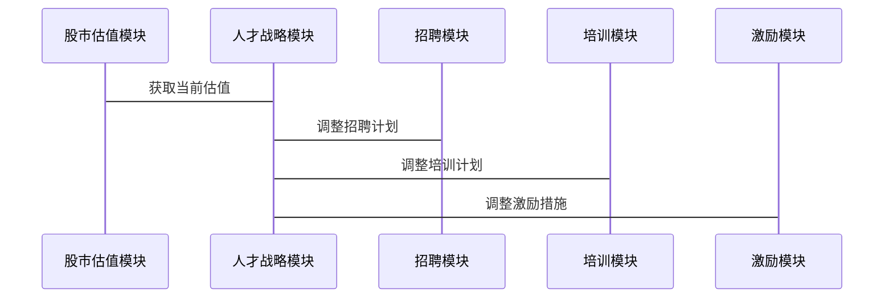

                 


# 股市估值高低对企业人才战略的影响

## 关键词
股市估值，企业人才战略，高估值，低估值，人才管理，激励机制

## 摘要
股市估值的高低对企业人才战略有着重要影响。高估值时，企业可以有更多的资金用于吸引和激励人才；低估值时，则需要优化人才结构和管理策略。本文通过分析股市估值与人才战略的关系，探讨如何根据市场环境调整企业的人才策略，以实现长期发展目标。

---

## 第一部分：背景介绍

### 第1章：股市估值与企业人才战略的关联

#### 1.1 问题背景
- 1.1.1 股市估值的定义与影响因素
  股市估值是指市场对上市公司股票价值的评估，主要受公司业绩、行业前景、宏观经济环境等因素影响。高估值意味着市场对公司前景看好，低估值则可能表示市场对其前景持谨慎态度。
- 1.1.2 企业人才战略的核心目标
  人才战略旨在通过吸引、培养和保留优秀人才，提升企业的竞争力和实现长期发展目标。
- 1.1.3 股市估值与企业发展的关系
  股市估值不仅是企业市场表现的反映，也影响着企业的融资能力、投资者信心和人才吸引力。

#### 1.2 问题描述
- 1.2.1 高估值对企业人才战略的影响
  高估值时，企业通常有更多的资金用于人才引进和激励，吸引优秀人才加入，提升团队能力。
- 1.2.2 低估值对企业人才战略的影响
  低估值时，企业可能面临资金紧张，需要优化成本结构，调整人才策略，注重内部培养和绩效激励。
- 1.2.3 估值波动对人才战略的动态影响
  估值的波动性要求企业的人才战略具备灵活性，及时调整以应对市场变化。

#### 1.3 问题解决
- 1.3.1 通过高估值优化人才激励机制
  高估值时，企业可以增加股票期权、绩效奖金等激励措施，吸引和留住优秀人才。
- 1.3.2 通过低估值调整人才结构
  低估值时，企业可能精简团队，注重内部培训和绩效考核，提升现有员工的效率和能力。
- 1.3.3 综合策略应对估值波动
  企业应制定灵活的人才战略，根据估值变化调整招聘、培训和激励策略，确保在不同市场环境下保持竞争力。

#### 1.4 边界与外延
- 1.4.1 股市估值的边界条件
  股市估值受多种因素影响，包括宏观经济、行业趋势、公司基本面等，企业需综合考虑这些因素。
- 1.4.2 人才战略的适用范围
  适用于各类企业，但具体策略需根据企业所处行业、发展阶段和市场环境调整。
- 1.4.3 相关概念的外延扩展
  包括企业融资策略、投资者关系管理、风险管理等，这些都与人才战略密切相关。

#### 1.5 核心要素组成
- 1.5.1 股市估值的核心指标
  每股收益（EPS）、市盈率（P/E）、市净率（P/B）等。
- 1.5.2 人才战略的关键要素
  招聘、培训、激励、绩效管理、员工保留等。
- 1.5.3 两者关联的核心机制
  股市估值影响企业的资金实力和市场形象，进而影响人才吸引和保留能力。

---

## 第二部分：核心概念与联系

### 第2章：核心概念解析

#### 2.1 股市估值的理论基础
- 2.1.1 股票内在价值的计算方法
  内在价值是基于公司未来现金流的现值，常用DCF模型进行计算。
- 2.1.2 市场价值与内在价值的差异
  市场价值受市场情绪影响，可能高于或低于内在价值。
- 2.1.3 影响股市估值的主要因素
  公司业绩、行业前景、宏观经济、政策环境等。

#### 2.2 企业人才战略的构成
- 2.2.1 人才招聘与培养策略
  根据企业发展需求，制定招聘计划和人才培养方案。
- 2.2.2 激励机制的设计
  设计合理的薪酬结构、奖金、股票期权等激励措施。
- 2.2.3 绩效考核与薪酬体系
  建立科学的绩效考核体系，确保薪酬与绩效挂钩。

#### 2.3 股市估值与人才战略的关系
- 2.3.1 高估值对人才吸引的优势
  高估值时，企业形象好，容易吸引优秀人才，提供更有竞争力的薪酬。
- 2.3.2 低估值对人才保留的挑战
  低估值时，员工可能因看不到未来发展而流失，企业需要加强内部激励和培训。
- 2.3.3 估值波动对人才管理的影响
  企业需根据估值变化调整人才战略，确保团队稳定和高效运作。

#### 2.4 概念属性对比表

| 概念       | 高估值时的特点           | 低估值时的特点           |
|------------|--------------------------|--------------------------|
| 股市估值   | 市场看好，资金充裕         | 市场看淡，资金紧张         |
| 人才战略   | 招聘力度大，激励措施多     | 招聘放缓，注重内部培养     |

#### 2.5 ER实体关系图

```mermaid
er
actor 股市估值,关联, 人才战略
```

---

## 第三部分：算法原理

### 第3章：算法原理讲解

#### 3.1 算法原理
- 通过回归分析，建立股市估值与人才战略投入之间的关系模型。
- 使用博弈论模型，分析企业与人才之间的互动关系。

#### 3.2 算法流程图



#### 3.3 代码实现

```python
import numpy as np
from sklearn.linear_model import LinearRegression

# 示例数据：股市估值与人才战略投入
valuation = np.array([100, 150, 200, 250]).reshape(-1, 1)
investment = np.array([50, 70, 90, 110])

# 建立回归模型
model = LinearRegression()
model.fit(valuation, investment)

# 预测投资
predicted_investment = model.predict([[220]])
print("预测的人才战略投入为：", predicted_investment)
```

#### 3.4 数学公式
回归分析的数学模型如下：
$$
y = \beta_0 + \beta_1 x + \epsilon
$$
其中，$y$ 是人才战略投入，$x$ 是股市估值，$\beta_0$ 是截距，$\beta_1$ 是回归系数，$\epsilon$ 是误差项。

---

## 第四部分：系统分析与架构设计

### 第4章：系统分析与架构设计方案

#### 4.1 问题场景介绍
企业需要根据当前股市估值调整人才战略，优化资源配置，提升竞争力。

#### 4.2 系统功能设计



#### 4.3 系统架构设计


#### 4.4 系统接口设计



---

## 第五部分：项目实战

### 第5章：项目实战

#### 5.1 环境安装
安装所需的Python库，如numpy、pandas、scikit-learn。

#### 5.2 核心实现代码

```python
import pandas as pd
import numpy as np
from sklearn.metrics import mean_squared_error

# 数据加载
data = pd.DataFrame({
    'valuation': [100, 150, 200, 250],
    'investment': [50, 70, 90, 110]
})

# 数据探索
print(data.describe())

# 建立模型
from sklearn.linear_model import LinearRegression
model = LinearRegression()
model.fit(data[['valuation']], data['investment'])

# 模型评估
predictions = model.predict(data[['valuation']])
print("均方误差：", mean_squared_error(data['investment'], predictions))
```

#### 5.3 案例分析
以科技行业为例，分析高估值和低估值时的企业人才战略调整，并展示如何通过模型预测和优化人才管理。

---

## 第六部分：最佳实践

### 第6章：总结与建议

#### 6.1 小结
股市估值的高低直接影响企业的人才战略。高估值时，企业可以加大人才引进和激励力度；低估值时，则需要优化成本结构，注重内部培养和绩效管理。

#### 6.2 注意事项
- 定期评估股市估值和人才战略的匹配度。
- 根据企业实际情况调整人才战略。
- 注重长期发展，避免短期行为。

#### 6.3 拓展阅读
推荐阅读相关书籍和文献，深入了解股市估值和人才管理的理论与实践。

---

## 作者

作者：AI天才研究院/AI Genius Institute & 禅与计算机程序设计艺术 /Zen And The Art of Computer Programming

---

这篇文章系统地探讨了股市估值对企业人才战略的影响，结合理论分析、算法模型和实际案例，为企业提供了具体的指导和建议。

