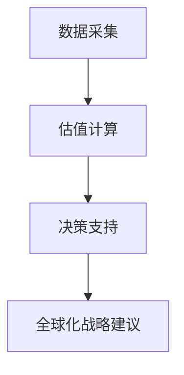

                 


# 股市估值高低对企业全球化战略的影响

## 关键词
- 股市估值
- 全球化战略
- 企业战略
- 估值模型
- 全球化布局

## 摘要
股市估值的高低直接影响企业的全球化战略决策。本文通过分析股市估值的核心概念、方法及其对全球化战略的影响路径，构建了企业全球化战略的估值分析框架，并通过实际案例深入探讨了如何利用股市估值优化全球化布局。文章最后结合系统设计与项目实战，提出了企业在制定全球化战略时应考虑的关键因素和实施策略。

---

# 第一部分：引言

## 第1章：背景介绍

### 1.1 股市估值与全球化战略的背景

#### 1.1.1 股市估值的基本概念
股市估值是指通过对企业的财务数据、市场环境和行业特性进行分析，评估其股票的内在价值。常用的方法包括市盈率（PE）、市净率（PB）、EV/EBITDA等。

#### 1.1.2 全球化战略的核心内涵
全球化战略是指企业在全球范围内配置资源、拓展市场和优化价值链的长期规划。它涉及跨文化管理、国际市场进入策略和全球供应链管理等多个方面。

#### 1.1.3 问题背景与研究意义
随着全球经济一体化的加深，企业的全球化布局越来越依赖于对其股票估值的准确评估。股市估值的高低不仅影响企业的融资能力，还直接影响其在全球市场中的竞争力。

---

## 第2章：股市估值的核心概念与方法

### 2.1 股市估值的基本原理

#### 2.1.1 股票价值的定义与计算
股票价值是投资者对企业未来现金流的贴现值。例如，使用股利折现模型（DDM）计算股票的内在价值。

$$ V = \frac{D}{k - g} $$

其中，$D$ 是股利，$k$ 是折现率，$g$ 是股利增长率。

#### 2.1.2 主要估值方法对比
| 估值方法 | 优点 | 缺点 |
|----------|------|------|
| 市盈率（PE） | 简单易用 | 受行业影响大 |
| 市净率（PB） | 考虑资产价值 | 适用于重资产行业 |
| EV/EBITDA | 全面性高 | 依赖于EBITDA质量 |

#### 2.1.3 估值模型的优缺点分析
- **优点**：帮助投资者理性决策。
- **缺点**：假设未来现金流可预测，实际中可能受宏观环境影响。

---

## 第3章：全球化战略的理论基础

### 3.1 全球化战略的核心要素

#### 3.1.1 跨文化管理
企业在不同文化背景下需要调整管理方式，例如通过并购或合作进入新兴市场。

#### 3.1.2 市场进入策略
包括直接投资、合资合作和特许经营等方式。选择哪种策略取决于企业估值和市场风险。

#### 3.1.3 全球供应链管理
优化供应链布局可以降低生产成本，提升全球竞争力。

---

## 第4章：股市估值与全球化战略的关联性

### 4.1 股市估值对企业战略的影响路径

#### 4.1.1 估值影响企业融资能力
高估值企业更容易获得资金支持，从而加快全球化布局。

#### 4.1.2 估值影响市场进入决策
低估值市场可能意味着更大的增长潜力，企业可能选择进入这些市场。

#### 4.1.3 估值影响企业并购策略
高估值企业可能通过并购整合资源，优化全球化战略。

---

## 第5章：构建全球化战略的估值分析框架

### 5.1 估值分析框架的构建

#### 5.1.1 框架结构
- **输入**：企业财务数据、市场环境数据。
- **处理**：使用估值模型计算目标市场估值。
- **输出**：全球化战略建议。

#### 5.1.2 影响路径
1. **估值 → 融资能力**：高估值企业更容易获得资金支持。
2. **估值 → 市场进入决策**：低估值市场可能更具吸引力。
3. **估值 → 并购策略**：高估值企业可能通过并购优化布局。

#### 5.1.3 案例分析
以某跨国公司为例，分析其如何根据股市估值调整全球化布局。

---

## 第6章：系统设计与实施

### 6.1 系统架构设计

#### 6.1.1 模块划分
- 数据采集模块：获取企业财务数据和市场数据。
- 估值计算模块：使用Python编写估值算法。
- 决策支持模块：生成全球化战略建议。

#### 6.1.2 系统流程图


### 6.2 项目实战

#### 6.2.1 环境配置
- 安装Python和相关库（如pandas、numpy）。
- 数据来源：Yahoo Finance API。

#### 6.2.2 核心代码实现
```python
import pandas as pd
import numpy as np

def calculate_pe(stock_data):
    pe = stock_data['市盈率']
    return pe.mean()

# 示例数据
data = pd.DataFrame({
    '市盈率': [15, 20, 25],
    '市净率': [2, 3, 4]
})

pe_value = calculate_pe(data)
print(f"平均市盈率为：{pe_value}")
```

---

## 第7章：结论与展望

### 7.1 本章小结
本文通过分析股市估值对全球化战略的影响，构建了估值分析框架，并提出了系统设计和实施策略。

### 7.2 未来研究方向
- 进一步优化估值模型，考虑更多变量。
- 研究不同行业中的具体应用。

---

# 作者：AI天才研究院/AI Genius Institute & 禅与计算机程序设计艺术 /Zen And The Art of Computer Programming

